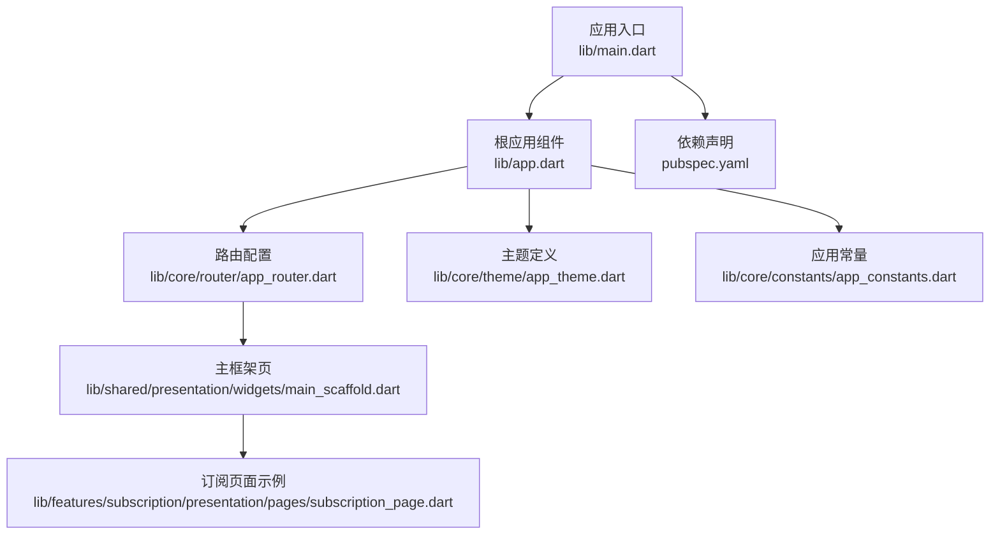
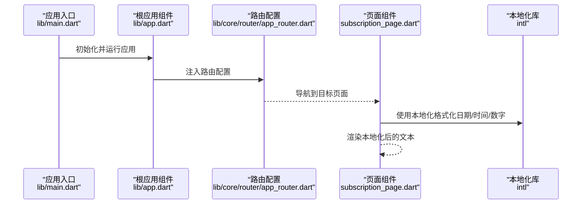
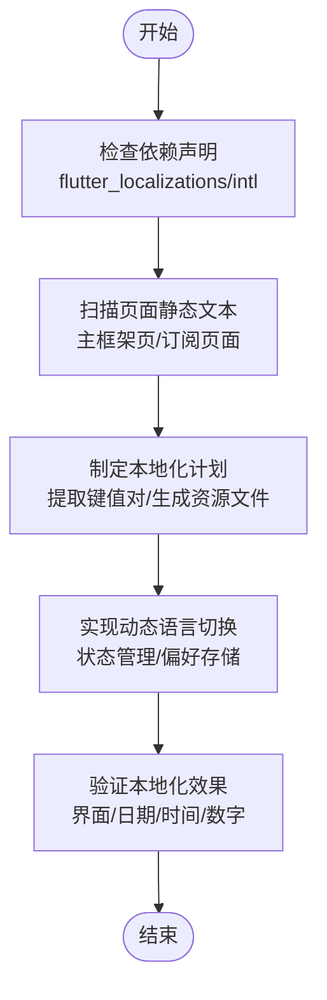
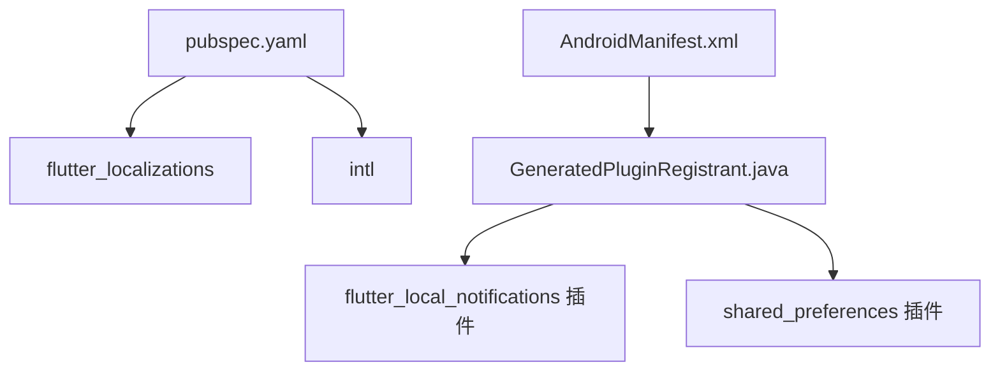

# 国际化支持

<cite>
**本文引用的文件**
- [main.dart](file://lib/main.dart)
- [app.dart](file://lib/app.dart)
- [pubspec.yaml](file://pubspec.yaml)
- [app_router.dart](file://lib/core/router/app_router.dart)
- [main_scaffold.dart](file://lib/shared/presentation/widgets/main_scaffold.dart)
- [subscription_page.dart](file://lib/features/subscription/presentation/pages/subscription_page.dart)
- [app_constants.dart](file://lib/core/constants/app_constants.dart)
- [app_theme.dart](file://lib/core/theme/app_theme.dart)
- [GeneratedPluginRegistrant.java](file://android/app/src/main/java/io/flutter/plugins/GeneratedPluginRegistrant.java)
- [AndroidManifest.xml](file://android/app/src/main/AndroidManifest.xml)
</cite>

## 目录
1. [简介](#简介)
2. [项目结构](#项目结构)
3. [核心组件](#核心组件)
4. [架构总览](#架构总览)
5. [详细组件分析](#详细组件分析)
6. [依赖关系分析](#依赖关系分析)
7. [性能考虑](#性能考虑)
8. [故障排查指南](#故障排查指南)
9. [结论](#结论)
10. [附录](#附录)

## 简介
本文件面向LifeMaster应用的国际化（i18n）能力，系统性说明多语言支持的实现机制、文本资源管理与动态语言切换、i18n文件组织与命名规范、新增语言的完整流程与最佳实践、日期/时间与数字的本地化格式化、文本提取与翻译管理的质量保障工作流、以及国际化测试与验证方法。文档同时为多语言团队与本地化专家提供实用指导。

## 项目结构
当前仓库中，国际化相关的关键位置与职责如下：
- 应用入口与根组件：负责初始化应用并挂载路由与主题体系
- 路由与页面：定义页面导航与页面内容，部分页面存在硬编码文本
- 主题与常量：提供颜色与通用文案常量，便于统一风格
- 依赖声明：声明了国际化所需的核心依赖（如intl、flutter_localizations）

图表来源
- [main.dart:1-13](file://lib/main.dart#L1-L13)
- [app.dart:1-23](file://lib/app.dart#L1-L23)
- [app_router.dart:1-61](file://lib/core/router/app_router.dart#L1-L61)
- [main_scaffold.dart:1-72](file://lib/shared/presentation/widgets/main_scaffold.dart#L1-L72)
- [subscription_page.dart:138-164](file://lib/features/subscription/presentation/pages/subscription_page.dart#L138-L164)
- [app_theme.dart:1-78](file://lib/core/theme/app_theme.dart#L1-L78)
- [app_constants.dart:1-47](file://lib/core/constants/app_constants.dart#L1-L47)
- [pubspec.yaml:1-54](file://pubspec.yaml#L1-L54)

章节来源
- [main.dart:1-13](file://lib/main.dart#L1-L13)
- [app.dart:1-23](file://lib/app.dart#L1-L23)
- [pubspec.yaml:1-54](file://pubspec.yaml#L1-L54)

## 核心组件
- 应用入口与根组件
  - 入口通过ProviderScope包裹应用根组件，启动MaterialApp.router并注入路由配置
  - 根组件设置标题、主题与暗色主题，并启用系统主题模式
- 路由与页面
  - 路由使用GoRouter进行ShellRoute与子路由配置，页面以无过渡方式加载
  - 页面中存在直接使用字符串字面量的场景（例如“Todo”、“Reminder”等），这些需要纳入i18n管理
- 主题与常量
  - 主题集中定义颜色与样式；常量集中定义默认分类等文本
- 依赖声明
  - 已声明flutter_localizations与intl，具备基础国际化能力

章节来源
- [main.dart:5-12](file://lib/main.dart#L5-L12)
- [app.dart:10-21](file://lib/app.dart#L10-L21)
- [app_router.dart:15-61](file://lib/core/router/app_router.dart#L15-L61)
- [main_scaffold.dart:41-67](file://lib/shared/presentation/widgets/main_scaffold.dart#L41-L67)
- [app_theme.dart:1-78](file://lib/core/theme/app_theme.dart#L1-L78)
- [app_constants.dart:1-47](file://lib/core/constants/app_constants.dart#L1-L47)
- [pubspec.yaml:12-31](file://pubspec.yaml#L12-L31)

## 架构总览
下图展示国际化在应用中的整体交互：应用启动后，MaterialApp.router承载路由与主题；页面渲染时，文本资源通过i18n机制进行本地化；日期/时间与数字格式化依赖intl库完成本地化输出。

图表来源
- [main.dart:5-12](file://lib/main.dart#L5-L12)
- [app.dart:13-21](file://lib/app.dart#L13-L21)
- [app_router.dart:15-61](file://lib/core/router/app_router.dart#L15-L61)
- [subscription_page.dart:152-154](file://lib/features/subscription/presentation/pages/subscription_page.dart#L152-L154)

## 详细组件分析

### 文本资源与本地化实现现状
- 依赖层面
  - 已引入flutter_localizations与intl，可使用系统本地化服务与格式化工具
- 页面层面
  - 导航标签等文本在主框架页中以字符串字面量形式出现，属于待本地化的静态文本
  - 订阅页面中存在直接使用字符串字面量的场景（如“Description”等），属于待本地化的静态文本
- 动态语言切换
  - 当前代码未见显式的语言切换逻辑或状态管理，需补充语言选择与持久化存储

图表来源
- [pubspec.yaml:12-31](file://pubspec.yaml#L12-L31)
- [main_scaffold.dart:41-67](file://lib/shared/presentation/widgets/main_scaffold.dart#L41-L67)
- [subscription_page.dart:146-149](file://lib/features/subscription/presentation/pages/subscription_page.dart#L146-L149)

章节来源
- [pubspec.yaml:12-31](file://pubspec.yaml#L12-L31)
- [main_scaffold.dart:41-67](file://lib/shared/presentation/widgets/main_scaffold.dart#L41-L67)
- [subscription_page.dart:138-164](file://lib/features/subscription/presentation/pages/subscription_page.dart#L138-L164)

### i18n文件组织结构与命名规范
- 文件组织建议
  - 按功能域分层：按模块（如todo、reminder、calendar、expense、subscription）划分资源文件，便于维护与评审
  - 按语言分层：以values-xx命名语言资源目录，如values-zh、values-en、values-es等
  - 按用途分层：将UI文案、错误提示、占位符等分类存放，避免混杂
- 命名规范建议
  - 键名采用层级式命名：模块_用途_语义，如todo_list_empty、reminder_notification_remind、calendar_event_title
  - 避免使用缩写与无上下文的键名，确保可读性与可维护性
  - 统一大小写与分隔符，推荐使用下划线分隔
- 资源文件结构示意
  - values/strings.xml（默认语言）
  - values-zh/strings.xml（简体中文）
  - values-es/strings.xml（西班牙语）
  - values-xx/strings.xml（其他语言）

[本节为概念性说明，不直接对应具体源码文件，故不附加章节来源]

### 新语言添加的完整流程与最佳实践
- 流程步骤
  - 创建语言目录：在资源根目录下新建对应values-xx目录
  - 复制默认语言资源：将默认语言资源复制到新语言目录
  - 翻译与校对：逐项翻译并进行一致性与文化适配校对
  - 校验与回归：验证界面显示、日期/时间/数字格式化是否正确
  - 提交与发布：合并到版本控制，随构建流程产出对应资源
- 最佳实践
  - 使用占位符与参数化：避免拼接字符串，使用参数化模板
  - 上下文与性别：根据目标语言的语法特性处理性别与数量词变化
  - 文化适配：注意日期顺序、数字分隔符、货币符号、单位换算等
  - 版本管理：为资源文件增加版本号，便于追踪变更

[本节为概念性说明，不直接对应具体源码文件，故不附加章节来源]

### 日期、时间和数字格式化的本地化处理
- 日期/时间
  - 使用intl库的DateFormat类，结合Locale信息进行本地化格式化
  - 在订阅页面中已可见日期格式化的使用示例，应将其替换为本地化键值
- 数字
  - 使用NumberFormat类进行本地化数字格式化（整数、小数、百分比、货币）
  - 结合应用主题与数值范围，确保在不同语言环境下可读性良好

章节来源
- [subscription_page.dart:152-154](file://lib/features/subscription/presentation/pages/subscription_page.dart#L152-L154)

### 文本提取、翻译管理与质量保证工作流
- 文本提取
  - 扫描所有页面与组件，提取硬编码字符串，生成键值对清单
  - 对重复文本进行去重与归并，减少翻译成本
- 翻译管理
  - 使用专业CAT工具或平台进行翻译任务分配与版本控制
  - 建立术语表与风格指南，确保术语一致与风格统一
- 质量保证
  - 本地化回归测试：覆盖主要页面与关键路径
  - 文化与无障碍：检查文本长度、方向、可读性与可访问性
  - 性能与体积：监控资源包大小与加载性能

[本节为概念性说明，不直接对应具体源码文件，故不附加章节来源]

### 国际化测试与验证方法
- 自动化测试
  - 单元测试：针对格式化函数与本地化逻辑编写测试用例
  - 集成测试：模拟切换语言并验证界面渲染与数据格式化
- 手动测试
  - 多语言环境验证：在不同Locale下检查UI布局、文本截断与对齐
  - 边界条件：超长文本、特殊字符、组合字符等
- 回归测试
  - 每次更新资源后执行回归测试，确保无回退问题

[本节为概念性说明，不直接对应具体源码文件，故不附加章节来源]

## 依赖关系分析
- 依赖声明
  - flutter_localizations：提供系统级本地化服务
  - intl：提供日期/时间与数字格式化能力
- 平台集成
  - Android端插件注册与查询权限声明，确保通知与存储等能力正常工作
  - iOS端AppDelegate与插件桥接，确保引擎初始化与插件注册

图表来源
- [pubspec.yaml:12-31](file://pubspec.yaml#L12-L31)
- [AndroidManifest.xml:25-45](file://android/app/src/main/AndroidManifest.xml#L25-L45)
- [GeneratedPluginRegistrant.java:17-38](file://android/app/src/main/java/io/flutter/plugins/GeneratedPluginRegistrant.java#L17-L38)

章节来源
- [pubspec.yaml:12-31](file://pubspec.yaml#L12-L31)
- [AndroidManifest.xml:25-45](file://android/app/src/main/AndroidManifest.xml#L25-L45)
- [GeneratedPluginRegistrant.java:17-38](file://android/app/src/main/java/io/flutter/plugins/GeneratedPluginRegistrant.java#L17-L38)

## 性能考虑
- 资源加载
  - 合理拆分资源文件，避免单个资源文件过大
  - 使用按需加载策略，减少冷启动时的内存占用
- 格式化开销
  - 缓存常用格式化器实例，避免频繁创建
  - 在UI渲染密集场景中，尽量复用格式化结果
- 语言切换
  - 将语言偏好持久化至本地存储，减少每次启动的判断开销
  - 在切换语言后，批量刷新相关UI，避免多次重建

[本节为一般性指导，不直接对应具体源码文件，故不附加章节来源]

## 故障排查指南
- 语言切换无效
  - 检查是否正确保存语言偏好并触发UI重建
  - 确认MaterialApp.router的locale配置与全局状态同步
- 文本未本地化
  - 排查页面中是否存在硬编码字符串未替换为本地化键值
  - 确认资源文件命名与values-xx目录结构一致
- 日期/时间格式异常
  - 检查DateFormat调用是否传入正确的Locale
  - 确认系统Locale与应用Locale一致
- 平台插件问题
  - 检查GeneratedPluginRegistrant注册列表与AndroidManifest权限声明
  - 确认插件初始化顺序与生命周期

章节来源
- [main.dart:5-12](file://lib/main.dart#L5-L12)
- [app.dart:13-21](file://lib/app.dart#L13-L21)
- [subscription_page.dart:152-154](file://lib/features/subscription/presentation/pages/subscription_page.dart#L152-L154)
- [GeneratedPluginRegistrant.java:17-38](file://android/app/src/main/java/io/flutter/plugins/GeneratedPluginRegistrant.java#L17-L38)
- [AndroidManifest.xml:25-45](file://android/app/src/main/AndroidManifest.xml#L25-L45)

## 结论
LifeMaster应用已具备国际化的基础能力（依赖声明与系统本地化服务）。当前需要完善的关键点包括：建立统一的文本资源管理与命名规范、将页面中的硬编码文本迁移至本地化键值、实现动态语言切换与偏好持久化、完善日期/时间与数字的本地化格式化、并建立完整的翻译管理与质量保证流程。通过以上改进，可显著提升应用的国际化体验与可维护性。

[本节为总结性内容，不直接对应具体源码文件，故不附加章节来源]

## 附录
- 快速检查清单
  - 是否已在pubspec.yaml声明flutter_localizations与intl
  - 页面中是否仍存在硬编码字符串
  - 是否实现了语言切换与偏好存储
  - 是否对日期/时间/数字进行了本地化格式化
  - 是否建立了资源文件命名与组织规范
  - 是否制定了翻译与质量保证流程

[本节为概念性说明，不直接对应具体源码文件，故不附加章节来源]