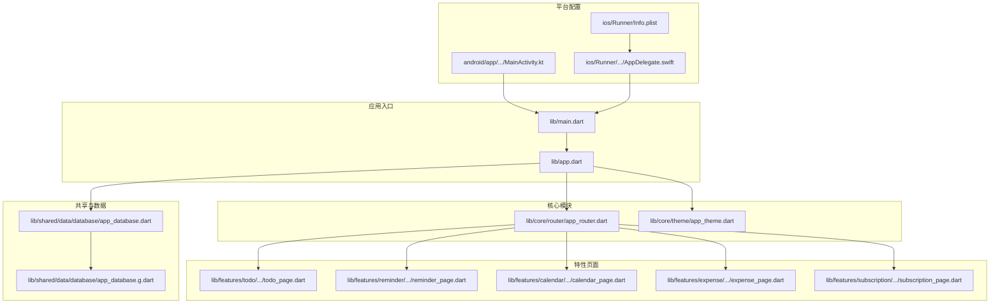
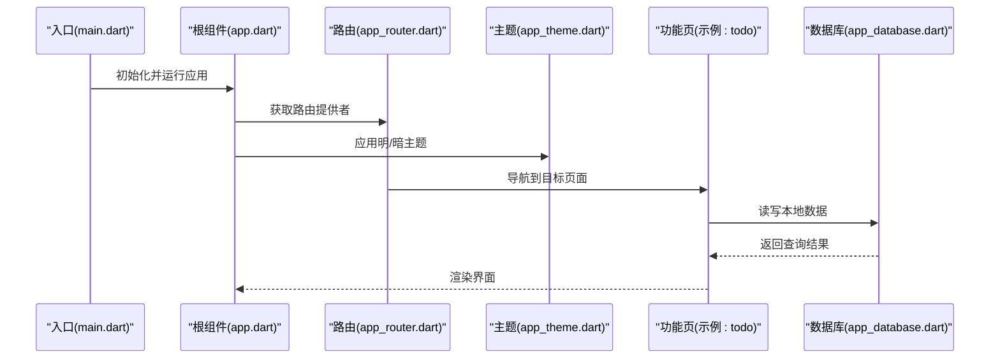
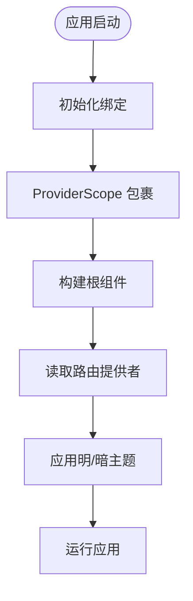
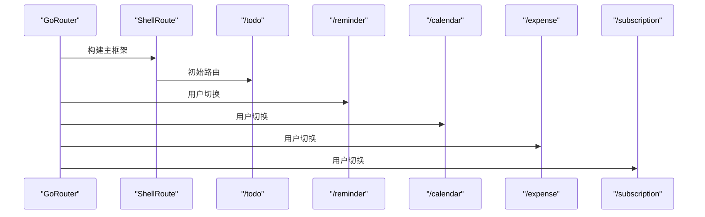
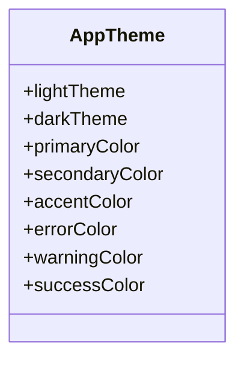
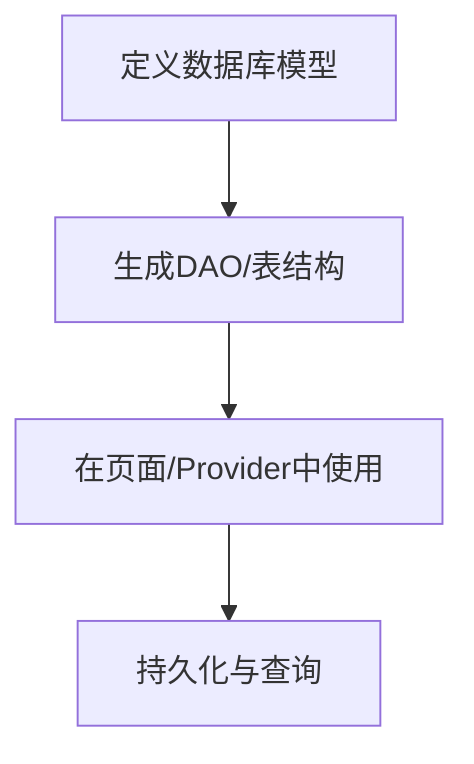
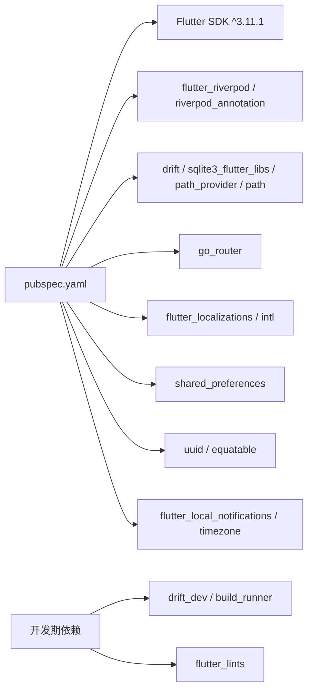

# 快速开始

<cite>
**本文引用的文件**
- [pubspec.yaml](file://pubspec.yaml)
- [main.dart](file://lib/main.dart)
- [app.dart](file://lib/app.dart)
- [app_router.dart](file://lib/core/router/app_router.dart)
- [app_theme.dart](file://lib/core/theme/app_theme.dart)
- [app_database.dart](file://lib/shared/data/database/app_database.dart)
- [app_database.g.dart](file://lib/shared/data/database/app_database.g.dart)
- [MainActivity.kt](file://android/app/src/main/kotlin/com/lifemaster/lifemaster/MainActivity.kt)
- [AppDelegate.swift](file://ios/Runner/AppDelegate.swift)
- [Info.plist](file://ios/Runner/Info.plist)
- [build.gradle.kts](file://android/build.gradle.kts)
- [gradle.properties](file://android/gradle.properties)
- [local.properties](file://android/local.properties)
- [analysis_options.yaml](file://analysis_options.yaml)
- [README.md](file://README.md)
</cite>

## 目录
1. [简介](#简介)
2. [项目结构](#项目结构)
3. [核心组件](#核心组件)
4. [架构总览](#架构总览)
5. [详细组件分析](#详细组件分析)
6. [依赖分析](#依赖分析)
7. [性能考虑](#性能考虑)
8. [故障排除指南](#故障排除指南)
9. [结论](#结论)
10. [附录](#附录)

## 简介
本指南面向新加入的开发者，帮助你在最短时间内完成 LifeMaster 应用的开发环境搭建、依赖安装、运行与调试，并理解项目结构与关键文件职责。LifeMaster 是一款基于 Flutter 的个人生活管理应用，采用 Riverpod 进行状态管理、Drift 进行本地数据库访问、GoRouter 进行路由管理，并通过 Material 3 主题提供明暗主题支持。

## 项目结构
项目采用按功能域分层的组织方式，核心入口位于 lib 目录，平台相关配置位于 android 与 ios 目录，依赖与构建配置位于根目录的 pubspec.yaml 与 Gradle/Kotlin DSL 配置文件中。

图表来源
- [main.dart:1-13](file://lib/main.dart#L1-L13)
- [app.dart:1-23](file://lib/app.dart#L1-L23)
- [app_router.dart:1-61](file://lib/core/router/app_router.dart#L1-L61)
- [app_theme.dart:1-78](file://lib/core/theme/app_theme.dart#L1-L78)
- [app_database.dart](file://lib/shared/data/database/app_database.dart)
- [app_database.g.dart](file://lib/shared/data/database/app_database.g.dart)
- [MainActivity.kt:1-6](file://android/app/src/main/kotlin/com/lifemaster/lifemaster/MainActivity.kt#L1-L6)
- [AppDelegate.swift:1-17](file://ios/Runner/AppDelegate.swift#L1-L17)
- [Info.plist:1-71](file://ios/Runner/Info.plist#L1-L71)

章节来源
- [main.dart:1-13](file://lib/main.dart#L1-L13)
- [app.dart:1-23](file://lib/app.dart#L1-L23)
- [app_router.dart:1-61](file://lib/core/router/app_router.dart#L1-L61)
- [app_theme.dart:1-78](file://lib/core/theme/app_theme.dart#L1-L78)
- [app_database.dart](file://lib/shared/data/database/app_database.dart)
- [app_database.g.dart](file://lib/shared/data/database/app_database.g.dart)
- [MainActivity.kt:1-6](file://android/app/src/main/kotlin/com/lifemaster/lifemaster/MainActivity.kt#L1-L6)
- [AppDelegate.swift:1-17](file://ios/Runner/AppDelegate.swift#L1-L17)
- [Info.plist:1-71](file://ios/Runner/Info.plist#L1-L71)

## 核心组件
- 应用入口与启动
  - 入口文件负责初始化绑定、包裹 ProviderScope 并运行应用根组件。
  - 参考路径：[lib/main.dart:1-13](file://lib/main.dart#L1-L13)
- 应用根组件
  - 根组件使用 Riverpod 监听路由提供者，配置主题（明/暗）、标题与路由配置。
  - 参考路径：[lib/app.dart:1-23](file://lib/app.dart#L1-L23)
- 路由系统
  - 使用 GoRouter 定义 ShellRoute 包裹主框架，各功能页作为子路由注册，初始跳转到“待办”页。
  - 参考路径：[lib/core/router/app_router.dart:1-61](file://lib/core/router/app_router.dart#L1-L61)
- 主题系统
  - 提供明/暗两种 Material 3 主题，包含色彩体系、卡片、输入框、悬浮按钮等样式配置。
  - 参考路径：[lib/core/theme/app_theme.dart:1-78](file://lib/core/theme/app_theme.dart#L1-L78)
- 数据层
  - 使用 Drift 定义数据库模型与 DAO，生成文件用于类型安全查询；通过 Provider 管理业务状态。
  - 参考路径：[lib/shared/data/database/app_database.dart](file://lib/shared/data/database/app_database.dart)
  - 生成文件参考：[lib/shared/data/database/app_database.g.dart](file://lib/shared/data/database/app_database.g.dart)

章节来源
- [main.dart:1-13](file://lib/main.dart#L1-L13)
- [app.dart:1-23](file://lib/app.dart#L1-L23)
- [app_router.dart:1-61](file://lib/core/router/app_router.dart#L1-L61)
- [app_theme.dart:1-78](file://lib/core/theme/app_theme.dart#L1-L78)
- [app_database.dart](file://lib/shared/data/database/app_database.dart)
- [app_database.g.dart](file://lib/shared/data/database/app_database.g.dart)

## 架构总览
应用采用“入口 → 根组件 → 路由 → 页面 → 数据”的清晰分层，状态管理通过 Riverpod 注入，数据库通过 Drift 访问，UI 采用 Material 3 设计语言。

图表来源
- [main.dart:1-13](file://lib/main.dart#L1-L13)
- [app.dart:1-23](file://lib/app.dart#L1-L23)
- [app_router.dart:1-61](file://lib/core/router/app_router.dart#L1-L61)
- [app_theme.dart:1-78](file://lib/core/theme/app_theme.dart#L1-L78)
- [app_database.dart](file://lib/shared/data/database/app_database.dart)

## 详细组件分析

### 组件一：应用入口与根组件
- 入口负责初始化 Flutter 绑定并以 ProviderScope 包裹应用根组件。
- 根组件通过 Riverpod 读取路由提供者，设置标题、主题模式与路由配置，实现统一的主题与导航体验。
- 关键点
  - ProviderScope 保证全局状态可注入。
  - ThemeMode.system 自动跟随系统深浅色偏好。
  - 路由配置在根组件集中声明，便于维护。

图表来源
- [main.dart:1-13](file://lib/main.dart#L1-L13)
- [app.dart:1-23](file://lib/app.dart#L1-L23)

章节来源
- [main.dart:1-13](file://lib/main.dart#L1-L13)
- [app.dart:1-23](file://lib/app.dart#L1-L23)

### 组件二：路由系统（GoRouter）
- 使用 ShellRoute 包裹主框架，子路由分别对应不同功能页。
- 初始路由为“待办”，无过渡动画，直接展示页面。
- 支持扩展更多功能页，遵循现有路由结构即可。

图表来源
- [app_router.dart:1-61](file://lib/core/router/app_router.dart#L1-L61)

章节来源
- [app_router.dart:1-61](file://lib/core/router/app_router.dart#L1-L61)

### 组件三：主题系统（Material 3）
- 明/暗主题均启用 Material 3，颜色方案基于种子色，统一卡片、输入框、悬浮按钮等组件风格。
- 支持通过主题切换实现夜间模式体验。

图表来源
- [app_theme.dart:1-78](file://lib/core/theme/app_theme.dart#L1-L78)

章节来源
- [app_theme.dart:1-78](file://lib/core/theme/app_theme.dart#L1-L78)

### 组件四：数据层（Drift）
- 数据库定义与生成文件位于 shared/data/database 目录，通过 Provider 管理业务状态。
- 建议在新增实体时同步更新数据库定义与 Provider，保持类型安全与一致性。

图表来源
- [app_database.dart](file://lib/shared/data/database/app_database.dart)
- [app_database.g.dart](file://lib/shared/data/database/app_database.g.dart)

章节来源
- [app_database.dart](file://lib/shared/data/database/app_database.dart)
- [app_database.g.dart](file://lib/shared/data/database/app_database.g.dart)

### 组件五：平台适配（Android 与 iOS）
- Android
  - MainActivity 继承 FlutterActivity，负责承载 Flutter 引擎。
  - 通过 local.properties 指定 Flutter SDK 路径，确保 Gradle 能正确解析。
  - 参考路径：
    - [android/app/src/main/kotlin/com/lifemaster/lifemaster/MainActivity.kt:1-6](file://android/app/src/main/kotlin/com/lifemaster/lifemaster/MainActivity.kt#L1-L6)
    - [android/local.properties:1-1](file://android/local.properties#L1-L1)
- iOS
  - AppDelegate 实现 FlutterAppDelegate 与隐式引擎委托，注册插件。
  - Info.plist 配置应用名称、版本、支持的方向与场景配置。
  - 参考路径：
    - [ios/Runner/AppDelegate.swift:1-17](file://ios/Runner/AppDelegate.swift#L1-L17)
    - [ios/Runner/Info.plist:1-71](file://ios/Runner/Info.plist#L1-L71)

章节来源
- [MainActivity.kt:1-6](file://android/app/src/main/kotlin/com/lifemaster/lifemaster/MainActivity.kt#L1-L6)
- [local.properties:1-1](file://android/local.properties#L1-L1)
- [AppDelegate.swift:1-17](file://ios/Runner/AppDelegate.swift#L1-L17)
- [Info.plist:1-71](file://ios/Runner/Info.plist#L1-L71)

## 依赖分析
- 语言与工具
  - Flutter SDK 版本要求与 Dart 分析规则由 pubspec.yaml 与 analysis_options.yaml 管理。
  - 参考路径：
    - [pubspec.yaml:6-8](file://pubspec.yaml#L6-L8)
    - [analysis_options.yaml:1-29](file://analysis_options.yaml#L1-L29)
- 运行时依赖
  - 状态管理：flutter_riverpod、riverpod_annotation
  - 数据库：drift、sqlite3_flutter_libs、path_provider、path
  - 导航：go_router
  - 国际化：flutter_localizations、intl
  - 本地存储：shared_preferences
  - 工具库：uuid、equatable
  - 通知：flutter_local_notifications、timezone
  - 参考路径：[pubspec.yaml:9-43](file://pubspec.yaml#L9-L43)
- 开发期依赖
  - 测试与 Lint：flutter_test、flutter_lints
  - Drift 代码生成：drift_dev、build_runner
  - 参考路径：[pubspec.yaml:44-50](file://pubspec.yaml#L44-L50)

图表来源
- [pubspec.yaml:1-54](file://pubspec.yaml#L1-L54)
- [analysis_options.yaml:1-29](file://analysis_options.yaml#L1-L29)

章节来源
- [pubspec.yaml:1-54](file://pubspec.yaml#L1-L54)
- [analysis_options.yaml:1-29](file://analysis_options.yaml#L1-L29)

## 性能考虑
- 启动优化
  - 将耗时初始化放入异步任务，避免阻塞主线程。
  - 减少启动阶段的网络请求与数据库初始化。
- UI 渲染
  - 使用 const 构造与不可变对象，降低重建成本。
  - 合理拆分页面与懒加载，减少一次性渲染压力。
- 数据访问
  - 对频繁查询建立索引，避免全表扫描。
  - 使用事务批量写入，减少磁盘 IO。
- 调试与分析
  - 使用 Flutter DevTools 进行性能分析与内存监控。
  - 通过分析选项与 Lint 规则提升代码质量与可维护性。

## 故障排除指南
- 无法找到 Flutter SDK
  - 检查 android/local.properties 中的 sdk 路径是否正确。
  - 参考路径：[android/local.properties:1-1](file://android/local.properties#L1-L1)
- Android 构建失败
  - 确认 Gradle 仓库与 AndroidX 设置正常。
  - 参考路径：[android/build.gradle.kts:1-25](file://android/build.gradle.kts#L1-L25)，[android/gradle.properties:1-3](file://android/gradle.properties#L1-L3)
- iOS 启动白屏或崩溃
  - 检查 Info.plist 中的应用标识、版本与场景配置。
  - 确认 AppDelegate 正确注册插件。
  - 参考路径：[ios/Runner/Info.plist:1-71](file://ios/Runner/Info.plist#L1-L71)，[ios/Runner/AppDelegate.swift:1-17](file://ios/Runner/AppDelegate.swift#L1-L17)
- 路由不生效或页面空白
  - 确认路由提供者已注入，初始路由与页面路径一致。
  - 参考路径：[lib/core/router/app_router.dart:1-61](file://lib/core/router/app_router.dart#L1-L61)
- 数据库生成文件缺失
  - 执行构建脚本生成 Drift 代码，确保数据库定义与生成文件同步。
  - 参考路径：[lib/shared/data/database/app_database.dart](file://lib/shared/data/database/app_database.dart)，[lib/shared/data/database/app_database.g.dart](file://lib/shared/data/database/app_database.g.dart)
- 代码风格与分析报错
  - 按照 analysis_options.yaml 的规则调整代码风格。
  - 参考路径：[analysis_options.yaml:1-29](file://analysis_options.yaml#L1-L29)

章节来源
- [local.properties:1-1](file://android/local.properties#L1-L1)
- [build.gradle.kts:1-25](file://android/build.gradle.kts#L1-L25)
- [gradle.properties:1-3](file://android/gradle.properties#L1-L3)
- [Info.plist:1-71](file://ios/Runner/Info.plist#L1-L71)
- [AppDelegate.swift:1-17](file://ios/Runner/AppDelegate.swift#L1-L17)
- [app_router.dart:1-61](file://lib/core/router/app_router.dart#L1-L61)
- [app_database.dart](file://lib/shared/data/database/app_database.dart)
- [app_database.g.dart](file://lib/shared/data/database/app_database.g.dart)
- [analysis_options.yaml:1-29](file://analysis_options.yaml#L1-L29)

## 结论
通过本指南，你可以完成 Flutter SDK、Android Studio 与 Xcode 的基础配置，安装并生成所有依赖，成功运行 LifeMaster 应用并在模拟器或真机上进行调试。建议在开发过程中遵循 Material 3 主题规范、Riverpod 状态管理约定与 Drift 数据访问模式，以确保代码一致性与可维护性。

## 附录

### 开发环境配置步骤
- Flutter SDK 安装
  - 在系统 PATH 中正确配置 Flutter SDK 路径。
  - 参考路径：[android/local.properties:1-1](file://android/local.properties#L1-L1)
- Android Studio 配置
  - 安装 Android Studio 与 Android SDK/NDK。
  - 在 Android Studio 中打开 android 目录，确保 Gradle 同步成功。
  - 参考路径：[android/build.gradle.kts:1-25](file://android/build.gradle.kts#L1-L25)，[android/gradle.properties:1-3](file://android/gradle.properties#L1-L3)
- Xcode 配置
  - 安装 Xcode 并打开 ios/Runner.xcworkspace。
  - 确认签名与目标设备配置正确。
  - 参考路径：[ios/Runner/AppDelegate.swift:1-17](file://ios/Runner/AppDelegate.swift#L1-L17)，[ios/Runner/Info.plist:1-71](file://ios/Runner/Info.plist#L1-L71)
- 依赖安装
  - 在项目根目录执行依赖安装命令，生成 Drift 代码与构建产物。
  - 参考路径：[pubspec.yaml:1-54](file://pubspec.yaml#L1-L54)，[lib/shared/data/database/app_database.dart](file://lib/shared/data/database/app_database.dart)，[lib/shared/data/database/app_database.g.dart](file://lib/shared/data/database/app_database.g.dart)
- 运行与调试
  - Android：连接设备或启动模拟器，选择目标设备运行。
  - iOS：连接设备或启动模拟器，选择 Runner 目标运行。
  - 参考路径：[lib/main.dart:1-13](file://lib/main.dart#L1-L13)，[lib/app.dart:1-23](file://lib/app.dart#L1-L23)

章节来源
- [local.properties:1-1](file://android/local.properties#L1-L1)
- [build.gradle.kts:1-25](file://android/build.gradle.kts#L1-L25)
- [gradle.properties:1-3](file://android/gradle.properties#L1-L3)
- [AppDelegate.swift:1-17](file://ios/Runner/AppDelegate.swift#L1-L17)
- [Info.plist:1-71](file://ios/Runner/Info.plist#L1-L71)
- [pubspec.yaml:1-54](file://pubspec.yaml#L1-L54)
- [app_database.dart](file://lib/shared/data/database/app_database.dart)
- [app_database.g.dart](file://lib/shared/data/database/app_database.g.dart)
- [main.dart:1-13](file://lib/main.dart#L1-L13)
- [app.dart:1-23](file://lib/app.dart#L1-L23)