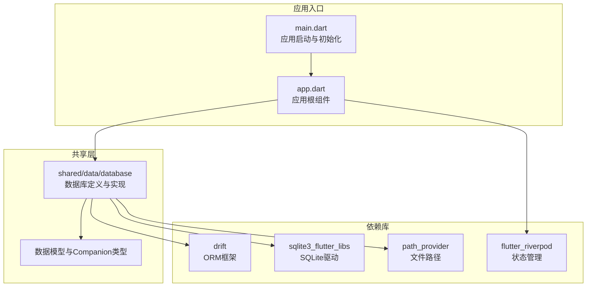
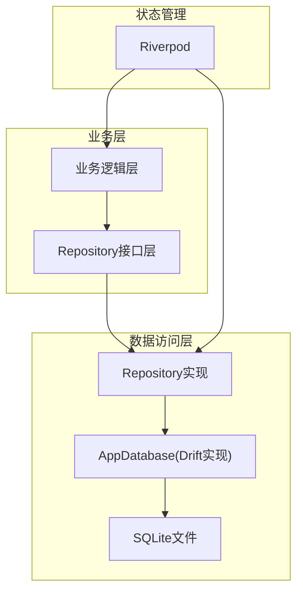
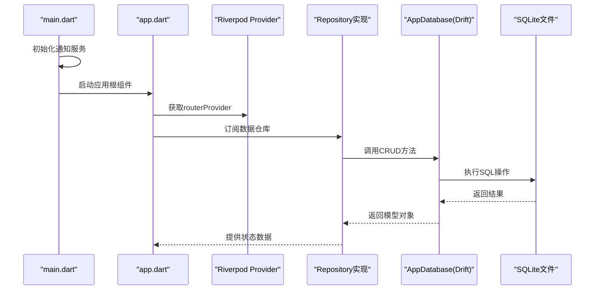
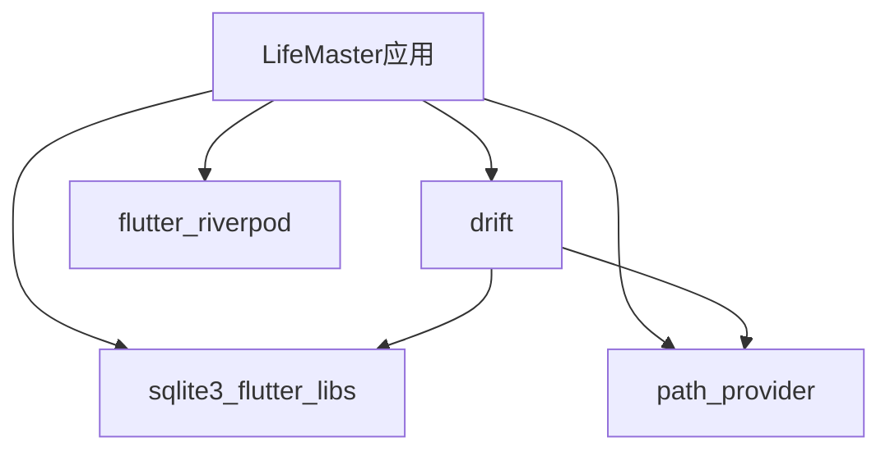

# Repository模式实现

<cite>
**本文档引用的文件**
- [main.dart](file://lib/main.dart)
- [app.dart](file://lib/app.dart)
- [pubspec.yaml](file://pubspec.yaml)
- [README.md](file://README.md)
- [app_database.dart](file://lib/shared/data/database/app_database.dart)
- [app_database.g.dart](file://lib/shared/data/database/app_database.g.dart)
</cite>

## 目录
1. [引言](#引言)
2. [项目结构](#项目结构)
3. [核心组件](#核心组件)
4. [架构概览](#架构概览)
5. [详细组件分析](#详细组件分析)
6. [依赖关系分析](#依赖关系分析)
7. [性能考虑](#性能考虑)
8. [故障排除指南](#故障排除指南)
9. [结论](#结论)
10. [附录](#附录)

## 引言
本文件为LifeMaster应用的数据访问层设计文档，重点阐述Repository模式在Flutter/Dart项目中的实现与应用。Repository模式通过抽象数据访问逻辑，将业务层与数据存储细节解耦，提升可测试性、可维护性和可扩展性。在LifeMaster中，数据持久化采用Drift ORM，结合Riverpod状态管理，形成清晰的分层架构。

本文件面向后端开发者与架构师，提供从接口定义、具体实现到依赖注入配置的完整技术参考，并包含错误处理、异常管理与数据一致性保障策略，以及扩展与自定义开发指南。

## 项目结构
LifeMaster项目采用Flutter标准目录结构，核心数据访问层位于shared模块下的database目录，配合Drift生成的数据库适配层与Riverpod状态管理。应用入口在main.dart中初始化通知服务并启动应用根组件app.dart。

**图表来源**
- [main.dart:1-15](file://lib/main.dart#L1-L15)
- [app.dart:1-23](file://lib/app.dart#L1-L23)
- [pubspec.yaml:9-54](file://pubspec.yaml#L9-L54)

**章节来源**
- [main.dart:1-15](file://lib/main.dart#L1-L15)
- [app.dart:1-23](file://lib/app.dart#L1-L23)
- [pubspec.yaml:9-54](file://pubspec.yaml#L9-L54)

## 核心组件
本节概述数据访问层的关键组件及其职责：

- 数据库定义与实现：使用Drift注解定义表结构，AppDatabase类集中管理所有数据访问方法（增删改查、流式监听等）。
- 生成代码：app_database.g.dart由Drift代码生成器生成，包含表映射、模型类、Companion类型及查询构建器。
- 模型与Companion：每个实体对应一个模型类和一个Companion类型，用于插入或更新时的参数传递与字段选择。
- 应用入口与初始化：main.dart负责应用初始化与通知服务启动，app.dart作为应用根组件承载路由与主题。

**章节来源**
- [app_database.dart:71-138](file://lib/shared/data/database/app_database.dart#L71-L138)
- [app_database.g.dart:1-200](file://lib/shared/data/database/app_database.g.dart#L1-L200)

## 架构概览
下图展示了Repository模式在LifeMaster中的整体架构：业务层通过Repository接口访问数据，Repository内部委托给AppDatabase（Drift实现），Drift负责与SQLite交互并返回模型对象；Riverpod用于状态管理与依赖注入。

该图为概念性架构示意，不直接映射具体源码文件，因此不提供图表来源。

## 详细组件分析

### 数据库定义与Drift集成
AppDatabase类通过@DriftDatabase注解声明使用的表集合，并提供统一的CRUD方法。Drift自动生成的app_database.g.dart包含：
- 表结构定义与列元信息
- 实体模型类（如Todo、Reminder、CalendarEvent、Expense、Subscription）
- Companion类型（如TodosCompanion、RemindersCompanion等）
- 查询构建器与过滤器组合器

这些生成代码为Repository实现提供了强类型的模型与查询能力，确保编译期安全与运行时高效。

**章节来源**
- [app_database.dart:71-138](file://lib/shared/data/database/app_database.dart#L71-L138)
- [app_database.g.dart:1-200](file://lib/shared/data/database/app_database.g.dart#L1-L200)

### Repository接口设计
Repository接口应定义业务所需的最小数据访问契约，避免业务层直接依赖具体存储实现。建议的接口层次如下：
- 基础CRUD接口：提供增删改查、分页、排序、过滤等通用能力
- 业务查询接口：按领域模型提供语义化的查询方法
- 流式监听接口：支持实时数据变更推送

接口设计应遵循单一职责原则，每个接口专注于特定业务域，便于单元测试与替换实现。

### Repository实现类
Repository实现类负责：
- 将业务请求转换为Drift查询
- 处理事务与并发控制
- 统一错误处理与异常包装
- 数据一致性校验与约束检查

实现类应保持无状态或弱状态，通过依赖注入获取AppDatabase实例，避免硬编码依赖。

### 依赖注入配置
推荐使用Riverpod进行依赖注入：
- 定义Provider：为AppDatabase与各Repository提供单例实例
- 作用域管理：根据UI组件生命周期管理Provider作用域
- 状态绑定：将Repository状态与UI组件绑定，实现自动刷新

以下序列图展示应用启动与依赖注入流程：

**图表来源**
- [main.dart:6-14](file://lib/main.dart#L6-L14)
- [app.dart:10-21](file://lib/app.dart#L10-L21)

**章节来源**
- [main.dart:6-14](file://lib/main.dart#L6-L14)
- [app.dart:10-21](file://lib/app.dart#L10-L21)

### CRUD操作实现与事务处理
基于AppDatabase提供的方法，Repository实现应关注以下要点：
- 插入操作：使用Companion类型传递非空字段，避免冗余数据
- 更新操作：采用replace策略确保字段完整性，或使用部分更新以减少冲突
- 删除操作：先查询再删除，确保幂等性与一致性
- 查询操作：支持条件过滤、排序与分页，必要时使用事务包裹复杂查询

事务处理建议：
- 单一写入：简单插入/更新/删除通常无需显式事务
- 复杂写入：多表联动或跨领域操作使用事务保证原子性
- 并发控制：使用SELECT ... FOR UPDATE或行级锁避免竞态条件

### 错误处理与异常管理
错误处理策略：
- 输入验证：在Repository层对输入参数进行合法性检查
- 数据校验：利用Drift生成的验证上下文确保数据完整性
- 异常捕获：捕获数据库异常并转换为业务异常，保留原始错误信息
- 用户反馈：将异常信息转化为用户可理解的提示

数据一致性保障：
- 主键唯一性：确保主键自增与唯一约束
- 外键约束：在业务允许范围内维持参照完整性
- 时间戳：统一使用UTC时间并记录创建与更新时间
- 并发冲突：通过版本号或乐观锁机制处理并发修改

### 查询封装策略
查询封装建议：
- 条件组合：使用Drift的过滤器组合器构建动态查询
- 排序与分页：提供统一的排序与分页参数，避免SQL拼接
- 预加载关联：对常用关联查询进行预加载优化
- 缓存策略：对热点查询结果进行内存缓存，降低数据库压力

## 依赖关系分析
LifeMaster项目对Drift与相关依赖的使用情况如下：
- drift：ORM框架，提供类型安全的数据库操作
- sqlite3_flutter_libs：SQLite原生库，支持移动端SQLite
- path_provider：提供应用文档目录，用于数据库文件存储
- flutter_riverpod：状态管理与依赖注入

**图表来源**
- [pubspec.yaml:9-54](file://pubspec.yaml#L9-L54)

**章节来源**
- [pubspec.yaml:9-54](file://pubspec.yaml#L9-L54)

## 性能考虑
- 查询优化：使用索引覆盖常见查询条件，避免全表扫描
- 连接池：合理复用数据库连接，避免频繁打开/关闭
- 批量操作：对大量插入/更新使用批量提交减少事务开销
- 内存管理：及时释放不再使用的查询结果与监听器
- 磁盘I/O：控制日志级别，避免频繁写入影响性能

## 故障排除指南
常见问题与解决方案：
- 数据库无法打开：检查应用文档目录权限与文件路径
- 查询结果为空：确认表是否已创建、数据是否正确插入
- 更新失败：检查字段类型与默认值约束，确保Companion参数正确
- 内存泄漏：确保取消订阅流式查询与监听器

调试建议：
- 启用Drift日志：观察SQL执行计划与性能指标
- 使用单元测试：针对Repository方法编写测试用例
- 监控异常：收集并分析数据库异常堆栈信息

**章节来源**
- [app_database.dart:79-87](file://lib/shared/data/database/app_database.dart#L79-L87)

## 结论
LifeMaster应用通过Repository模式与Drift ORM实现了清晰的数据访问层设计。Repository将业务逻辑与数据存储解耦，结合Riverpod的依赖注入与状态管理，提升了系统的可维护性与可扩展性。通过合理的错误处理、事务控制与查询封装策略，系统能够在保证数据一致性的同时提供良好的用户体验。建议在后续迭代中持续完善Repository接口设计、增强测试覆盖率，并根据业务需求扩展查询与缓存策略。

## 附录
- 开发环境要求：Flutter SDK 3.11.1及以上
- 数据库迁移：当前版本使用Drift MigrationStrategy的onCreate钩子，后续版本可根据需要扩展onUpgrade逻辑
- 本地化与国际化：项目包含intl依赖，可在Repository层增加本地化支持

**章节来源**
- [README.md:1-18](file://README.md#L1-L18)
- [pubspec.yaml:6-8](file://pubspec.yaml#L6-L8)