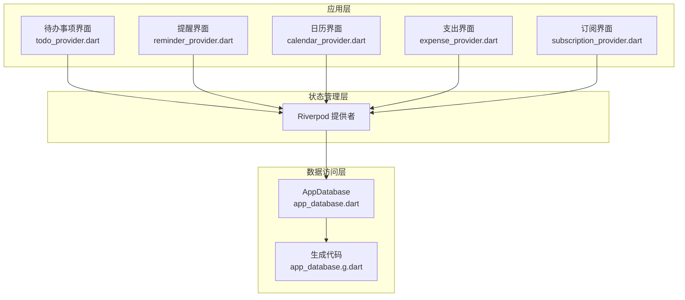
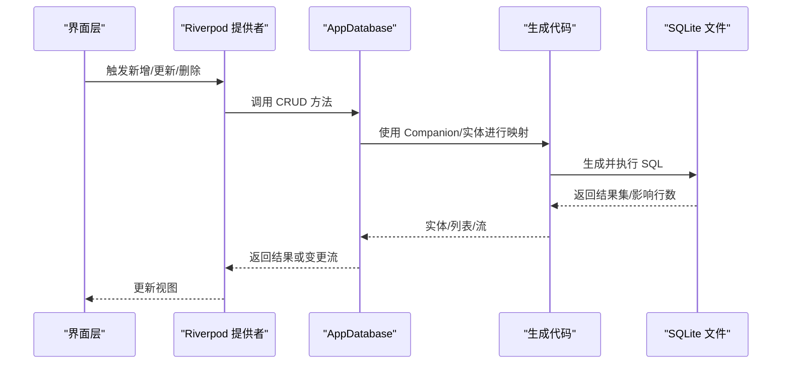
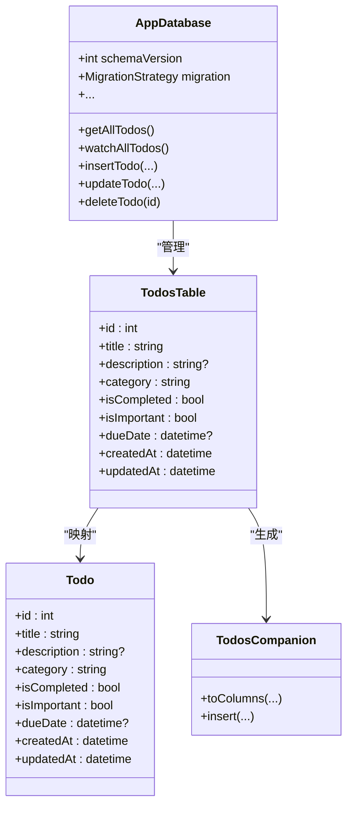
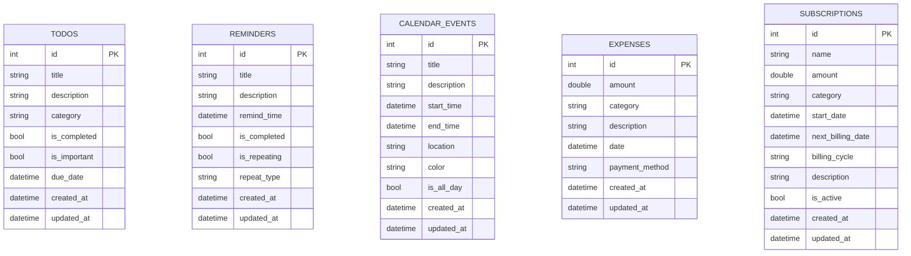
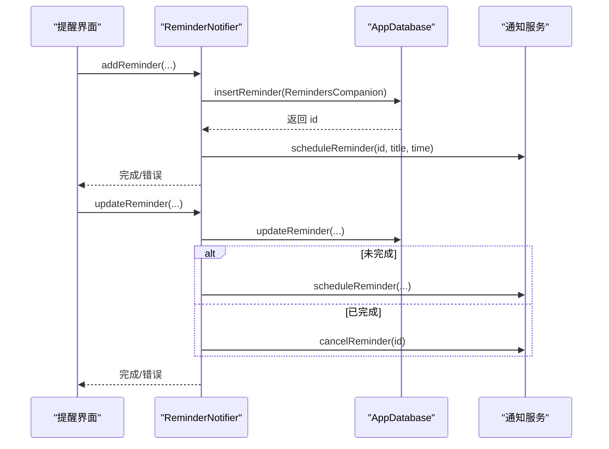
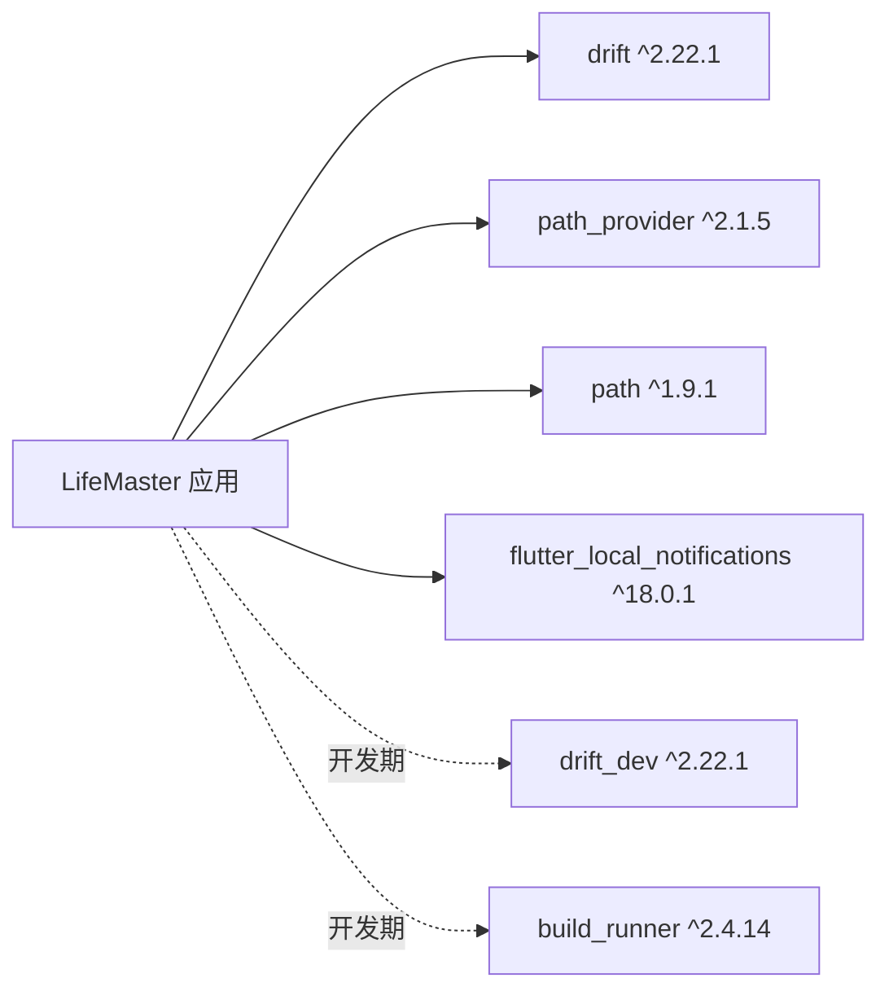

# 数据库操作与查询

<cite>
**本文引用的文件**
- [lib/shared/data/database/app_database.dart](file://lib/shared/data/database/app_database.dart)
- [lib/shared/data/database/app_database.g.dart](file://lib/shared/data/database/app_database.g.dart)
- [lib/features/todo/presentation/providers/todo_provider.dart](file://lib/features/todo/presentation/providers/todo_provider.dart)
- [lib/features/reminder/presentation/providers/reminder_provider.dart](file://lib/features/reminder/presentation/providers/reminder_provider.dart)
- [lib/features/calendar/presentation/providers/calendar_provider.dart](file://lib/features/calendar/presentation/providers/calendar_provider.dart)
- [lib/features/expense/presentation/providers/expense_provider.dart](file://lib/features/expense/presentation/providers/expense_provider.dart)
- [lib/features/subscription/presentation/providers/subscription_provider.dart](file://lib/features/subscription/presentation/providers/subscription_provider.dart)
- [lib/main.dart](file://lib/main.dart)
- [lib/core/services/notification_service.dart](file://lib/core/services/notification_service.dart)
- [pubspec.yaml](file://pubspec.yaml)
</cite>

## 目录
1. [简介](#简介)
2. [项目结构](#项目结构)
3. [核心组件](#核心组件)
4. [架构总览](#架构总览)
5. [详细组件分析](#详细组件分析)
6. [依赖关系分析](#依赖关系分析)
7. [性能考虑](#性能考虑)
8. [故障排除指南](#故障排除指南)
9. [结论](#结论)
10. [附录](#附录)

## 简介
本文件面向数据库管理员与高级开发者，系统化阐述 LifeMaster 应用中基于 Drift ORM 的数据库操作与查询实现，涵盖以下主题：
- 类型安全的 SQL 查询与复杂查询构建
- 数据库连接管理、事务与并发控制
- 数据迁移策略与版本升级流程
- 批量操作、索引优化与查询缓存策略
- 调试、性能监控与故障排除

LifeMaster 使用 Drift 在本地 SQLite 上持久化任务、提醒、日历事件、支出与订阅等数据，并通过 Riverpod 提供响应式数据流与状态管理。

## 项目结构
数据库相关代码主要集中在共享层的数据库定义与生成文件，以及各功能模块的状态提供者中：
- 数据库定义与生成：lib/shared/data/database/app_database.dart 与自动生成的 app_database.g.dart
- 功能模块提供者：各特性模块的 providers 中通过 Riverpod 访问数据库并驱动 UI 响应式更新
- 启动与通知：lib/main.dart 初始化通知服务；提醒模块在添加/更新时调度系统通知

图表来源
- [lib/shared/data/database/app_database.dart:71-138](file://lib/shared/data/database/app_database.dart#L71-L138)
- [lib/shared/data/database/app_database.g.dart:1-263](file://lib/shared/data/database/app_database.g.dart#L1-L263)
- [lib/features/todo/presentation/providers/todo_provider.dart:1-79](file://lib/features/todo/presentation/providers/todo_provider.dart#L1-L79)
- [lib/features/reminder/presentation/providers/reminder_provider.dart:1-98](file://lib/features/reminder/presentation/providers/reminder_provider.dart#L1-L98)
- [lib/features/calendar/presentation/providers/calendar_provider.dart:1-70](file://lib/features/calendar/presentation/providers/calendar_provider.dart#L1-L70)
- [lib/features/expense/presentation/providers/expense_provider.dart:1-110](file://lib/features/expense/presentation/providers/expense_provider.dart#L1-L110)
- [lib/features/subscription/presentation/providers/subscription_provider.dart:1-92](file://lib/features/subscription/presentation/providers/subscription_provider.dart#L1-L92)

章节来源
- [lib/shared/data/database/app_database.dart:1-147](file://lib/shared/data/database/app_database.dart#L1-L147)
- [lib/shared/data/database/app_database.g.dart:1-263](file://lib/shared/data/database/app_database.g.dart#L1-L263)
- [lib/features/todo/presentation/providers/todo_provider.dart:1-79](file://lib/features/todo/presentation/providers/todo_provider.dart#L1-L79)
- [lib/features/reminder/presentation/providers/reminder_provider.dart:1-98](file://lib/features/reminder/presentation/providers/reminder_provider.dart#L1-L98)
- [lib/features/calendar/presentation/providers/calendar_provider.dart:1-70](file://lib/features/calendar/presentation/providers/calendar_provider.dart#L1-L70)
- [lib/features/expense/presentation/providers/expense_provider.dart:1-110](file://lib/features/expense/presentation/providers/expense_provider.dart#L1-L110)
- [lib/features/subscription/presentation/providers/subscription_provider.dart:1-92](file://lib/features/subscription/presentation/providers/subscription_provider.dart#L1-L92)

## 核心组件
- AppDatabase：Drift 数据库类，声明表结构、提供 CRUD 方法与变更监听，定义 schemaVersion 与迁移策略。
- 生成代码（app_database.g.dart）：由 Drift 生成的表映射、实体模型、Companion 更新对象与列元信息。
- 各功能模块提供者：通过 Riverpod 访问 AppDatabase，暴露 StreamProvider 观察数据变化，StateNotifierProvider 执行增删改操作。

关键职责与接口路径
- 表定义与默认值：参见 [lib/shared/data/database/app_database.dart:9-69](file://lib/shared/data/database/app_database.dart#L9-L69)
- 数据库实例与迁移：参见 [lib/shared/data/database/app_database.dart:71-87](file://lib/shared/data/database/app_database.dart#L71-L87)
- 查询与变更监听：参见 [lib/shared/data/database/app_database.dart:89-138](file://lib/shared/data/database/app_database.dart#L89-L138)
- 生成实体与 Companion：参见 [lib/shared/data/database/app_database.g.dart:265-472](file://lib/shared/data/database/app_database.g.dart#L265-L472)
- 连接打开与后台线程：参见 [lib/shared/data/database/app_database.dart:140-147](file://lib/shared/data/database/app_database.dart#L140-L147)

章节来源
- [lib/shared/data/database/app_database.dart:71-138](file://lib/shared/data/database/app_database.dart#L71-L138)
- [lib/shared/data/database/app_database.g.dart:265-472](file://lib/shared/data/database/app_database.g.dart#L265-L472)
- [lib/shared/data/database/app_database.dart:140-147](file://lib/shared/data/database/app_database.dart#L140-L147)

## 架构总览
Drift 在本地 SQLite 上提供类型安全的数据访问。应用通过 Riverpod 将 UI 与数据库解耦，UI 仅消费数据流或触发状态变更，状态变更最终落到数据库。

图表来源
- [lib/shared/data/database/app_database.dart:89-138](file://lib/shared/data/database/app_database.dart#L89-L138)
- [lib/shared/data/database/app_database.g.dart:265-472](file://lib/shared/data/database/app_database.g.dart#L265-L472)
- [lib/features/todo/presentation/providers/todo_provider.dart:20-73](file://lib/features/todo/presentation/providers/todo_provider.dart#L20-L73)

## 详细组件分析

### AppDatabase 与 Drift 配置
- 数据库初始化：通过 LazyDatabase 在后台线程打开本地 SQLite 文件，避免阻塞主线程。
- Schema 版本与迁移：当前 schemaVersion 为 1，迁移策略在 onCreate 中创建所有表，在 onUpgrade 中预留扩展点。
- 查询 API：提供 select/watch/into/update/delete 等类型安全的 DSL，返回 Future/List 或 Stream<List>。

图表来源
- [lib/shared/data/database/app_database.dart:71-138](file://lib/shared/data/database/app_database.dart#L71-L138)
- [lib/shared/data/database/app_database.g.dart:6-141](file://lib/shared/data/database/app_database.g.dart#L6-L141)
- [lib/shared/data/database/app_database.g.dart:265-472](file://lib/shared/data/database/app_database.g.dart#L265-L472)

章节来源
- [lib/shared/data/database/app_database.dart:71-87](file://lib/shared/data/database/app_database.dart#L71-L87)
- [lib/shared/data/database/app_database.dart:140-147](file://lib/shared/data/database/app_database.dart#L140-L147)
- [lib/shared/data/database/app_database.g.dart:6-141](file://lib/shared/data/database/app_database.g.dart#L6-L141)
- [lib/shared/data/database/app_database.g.dart:265-472](file://lib/shared/data/database/app_database.g.dart#L265-L472)

### 类型安全查询与复杂查询构建
- 基础查询：使用 select(table).get()/watch() 获取列表或实时流。
- 条件过滤：通过 where((t) => t.field.equals(value)) 构建条件；可组合多条件。
- 插入/更新：使用 into(table).insert(...) 与 update(table).replace(...)；Drift 自动生成 Companion 对象以支持部分字段更新。
- 关联与别名：生成代码提供 createAlias(...) 支持同一表的多次连接场景。

示例调用路径
- 列表查询与监听：参见 [lib/shared/data/database/app_database.dart:89-138](file://lib/shared/data/database/app_database.dart#L89-L138)
- 条件删除：参见 [lib/shared/data/database/app_database.dart:97-107](file://lib/shared/data/database/app_database.dart#L97-L107)
- Companion 使用：参见 [lib/shared/data/database/app_database.g.dart:440-472](file://lib/shared/data/database/app_database.g.dart#L440-L472)

章节来源
- [lib/shared/data/database/app_database.dart:89-138](file://lib/shared/data/database/app_database.dart#L89-L138)
- [lib/shared/data/database/app_database.g.dart:440-472](file://lib/shared/data/database/app_database.g.dart#L440-L472)

### 数据库连接管理、事务与并发控制
- 连接管理：LazyDatabase 在后台线程创建 NativeDatabase，避免主线程阻塞。
- 并发控制：Drift 在内部协调并发访问；建议在 UI 层通过 Riverpod 的状态隔离减少竞态。
- 事务：Drift 支持事务块，可在单次回调中执行多个写操作以保证一致性（当前未在代码中显式使用，但可按需引入）。

章节来源
- [lib/shared/data/database/app_database.dart:140-147](file://lib/shared/data/database/app_database.dart#L140-L147)

### 迁移策略与版本升级
- 当前策略：schemaVersion=1，onCreate 创建所有表；onUpgrade 留空。
- 建议实践：未来升级时在 onUpgrade 中使用 Migrator 执行 ALTER TABLE/CREATE INDEX/数据转换等操作；确保向后兼容与幂等性。

章节来源
- [lib/shared/data/database/app_database.dart:75-87](file://lib/shared/data/database/app_database.dart#L75-L87)

### 批量操作、索引优化与查询缓存
- 批量插入/更新：使用 Companion 的 insert(...) 与 replace(...)，在 UI 层聚合多次变更后一次性提交。
- 索引优化：当前未显式创建索引。建议对高频查询字段（如 dueDate、remindTime、category、date）建立索引以提升查询性能。
- 查询缓存：Drift 的 watch() 返回热流，UI 层无需手动缓存；可在业务层对昂贵计算结果进行内存缓存（例如按月统计）。

章节来源
- [lib/shared/data/database/app_database.dart:89-138](file://lib/shared/data/database/app_database.dart#L89-L138)

### 数据模型与实体映射
- 实体类：Todo、Reminder、CalendarEvent、Expense、Subscription。
- Companion：用于部分字段更新与插入，生成 toColumns(...) 映射。
- 映射实现：生成代码中的 map(...) 方法将数据库行映射到实体对象。

图表来源
- [lib/shared/data/database/app_database.g.dart:265-472](file://lib/shared/data/database/app_database.g.dart#L265-L472)
- [lib/shared/data/database/app_database.g.dart:1961-2013](file://lib/shared/data/database/app_database.g.dart#L1961-L2013)
- [lib/shared/data/database/app_database.g.dart:2496-2544](file://lib/shared/data/database/app_database.g.dart#L2496-L2544)

章节来源
- [lib/shared/data/database/app_database.g.dart:265-472](file://lib/shared/data/database/app_database.g.dart#L265-L472)
- [lib/shared/data/database/app_database.g.dart:1961-2013](file://lib/shared/data/database/app_database.g.dart#L1961-L2013)
- [lib/shared/data/database/app_database.g.dart:2496-2544](file://lib/shared/data/database/app_database.g.dart#L2496-L2544)

### 查询序列与错误处理
- 添加提醒时调度系统通知，更新/删除时同步取消通知。
- UI 层通过 StateNotifier 捕获异常并反馈给用户。

图表来源
- [lib/features/reminder/presentation/providers/reminder_provider.dart:22-91](file://lib/features/reminder/presentation/providers/reminder_provider.dart#L22-L91)
- [lib/core/services/notification_service.dart:33-81](file://lib/core/services/notification_service.dart#L33-L81)

章节来源
- [lib/features/reminder/presentation/providers/reminder_provider.dart:17-91](file://lib/features/reminder/presentation/providers/reminder_provider.dart#L17-L91)
- [lib/core/services/notification_service.dart:1-83](file://lib/core/services/notification_service.dart#L1-L83)

## 依赖关系分析
- Drift 版本：2.22.1；生成工具 drift_dev 与 build_runner。
- 路径与文件系统：path_provider 与 path 用于定位数据库文件位置。
- 通知：flutter_local_notifications 与 timezone 用于提醒调度与时区处理。

图表来源
- [pubspec.yaml:21-50](file://pubspec.yaml#L21-L50)

章节来源
- [pubspec.yaml:1-54](file://pubspec.yaml#L1-L54)

## 性能考虑
- 查询性能
  - 为高频过滤字段（如 dueDate、remindTime、category、date）建立索引。
  - 使用 select(table).watch() 替代轮询，降低 CPU 占用。
- 写入性能
  - 批量写入时尽量合并事务，减少磁盘刷写次数。
  - 避免在主线程执行重查询/重写入。
- 内存与缓存
  - 对 UI 层的聚合结果（如月度统计）进行轻量缓存，避免重复计算。
- 磁盘与 IO
  - 使用 LazyDatabase 在后台线程执行 IO，避免阻塞 UI。
- 诊断
  - 可开启 Drift 的日志输出以观察 SQL 执行情况（开发期配置）。

## 故障排除指南
- 数据库无法打开
  - 检查数据库文件路径与权限；确认 LazyDatabase 初始化成功。
  - 参考：[lib/shared/data/database/app_database.dart:140-147](file://lib/shared/data/database/app_database.dart#L140-L147)
- 查询无结果或结果不更新
  - 确认使用 watch() 订阅数据流；检查 where 条件是否正确。
  - 参考：[lib/shared/data/database/app_database.dart:89-138](file://lib/shared/data/database/app_database.dart#L89-L138)
- 插入/更新失败
  - 检查实体字段约束与默认值；确认 Companion 字段设置正确。
  - 参考：[lib/shared/data/database/app_database.g.dart:265-472](file://lib/shared/data/database/app_database.g.dart#L265-L472)
- 提醒通知未触发
  - 确认 NotificationService 初始化完成；检查时区与时钟设置。
  - 参考：[lib/core/services/notification_service.dart:13-31](file://lib/core/services/notification_service.dart#L13-L31)
- 迁移问题
  - 新增字段或索引时在 onUpgrade 中补充迁移逻辑；保持幂等性。
  - 参考：[lib/shared/data/database/app_database.dart:75-87](file://lib/shared/data/database/app_database.dart#L75-L87)

章节来源
- [lib/shared/data/database/app_database.dart:140-147](file://lib/shared/data/database/app_database.dart#L140-L147)
- [lib/shared/data/database/app_database.dart:89-138](file://lib/shared/data/database/app_database.dart#L89-L138)
- [lib/shared/data/database/app_database.g.dart:265-472](file://lib/shared/data/database/app_database.g.dart#L265-L472)
- [lib/core/services/notification_service.dart:13-31](file://lib/core/services/notification_service.dart#L13-L31)
- [lib/shared/data/database/app_database.dart:75-87](file://lib/shared/data/database/app_database.dart#L75-L87)

## 结论
LifeMaster 的数据库层以 Drift 为核心，结合生成代码与 Riverpod，实现了类型安全、响应式的本地数据持久化方案。当前实现简洁可靠，具备良好的扩展性。建议后续在迁移策略、索引设计与查询缓存方面进一步完善，以支撑更大规模的数据与更复杂的查询需求。

## 附录
- 启动流程：应用启动时初始化通知服务，随后运行主应用。
  - 参考：[lib/main.dart:6-14](file://lib/main.dart#L6-L14)
- 依赖清单：Drift、生成工具、路径与通知相关依赖。
  - 参考：[pubspec.yaml:21-50](file://pubspec.yaml#L21-L50)