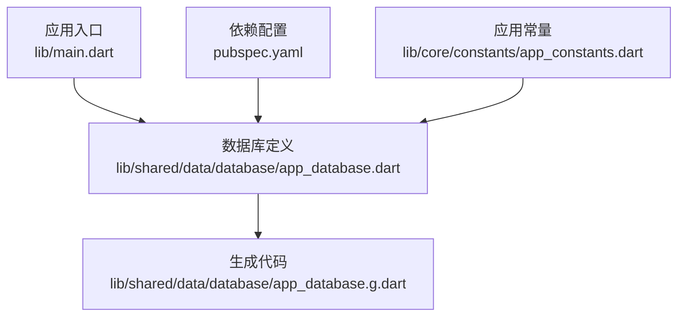
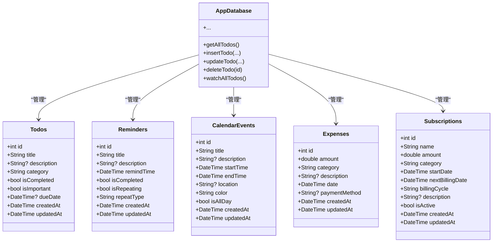
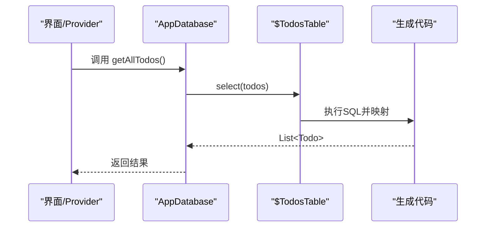
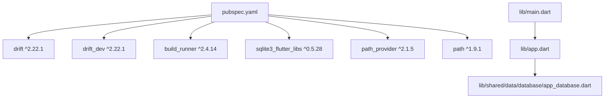

# 数据库系统

<cite>
**本文引用的文件**
- [app_database.dart](file://lib/shared/data/database/app_database.dart)
- [app_database.g.dart](file://lib/shared/data/database/app_database.g.dart)
- [pubspec.yaml](file://pubspec.yaml)
- [main.dart](file://lib/main.dart)
- [app_constants.dart](file://lib/core/constants/app_constants.dart)
</cite>

## 目录
1. [简介](#简介)
2. [项目结构](#项目结构)
3. [核心组件](#核心组件)
4. [架构总览](#架构总览)
5. [详细组件分析](#详细组件分析)
6. [依赖分析](#依赖分析)
7. [性能考虑](#性能考虑)
8. [故障排查指南](#故障排查指南)
9. [结论](#结论)
10. [附录](#附录)

## 简介
本文件面向LifeMaster应用的数据库系统，聚焦于Drift ORM在移动端的使用与配置，涵盖数据库表结构设计、数据模型定义、类型安全查询、数据访问层封装、迁移策略与版本管理、性能优化建议及最佳实践。文档以仓库中现有的数据库代码为基础，结合依赖配置与常量定义，为数据库管理员与后端开发者提供完整技术参考。

## 项目结构
数据库相关代码集中于共享数据层，采用Drift的声明式表定义与自动生成的查询适配器，配合应用启动入口进行初始化。

**图表来源**
- [main.dart:1-13](file://lib/main.dart#L1-L13)
- [app_database.dart:1-147](file://lib/shared/data/database/app_database.dart#L1-L147)
- [app_database.g.dart:1-200](file://lib/shared/data/database/app_database.g.dart#L1-L200)
- [pubspec.yaml:1-54](file://pubspec.yaml#L1-L54)
- [app_constants.dart:1-46](file://lib/core/constants/app_constants.dart#L1-L46)

**章节来源**
- [main.dart:1-13](file://lib/main.dart#L1-L13)
- [app_database.dart:1-147](file://lib/shared/data/database/app_database.dart#L1-L147)
- [pubspec.yaml:1-54](file://pubspec.yaml#L1-L54)
- [app_constants.dart:1-46](file://lib/core/constants/app_constants.dart#L1-L46)

## 核心组件
- 数据库定义与表结构：通过Table子类声明各业务表字段、默认值、可空性与约束；由@DriftDatabase聚合并生成数据库类。
- 自动生成的查询适配层：生成的$XTable与Companion类型提供类型安全的查询、插入、更新与映射。
- 数据访问方法：在AppDatabase中直接暴露常用CRUD与流式查询方法，便于上层调用。
- 连接与存储：使用NativeDatabase在应用文档目录下创建SQLite文件，后台线程打开，避免阻塞UI。

**章节来源**
- [app_database.dart:9-138](file://lib/shared/data/database/app_database.dart#L9-L138)
- [app_database.g.dart:5-263](file://lib/shared/data/database/app_database.g.dart#L5-L263)

## 架构总览
Drift在LifeMaster中的架构采用“声明式表 + 生成代码 + 轻量封装”的模式：
- 表定义层：Todos、Reminders、CalendarEvents、Expenses、Subscriptions。
- 查询适配层：$XTable、Companion、实体类与映射函数。
- 访问层：AppDatabase对各表提供统一的增删改查与watch接口。
- 存储层：NativeDatabase + 应用文档目录。

**图表来源**
- [app_database.dart:9-69](file://lib/shared/data/database/app_database.dart#L9-L69)
- [app_database.g.dart:265-438](file://lib/shared/data/database/app_database.g.dart#L265-L438)
- [app_database.g.dart:1961-1979](file://lib/shared/data/database/app_database.g.dart#L1961-L1979)
- [app_database.g.dart:2496-2543](file://lib/shared/data/database/app_database.g.dart#L2496-L2543)

## 详细组件分析

### 数据库初始化与连接
- 使用LazyDatabase延迟打开数据库，后台线程创建NativeDatabase实例。
- 数据库存放于应用文档目录下的lifemaster.sqlite文件。
- AppDatabase构造时传入连接工厂，确保线程安全与异步初始化。

**章节来源**
- [app_database.dart:140-147](file://lib/shared/data/database/app_database.dart#L140-L147)

### 表结构与字段约束
- Todos：标题长度限制、分类默认值、完成状态与重要性布尔字段、到期时间与时间戳。
- Reminders：提醒时间必填、重复标志与周期类型默认值、完成状态布尔字段。
- CalendarEvents：起止时间必填、全天事件布尔、颜色默认值、位置可空。
- Expenses：金额为实数、日期必填、支付方式可空、时间戳默认值。
- Subscriptions：名称长度限制、金额与周期类型、开始与下次计费日期、状态默认激活、时间戳默认值。

**章节来源**
- [app_database.dart:9-69](file://lib/shared/data/database/app_database.dart#L9-L69)

### 实体类与映射
- 每个表对应一个实体类（如Todo、Reminder等），实现Insertable接口，支持toColumns与JSON序列化。
- 生成的$XTable提供map方法将数据库行映射到实体对象。
- Companion用于构建插入/更新参数，支持部分字段更新与空值处理。

**章节来源**
- [app_database.g.dart:265-438](file://lib/shared/data/database/app_database.g.dart#L265-L438)
- [app_database.g.dart:1961-1979](file://lib/shared/data/database/app_database.g.dart#L1961-L1979)
- [app_database.g.dart:2496-2543](file://lib/shared/data/database/app_database.g.dart#L2496-L2543)

### 类型安全查询与过滤
- 生成的$$XTableFilterComposer提供列级过滤器，支持链式条件组合。
- $$XTableOrderingComposer提供排序组合器。
- $$XTableAnnotationComposer提供注解式列选择。
- 通过这些组合器，可在编译期保证查询字段与类型正确性。

**章节来源**
- [app_database.g.dart:3783-3831](file://lib/shared/data/database/app_database.g.dart#L3783-L3831)
- [app_database.g.dart:3833-3881](file://lib/shared/data/database/app_database.g.dart#L3833-L3881)
- [app_database.g.dart:4082-4101](file://lib/shared/data/database/app_database.g.dart#L4082-L4101)

### 数据访问层与Repository风格封装
- AppDatabase在类内直接提供每个表的查询、插入、更新、删除与watch方法，形成轻量的Repository风格封装。
- 上层可通过数据库实例直接调用，无需额外的仓储类抽象，简化了数据访问层。

**图表来源**
- [app_database.dart:89-91](file://lib/shared/data/database/app_database.dart#L89-L91)
- [app_database.g.dart:214-257](file://lib/shared/data/database/app_database.g.dart#L214-L257)

**章节来源**
- [app_database.dart:89-137](file://lib/shared/data/database/app_database.dart#L89-L137)

### 数据模型定义与关系映射
- 当前数据库未定义外键关系，各表独立管理。
- 若未来扩展，可在生成的$XTable中添加关系映射与join逻辑（基于生成代码能力）。

**章节来源**
- [app_database.g.dart:2903-2921](file://lib/shared/data/database/app_database.g.dart#L2903-L2921)

### 数据迁移策略与版本管理
- 当前schemaVersion为1，MigrationStrategy的onCreate创建所有表，onUpgrade为空实现。
- 建议后续版本在onUpgrade中按需添加列、索引或表变更，并维护版本号递增。

**章节来源**
- [app_database.dart:75-87](file://lib/shared/data/database/app_database.dart#L75-L87)

## 依赖分析
- Drift核心库与开发工具：drift与drift_dev，build_runner。
- SQLite运行时：sqlite3_flutter_libs。
- 文件路径与目录：path_provider与path。
- 应用启动入口：main.dart通过ProviderScope启动应用。

**图表来源**
- [pubspec.yaml:9-50](file://pubspec.yaml#L9-L50)
- [main.dart:1-13](file://lib/main.dart#L1-L13)

**章节来源**
- [pubspec.yaml:9-50](file://pubspec.yaml#L9-L50)
- [main.dart:1-13](file://lib/main.dart#L1-L13)

## 性能考虑
- 使用生成代码的类型安全查询减少运行时错误与解析成本。
- 利用watch接口进行响应式数据订阅，避免频繁轮询。
- 在高频查询场景下，建议为常用过滤字段建立索引（可在迁移脚本中添加）。
- 对大列表分页加载，控制单次查询返回量，降低内存占用。
- 将耗时操作放在后台线程执行，避免阻塞主线程。

## 故障排查指南
- 插入失败或校验错误：检查实体类的toColumns与Companion构建是否包含必填字段，默认值是否满足约束。
- 映射异常：确认$XTable.map方法使用的列名与实际表结构一致。
- 迁移问题：升级schemaVersion后，确保onUpgrade中包含必要的DDL变更。
- 数据库文件损坏：清理应用缓存目录后重新初始化数据库。

**章节来源**
- [app_database.g.dart:143-212](file://lib/shared/data/database/app_database.g.dart#L143-L212)
- [app_database.g.dart:708-779](file://lib/shared/data/database/app_database.g.dart#L708-L779)
- [app_database.dart:75-87](file://lib/shared/data/database/app_database.dart#L75-L87)

## 结论
LifeMaster的数据库系统基于Drift实现了清晰的表定义、完善的生成代码与简洁的数据访问封装。当前版本专注于基础表结构与类型安全查询，具备良好的扩展性。建议后续完善迁移策略、引入索引与分页机制，并在需要时扩展表间关系映射，以支撑更复杂的业务场景。

## 附录
- 默认分类与容量限制：应用常量中定义了默认分类集合与各表上限，可用于前端展示与数据治理。

**章节来源**
- [app_constants.dart:13-46](file://lib/core/constants/app_constants.dart#L13-L46)