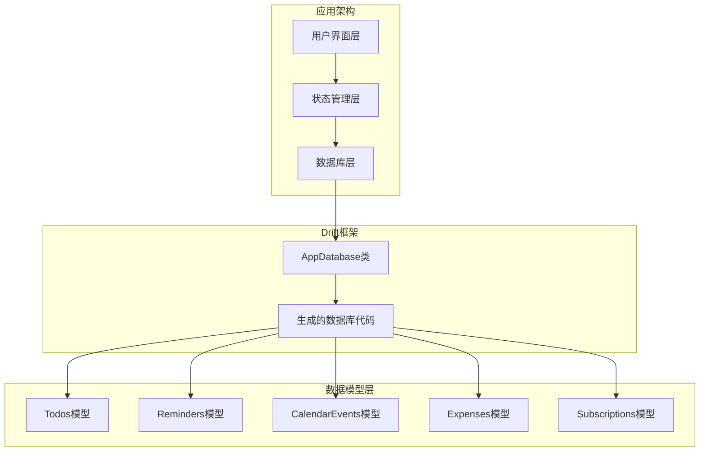
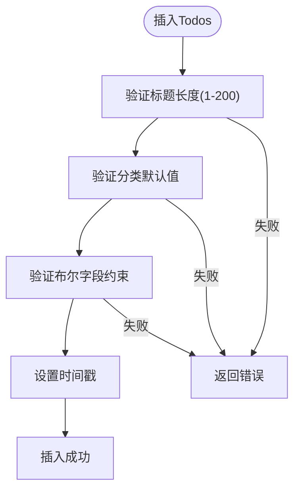
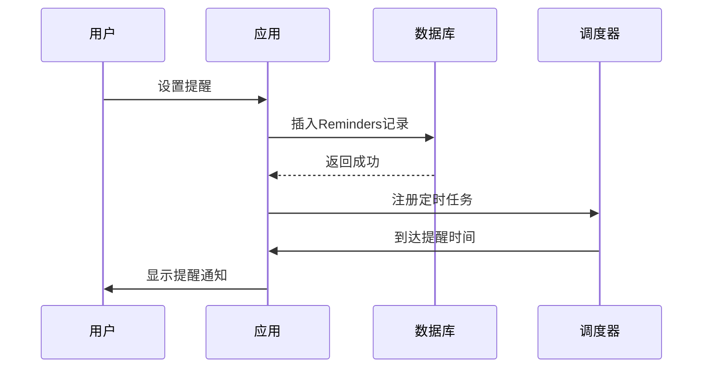
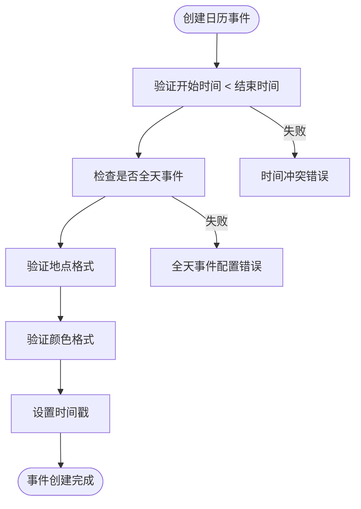
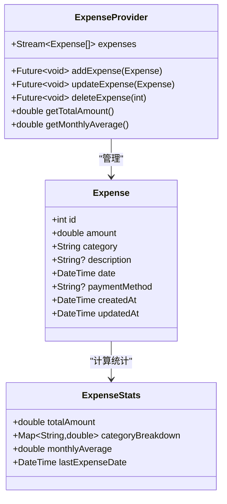
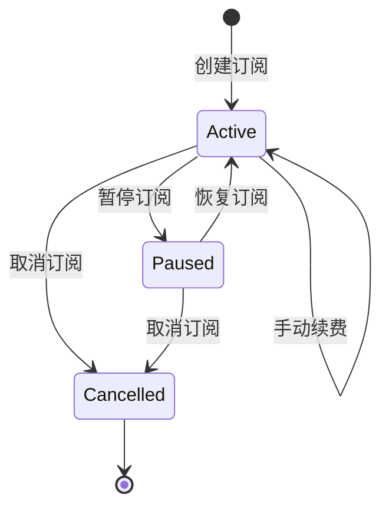
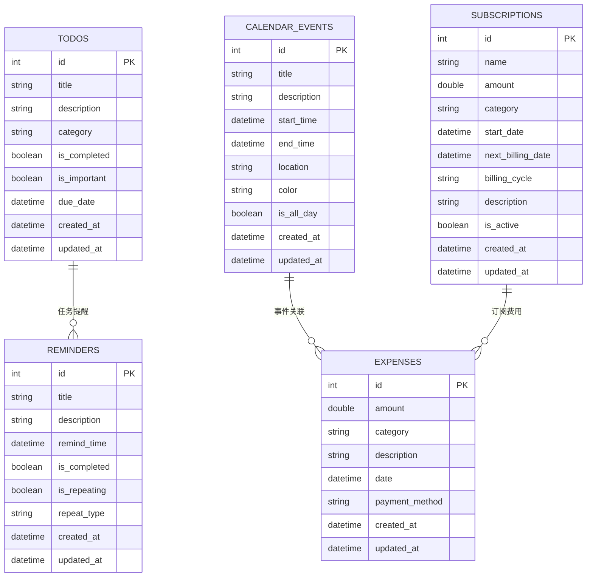
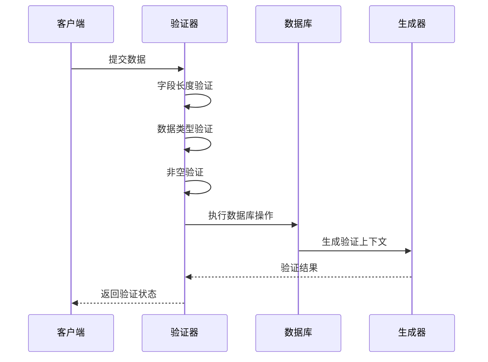
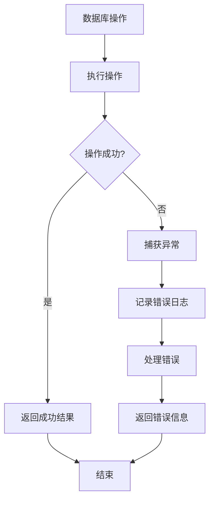

# 数据模型设计

<cite>
**本文档引用的文件**
- [app_database.dart](file://lib/shared/data/database/app_database.dart)
- [app_database.g.dart](file://lib/shared/data/database/app_database.g.dart)
- [todo_provider.dart](file://lib/features/todo/presentation/providers/todo_provider.dart)
- [expense_provider.dart](file://lib/features/expense/presentation/providers/expense_provider.dart)
- [subscription_provider.dart](file://lib/features/subscription/presentation/providers/subscription_provider.dart)
</cite>

## 目录
1. [简介](#简介)
2. [项目结构概览](#项目结构概览)
3. [核心数据模型总览](#核心数据模型总览)
4. [Todos模型详解](#todos模型详解)
5. [Reminders模型详解](#reminders模型详解)
6. [CalendarEvents模型详解](#calevents模型详解)
7. [Expenses模型详解](#expenses模型详解)
8. [Subscriptions模型详解](#subscriptions模型详解)
9. [数据模型关系图](#数据模型关系图)
10. [序列化与反序列化](#序列化与反序列化)
11. [验证规则与约束](#验证规则与约束)
12. [最佳实践指南](#最佳实践指南)
13. [性能优化建议](#性能优化建议)
14. [故障排除指南](#故障排除指南)
15. [总结](#总结)

## 简介

LifeMaster是一个基于Flutter开发的个人生活管理应用，采用Drift数据库框架实现本地数据持久化。本文档详细阐述了应用的五个核心数据模型设计，包括Todos（待办事项）、Reminders（提醒）、CalendarEvents（日历事件）、Expenses（支出）和Subscriptions（订阅）表的字段定义、数据类型、约束条件和业务逻辑。

该数据模型设计遵循现代化的数据库设计原则，确保数据完整性、一致性和可维护性，同时为前端开发者提供了清晰的API接口和最佳实践指导。

## 项目结构概览

LifeMaster采用模块化的项目结构，数据模型集中在`lib/shared/data/database/`目录下，通过Drift框架自动生成数据库代码：



**图表来源**
- [app_database.dart:71-138](file://lib/shared/data/database/app_database.dart#L71-L138)

## 核心数据模型总览

应用采用Drift框架的声明式数据库设计方法，所有数据模型都继承自`Table`基类，并通过生成器代码提供完整的CRUD操作支持。

### 模型设计特点

1. **强类型安全**：每个字段都有明确的数据类型定义
2. **自动验证**：Drift自动生成字段长度和类型验证
3. **默认值管理**：关键字段设置合理的默认值
4. **时间戳跟踪**：所有模型都包含创建和更新时间戳
5. **布尔字段约束**：使用CHECK约束确保布尔值的有效性

**章节来源**
- [app_database.dart:9-69](file://lib/shared/data/database/app_database.dart#L9-L69)

## Todos模型详解

Todos模型用于管理用户的待办事项，是LifeMaster中最基础的任务管理功能。

### 字段定义与约束

| 字段名 | 数据类型 | 约束条件 | 默认值 | 说明 |
|--------|----------|----------|--------|------|
| id | Integer | 主键, 自增 | 无 | 唯一标识符 |
| title | Text | 非空, 长度1-200 | 无 | 任务标题 |
| description | Text | 可空 | null | 任务描述 |
| category | Text | 默认值'General' | 'General' | 分类标签 |
| isCompleted | Boolean | CHECK(0,1), 默认false | false | 完成状态 |
| isImportant | Boolean | CHECK(0,1), 默认false | false | 重要性标记 |
| dueDate | DateTime | 可空 | null | 截止日期 |
| createdAt | DateTime | 默认当前时间 | 当前时间 | 创建时间 |
| updatedAt | DateTime | 默认当前时间 | 当前时间 | 更新时间 |

### 业务属性分析

- **分类系统**：支持通用、工作、个人、健康、购物、财务等分类
- **优先级管理**：通过`isImportant`字段实现任务优先级标记
- **完成追踪**：`isCompleted`字段支持任务完成状态管理
- **时间管理**：`dueDate`字段提供截止日期提醒功能

### 数据验证规则



**图表来源**
- [app_database.g.dart:143-212](file://lib/shared/data/database/app_database.g.dart#L143-L212)

**章节来源**
- [app_database.dart:9-19](file://lib/shared/data/database/app_database.dart#L9-L19)
- [app_database.g.dart:265-438](file://lib/shared/data/database/app_database.g.dart#L265-L438)

## Reminders模型详解

Reminders模型提供重复性提醒功能，支持一次性提醒和周期性提醒。

### 字段定义与约束

| 字段名 | 数据类型 | 约束条件 | 默认值 | 说明 |
|--------|----------|----------|--------|------|
| id | Integer | 主键, 自增 | 无 | 唯一标识符 |
| title | Text | 非空, 长度1-200 | 无 | 提醒标题 |
| description | Text | 可空 | null | 提醒描述 |
| remindTime | DateTime | 非空 | 无 | 提醒时间 |
| isCompleted | Boolean | CHECK(0,1), 默认false | false | 完成状态 |
| isRepeating | Boolean | CHECK(0,1), 默认false | false | 是否重复 |
| repeatType | Text | 默认值'none' | 'none' | 重复类型 |
| createdAt | DateTime | 默认当前时间 | 当前时间 | 创建时间 |
| updatedAt | DateTime | 默认当前时间 | 当前时间 | 更新时间 |

### 重复类型支持

系统支持多种重复类型：
- `none`: 不重复
- `daily`: 每日重复
- `weekly`: 每周重复
- `monthly`: 每月重复
- `yearly`: 每年重复

### 业务逻辑实现



**图表来源**
- [app_database.dart:21-31](file://lib/shared/data/database/app_database.dart#L21-L31)

**章节来源**
- [app_database.g.dart:832-1005](file://lib/shared/data/database/app_database.g.dart#L832-L1005)

## CalendarEvents模型详解

CalendarEvents模型提供完整的日历事件管理功能，支持全天事件和时间段事件。

### 字段定义与约束

| 字段名 | 数据类型 | 约束条件 | 默认值 | 说明 |
|--------|----------|----------|--------|------|
| id | Integer | 主键, 自增 | 无 | 唯一标识符 |
| title | Text | 非空, 长度1-200 | 无 | 事件标题 |
| description | Text | 可空 | null | 事件描述 |
| startTime | DateTime | 非空 | 无 | 开始时间 |
| endTime | DateTime | 非空 | 无 | 结束时间 |
| location | Text | 可空 | null | 事件地点 |
| color | Text | 默认值'#10B981' | '#10B981' | 事件颜色 |
| isAllDay | Boolean | CHECK(0,1), 默认false | false | 全天事件标记 |
| createdAt | DateTime | 默认当前时间 | 当前时间 | 创建时间 |
| updatedAt | DateTime | 默认当前时间 | 当前时间 | 更新时间 |

### 颜色系统

系统提供预设的颜色方案，支持事件的视觉区分：
- `#10B981` (绿色) - 默认颜色
- `#EF4444` (红色) - 重要事件
- `#3B82F6` (蓝色) - 工作相关
- `#F59E0B` (橙色) - 个人事务
- `#8B5CF6` (紫色) - 特殊事件

### 时间范围验证



**图表来源**
- [app_database.g.dart:1282-1355](file://lib/shared/data/database/app_database.g.dart#L1282-L1355)

**章节来源**
- [app_database.g.dart:1412-1593](file://lib/shared/data/database/app_database.g.dart#L1412-L1593)

## Expenses模型详解

Expenses模型专门用于管理个人财务支出，提供详细的支出追踪功能。

### 字段定义与约束

| 字段名 | 数据类型 | 约束条件 | 默认值 | 说明 |
|--------|----------|----------|--------|------|
| id | Integer | 主键, 自增 | 无 | 唯一标识符 |
| amount | Real | 非空 | 无 | 支出金额 |
| category | Text | 非空 | 无 | 支出分类 |
| description | Text | 可空 | null | 支出描述 |
| date | DateTime | 非空 | 无 | 支出日期 |
| paymentMethod | Text | 可空 | null | 支付方式 |
| createdAt | DateTime | 默认当前时间 | 当前时间 | 创建时间 |
| updatedAt | DateTime | 默认当前时间 | 当前时间 | 更新时间 |

### 支出分类体系

系统支持以下预设分类：
- `Food` (食物)
- `Transport` (交通)
- `Shopping` (购物)
- `Entertainment` (娱乐)
- `Health` (健康)
- `Education` (教育)
- `Housing` (住房)
- `Utilities` (公用事业)
- `Other` (其他)

### 支付方式支持

- `Cash` (现金)
- `Credit Card` (信用卡)
- `Debit Card` (借记卡)
- `Bank Transfer` (银行转账)
- `Mobile Payment` (移动支付)

### 财务统计功能



**图表来源**
- [app_database.g.dart:1961-2122](file://lib/shared/data/database/app_database.g.dart#L1961-L2122)

**章节来源**
- [app_database.g.dart:1961-2122](file://lib/shared/data/database/app_database.g.dart#L1961-L2122)

## Subscriptions模型详解

Subscriptions模型用于管理定期订阅服务，提供订阅费用的持续追踪。

### 字段定义与约束

| 字段名 | 数据类型 | 约束条件 | 默认值 | 说明 |
|--------|----------|----------|--------|------|
| id | Integer | 主键, 自增 | 无 | 唯一标识符 |
| name | Text | 非空, 长度1-200 | 无 | 订阅名称 |
| amount | Real | 非空 | 无 | 月费金额 |
| category | Text | 非空 | 无 | 订阅分类 |
| startDate | DateTime | 非空 | 无 | 开始日期 |
| nextBillingDate | DateTime | 非空 | 无 | 下次计费日期 |
| billingCycle | Text | 默认值'monthly' | 'monthly' | 计费周期 |
| description | Text | 可空 | null | 订阅描述 |
| isActive | Boolean | CHECK(0,1), 默认true | true | 激活状态 |
| createdAt | DateTime | 默认当前时间 | 当前时间 | 创建时间 |
| updatedAt | DateTime | 默认当前时间 | 当前时间 | 更新时间 |

### 订阅分类体系

系统支持以下订阅分类：
- `Streaming` (流媒体)
- `Music` (音乐)
- `Gaming` (游戏)
- `Productivity` (生产力)
- `Cloud Storage` (云存储)
- `Fitness` (健身)
- `News` (新闻)
- `Other` (其他)

### 计费周期管理

支持的计费周期：
- `monthly` (月度)
- `quarterly` (季度)
- `yearly` (年度)

### 订阅生命周期管理



**图表来源**
- [app_database.g.dart:2552-2745](file://lib/shared/data/database/app_database.g.dart#L2552-L2745)

**章节来源**
- [app_database.g.dart:2552-2745](file://lib/shared/data/database/app_database.g.dart#L2552-L2745)

## 数据模型关系图

LifeMaster的五个数据模型相互独立，各自服务于不同的业务领域，但都遵循统一的设计模式和约束规则。



**图表来源**
- [app_database.dart:9-69](file://lib/shared/data/database/app_database.dart#L9-L69)

## 序列化与反序列化

LifeMaster采用Drift框架提供的自动序列化机制，为每个数据模型提供完整的JSON序列化支持。

### 序列化特性

1. **自动映射**：字段名称与数据库列名自动映射
2. **类型安全**：运行时类型检查和转换
3. **默认处理**：可空字段的智能处理
4. **时间格式**：DateTime类型的标准化处理

### JSON格式示例

每个模型都支持标准的JSON格式，便于网络传输和存储：

```json
{
  "id": 1,
  "title": "完成项目报告",
  "description": "准备季度项目总结报告",
  "category": "Work",
  "isCompleted": false,
  "isImportant": true,
  "dueDate": "2024-01-15T10:00:00Z",
  "createdAt": "2024-01-01T08:00:00Z",
  "updatedAt": "2024-01-01T08:00:00Z"
}
```

### 序列化流程


**图表来源**
- [app_database.g.dart:323-354](file://lib/shared/data/database/app_database.g.dart#L323-L354)

**章节来源**
- [app_database.g.dart:323-354](file://lib/shared/data/database/app_database.g.dart#L323-L354)

## 验证规则与约束

LifeMaster的数据模型实现了多层次的验证机制，确保数据的完整性和一致性。

### 字段级验证

1. **长度验证**：文本字段的最小和最大长度限制
2. **类型验证**：确保数据类型符合预期
3. **非空验证**：关键字段的必填检查
4. **范围验证**：数值字段的合理范围检查

### 数据库级约束

1. **主键约束**：确保每条记录的唯一性
2. **外键约束**：维护表间关系的完整性
3. **检查约束**：布尔字段的0/1值限制
4. **默认值约束**：自动填充关键字段

### 运行时验证



**图表来源**
- [app_database.g.dart:143-212](file://lib/shared/data/database/app_database.g.dart#L143-L212)

**章节来源**
- [app_database.g.dart:143-212](file://lib/shared/data/database/app_database.g.dart#L143-L212)

## 最佳实践指南

### 数据模型设计最佳实践

1. **字段命名规范**
   - 使用小驼峰命名法
   - 保持字段名简洁明了
   - 避免使用保留字

2. **数据类型选择**
   - 数值使用合适的精度类型
   - 文本字段设置合理的长度限制
   - 时间字段使用UTC格式

3. **默认值策略**
   - 为关键字段设置有意义的默认值
   - 避免使用null值作为默认值
   - 考虑业务场景的合理性

### 性能优化建议

1. **索引策略**
   - 为常用查询字段建立索引
   - 避免过度索引影响写入性能
   - 考虑复合索引的使用场景

2. **查询优化**
   - 使用参数化查询防止SQL注入
   - 避免SELECT *，只查询必要字段
   - 合理使用LIMIT和分页

3. **内存管理**
   - 及时释放数据库连接
   - 使用流式查询处理大量数据
   - 避免内存泄漏

### 错误处理策略



**图表来源**
- [todo_provider.dart:42-44](file://lib/features/todo/presentation/providers/todo_provider.dart#L42-L44)

**章节来源**
- [todo_provider.dart:42-44](file://lib/features/todo/presentation/providers/todo_provider.dart#L42-L44)

## 性能优化建议

### 数据库性能优化

1. **查询优化**
   - 使用适当的WHERE条件
   - 避免在WHERE子句中使用函数
   - 合理使用ORDER BY和LIMIT

2. **索引优化**
   - 为频繁查询的字段建立索引
   - 考虑复合索引的使用
   - 定期分析查询计划

3. **连接池管理**
   - 合理配置连接池大小
   - 及时关闭不再使用的连接
   - 使用异步操作避免阻塞

### 内存优化

1. **对象生命周期管理**
   - 及时释放不再使用的对象
   - 使用弱引用避免循环引用
   - 监控内存使用情况

2. **数据缓存策略**
   - 实现适当的缓存机制
   - 避免缓存过多数据
   - 定期清理过期缓存

## 故障排除指南

### 常见问题诊断

1. **数据插入失败**
   - 检查字段长度限制
   - 验证数据类型匹配
   - 确认必填字段完整性

2. **查询结果异常**
   - 检查WHERE条件的正确性
   - 验证排序字段的有效性
   - 确认分页参数的合理性

3. **性能问题排查**
   - 分析查询执行计划
   - 检查索引使用情况
   - 监控数据库连接数

### 调试工具使用

1. **数据库调试**
   - 使用SQLite命令行工具
   - 启用SQL语句日志
   - 分析慢查询日志

2. **应用调试**
   - 启用Drift调试模式
   - 监控数据库操作时间
   - 检查内存使用情况

**章节来源**
- [app_database.dart:78-87](file://lib/shared/data/database/app_database.dart#L78-L87)

## 总结

LifeMaster的数据模型设计体现了现代移动应用开发的最佳实践，通过Drift框架实现了类型安全、自动验证和高性能的数据持久化。五个核心数据模型各有明确的业务职责，既相互独立又协调配合，为用户提供完整的个人生活管理解决方案。

### 设计亮点

1. **模块化设计**：每个数据模型专注于特定的业务领域
2. **强类型安全**：编译时类型检查确保数据完整性
3. **自动验证**：Drift框架提供全面的数据验证机制
4. **性能优化**：合理的索引策略和查询优化
5. **可扩展性**：清晰的架构为未来功能扩展奠定基础

### 技术优势

- **开发效率**：自动生成的代码减少重复劳动
- **维护性**：统一的设计模式便于代码维护
- **可靠性**：多层次的验证机制确保数据质量
- **性能**：优化的数据库设计支持大规模数据处理

该数据模型设计为LifeMaster应用提供了坚实的技术基础，能够满足当前的功能需求并支持未来的业务发展。