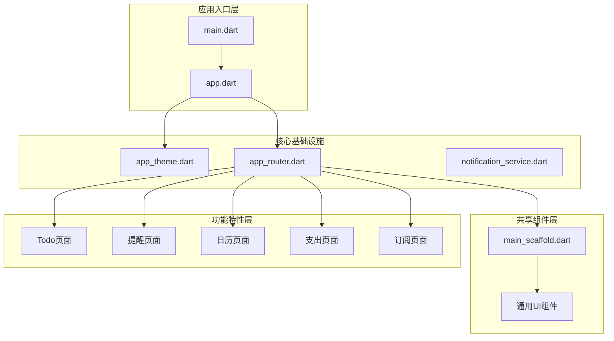
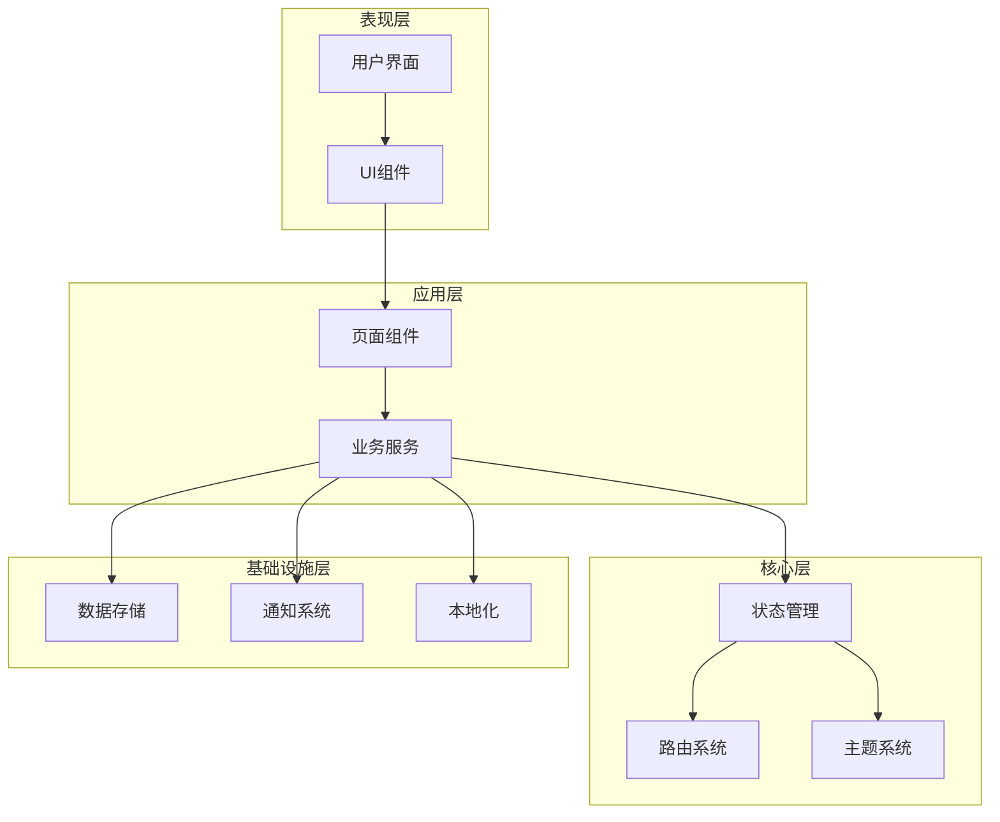
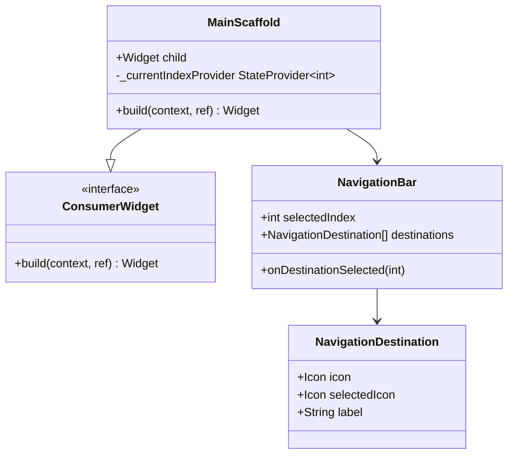
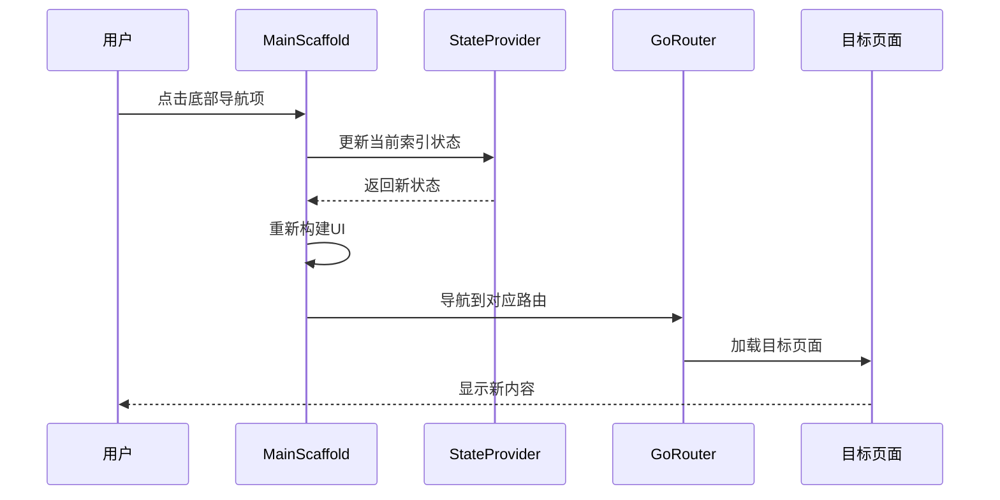
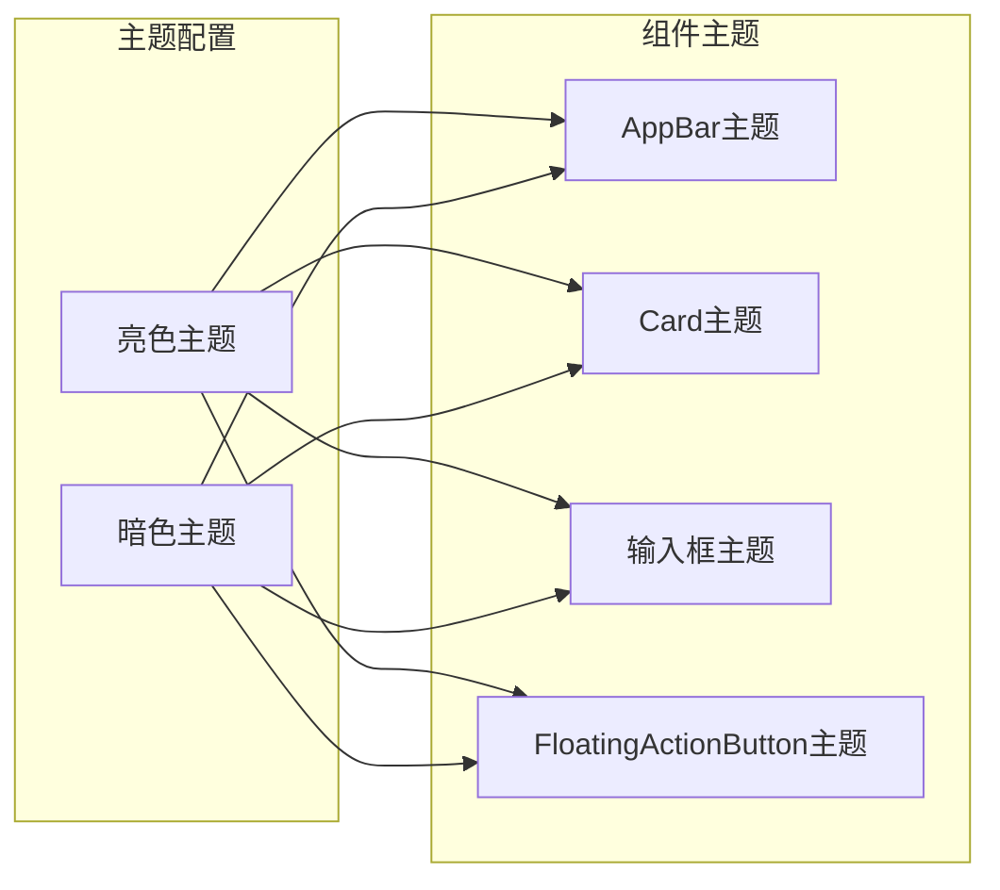
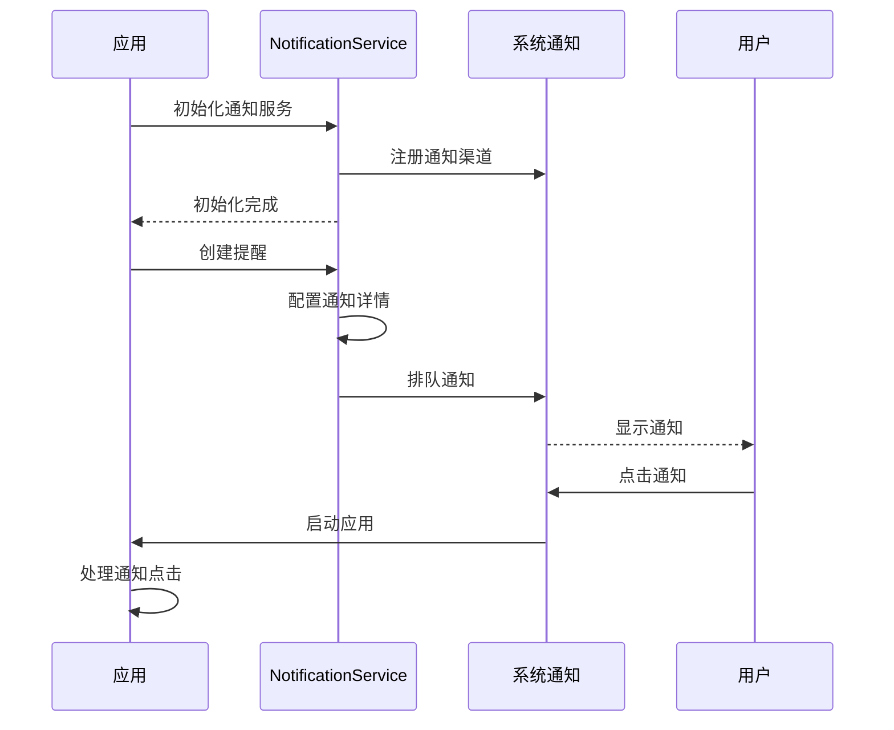
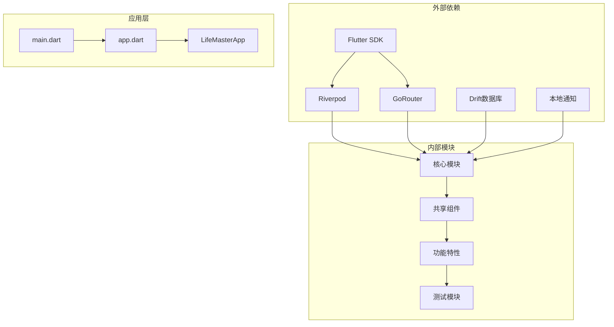

# 共享组件架构

<cite>
**本文档引用的文件**
- [main.dart](file://lib/main.dart)
- [app.dart](file://lib/app.dart)
- [app_theme.dart](file://lib/core/theme/app_theme.dart)
- [app_router.dart](file://lib/core/router/app_router.dart)
- [main_scaffold.dart](file://lib/shared/presentation/widgets/main_scaffold.dart)
- [notification_service.dart](file://lib/core/services/notification_service.dart)
- [pubspec.yaml](file://pubspec.yaml)
</cite>

## 目录
1. [简介](#简介)
2. [项目结构](#项目结构)
3. [核心组件](#核心组件)
4. [架构概览](#架构概览)
5. [详细组件分析](#详细组件分析)
6. [依赖关系分析](#依赖关系分析)
7. [性能考虑](#性能考虑)
8. [故障排除指南](#故障排除指南)
9. [结论](#结论)
10. [附录](#附录)

## 简介

LifeMaster 是一个基于 Flutter 的个人生活管理应用，采用现代化的架构设计，专注于组件复用和可维护性。该应用的核心架构围绕共享组件系统构建，通过统一的主题管理、导航状态管理和组件化设计，实现了高度的代码复用和一致的用户体验。

本架构文档深入解析了共享组件的设计原则和复用策略，详细说明了主布局组件的实现机制，包括底部导航栏、主屏幕布局和导航状态管理。同时阐述了通用UI组件的设计模式，组件间的通信机制和事件传递，以及组件测试策略和可访问性支持。

## 项目结构

项目采用功能驱动的模块化组织方式，主要分为以下几个核心层次：



**图表来源**
- [main.dart:1-15](file://lib/main.dart#L1-L15)
- [app.dart:1-23](file://lib/app.dart#L1-L23)
- [app_theme.dart:1-78](file://lib/core/theme/app_theme.dart#L1-L78)
- [app_router.dart:1-61](file://lib/core/router/app_router.dart#L1-L61)

**章节来源**
- [main.dart:1-15](file://lib/main.dart#L1-L15)
- [app.dart:1-23](file://lib/app.dart#L1-L23)
- [pubspec.yaml:1-57](file://pubspec.yaml#L1-L57)

## 核心组件

### 应用入口组件

应用的启动流程通过简洁而强大的入口点实现，采用 Riverpod 状态管理模式，确保了组件间通信的一致性和可预测性。

### 主题管理系统

AppTheme 类提供了完整的主题管理解决方案，包括：
- **颜色系统**：定义了主色调、辅助色和功能专用色
- **Material Design 3 支持**：充分利用最新的 Material Design 规范
- **明暗主题切换**：基于系统设置自动切换主题模式
- **组件主题定制**：针对 AppBar、Card、InputDecoration 等组件的专门定制

### 导航路由系统

基于 GoRouter 的现代路由解决方案，实现了：
- **ShellRoute 架构**：支持共享布局和独立页面路由
- **无过渡动画**：优化用户体验的页面切换效果
- **类型安全的导航**：编译时检查路由参数和返回值

**章节来源**
- [app_theme.dart:1-78](file://lib/core/theme/app_theme.dart#L1-L78)
- [app_router.dart:15-60](file://lib/core/router/app_router.dart#L15-L60)

## 架构概览

LifeMaster 采用了分层架构设计，每层都有明确的职责分工和边界定义：



**图表来源**
- [app.dart:6-22](file://lib/app.dart#L6-L22)
- [app_router.dart:15-60](file://lib/core/router/app_router.dart#L15-L60)
- [app_theme.dart:18-77](file://lib/core/theme/app_theme.dart#L18-L77)

## 详细组件分析

### 主布局组件 MainScaffold

MainScaffold 是整个应用的核心布局组件，实现了统一的导航体验和状态管理。

#### 组件架构设计



**图表来源**
- [main_scaffold.dart:8-71](file://lib/shared/presentation/widgets/main_scaffold.dart#L8-L71)

#### 导航状态管理机制

组件使用 Riverpod 的 StateProvider 实现本地状态管理，通过 ref.watch 和 ref.read 实现响应式更新：



**图表来源**
- [main_scaffold.dart:14-40](file://lib/shared/presentation/widgets/main_scaffold.dart#L14-L40)

#### 颜色主题集成

每个导航项都集成了特定的功能颜色主题，实现了视觉一致性：

| 功能 | 颜色代码 | 使用场景 |
|------|----------|----------|
| Todo | #FF6366F1 | 任务管理功能 |
| Reminder | #FFF59E0B | 提醒事项功能 |
| Calendar | #FF10B981 | 日程安排功能 |
| Expense | #FFEC4899 | 财务支出功能 |
| Subscription | #FF8B5CF6 | 订阅管理功能 |

**章节来源**
- [main_scaffold.dart:1-71](file://lib/shared/presentation/widgets/main_scaffold.dart#L1-L71)

### 主题系统设计

AppTheme 提供了完整的主题管理解决方案，确保应用在不同设备和环境下保持一致的视觉体验。

#### 主题设计原则

1. **Material Design 3 规范**：完全遵循最新的 Material Design 设计语言
2. **色彩系统**：定义了主色调、辅助色和语义化颜色（错误、警告、成功）
3. **组件定制**：针对不同组件提供专门的主题配置
4. **暗黑模式**：完整的明暗主题切换支持

#### 主题配置详解



**图表来源**
- [app_theme.dart:18-77](file://lib/core/theme/app_theme.dart#L18-L77)

**章节来源**
- [app_theme.dart:1-78](file://lib/core/theme/app_theme.dart#L1-L78)

### 路由系统架构

基于 GoRouter 的现代路由解决方案，实现了灵活的页面导航和状态管理。

#### 路由架构设计

```mermaid
flowchart TD
Root[根路由] --> Shell[ShellRoute]
Shell --> MainScaffold[MainScaffold]
MainScaffold --> Child[子路由]
Child --> Todo[/todo]
Child --> Reminder[/reminder]
Child --> Calendar[/calendar]
Child --> Expense[/expense]
Child --> Subscription[/subscription]
Todo --> TodoPage[TodoPage]
Reminder --> ReminderPage[ReminderPage]
Calendar --> CalendarPage[CalendarPage]
Expense --> ExpensePage[ExpensePage]
Subscription --> SubscriptionPage[SubscriptionPage]
```

**图表来源**
- [app_router.dart:15-60](file://lib/core/router/app_router.dart#L15-L60)

#### 路由状态管理

路由系统采用 Provider 模式管理 GoRouter 实例，确保全局状态的一致性：

**章节来源**
- [app_router.dart:1-61](file://lib/core/router/app_router.dart#L1-L61)

### 通知服务系统

NotificationService 提供了跨平台的通知管理功能，支持定时提醒和通知调度。

#### 通知服务架构



**图表来源**
- [notification_service.dart:13-31](file://lib/core/services/notification_service.dart#L13-L31)

**章节来源**
- [notification_service.dart:1-82](file://lib/core/services/notification_service.dart#L1-L82)

## 依赖关系分析

项目采用现代化的依赖注入和模块化设计，确保了组件间的松耦合和高内聚。



**图表来源**
- [pubspec.yaml:9-46](file://pubspec.yaml#L9-L46)
- [main.dart:1-15](file://lib/main.dart#L1-L15)

**章节来源**
- [pubspec.yaml:1-57](file://pubspec.yaml#L1-L57)

## 性能考虑

### 状态管理优化

1. **选择性重建**：使用 ConsumerWidget 确保只在相关状态变化时重建组件
2. **状态隔离**：将导航状态与业务状态分离，减少不必要的重绘
3. **Provider 缓存**：利用 Riverpod 的自动缓存机制提升性能

### 内存管理

1. **组件生命周期**：合理管理组件的创建和销毁
2. **资源释放**：及时释放数据库连接和通知资源
3. **内存泄漏防护**：避免闭包捕获导致的循环引用

### 导航性能

1. **预加载策略**：对常用页面实施预加载
2. **路由缓存**：利用 GoRouter 的页面缓存机制
3. **动画优化**：使用无过渡动画减少渲染开销

## 故障排除指南

### 常见问题诊断

#### 主题不生效问题

**症状**：应用主题更改后界面未更新
**解决方案**：
1. 检查 AppTheme 的静态属性是否正确引用
2. 确认 MaterialApp.router 中的主题配置
3. 验证主题模式设置是否正确

#### 导航状态异常

**症状**：底部导航栏状态与实际页面不匹配
**解决方案**：
1. 检查 StateProvider 的初始化值
2. 验证导航回调函数的实现
3. 确认路由路径配置的正确性

#### 通知服务初始化失败

**症状**：应用无法接收通知
**解决方案**：
1. 检查通知权限配置
2. 验证时区数据初始化
3. 确认通知渠道注册

**章节来源**
- [notification_service.dart:13-31](file://lib/core/services/notification_service.dart#L13-L31)

## 结论

LifeMaster 的共享组件架构展现了现代 Flutter 应用的最佳实践。通过精心设计的主题系统、灵活的路由架构和高效的组件复用机制，实现了高度的代码质量和用户体验。

该架构的主要优势包括：
- **高度复用性**：共享组件减少了重复代码，提升了开发效率
- **强一致性**：统一的主题和导航体验确保了应用的整体性
- **可维护性**：清晰的模块划分和依赖关系便于长期维护
- **扩展性**：灵活的架构设计支持新功能的快速集成

未来可以考虑的改进方向：
- 添加更完善的组件测试套件
- 实施更细粒度的状态管理策略
- 增强可访问性支持
- 优化性能监控和分析

## 附录

### 开发指南

#### 新组件开发流程

1. **需求分析**：确定组件的功能需求和使用场景
2. **接口设计**：定义清晰的组件接口和参数
3. **实现开发**：遵循现有代码风格和架构规范
4. **测试验证**：编写单元测试和集成测试
5. **文档完善**：添加必要的使用说明和示例

#### 组件定制化策略

1. **主题定制**：通过 AppTheme 扩展颜色和样式
2. **行为定制**：通过回调函数和配置参数实现行为定制
3. **外观定制**：通过装饰参数和样式属性调整外观
4. **功能扩展**：通过组合模式实现功能扩展

#### 最佳实践建议

1. **单一职责原则**：每个组件应专注于单一功能
2. **不可变性优先**：尽量使用不可变数据结构
3. **错误处理**：实现完善的错误处理和恢复机制
4. **性能优化**：关注组件的性能影响，避免过度重建
5. **可测试性**：设计易于测试的组件接口和行为