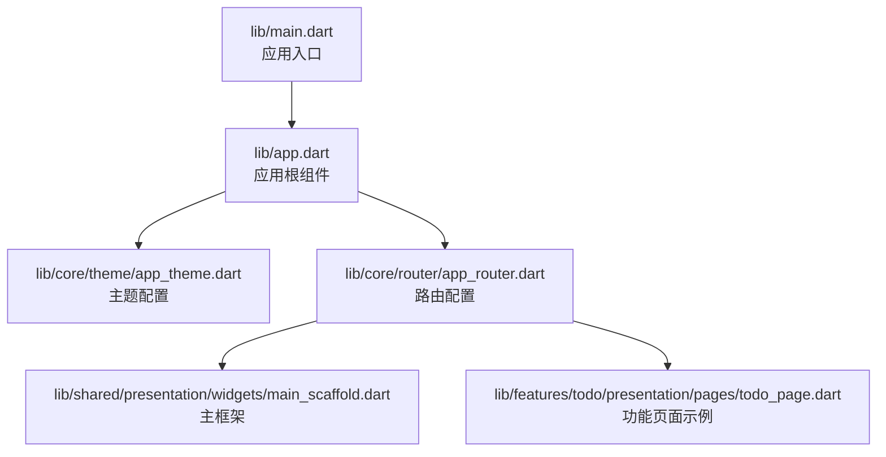
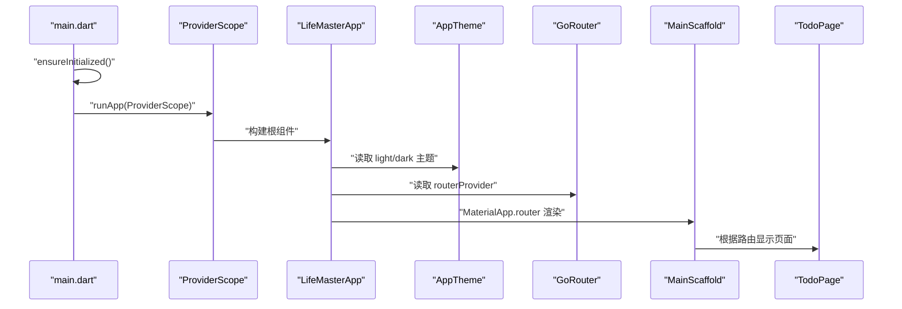
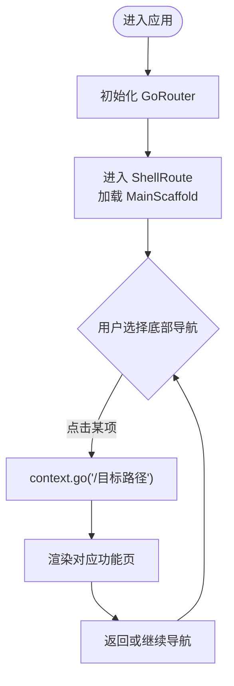
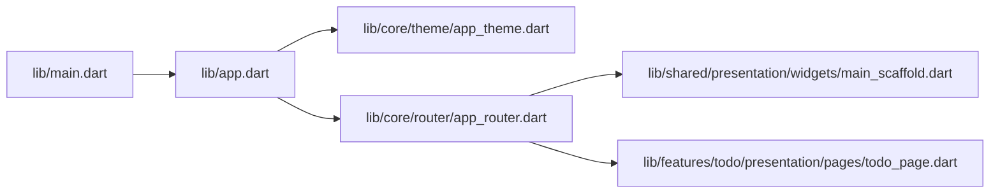

# 应用入口与初始化

<cite>
**本文引用的文件**
- [main.dart](file://lib/main.dart)
- [app.dart](file://lib/app.dart)
- [app_theme.dart](file://lib/core/theme/app_theme.dart)
- [app_router.dart](file://lib/core/router/app_router.dart)
- [main_scaffold.dart](file://lib/shared/presentation/widgets/main_scaffold.dart)
- [todo_page.dart](file://lib/features/todo/presentation/pages/todo_page.dart)
- [styles.xml（浅色）](file://android/app/src/main/res/values/styles.xml)
- [styles.xml（深色）](file://android/app/src/main/res/values-night/styles.xml)
</cite>

## 目录
1. [简介](#简介)
2. [项目结构](#项目结构)
3. [核心组件](#核心组件)
4. [架构总览](#架构总览)
5. [组件详解](#组件详解)
6. [依赖关系分析](#依赖关系分析)
7. [性能考量](#性能考量)
8. [故障排查指南](#故障排查指南)
9. [结论](#结论)
10. [附录](#附录)

## 简介
本文件聚焦 LifeMaster 应用的入口点与初始化流程，系统性解析以下内容：
- main.dart 与 app.dart 的职责分工与协作方式
- 应用启动流程、初始化过程与全局配置
- 组件树构建：MaterialApp 包装器、主题配置、路由配置
- 生命周期管理与错误边界处理策略
- 启动性能优化建议与调试技巧
- 入口点最佳实践

## 项目结构
入口相关的关键文件位于 lib 目录，Android 端的启动主题样式位于 android/app/src/main/res/values*。整体采用“入口层（main.dart）→ 应用根组件（app.dart）→ 路由与主题”的分层组织。

图表来源
- [main.dart:1-13](file://lib/main.dart#L1-L13)
- [app.dart:1-23](file://lib/app.dart#L1-L23)
- [app_theme.dart:1-77](file://lib/core/theme/app_theme.dart#L1-L77)
- [app_router.dart:1-60](file://lib/core/router/app_router.dart#L1-L60)
- [main_scaffold.dart:1-72](file://lib/shared/presentation/widgets/main_scaffold.dart#L1-L72)
- [todo_page.dart:1-291](file://lib/features/todo/presentation/pages/todo_page.dart#L1-L291)

章节来源
- [main.dart:1-13](file://lib/main.dart#L1-L13)
- [app.dart:1-23](file://lib/app.dart#L1-L23)

## 核心组件
- main.dart：应用启动入口，负责初始化 Flutter 绑定、挂载 ProviderScope，并运行应用根组件。
- app.dart：应用根组件，使用 ConsumerWidget 读取路由 Provider，通过 MaterialApp.router 构建全局 UI。
- 主题模块：集中定义明暗主题与颜色体系，供 MaterialApp 使用。
- 路由模块：基于 Riverpod 提供 GoRouter 实例，定义 ShellRoute 与各功能页路由，统一导航与页面切换。
- 主框架：MainScaffold 作为 ShellRoute 的容器，提供底部导航与当前页面状态管理。

章节来源
- [main.dart:5-12](file://lib/main.dart#L5-L12)
- [app.dart:6-22](file://lib/app.dart#L6-L22)
- [app_theme.dart:3-77](file://lib/core/theme/app_theme.dart#L3-L77)
- [app_router.dart:15-60](file://lib/core/router/app_router.dart#L15-L60)
- [main_scaffold.dart:8-72](file://lib/shared/presentation/widgets/main_scaffold.dart#L8-L72)

## 架构总览
入口到页面渲染的端到端流程如下：

图表来源
- [main.dart:5-12](file://lib/main.dart#L5-L12)
- [app.dart:10-21](file://lib/app.dart#L10-L21)
- [app_theme.dart:18-76](file://lib/core/theme/app_theme.dart#L18-L76)
- [app_router.dart:15-60](file://lib/core/router/app_router.dart#L15-L60)
- [main_scaffold.dart:14-70](file://lib/shared/presentation/widgets/main_scaffold.dart#L14-L70)
- [todo_page.dart:7-12](file://lib/features/todo/presentation/pages/todo_page.dart#L7-L12)

## 组件详解

### 入口与初始化：main.dart
- 初始化绑定：确保 Flutter 框架已初始化，避免在异步初始化前使用某些 API。
- ProviderScope：为整个应用树提供 Riverpod 上下文，使后续组件可使用 ref.watch/ref.read。
- 运行根组件：以 ProviderScope 包裹 LifeMasterApp，形成统一的状态与路由入口。

章节来源
- [main.dart:5-12](file://lib/main.dart#L5-L12)

### 应用根组件：app.dart
- ConsumerWidget：利用 Riverpod 订阅 routerProvider，动态获取路由实例。
- MaterialApp.router：声明式路由模式，支持 GoRouter 的 routerConfig；同时配置标题、主题、暗色主题与系统主题模式。
- 主题集成：通过 AppTheme.lightTheme/AppTheme.darkTheme 提供一致的视觉语言。

章节来源
- [app.dart:6-22](file://lib/app.dart#L6-L22)
- [app_theme.dart:18-76](file://lib/core/theme/app_theme.dart#L18-L76)

### 路由与页面：app_router.dart 与 main_scaffold.dart
- 路由提供者：routerProvider 返回 GoRouter 实例，设置根导航键与初始位置。
- ShellRoute：包裹 MainScaffold，实现跨页面共享的底部导航与当前索引状态。
- 子路由：定义 /todo、/reminder、/calendar、/expense、/subscription 等路径，均使用无过渡页面构建。
- 主框架：MainScaffold 内部维护当前选中项，点击后通过 context.go 导航至对应路径。

图表来源
- [app_router.dart:15-60](file://lib/core/router/app_router.dart#L15-L60)
- [main_scaffold.dart:14-70](file://lib/shared/presentation/widgets/main_scaffold.dart#L14-L70)

章节来源
- [app_router.dart:15-60](file://lib/core/router/app_router.dart#L15-L60)
- [main_scaffold.dart:8-72](file://lib/shared/presentation/widgets/main_scaffold.dart#L8-L72)

### 页面示例：TodoPage
- 功能页示例：TodoPage 展示了基于 Riverpod 的数据流、过滤与交互。
- 与路由配合：在 ShellRoute 下，TodoPage 作为子路由被渲染，底部导航与路由状态保持一致。

章节来源
- [todo_page.dart:7-12](file://lib/features/todo/presentation/pages/todo_page.dart#L7-L12)

### 主题系统：AppTheme
- 颜色体系：定义主色、辅色、强调色与业务色（待办、提醒、日历、支出、订阅）。
- 明暗主题：lightTheme 与 darkTheme 基于 Material 3，统一卡片、输入框、悬浮按钮等组件风格。
- 系统跟随：themeMode=system，自动适配系统深浅模式。

章节来源
- [app_theme.dart:3-77](file://lib/core/theme/app_theme.dart#L3-L77)

### Android 启动主题：styles.xml
- 浅色主题：启动时使用浅色背景，初始化完成后显示正常主题。
- 深色主题：夜间模式下使用黑色背景，保证启动体验一致。
- 作用：减少冷启动阶段的视觉闪烁，提升首帧感知质量。

章节来源
- [styles.xml（浅色）:1-18](file://android/app/src/main/res/values/styles.xml#L1-L18)
- [styles.xml（深色）:1-18](file://android/app/src/main/res/values-night/styles.xml#L1-L18)

## 依赖关系分析
入口层与核心模块之间的依赖关系如下：

图表来源
- [main.dart:1-3](file://lib/main.dart#L1-L3)
- [app.dart:1-4](file://lib/app.dart#L1-L4)
- [app_theme.dart:1-1](file://lib/core/theme/app_theme.dart#L1-L1)
- [app_router.dart:1-10](file://lib/core/router/app_router.dart#L1-L10)
- [main_scaffold.dart:1-4](file://lib/shared/presentation/widgets/main_scaffold.dart#L1-L4)
- [todo_page.dart:1-5](file://lib/features/todo/presentation/pages/todo_page.dart#L1-L5)

章节来源
- [main.dart:1-3](file://lib/main.dart#L1-L3)
- [app.dart:1-4](file://lib/app.dart#L1-L4)

## 性能考量
- 启动阶段优化
  - 在入口处尽早完成必要的初始化，避免在 build 中执行重任务。
  - 将耗时逻辑放入 Future 或 isolate，确保首帧快速渲染。
- 路由与页面
  - 使用无过渡页面减少首屏动画开销；仅在必要时启用过渡。
  - 将重型数据加载延迟到页面可见后再触发，避免阻塞导航。
- 主题与资源
  - 复用 AppTheme，避免重复构造 ThemeData，降低内存与 CPU 开销。
  - 合理使用缓存与懒加载，减少 UI 重建频率。
- 调试技巧
  - 使用 Flutter DevTools 分析帧率、内存与网络请求。
  - 在开发模式下开启性能面板，定位慢操作与过度重建。
  - 利用断点与日志追踪路由切换与状态更新路径。

## 故障排查指南
- 路由无法跳转
  - 检查 routerProvider 是否正确注入与监听。
  - 确认 ShellRoute 的 navigatorKey 与子路由路径是否匹配。
- 主题不生效
  - 确认 theme/darkTheme 与 themeMode 设置正确。
  - 检查 AppTheme 是否被正确导入与引用。
- 底部导航异常
  - 核对 MainScaffold 的 onDestinationSelected 与 context.go 路径一致性。
  - 确保当前索引状态未被外部覆盖导致 UI 不同步。
- 冷启动卡顿
  - 检查 Android 启动主题是否正确，避免白/黑屏时间过长。
  - 将非关键初始化移出入口，或使用异步初始化。

章节来源
- [app_router.dart:15-60](file://lib/core/router/app_router.dart#L15-L60)
- [main_scaffold.dart:14-70](file://lib/shared/presentation/widgets/main_scaffold.dart#L14-L70)
- [app_theme.dart:18-76](file://lib/core/theme/app_theme.dart#L18-L76)
- [styles.xml（浅色）:1-18](file://android/app/src/main/res/values/styles.xml#L1-L18)
- [styles.xml（深色）:1-18](file://android/app/src/main/res/values-night/styles.xml#L1-L18)

## 结论
LifeMaster 的入口层采用清晰的分层设计：main.dart 负责初始化与挂载，app.dart 聚焦全局 UI 与路由主题配置。通过 Riverpod 提供的 routerProvider 与 GoRouter 的声明式路由，应用实现了可维护、可扩展的导航体系。结合统一的主题系统与 Android 启动主题，应用在启动体验与视觉一致性方面具备良好基础。建议在实际开发中持续关注启动性能与状态管理的健壮性，遵循本文提供的优化与调试建议。

## 附录
- 最佳实践清单
  - 入口只做必要初始化，避免阻塞主线程。
  - 使用 ProviderScope 包裹根组件，确保状态访问一致性。
  - 将主题与路由集中管理，便于统一维护与扩展。
  - 在 ShellRoute 下组织页面，复用底部导航与通用布局。
  - 对重型任务进行异步化与懒加载，提升首帧响应速度。
  - 使用 DevTools 与日志持续监控性能与状态流。