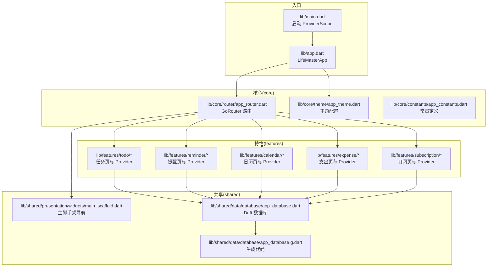
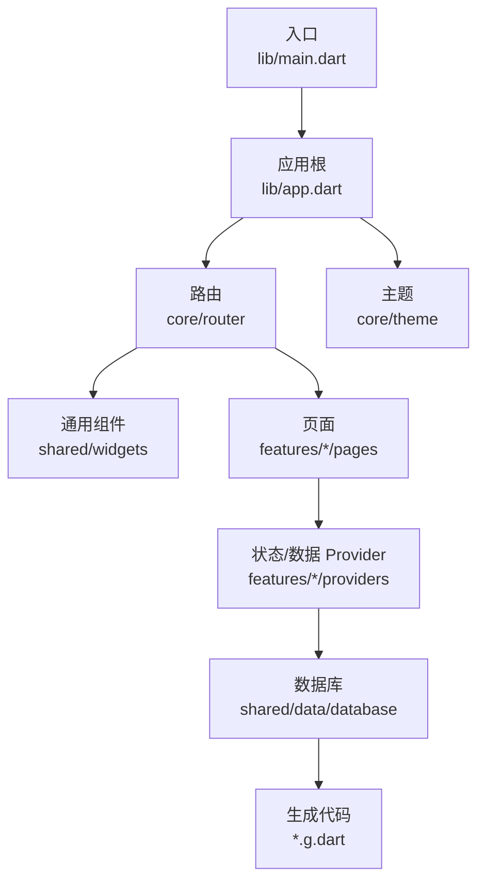
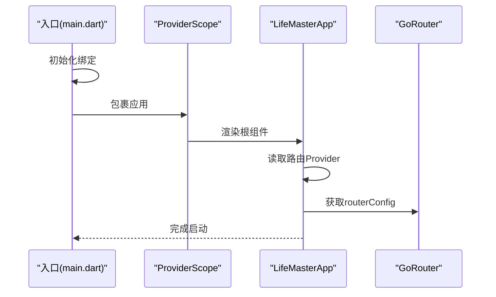
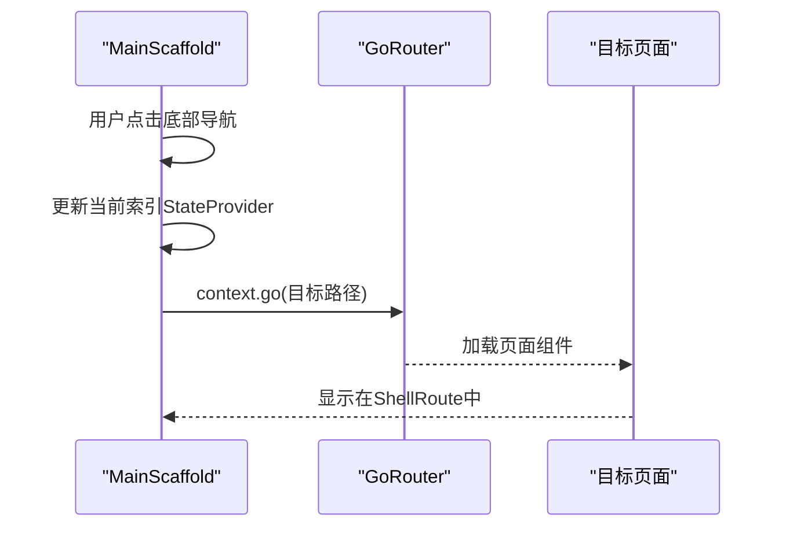
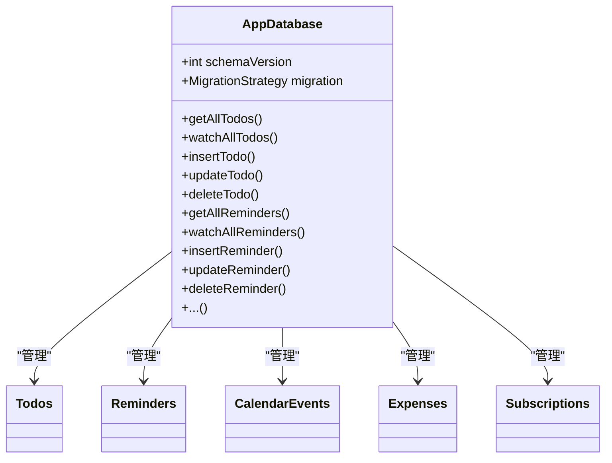
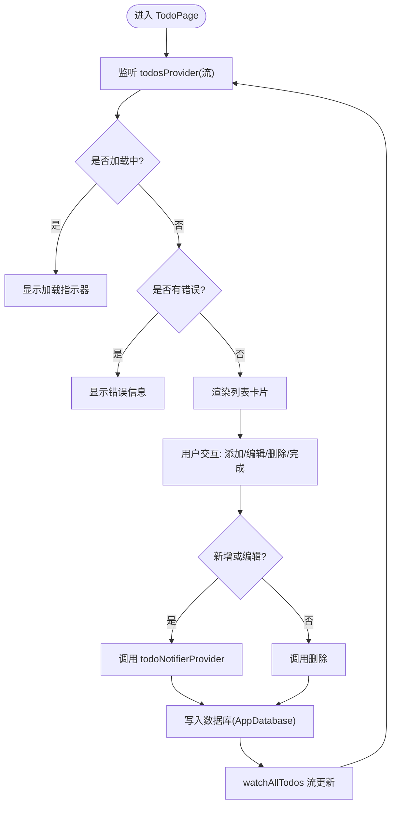
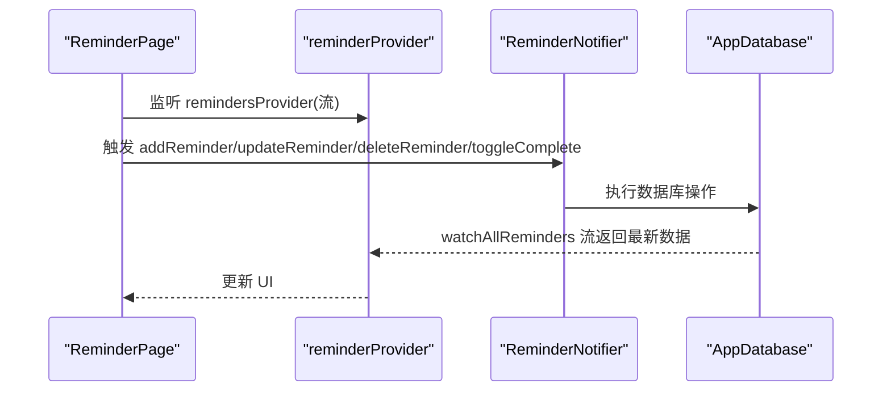
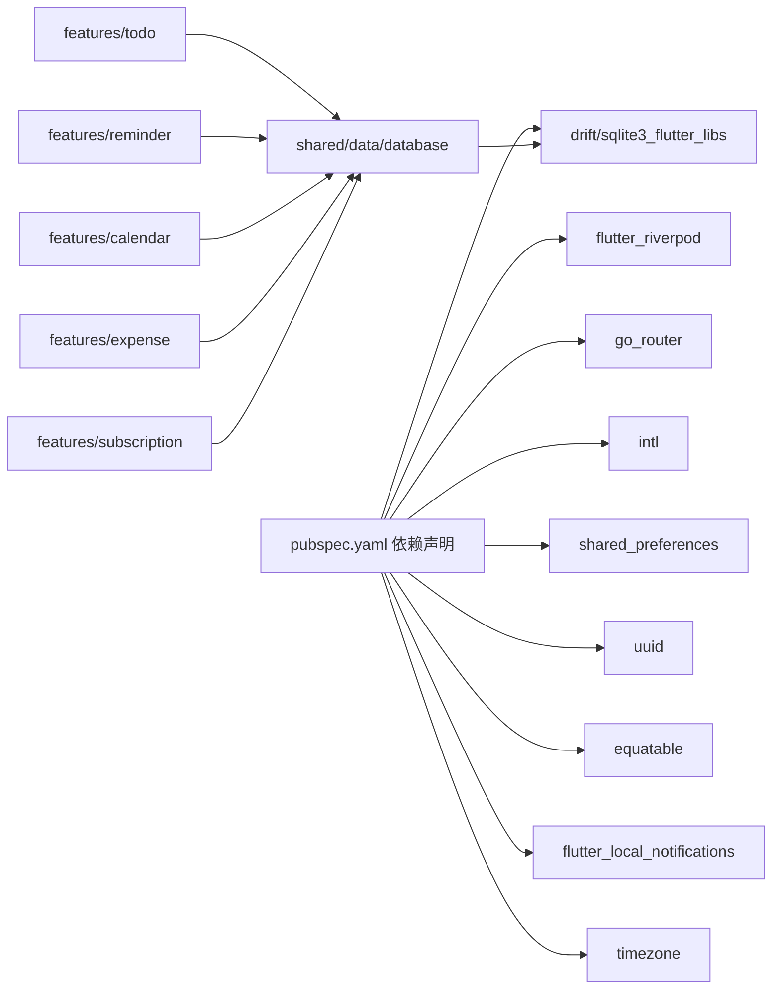

# 架构设计

<cite>
**本文引用的文件**
- [main.dart](file://lib/main.dart)
- [app.dart](file://lib/app.dart)
- [pubspec.yaml](file://pubspec.yaml)
- [app_router.dart](file://lib/core/router/app_router.dart)
- [app_theme.dart](file://lib/core/theme/app_theme.dart)
- [app_constants.dart](file://lib/core/constants/app_constants.dart)
- [main_scaffold.dart](file://lib/shared/presentation/widgets/main_scaffold.dart)
- [app_database.dart](file://lib/shared/data/database/app_database.dart)
- [app_database.g.dart](file://lib/shared/data/database/app_database.g.dart)
- [todo_provider.dart](file://lib/features/todo/presentation/providers/todo_provider.dart)
- [todo_page.dart](file://lib/features/todo/presentation/pages/todo_page.dart)
- [reminder_provider.dart](file://lib/features/reminder/presentation/providers/reminder_provider.dart)
</cite>

## 目录
1. [引言](#引言)
2. [项目结构](#项目结构)
3. [核心组件](#核心组件)
4. [架构总览](#架构总览)
5. [详细组件分析](#详细组件分析)
6. [依赖分析](#依赖分析)
7. [性能考虑](#性能考虑)
8. [故障排查指南](#故障排查指南)
9. [结论](#结论)
10. [附录](#附录)

## 引言
本文件为 LifeMaster 应用的架构设计文档，面向架构师与高级开发者，系统阐述整体架构模式（模块化设计、分层架构、响应式编程）、核心设计原则（Riverpod 状态管理、Provider 模式、Repository 模式思想）、组件交互与数据流、技术选型权衡与约束，并提供架构图与组件分解图，帮助读者快速理解并高效扩展该应用。

## 项目结构
LifeMaster 采用基于功能域的模块化组织方式，按领域拆分 features（任务、提醒、日历、支出、订阅），共享层 shared 提供跨领域通用能力（数据库、通用 UI 组件），核心层 core 提供路由、主题、常量等基础设施，入口位于 lib/main.dart 启动 ProviderScope 包裹的应用根组件。

**图表来源**
- [main.dart:1-13](file://lib/main.dart#L1-L13)
- [app.dart:1-23](file://lib/app.dart#L1-L23)
- [app_router.dart:1-61](file://lib/core/router/app_router.dart#L1-L61)
- [main_scaffold.dart:1-72](file://lib/shared/presentation/widgets/main_scaffold.dart#L1-L72)
- [app_database.dart:1-147](file://lib/shared/data/database/app_database.dart#L1-L147)
- [app_database.g.dart:1-200](file://lib/shared/data/database/app_database.g.dart#L1-L200)

**章节来源**
- [main.dart:1-13](file://lib/main.dart#L1-L13)
- [app.dart:1-23](file://lib/app.dart#L1-L23)
- [app_router.dart:1-61](file://lib/core/router/app_router.dart#L1-L61)
- [main_scaffold.dart:1-72](file://lib/shared/presentation/widgets/main_scaffold.dart#L1-L72)
- [app_database.dart:1-147](file://lib/shared/data/database/app_database.dart#L1-L147)
- [app_database.g.dart:1-200](file://lib/shared/data/database/app_database.g.dart#L1-L200)

## 核心组件
- 入口与状态根：应用在入口通过 ProviderScope 包裹根组件，统一注入 Riverpod Provider 生态。
- 应用根组件：LifeMasterApp 从 Provider 中读取路由配置，统一设置主题与暗黑模式。
- 路由与导航：GoRouter 定义 ShellRoute + 多个页面路由，配合主脚手架统一底部导航。
- 主题系统：集中定义明/暗主题与各功能色板，保证视觉一致性。
- 数据层：Drift 声明式表模型与生成代码，提供 CRUD 与流式查询；数据库连接懒加载到后台线程。
- 功能模块：每个特性以“页面 + Provider”为核心，使用 Riverpod 的 Provider/Notifier/StreamProvider 进行状态与数据管理。

**章节来源**
- [main.dart:5-12](file://lib/main.dart#L5-L12)
- [app.dart:6-22](file://lib/app.dart#L6-L22)
- [app_router.dart:15-60](file://lib/core/router/app_router.dart#L15-L60)
- [app_theme.dart:3-77](file://lib/core/theme/app_theme.dart#L3-L77)
- [app_database.dart:71-147](file://lib/shared/data/database/app_database.dart#L71-L147)

## 架构总览
LifeMaster 采用“入口 -> 应用根 -> 路由/主题 -> 特性模块 -> 数据层”的分层架构。UI 层仅负责展示与交互，状态与数据逻辑通过 Provider 注入，数据持久化通过 Drift SQLite 实现，支持响应式更新与热重载开发体验。

**图表来源**
- [main.dart:1-13](file://lib/main.dart#L1-L13)
- [app.dart:1-23](file://lib/app.dart#L1-L23)
- [app_router.dart:1-61](file://lib/core/router/app_router.dart#L1-L61)
- [main_scaffold.dart:1-72](file://lib/shared/presentation/widgets/main_scaffold.dart#L1-L72)
- [app_database.dart:1-147](file://lib/shared/data/database/app_database.dart#L1-L147)
- [app_database.g.dart:1-200](file://lib/shared/data/database/app_database.g.dart#L1-L200)

## 详细组件分析

### 组件 A：应用启动与根组件
- 启动流程：入口初始化绑定，包裹 ProviderScope，注入全局 Provider。
- 根组件：从 Provider 读取路由配置，统一设置主题与暗黑模式，MaterialApp.router 驱动导航。

**图表来源**
- [main.dart:5-12](file://lib/main.dart#L5-L12)
- [app.dart:10-20](file://lib/app.dart#L10-L20)
- [app_router.dart:15-25](file://lib/core/router/app_router.dart#L15-L25)

**章节来源**
- [main.dart:1-13](file://lib/main.dart#L1-L13)
- [app.dart:6-22](file://lib/app.dart#L6-L22)

### 组件 B：路由与主脚手架
- 路由：ShellRoute 包裹主脚手架，内部多个页面路由，初始定位到任务页。
- 导航：底部导航切换时通过 context.go 跳转至对应路径，状态通过 StateProvider 记录当前索引。

**图表来源**
- [app_router.dart:20-57](file://lib/core/router/app_router.dart#L20-L57)
- [main_scaffold.dart:14-40](file://lib/shared/presentation/widgets/main_scaffold.dart#L14-L40)

**章节来源**
- [app_router.dart:15-60](file://lib/core/router/app_router.dart#L15-L60)
- [main_scaffold.dart:8-71](file://lib/shared/presentation/widgets/main_scaffold.dart#L8-L71)

### 组件 C：数据库与 Drift
- 表模型：Todos、Reminders、CalendarEvents、Expenses、Subscriptions。
- 数据库类：AppDatabase 统一封装查询、插入、更新、删除与 watch 流。
- 连接策略：LazyDatabase 在后台线程打开本地 SQLite 文件。

**图表来源**
- [app_database.dart:71-147](file://lib/shared/data/database/app_database.dart#L71-L147)

**章节来源**
- [app_database.dart:9-147](file://lib/shared/data/database/app_database.dart#L9-L147)
- [app_database.g.dart:1-200](file://lib/shared/data/database/app_database.g.dart#L1-L200)

### 组件 D：任务模块（Todo）的状态与页面
- Provider 设计：databaseProvider 提供 AppDatabase；todosProvider 使用 StreamProvider 订阅 watchAllTodos；todoNotifierProvider 使用 StateNotifier 管理增删改操作。
- 页面交互：TodoPage 通过 AsyncValue 分支渲染加载/错误/数据；支持分类筛选、添加/编辑/删除、完成状态切换。

**图表来源**
- [todo_provider.dart:5-79](file://lib/features/todo/presentation/providers/todo_provider.dart#L5-L79)
- [todo_page.dart:19-77](file://lib/features/todo/presentation/pages/todo_page.dart#L19-L77)

**章节来源**
- [todo_provider.dart:1-79](file://lib/features/todo/presentation/providers/todo_provider.dart#L1-L79)
- [todo_page.dart:1-293](file://lib/features/todo/presentation/pages/todo_page.dart#L1-L293)

### 组件 E：提醒模块（Reminder）的状态与页面
- Provider 设计：与 Todo 类似，使用 databaseProvider 与 StreamProvider 订阅 watchAllReminders；ReminderNotifier 管理提醒的增删改与完成切换。
- 页面交互：支持设置提醒时间、重复类型、完成状态切换等。

**图表来源**
- [reminder_provider.dart:11-75](file://lib/features/reminder/presentation/providers/reminder_provider.dart#L11-L75)

**章节来源**
- [reminder_provider.dart:1-75](file://lib/features/reminder/presentation/providers/reminder_provider.dart#L1-L75)

### 组件 F：主题与常量
- 主题：AppTheme 统一定义明/暗主题、颜色体系、控件样式，便于跨页面一致。
- 常量：AppConstants 定义应用名、版本、默认分类、上限数量、默认类别等。

**章节来源**
- [app_theme.dart:3-77](file://lib/core/theme/app_theme.dart#L3-L77)
- [app_constants.dart:1-47](file://lib/core/constants/app_constants.dart#L1-L47)

## 依赖分析
- 技术栈与版本：Flutter SDK、Riverpod、Drift、GoRouter、intl、shared_preferences、uuid、equatable、flutter_local_notifications、timezone 等。
- 内聚与耦合：特性模块对共享数据库与通用 UI 组件存在依赖，但通过 Provider 解耦；路由与主题作为横切关注点被多处复用。
- 外部依赖：SQLite 本地存储、Material3 主题、国际化、通知与时区。

**图表来源**
- [pubspec.yaml:9-54](file://pubspec.yaml#L9-L54)
- [app_database.dart:1-147](file://lib/shared/data/database/app_database.dart#L1-L147)

**章节来源**
- [pubspec.yaml:1-54](file://pubspec.yaml#L1-L54)

## 性能考虑
- 响应式更新：使用 StreamProvider 订阅 watch* 流，避免手动刷新，减少不必要的重建。
- 数据库异步：Drift LazyDatabase 在后台线程执行，避免阻塞主线程。
- UI 优化：TodoPage 对空状态与错误进行分支渲染，提升用户体验。
- 可扩展性：Provider 模式便于替换实现（如未来引入 Repository 封装），保持 UI 不变。
- 维护性：模块化与分层清晰，单测与集成测试可针对 Provider 与数据库进行隔离验证。

## 故障排查指南
- 路由跳转无效：检查 GoRouter 的路径与 ShellRoute builder 是否正确包裹 MainScaffold。
- 数据不更新：确认页面监听的是对应的 StreamProvider，且数据库操作后 watch 流已触发。
- 数据库异常：检查 AppDatabase 的 schemaVersion 与 MigrationStrategy，确保生成代码与模型同步。
- 主题不生效：确认 LifeMasterApp 使用了正确的 theme/darkTheme 与 themeMode。

**章节来源**
- [app_router.dart:15-60](file://lib/core/router/app_router.dart#L15-L60)
- [app_database.dart:75-87](file://lib/shared/data/database/app_database.dart#L75-L87)
- [app.dart:13-20](file://lib/app.dart#L13-L20)

## 结论
LifeMaster 采用清晰的模块化与分层架构，结合 Riverpod 的 Provider/Notifier/StreamProvider 与 Drift 的声明式数据库，实现了高内聚、低耦合、易扩展与高性能的移动端应用。通过统一的主题与路由体系，保证了良好的用户体验与开发效率。建议后续在数据层引入 Repository 模式抽象，进一步增强可测试性与可替换性。

## 附录
- 术语说明
  - Provider：Riverpod 的状态/服务提供者。
  - StateProvider：可变状态容器。
  - StreamProvider：基于流的数据源。
  - StateNotifier：可变状态的业务逻辑封装。
  - Drift：Flutter 的声明式数据库 ORM。
  - GoRouter：现代化路由方案。