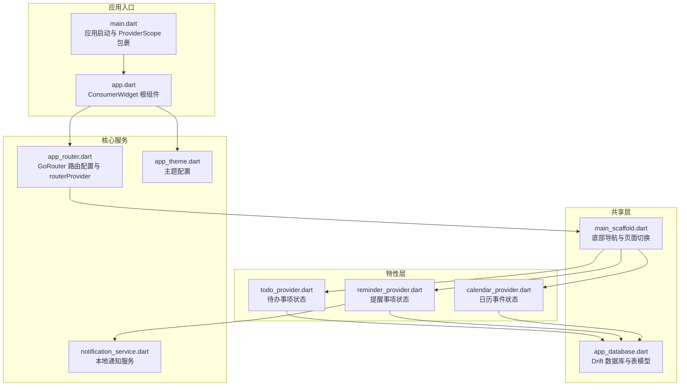
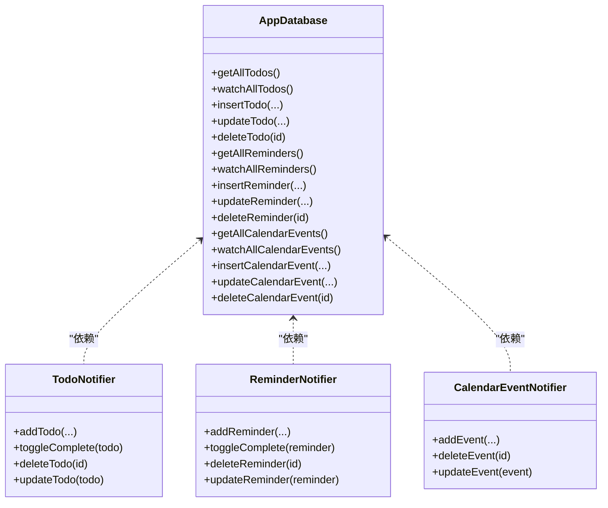
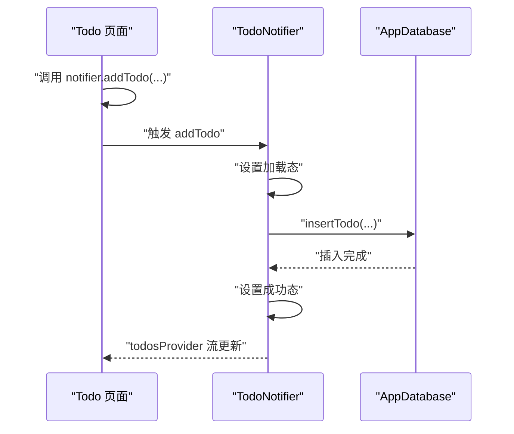
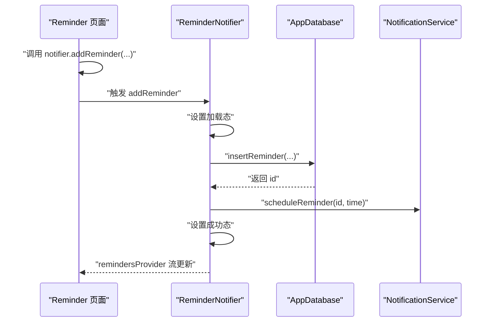
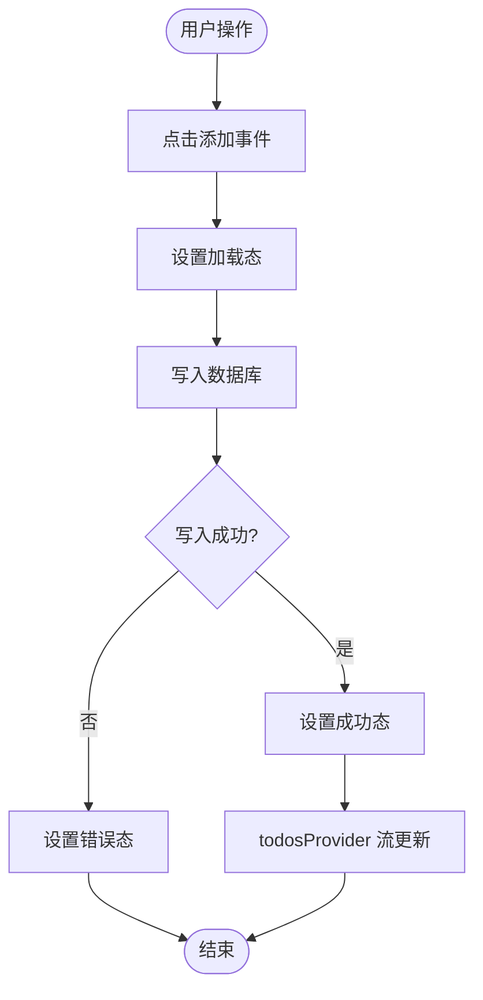
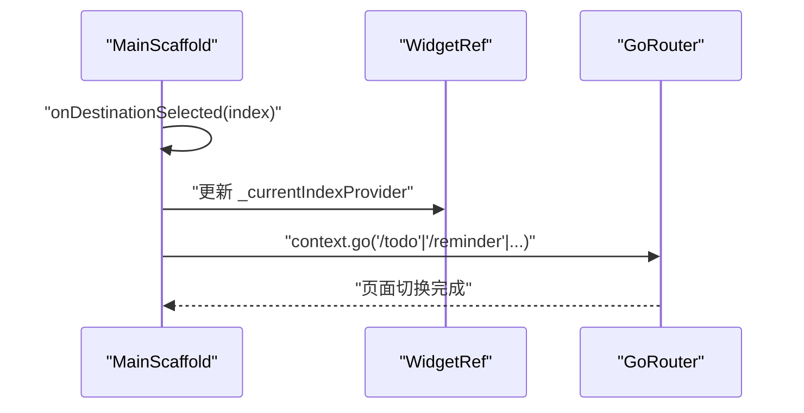
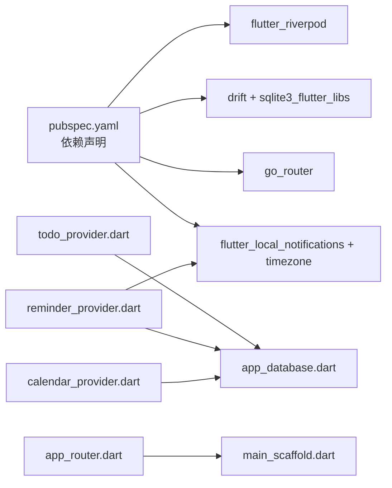

# 状态管理系统

<cite>
**本文引用的文件**
- [main.dart](file://lib/main.dart)
- [app.dart](file://lib/app.dart)
- [app_router.dart](file://lib/core/router/app_router.dart)
- [notification_service.dart](file://lib/core/services/notification_service.dart)
- [app_theme.dart](file://lib/core/theme/app_theme.dart)
- [todo_provider.dart](file://lib/features/todo/presentation/providers/todo_provider.dart)
- [reminder_provider.dart](file://lib/features/reminder/presentation/providers/reminder_provider.dart)
- [calendar_provider.dart](file://lib/features/calendar/presentation/providers/calendar_provider.dart)
- [main_scaffold.dart](file://lib/shared/presentation/widgets/main_scaffold.dart)
- [app_database.dart](file://lib/shared/data/database/app_database.dart)
- [pubspec.yaml](file://pubspec.yaml)
</cite>

## 目录
1. [简介](#简介)
2. [项目结构](#项目结构)
3. [核心组件](#核心组件)
4. [架构总览](#架构总览)
5. [详细组件分析](#详细组件分析)
6. [依赖关系分析](#依赖关系分析)
7. [性能考量](#性能考量)
8. [故障排查指南](#故障排查指南)
9. [结论](#结论)
10. [附录](#附录)

## 简介
本文件为 LifeMaster 应用的状态管理系统提供深入的架构文档，重点围绕 Riverpod Provider 模式展开，系统性阐述以下主题：
- Provider 的组织与使用策略：包括 Provider、StateNotifierProvider、StreamProvider、StateProvider 的职责划分与协作方式
- 核心概念应用：StateNotifier、AsyncValue 的设计意图与适用场景
- 最佳实践：状态隔离、状态共享、状态同步
- 生命周期管理与依赖注入：Provider 的创建、销毁与资源释放
- 调试、性能优化与内存泄漏防护
- 自定义 Provider 开发与扩展指南

## 项目结构
LifeMaster 采用按功能域分层的模块化组织方式，状态管理集中在 features/* 与 shared/* 下的 providers 目录中，配合 core/* 提供路由、主题、通知等基础设施服务。

图表来源
- [main.dart:1-15](file://lib/main.dart#L1-L15)
- [app.dart:1-23](file://lib/app.dart#L1-L23)
- [app_router.dart:1-61](file://lib/core/router/app_router.dart#L1-L61)
- [main_scaffold.dart:1-72](file://lib/shared/presentation/widgets/main_scaffold.dart#L1-L72)
- [todo_provider.dart:1-79](file://lib/features/todo/presentation/providers/todo_provider.dart#L1-L79)
- [reminder_provider.dart:1-98](file://lib/features/reminder/presentation/providers/reminder_provider.dart#L1-L98)
- [calendar_provider.dart:1-70](file://lib/features/calendar/presentation/providers/calendar_provider.dart#L1-L70)
- [app_database.dart:1-147](file://lib/shared/data/database/app_database.dart#L1-L147)
- [notification_service.dart:1-83](file://lib/core/services/notification_service.dart#L1-L83)

章节来源
- [main.dart:1-15](file://lib/main.dart#L1-L15)
- [app.dart:1-23](file://lib/app.dart#L1-L23)
- [app_router.dart:1-61](file://lib/core/router/app_router.dart#L1-L61)
- [main_scaffold.dart:1-72](file://lib/shared/presentation/widgets/main_scaffold.dart#L1-L72)

## 核心组件
- ProviderScope 与应用启动
  - 在应用入口通过 ProviderScope 包裹根组件，确保整个应用树内可访问所有 Provider
  - 启动时初始化通知服务，保证后续提醒功能可用
- 路由与导航
  - 使用 GoRouter 配置 ShellRoute + 多个子路由，routerProvider 返回 GoRouter 实例
  - MainScaffold 作为 ShellRoute 的 builder，承载底部导航与页面切换逻辑
- 数据层
  - AppDatabase 基于 Drift 定义多张表（待办、提醒、日历、支出、订阅），提供查询与流式监听方法
  - 通过 databaseProvider 注入数据库实例，各特性模块复用该 Provider
- 特性状态
  - Todo、Reminder、Calendar 分别定义了对应的 StreamProvider（数据流）、StateNotifierProvider（可变状态）与辅助 Provider（如分类、选中日期）

章节来源
- [main.dart:6-14](file://lib/main.dart#L6-L14)
- [app_router.dart:15-60](file://lib/core/router/app_router.dart#L15-L60)
- [main_scaffold.dart:6-71](file://lib/shared/presentation/widgets/main_scaffold.dart#L6-L71)
- [app_database.dart:71-147](file://lib/shared/data/database/app_database.dart#L71-L147)

## 架构总览
Riverpod 在 LifeMaster 中采用“Provider 工厂 + StateNotifier”的组合模式：
- Provider：用于创建与注入外部依赖（如数据库、通知服务）
- StreamProvider：用于暴露数据库变更的响应式数据流
- StateNotifierProvider：封装业务操作与异步状态，统一处理加载、成功、错误
- StateProvider：用于轻量级 UI 状态（如当前选中的导航索引）

图表来源
- [app_database.dart:71-147](file://lib/shared/data/database/app_database.dart#L71-L147)
- [todo_provider.dart:20-79](file://lib/features/todo/presentation/providers/todo_provider.dart#L20-L79)
- [reminder_provider.dart:17-98](file://lib/features/reminder/presentation/providers/reminder_provider.dart#L17-L98)
- [calendar_provider.dart:18-70](file://lib/features/calendar/presentation/providers/calendar_provider.dart#L18-L70)

## 详细组件分析

### Todo 功能状态管理
- 数据流
  - databaseProvider 创建 AppDatabase 并在 onDispose 关闭连接
  - todosProvider 订阅数据库流，自动推送最新列表
- 可变状态
  - TodoNotifier 继承 StateNotifier<AsyncValue<void>>，封装添加、完成切换、删除、更新等操作
  - 每次异步操作前设置加载态，成功或失败后更新状态
- UI 使用
  - 页面通过 watch(todosProvider) 获取列表，通过 watch(todoNotifierProvider) 触发业务操作

图表来源
- [todo_provider.dart:11-14](file://lib/features/todo/presentation/providers/todo_provider.dart#L11-L14)
- [todo_provider.dart:20-79](file://lib/features/todo/presentation/providers/todo_provider.dart#L20-L79)
- [app_database.dart:93-98](file://lib/shared/data/database/app_database.dart#L93-L98)

章节来源
- [todo_provider.dart:1-79](file://lib/features/todo/presentation/providers/todo_provider.dart#L1-L79)
- [app_database.dart:71-147](file://lib/shared/data/database/app_database.dart#L71-L147)

### Reminder 功能状态管理
- 数据流
  - remindersProvider 订阅数据库流，实时展示提醒列表
- 可变状态与通知集成
  - ReminderNotifier 在新增/更新提醒时，调用 NotificationService 安排或重排通知
  - 删除提醒时取消对应通知
- 错误处理
  - 异步操作前后设置加载态，异常时记录错误并保持 UI 反馈

图表来源
- [reminder_provider.dart:12-15](file://lib/features/reminder/presentation/providers/reminder_provider.dart#L12-L15)
- [reminder_provider.dart:17-98](file://lib/features/reminder/presentation/providers/reminder_provider.dart#L17-L98)
- [notification_service.dart:33-81](file://lib/core/services/notification_service.dart#L33-L81)
- [app_database.dart:103-107](file://lib/shared/data/database/app_database.dart#L103-L107)

章节来源
- [reminder_provider.dart:1-98](file://lib/features/reminder/presentation/providers/reminder_provider.dart#L1-L98)
- [notification_service.dart:1-83](file://lib/core/services/notification_service.dart#L1-L83)

### Calendar 功能状态管理
- 数据流
  - calendarEventsProvider 订阅数据库流，驱动日历视图刷新
- 可变状态
  - CalendarEventNotifier 封装事件的增删改操作，支持全天事件与颜色等属性
- UI 状态
  - selectedDateProvider 保存当前选中日期，便于日程选择与默认值填充

图表来源
- [calendar_provider.dart:11-14](file://lib/features/calendar/presentation/providers/calendar_provider.dart#L11-L14)
- [calendar_provider.dart:18-70](file://lib/features/calendar/presentation/providers/calendar_provider.dart#L18-L70)
- [app_database.dart:113-117](file://lib/shared/data/database/app_database.dart#L113-L117)

章节来源
- [calendar_provider.dart:1-70](file://lib/features/calendar/presentation/providers/calendar_provider.dart#L1-L70)
- [app_database.dart:71-147](file://lib/shared/data/database/app_database.dart#L71-L147)

### 导航与页面切换
- MainScaffold 内部维护 _currentIndexProvider，底部导航点击时更新状态并跳转到对应路由
- 路由通过 routerProvider 注入，ShellRoute 包裹主框架，子路由映射到各功能页

图表来源
- [main_scaffold.dart:6-71](file://lib/shared/presentation/widgets/main_scaffold.dart#L6-L71)
- [app_router.dart:15-60](file://lib/core/router/app_router.dart#L15-L60)

章节来源
- [main_scaffold.dart:1-72](file://lib/shared/presentation/widgets/main_scaffold.dart#L1-72)
- [app_router.dart:1-61](file://lib/core/router/app_router.dart#L1-L61)

## 依赖关系分析
- 外部依赖
  - flutter_riverpod、riverpod_annotation：提供 Provider 体系与注解生成
  - go_router：路由管理
  - drift、sqlite3_flutter_libs、path_provider：本地数据库与文件路径
  - flutter_local_notifications、timezone：本地通知与时区
- 内部依赖
  - 所有特性模块依赖 shared 层的 AppDatabase
  - Reminder 模块额外依赖 NotificationService
  - 路由与 UI 通过 Provider 注入，降低耦合

图表来源
- [pubspec.yaml:9-57](file://pubspec.yaml#L9-L57)
- [todo_provider.dart:1-4](file://lib/features/todo/presentation/providers/todo_provider.dart#L1-L4)
- [reminder_provider.dart:1-5](file://lib/features/reminder/presentation/providers/reminder_provider.dart#L1-L5)
- [calendar_provider.dart:1-4](file://lib/features/calendar/presentation/providers/calendar_provider.dart#L1-L4)
- [app_database.dart:1-8](file://lib/shared/data/database/app_database.dart#L1-L8)
- [app_router.dart:1-11](file://lib/core/router/app_router.dart#L1-L11)
- [main_scaffold.dart:1-6](file://lib/shared/presentation/widgets/main_scaffold.dart#L1-L6)

章节来源
- [pubspec.yaml:1-57](file://pubspec.yaml#L1-L57)

## 性能考量
- 数据流驱动
  - 使用 StreamProvider 订阅数据库流，避免手动刷新，减少不必要的重建
- 状态粒度
  - 将 UI 状态（如导航索引）与业务状态分离，降低无关重建
- 异步状态管理
  - 使用 AsyncValue 明确加载/错误/成功三态，有助于 UI 快速反馈与节流
- 资源释放
  - databaseProvider 在 onDispose 中关闭数据库连接，防止资源泄漏
- 通知调度
  - 更新提醒时仅在必要时重新安排通知，避免重复调度导致的性能损耗

章节来源
- [todo_provider.dart:5-9](file://lib/features/todo/presentation/providers/todo_provider.dart#L5-L9)
- [reminder_provider.dart:6-10](file://lib/features/reminder/presentation/providers/reminder_provider.dart#L6-L10)
- [calendar_provider.dart:5-9](file://lib/features/calendar/presentation/providers/calendar_provider.dart#L5-L9)

## 故障排查指南
- 症状：页面不更新
  - 检查是否正确使用 watch(StreamProvider) 订阅数据流
  - 确认数据库写入成功且流已发出新快照
- 症状：异步操作无反馈
  - 确保在操作开始前设置加载态，在成功/失败后更新状态
  - 检查错误分支是否正确设置错误态
- 症状：通知未按时弹出
  - 确认 NotificationService 初始化完成
  - 检查提醒时间与时区设置，以及调度接口调用链
- 症状：内存泄漏或数据库句柄未释放
  - 确认 databaseProvider 在 onDispose 中关闭数据库
  - 避免在 Provider 中持有长生命周期对象而不释放

章节来源
- [todo_provider.dart:20-79](file://lib/features/todo/presentation/providers/todo_provider.dart#L20-L79)
- [reminder_provider.dart:17-98](file://lib/features/reminder/presentation/providers/reminder_provider.dart#L17-L98)
- [calendar_provider.dart:18-70](file://lib/features/calendar/presentation/providers/calendar_provider.dart#L18-L70)
- [notification_service.dart:13-31](file://lib/core/services/notification_service.dart#L13-L31)
- [app_database.dart:71-87](file://lib/shared/data/database/app_database.dart#L71-L87)

## 结论
LifeMaster 的状态管理以 Riverpod 为核心，结合 Drift 数据库与 GoRouter 路由，形成了清晰的分层与职责边界：
- Provider 工厂负责依赖注入与生命周期管理
- StreamProvider 驱动响应式数据流
- StateNotifierProvider 封装业务与异步状态
- AsyncValue 为 UI 提供明确的状态反馈
该架构具备良好的可扩展性与可维护性，适合在多特性模块并行演进的场景下持续发展。

## 附录

### 自定义 Provider 开发与扩展指南
- 新建 Provider 的步骤
  - 在特性目录下创建 providers 子目录
  - 定义 Provider 工厂（如 databaseProvider、streamProvider、notifierProvider）
  - 在页面中通过 ref.watch 或 ref.read 使用
- 设计原则
  - 单一职责：每个 Provider 聚焦一个领域或一组相关状态
  - 可测试性：尽量将副作用（网络、通知、数据库）抽象为可注入的服务
  - 可观察性：对关键流程输出日志或使用调试工具定位问题
- 扩展建议
  - 对于复杂业务，拆分多个 StateNotifier，避免单点过载
  - 对于跨页面共享的轻量状态，优先使用 StateProvider
  - 对于需要缓存或去抖的请求，考虑引入缓存层或节流策略