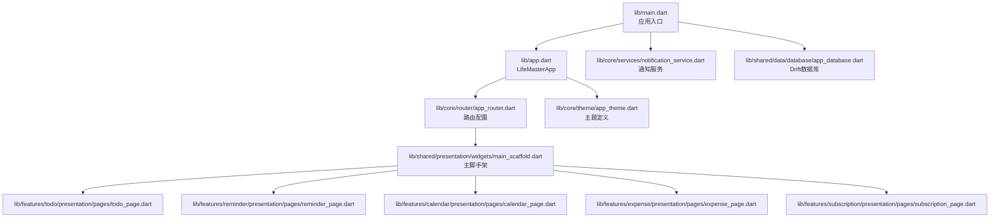
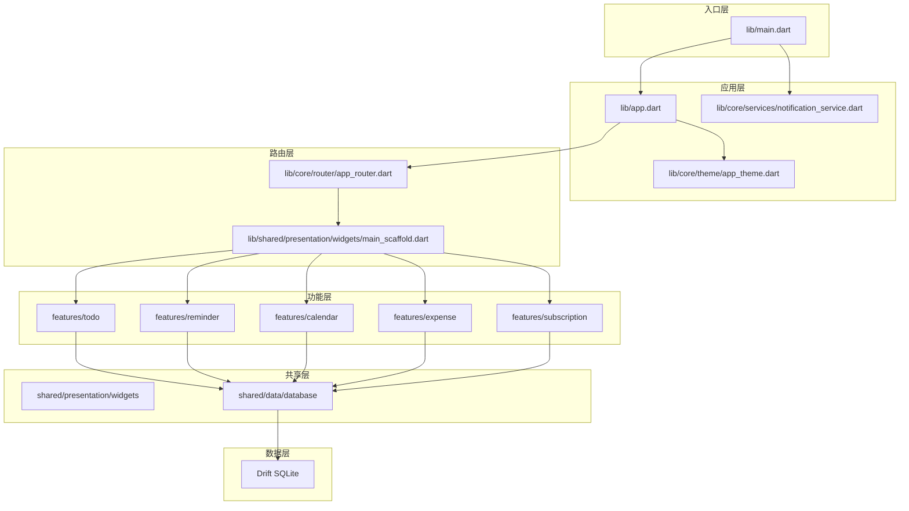
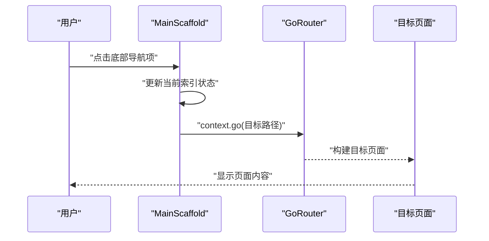
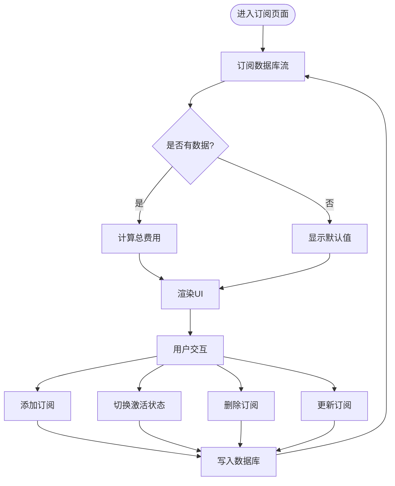
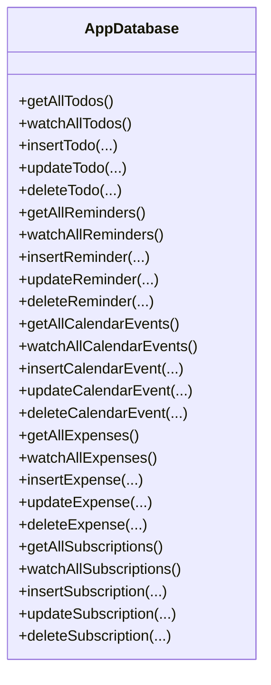
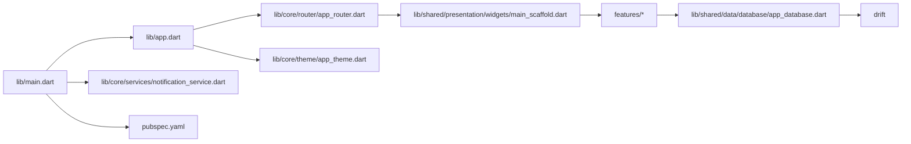

# 设计模式与架构原则

<cite>
**本文引用的文件**
- [main.dart](file://lib/main.dart)
- [app.dart](file://lib/app.dart)
- [app_router.dart](file://lib/core/router/app_router.dart)
- [notification_service.dart](file://lib/core/services/notification_service.dart)
- [app_theme.dart](file://lib/core/theme/app_theme.dart)
- [main_scaffold.dart](file://lib/shared/presentation/widgets/main_scaffold.dart)
- [app_database.dart](file://lib/shared/data/database/app_database.dart)
- [subscription_provider.dart](file://lib/features/subscription/presentation/providers/subscription_provider.dart)
- [pubspec.yaml](file://pubspec.yaml)
- [README.md](file://README.md)
</cite>

## 目录
1. [引言](#引言)
2. [项目结构](#项目结构)
3. [核心组件](#核心组件)
4. [架构总览](#架构总览)
5. [详细组件分析](#详细组件分析)
6. [依赖关系分析](#依赖关系分析)
7. [性能考量](#性能考量)
8. [故障排查指南](#故障排查指南)
9. [结论](#结论)
10. [附录](#附录)

## 引言
本文件面向LifeMaster应用，系统性梳理其采用的设计模式与架构原则，重点覆盖以下主题：
- 核心设计模式：Repository模式、Provider模式、ShellRoute模式
- 模块化架构：功能模块划分与依赖管理策略
- 响应式编程：状态管理与数据流（Riverpod）
- 解耦策略：依赖注入、接口抽象与跨层依赖控制
- 架构演进与权衡：从单一入口到多模块可扩展的演进路径
- 扩展与重构最佳实践：如何在现有基础上安全地引入新模块或替换技术栈

## 项目结构
LifeMaster采用按功能域分层的模块化组织方式，核心目录如下：
- lib/main.dart：应用入口，初始化通知服务并启动ProviderScope
- lib/app.dart：顶层应用组件，基于Riverpod读取路由配置并渲染MaterialApp
- lib/core/*：通用基础设施（路由、主题、通知等）
- lib/features/*：业务功能模块（如todo、reminder、calendar、expense、subscription）
- lib/shared/*：共享能力（数据库、通用UI组件）

图表来源
- [main.dart:1-15](file://lib/main.dart#L1-L15)
- [app.dart:1-23](file://lib/app.dart#L1-L23)
- [app_router.dart:1-61](file://lib/core/router/app_router.dart#L1-L61)
- [main_scaffold.dart:1-72](file://lib/shared/presentation/widgets/main_scaffold.dart#L1-L72)
- [notification_service.dart:1-83](file://lib/core/services/notification_service.dart#L1-L83)
- [app_database.dart:1-147](file://lib/shared/data/database/app_database.dart#L1-L147)

章节来源
- [main.dart:1-15](file://lib/main.dart#L1-L15)
- [app.dart:1-23](file://lib/app.dart#L1-L23)
- [pubspec.yaml:1-57](file://pubspec.yaml#L1-L57)

## 核心组件
- 应用入口与生命周期
  - 初始化Flutter绑定、通知服务，使用ProviderScope包裹顶层应用，确保Riverpod作用域生效
- 路由与导航
  - 使用GoRouter定义ShellRoute作为容器，内部各功能页通过GoRoute注册；通过routerProvider统一提供GoRouter实例
- 主脚手架与底部导航
  - MainScaffold封装底部导航栏，维护当前索引状态，驱动导航跳转
- 状态管理与数据流
  - Riverpod Provider体系：Provider（纯数据）、StreamProvider（响应式数据流）、StateNotifierProvider（可变状态）
- 数据持久化
  - Drift数据库：定义多表模型，提供查询、监听、增删改等方法；通过LazyDatabase异步打开本地SQLite文件
- 通知服务
  - 单例通知服务，负责初始化平台通知通道与调度提醒

章节来源
- [main.dart:6-14](file://lib/main.dart#L6-L14)
- [app_router.dart:15-60](file://lib/core/router/app_router.dart#L15-L60)
- [main_scaffold.dart:6-71](file://lib/shared/presentation/widgets/main_scaffold.dart#L6-L71)
- [app_database.dart:71-147](file://lib/shared/data/database/app_database.dart#L71-L147)
- [notification_service.dart:5-83](file://lib/core/services/notification_service.dart#L5-L83)

## 架构总览
LifeMaster采用“入口层-应用层-路由层-功能层-共享层-数据层”的分层架构，结合Riverpod实现响应式状态管理与依赖注入。

图表来源
- [main.dart:1-15](file://lib/main.dart#L1-L15)
- [app.dart:1-23](file://lib/app.dart#L1-L23)
- [app_router.dart:1-61](file://lib/core/router/app_router.dart#L1-L61)
- [main_scaffold.dart:1-72](file://lib/shared/presentation/widgets/main_scaffold.dart#L1-L72)
- [app_database.dart:1-147](file://lib/shared/data/database/app_database.dart#L1-L147)

## 详细组件分析

### 组件一：ShellRoute模式与主脚手架
- ShellRoute模式
  - 通过ShellRoute包裹所有功能页，统一承载底部导航与页面切换逻辑，避免重复代码
  - 使用navigatorKey管理Shell层级的导航状态
- 主脚手架MainScaffold
  - 维护当前选中页索引的状态（StateProvider），根据索引驱动GoRouter跳转
  - 为每个功能页提供一致的视觉与交互体验

图表来源
- [app_router.dart:20-57](file://lib/core/router/app_router.dart#L20-L57)
- [main_scaffold.dart:14-40](file://lib/shared/presentation/widgets/main_scaffold.dart#L14-L40)

章节来源
- [app_router.dart:15-60](file://lib/core/router/app_router.dart#L15-L60)
- [main_scaffold.dart:8-71](file://lib/shared/presentation/widgets/main_scaffold.dart#L8-L71)

### 组件二：Provider模式与响应式数据流
- Provider模式
  - databaseProvider：提供AppDatabase单例，随Provider释放自动关闭数据库连接
  - subscriptionsProvider：基于StreamProvider订阅数据库变更，形成响应式数据流
  - totalSubscriptionProvider：对异步数据进行聚合计算，体现Provider的组合与派生能力
- StateNotifierProvider
  - subscriptionNotifierProvider：封装订阅管理的可变状态，支持添加、切换激活、删除、更新等操作
  - 内部使用StateNotifier管理加载/错误/成功状态，保证UI与业务逻辑解耦

图表来源
- [subscription_provider.dart:5-91](file://lib/features/subscription/presentation/providers/subscription_provider.dart#L5-L91)
- [app_database.dart:129-137](file://lib/shared/data/database/app_database.dart#L129-L137)

章节来源
- [subscription_provider.dart:1-91](file://lib/features/subscription/presentation/providers/subscription_provider.dart#L1-L91)
- [app_database.dart:71-147](file://lib/shared/data/database/app_database.dart#L71-L147)

### 组件三：Repository模式与数据访问抽象
- 数据访问层抽象
  - AppDatabase集中定义所有表模型与CRUD方法，向上提供统一的数据访问接口
  - 通过watchAll*方法暴露Stream，实现响应式查询与自动刷新
- Repository职责边界
  - 当前代码中，AppDatabase承担了Repository角色：封装具体存储细节，向上提供领域语义的操作
  - 若未来扩展网络层或缓存层，可在AppDatabase之上再封装一层Repository接口，以隔离变化

图表来源
- [app_database.dart:71-147](file://lib/shared/data/database/app_database.dart#L71-L147)

章节来源
- [app_database.dart:71-147](file://lib/shared/data/database/app_database.dart#L71-L147)

### 组件四：依赖注入与解耦策略
- 依赖注入
  - routerProvider：向应用注入GoRouter实例，便于测试替换与集中管理
  - databaseProvider：向功能模块注入AppDatabase单例，避免重复创建与资源泄漏
- 接口抽象与解耦
  - 将AppDatabase作为共享依赖，功能模块仅依赖接口/类本身，不直接依赖具体实现细节
  - 通过Riverpod的ref.watch/ref.read机制实现弱耦合的跨层调用

章节来源
- [app_router.dart:15-15](file://lib/core/router/app_router.dart#L15-L15)
- [subscription_provider.dart:5-9](file://lib/features/subscription/presentation/providers/subscription_provider.dart#L5-L9)

### 组件五：主题与通知服务
- 主题管理
  - AppTheme集中定义颜色与Material主题，统一Light/Dark主题风格，减少重复配置
- 通知服务
  - NotificationService采用单例模式，延迟初始化平台通知通道，提供调度与取消提醒的能力

章节来源
- [app_theme.dart:3-78](file://lib/core/theme/app_theme.dart#L3-L78)
- [notification_service.dart:5-83](file://lib/core/services/notification_service.dart#L5-L83)

## 依赖关系分析
- 技术栈依赖
  - 状态管理：flutter_riverpod、riverpod_annotation
  - 导航：go_router
  - 数据持久化：drift、sqlite3_flutter_libs、path_provider、path
  - 本地化：intl
  - 本地存储：shared_preferences
  - 工具：uuid、equatable
  - 通知：flutter_local_notifications、timezone
  - 图表：fl_chart
- 层间依赖
  - 入口层依赖应用层与共享层
  - 应用层依赖路由层与主题层
  - 功能层依赖共享层（数据库、通用组件）
  - 数据层依赖Drift与SQLite

图表来源
- [pubspec.yaml:9-46](file://pubspec.yaml#L9-L46)
- [main.dart:1-15](file://lib/main.dart#L1-L15)
- [app.dart:1-23](file://lib/app.dart#L1-L23)
- [app_router.dart:1-61](file://lib/core/router/app_router.dart#L1-L61)
- [main_scaffold.dart:1-72](file://lib/shared/presentation/widgets/main_scaffold.dart#L1-L72)
- [app_database.dart:1-147](file://lib/shared/data/database/app_database.dart#L1-L147)

章节来源
- [pubspec.yaml:1-57](file://pubspec.yaml#L1-L57)

## 性能考量
- 数据库性能
  - 使用LazyDatabase在后台线程打开数据库，避免阻塞主线程
  - 通过watchAll*返回Stream，实现局部增量刷新，减少全量重绘
- 状态管理性能
  - Riverpod的细粒度订阅与不可变状态，降低不必要的重建
  - Provider组合与when处理，避免在loading/error状态下执行昂贵计算
- 导航与UI
  - ShellRoute复用容器，减少页面切换成本
  - BottomNavigationBar状态通过StateProvider管理，避免深层Widget重建

## 故障排查指南
- 启动阶段
  - 若通知无法初始化：检查NotificationService.init是否被调用，确认平台权限与时区初始化
- 数据库问题
  - 数据库未打开：确认LazyDatabase路径与文件存在，检查schemaVersion与迁移策略
  - 查询无结果：确认表名与列名映射正确，检查watchAll*是否被正确订阅
- 路由与导航
  - 页面无法跳转：检查GoRouter配置与路径是否匹配，确认ShellRoute的navigatorKey设置
- 状态异常
  - 订阅状态不更新：检查StreamProvider是否被上游Provider正确触发，确认StateNotifier的异步流程

章节来源
- [notification_service.dart:13-31](file://lib/core/services/notification_service.dart#L13-L31)
- [app_database.dart:140-147](file://lib/shared/data/database/app_database.dart#L140-L147)
- [app_router.dart:15-60](file://lib/core/router/app_router.dart#L15-L60)
- [subscription_provider.dart:11-14](file://lib/features/subscription/presentation/providers/subscription_provider.dart#L11-L14)

## 结论
LifeMaster在Flutter生态下，通过Riverpod实现了清晰的响应式状态管理，借助GoRouter与ShellRoute构建了统一的导航容器，配合Drift数据库与Provider模式，形成了高内聚、低耦合的模块化架构。该架构具备良好的扩展性与可维护性，适合在现有基础上引入新的功能模块或替换底层实现。

## 附录
- 快速上手
  - 运行环境：Flutter SDK满足版本要求
  - 安装依赖：执行包管理器安装命令
  - 启动应用：运行入口文件
- 参考资料
  - Flutter官方文档与Riverpod、GoRouter、Drift文档

章节来源
- [README.md:1-18](file://README.md#L1-L18)
- [pubspec.yaml:6-8](file://pubspec.yaml#L6-L8)