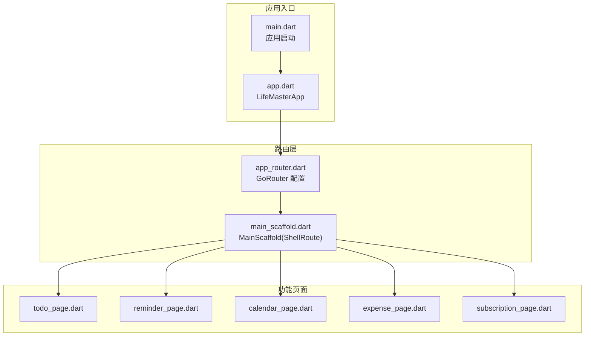
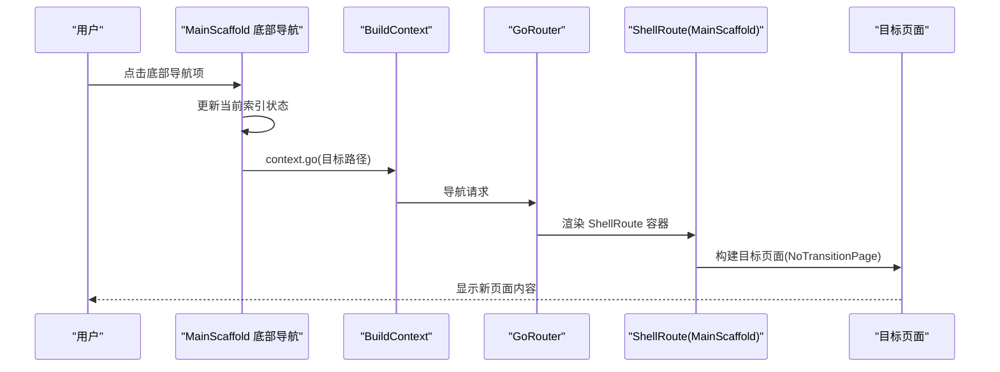
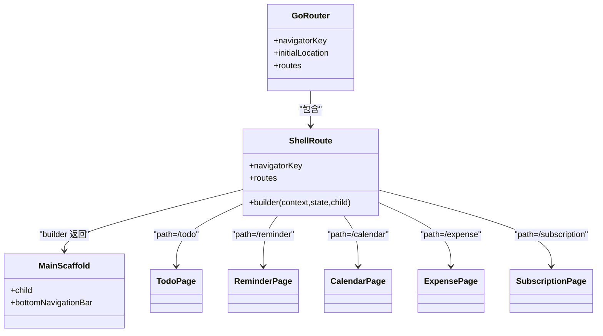
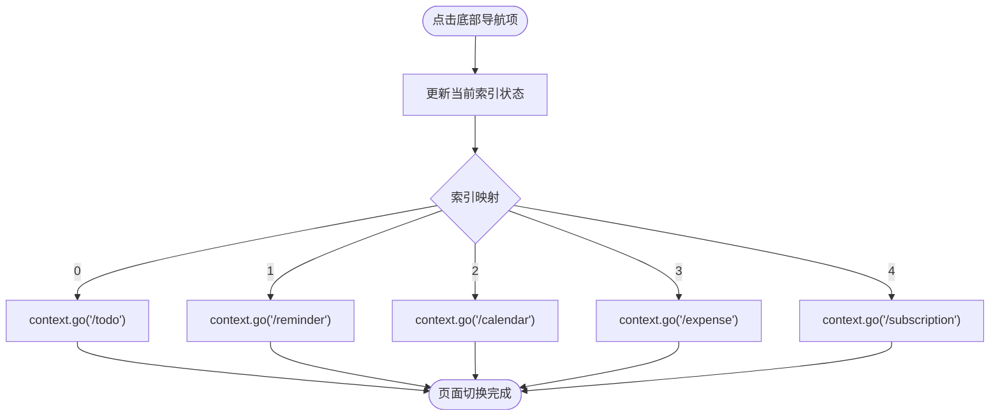
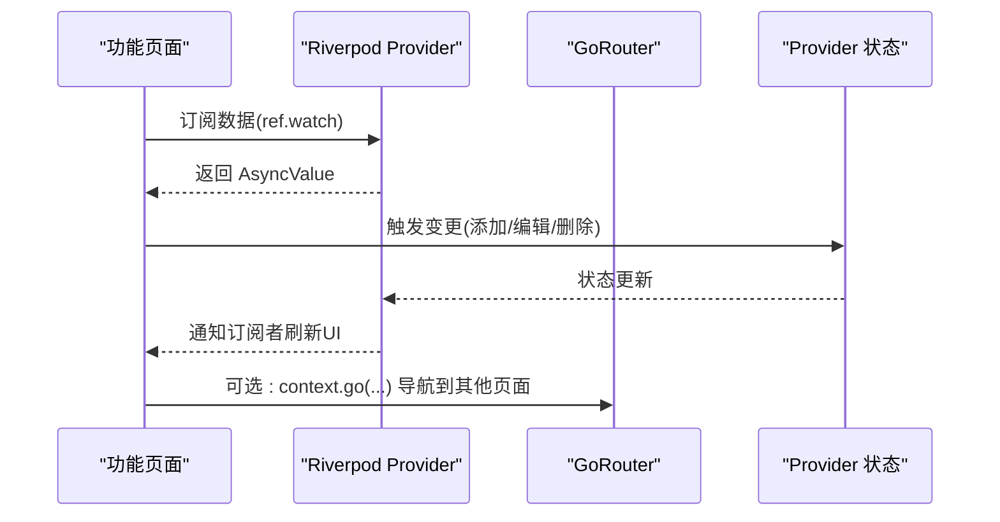
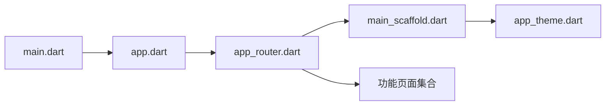

# 路由系统设计

<cite>
**本文档引用的文件**
- [main.dart](file://lib/main.dart)
- [app.dart](file://lib/app.dart)
- [app_router.dart](file://lib/core/router/app_router.dart)
- [main_scaffold.dart](file://lib/shared/presentation/widgets/main_scaffold.dart)
- [todo_page.dart](file://lib/features/todo/presentation/pages/todo_page.dart)
- [reminder_page.dart](file://lib/features/reminder/presentation/pages/reminder_page.dart)
- [calendar_page.dart](file://lib/features/calendar/presentation/pages/calendar_page.dart)
- [expense_page.dart](file://lib/features/expense/presentation/pages/expense_page.dart)
- [subscription_page.dart](file://lib/features/subscription/presentation/pages/subscription_page.dart)
- [app_theme.dart](file://lib/core/theme/app_theme.dart)
- [app_constants.dart](file://lib/core/constants/app_constants.dart)
</cite>

## 目录
1. [简介](#简介)
2. [项目结构](#项目结构)
3. [核心组件](#核心组件)
4. [架构总览](#架构总览)
5. [详细组件分析](#详细组件分析)
6. [依赖关系分析](#依赖关系分析)
7. [性能考虑](#性能考虑)
8. [故障排除指南](#故障排除指南)
9. [结论](#结论)

## 简介
本文件为 LifeMaster 应用的路由系统设计文档，重点阐述基于 GoRouter 的路由配置与使用模式，特别是 ShellRoute 模式的实现原理；详细说明路由导航策略、页面间数据传递机制与参数处理方式；描述底部导航栏与路由的集成及状态管理；解释路由守卫、权限控制与导航拦截的实现思路；并提供路由性能优化与内存管理策略，以及路由扩展与自定义导航组件的开发指南。

## 项目结构
LifeMaster 采用模块化结构组织路由相关代码，核心路由配置集中在 core/router 目录，页面组件位于 features 下对应的功能模块中，共享组件（如主脚手架）位于 shared 目录。应用入口通过 ProviderScope 初始化 Riverpod，并在 MaterialApp.router 中注入 GoRouter 实例。

**图表来源**
- [main.dart:1-15](file://lib/main.dart#L1-L15)
- [app.dart:1-23](file://lib/app.dart#L1-L23)
- [app_router.dart:1-61](file://lib/core/router/app_router.dart#L1-L61)
- [main_scaffold.dart:1-72](file://lib/shared/presentation/widgets/main_scaffold.dart#L1-L72)
- [todo_page.dart:1-291](file://lib/features/todo/presentation/pages/todo_page.dart#L1-L291)
- [reminder_page.dart:1-269](file://lib/features/reminder/presentation/pages/reminder_page.dart#L1-L269)
- [calendar_page.dart:1-424](file://lib/features/calendar/presentation/pages/calendar_page.dart#L1-L424)
- [expense_page.dart:1-321](file://lib/features/expense/presentation/pages/expense_page.dart#L1-L321)
- [subscription_page.dart:1-341](file://lib/features/subscription/presentation/pages/subscription_page.dart#L1-L341)

**章节来源**
- [main.dart:1-15](file://lib/main.dart#L1-L15)
- [app.dart:1-23](file://lib/app.dart#L1-L23)
- [app_router.dart:1-61](file://lib/core/router/app_router.dart#L1-L61)

## 核心组件
- GoRouter 实例：通过 Provider 提供，集中管理路由配置、初始位置与页面构建器。
- ShellRoute：以 MainScaffold 包裹子路由，实现底部导航栏与页面切换的统一容器。
- MainScaffold：负责底部导航栏渲染与点击事件，通过 context.go 导航到各子路由路径。
- 功能页面：每个功能页面作为独立 GoRoute 的 child 页面，使用 NoTransitionPage 进行无转场跳转。

**章节来源**
- [app_router.dart:15-60](file://lib/core/router/app_router.dart#L15-L60)
- [main_scaffold.dart:8-71](file://lib/shared/presentation/widgets/main_scaffold.dart#L8-L71)

## 架构总览
LifeMaster 的路由采用“ShellRoute + 多个子路由”的模式。ShellRoute 使用 MainScaffold 作为容器，内部包含多个 GoRoute，分别对应 Todo、Reminder、Calendar、Expense、Subscription 五个功能页。底部导航栏与路由解耦，通过状态管理维护当前选中项索引，点击时调用 context.go 切换到对应路径。

**图表来源**
- [main_scaffold.dart:19-40](file://lib/shared/presentation/widgets/main_scaffold.dart#L19-L40)
- [app_router.dart:20-57](file://lib/core/router/app_router.dart#L20-L57)

## 详细组件分析

### GoRouter 配置与 ShellRoute 模式
- 全局配置：设置根 NavigatorKey、初始位置为 "/todo"，使用 ShellRoute 作为顶层容器。
- ShellRoute 构建器：返回 MainScaffold，作为所有子路由的公共容器。
- 子路由：五个 GoRoute 分别映射到各功能页面，使用 NoTransitionPage 实现无转场动画。
- 路由提供者：通过 Provider<GoRouter> 暴露给应用，MaterialApp.router 接收 routerConfig。

**图表来源**
- [app_router.dart:15-60](file://lib/core/router/app_router.dart#L15-L60)
- [main_scaffold.dart:8-20](file://lib/shared/presentation/widgets/main_scaffold.dart#L8-L20)

**章节来源**
- [app_router.dart:15-60](file://lib/core/router/app_router.dart#L15-L60)

### 底部导航栏与路由集成
- 状态管理：使用 StateProvider 维护当前选中索引，ConsumerWidget 读取并响应变化。
- 导航策略：onDestinationSelected 回调中根据索引调用 context.go 跳转到对应路径。
- 图标与颜色：底部导航项图标与选中态颜色来自主题常量，保持视觉一致性。

**图表来源**
- [main_scaffold.dart:21-40](file://lib/shared/presentation/widgets/main_scaffold.dart#L21-L40)

**章节来源**
- [main_scaffold.dart:6-71](file://lib/shared/presentation/widgets/main_scaffold.dart#L6-L71)

### 页面间数据传递与参数处理
- 参数传递：当前实现未使用 GoRouter 的参数传递机制，页面数据通过 Riverpod Provider 管理。
- 数据流：页面通过 ref.watch 订阅 Provider，实现响应式数据更新与 UI 刷新。
- 交互方式：各功能页面通过 showModalBottomSheet 或对话框进行新增/编辑操作，完成后通过 notifier 更新数据源。

**图表来源**
- [todo_page.dart:19-70](file://lib/features/todo/presentation/pages/todo_page.dart#L19-L70)
- [reminder_page.dart:12-51](file://lib/features/reminder/presentation/pages/reminder_page.dart#L12-L51)
- [calendar_page.dart:12-73](file://lib/features/calendar/presentation/pages/calendar_page.dart#L12-L73)
- [expense_page.dart:13-85](file://lib/features/expense/presentation/pages/expense_page.dart#L13-L85)
- [subscription_page.dart:12-81](file://lib/features/subscription/presentation/pages/subscription_page.dart#L12-L81)

**章节来源**
- [todo_page.dart:102-208](file://lib/features/todo/presentation/pages/todo_page.dart#L102-L208)
- [reminder_page.dart:53-169](file://lib/features/reminder/presentation/pages/reminder_page.dart#L53-L169)
- [calendar_page.dart:83-235](file://lib/features/calendar/presentation/pages/calendar_page.dart#L83-L235)
- [expense_page.dart:95-227](file://lib/features/expense/presentation/pages/expense_page.dart#L95-L227)
- [subscription_page.dart:91-245](file://lib/features/subscription/presentation/pages/subscription_page.dart#L91-L245)

### 路由守卫、权限控制与导航拦截
- 当前实现：未配置 GoRouter 的 redirect、guards 或拦截器等高级路由守卫功能。
- 建议方案：
  - 在 GoRouter 中使用 redirect 或 observers 实现登录态校验与未授权拦截。
  - 结合 Provider 管理用户状态，在路由切换前进行权限判断。
  - 对敏感页面可增加条件导航，避免直接访问。

[本节为概念性指导，不直接分析具体文件，故无章节来源]

### 路由性能优化与内存管理
- 页面转场：使用 NoTransitionPage 减少动画开销，适合内嵌页面切换场景。
- 状态持久化：通过 Provider 管理页面状态，避免在路由栈中携带大量数据。
- 导航键分离：根 NavigatorKey 与 Shell NavigatorKey 分离，减少不必要的重建范围。
- 内存管理：合理使用 dispose 释放资源，避免在页面中持有长生命周期引用。

**章节来源**
- [app_router.dart:12-13](file://lib/core/router/app_router.dart#L12-L13)
- [app_router.dart:28-30](file://lib/core/router/app_router.dart#L28-L30)

### 自定义导航组件与扩展开发
- 扩展 ShellRoute：可在 MainScaffold 中增加侧边栏、标签页或顶部导航等自定义组件。
- 新增页面：在 app_router.dart 的 routes 列表中添加新的 GoRoute，并在 MainScaffold 中同步更新底部导航项。
- 主题集成：通过 AppTheme 常量统一管理颜色与样式，确保导航组件风格一致。

**章节来源**
- [main_scaffold.dart:41-68](file://lib/shared/presentation/widgets/main_scaffold.dart#L41-L68)
- [app_theme.dart:1-78](file://lib/core/theme/app_theme.dart#L1-L78)

## 依赖关系分析
- 应用入口依赖 Riverpod 提供 GoRouter 实例。
- LifeMasterApp 将 GoRouter 注入 MaterialApp.router。
- GoRouter 依赖各功能页面与 MainScaffold。
- MainScaffold 依赖底部导航组件与主题常量。

**图表来源**
- [main.dart:1-15](file://lib/main.dart#L1-L15)
- [app.dart:1-23](file://lib/app.dart#L1-L23)
- [app_router.dart:1-11](file://lib/core/router/app_router.dart#L1-L11)
- [main_scaffold.dart:1-5](file://lib/shared/presentation/widgets/main_scaffold.dart#L1-L5)
- [app_theme.dart:1-78](file://lib/core/theme/app_theme.dart#L1-L78)

**章节来源**
- [main.dart:1-15](file://lib/main.dart#L1-L15)
- [app.dart:1-23](file://lib/app.dart#L1-L23)
- [app_router.dart:1-11](file://lib/core/router/app_router.dart#L1-L11)

## 性能考虑
- 转场优化：使用 NoTransitionPage 降低页面切换成本，适合底部导航场景。
- 状态管理：通过 Provider 管理页面状态，避免在路由栈中传递大对象。
- 导航键隔离：根与 Shell 导航键分离，减少重建范围，提升性能。
- 主题与图标：统一使用 AppTheme 常量，减少重复计算与样式解析开销。

[本节提供通用建议，不直接分析具体文件，故无章节来源]

## 故障排除指南
- 路由无法跳转：检查 GoRouter 的 navigatorKey 是否正确设置，以及路径是否与 GoRoute 的 path 匹配。
- 底部导航不生效：确认 MainScaffold 的 onDestinationSelected 回调已正确调用 context.go，并且索引与路由映射一致。
- 页面状态异常：检查 Provider 的状态更新逻辑，确保在页面构建前完成数据准备。
- 主题显示异常：核对 AppTheme 常量与底部导航图标颜色是否一致。

**章节来源**
- [main_scaffold.dart:19-40](file://lib/shared/presentation/widgets/main_scaffold.dart#L19-L40)
- [app_router.dart:15-60](file://lib/core/router/app_router.dart#L15-L60)
- [app_theme.dart:1-78](file://lib/core/theme/app_theme.dart#L1-L78)

## 结论
LifeMaster 的路由系统以 GoRouter 为核心，采用 ShellRoute + 多子路由的模式，结合 MainScaffold 实现底部导航与页面切换。当前实现简洁高效，适合多 Tab 场景；未来可扩展路由守卫、权限控制与参数传递机制，进一步增强安全性与灵活性。通过 Provider 管理状态与主题常量统一管理，保证了良好的性能与可维护性。