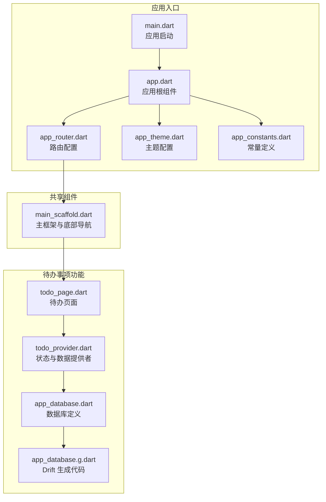
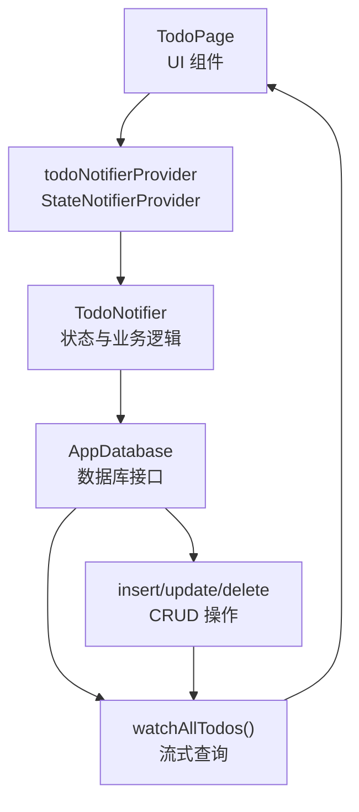
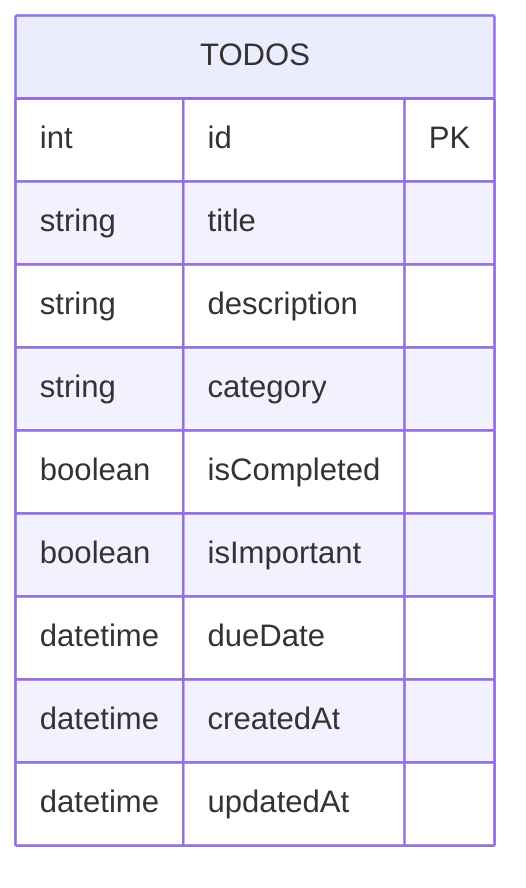
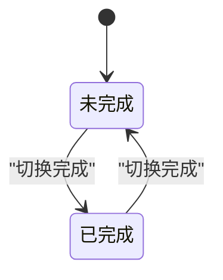
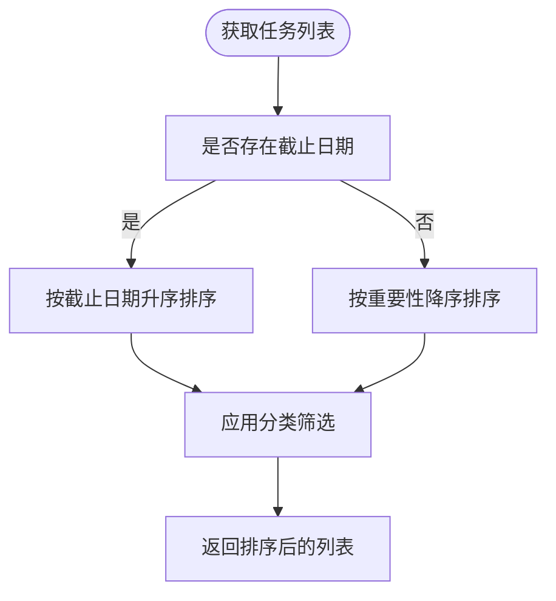
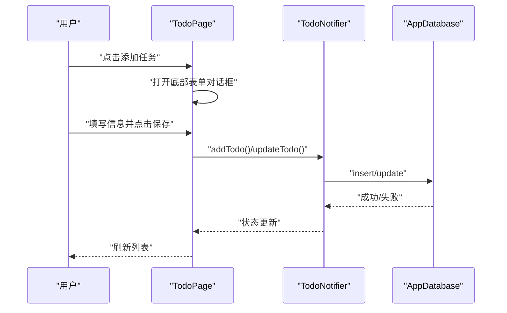
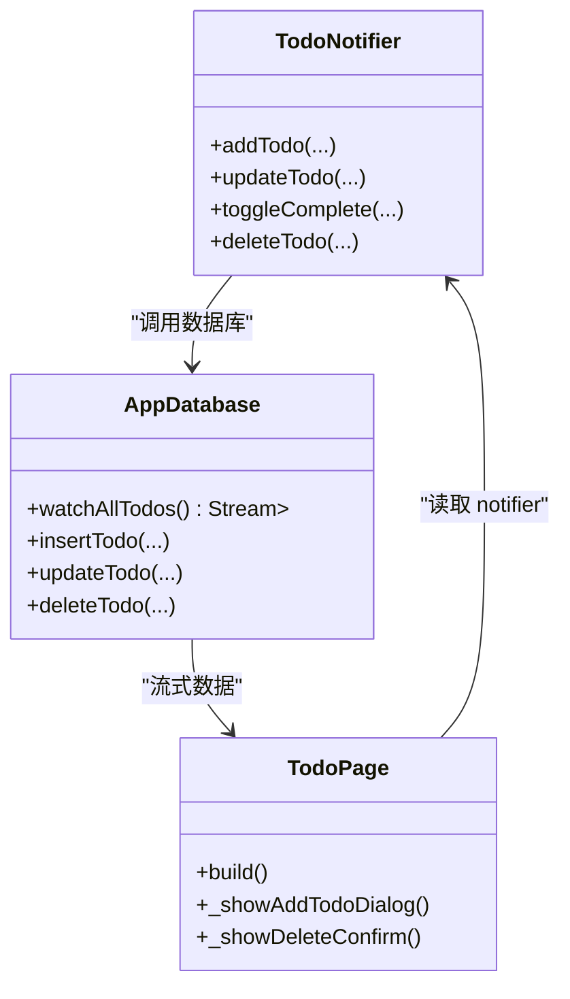
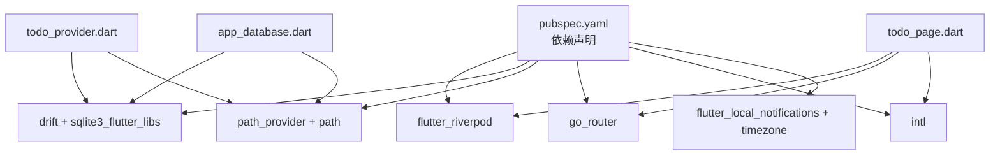

# 待办事项管理

<cite>
**本文档引用的文件**
- [main.dart](file://lib/main.dart)
- [app.dart](file://lib/app.dart)
- [app_router.dart](file://lib/core/router/app_router.dart)
- [app_theme.dart](file://lib/core/theme/app_theme.dart)
- [app_constants.dart](file://lib/core/constants/app_constants.dart)
- [todo_page.dart](file://lib/features/todo/presentation/pages/todo_page.dart)
- [todo_provider.dart](file://lib/features/todo/presentation/providers/todo_provider.dart)
- [app_database.dart](file://lib/shared/data/database/app_database.dart)
- [app_database.g.dart](file://lib/shared/data/database/app_database.g.dart)
- [main_scaffold.dart](file://lib/shared/presentation/widgets/main_scaffold.dart)
- [pubspec.yaml](file://pubspec.yaml)
</cite>

## 目录
1. [简介](#简介)
2. [项目结构](#项目结构)
3. [核心组件](#核心组件)
4. [架构总览](#架构总览)
5. [详细组件分析](#详细组件分析)
6. [依赖关系分析](#依赖关系分析)
7. [性能考虑](#性能考虑)
8. [故障排除指南](#故障排除指南)
9. [结论](#结论)
10. [附录](#附录)

## 简介
本文件面向待办事项管理功能，系统化阐述其业务逻辑、数据模型、状态流转与排序策略、UI 设计规范、状态管理（Riverpod）实现与数据同步机制，并提供最佳实践与排错建议。该功能基于 Flutter + Riverpod + Drift 的技术栈构建，采用响应式数据流与本地 SQLite 数据库持久化，支持任务的创建、编辑、删除、完成状态切换、分类筛选与到期时间设置。

## 项目结构
待办事项模块位于 features/todo 目录下，采用按功能域分层组织：
- presentation/pages：页面级组件，负责 UI 呈现与用户交互
- presentation/providers：状态管理与数据访问，包含 Riverpod Provider、StateNotifier 与数据库适配器
- shared/data/database：数据库定义与 Drift 生成代码，封装 CRUD 操作与流式查询

应用入口通过 ProviderScope 初始化全局状态，App 组件使用 GoRouter 进行页面路由，底部导航在 MainScaffold 中统一管理。

**图表来源**
- [main.dart:1-13](file://lib/main.dart#L1-L13)
- [app.dart:1-23](file://lib/app.dart#L1-L23)
- [app_router.dart:15-60](file://lib/core/router/app_router.dart#L15-L60)
- [app_theme.dart:18-76](file://lib/core/theme/app_theme.dart#L18-L76)
- [app_constants.dart:15-22](file://lib/core/constants/app_constants.dart#L15-L22)
- [todo_page.dart:7-291](file://lib/features/todo/presentation/pages/todo_page.dart#L7-L291)
- [todo_provider.dart:1-79](file://lib/features/todo/presentation/providers/todo_provider.dart#L1-L79)
- [app_database.dart:9-147](file://lib/shared/data/database/app_database.dart#L9-L147)
- [app_database.g.dart:265-438](file://lib/shared/data/database/app_database.g.dart#L265-L438)
- [main_scaffold.dart:8-72](file://lib/shared/presentation/widgets/main_scaffold.dart#L8-L72)

**章节来源**
- [main.dart:1-13](file://lib/main.dart#L1-L13)
- [app.dart:1-23](file://lib/app.dart#L1-L23)
- [app_router.dart:15-60](file://lib/core/router/app_router.dart#L15-L60)
- [app_theme.dart:18-76](file://lib/core/theme/app_theme.dart#L18-L76)
- [app_constants.dart:15-22](file://lib/core/constants/app_constants.dart#L15-L22)
- [todo_page.dart:7-291](file://lib/features/todo/presentation/pages/todo_page.dart#L7-L291)
- [todo_provider.dart:1-79](file://lib/features/todo/presentation/providers/todo_provider.dart#L1-L79)
- [app_database.dart:9-147](file://lib/shared/data/database/app_database.dart#L9-L147)
- [app_database.g.dart:265-438](file://lib/shared/data/database/app_database.g.dart#L265-L438)
- [main_scaffold.dart:8-72](file://lib/shared/presentation/widgets/main_scaffold.dart#L8-L72)

## 核心组件
- 应用入口与状态初始化
  - 全局 ProviderScope 包裹应用，确保 Riverpod 提供者树可用
  - 使用 GoRouter 配置路由，初始定位到待办页面
- 页面组件 TodoPage
  - 负责任务列表渲染、分类筛选、添加/编辑任务对话框、删除确认、完成状态切换
  - 使用 ConsumerWidget 订阅 Riverpod 状态与数据流
- 状态与数据提供者
  - databaseProvider：数据库实例提供
  - todosProvider：监听数据库变更的流式任务列表
  - todoCategoriesProvider：默认分类集合
  - TodoNotifier：封装增删改查与完成状态切换
  - todoNotifierProvider：暴露 TodoNotifier 实例
- 数据库层
  - AppDatabase 定义 Todos 表结构与 CRUD 方法，提供 watchAllTodos 流式查询
  - 生成代码 Todo/TodosCompanion 提供类型安全的实体与补丁对象

**章节来源**
- [main.dart:5-12](file://lib/main.dart#L5-L12)
- [app_router.dart:15-31](file://lib/core/router/app_router.dart#L15-L31)
- [todo_page.dart:14-77](file://lib/features/todo/presentation/pages/todo_page.dart#L14-L77)
- [todo_provider.dart:5-18](file://lib/features/todo/presentation/providers/todo_provider.dart#L5-L18)
- [todo_provider.dart:20-79](file://lib/features/todo/presentation/providers/todo_provider.dart#L20-L79)
- [app_database.dart:9-19](file://lib/shared/data/database/app_database.dart#L9-L19)
- [app_database.dart:91-97](file://lib/shared/data/database/app_database.dart#L91-L97)
- [app_database.g.dart:265-438](file://lib/shared/data/database/app_database.g.dart#L265-L438)

## 架构总览
待办事项采用“页面组件 + Provider + 数据库”的三层架构：
- UI 层：TodoPage 及内部卡片组件负责交互与展示
- 状态层：Riverpod Provider 管理异步状态与副作用
- 数据层：Drift ORM 提供类型安全的本地数据库访问与变更监听

**图表来源**
- [todo_page.dart:19-20](file://lib/features/todo/presentation/pages/todo_page.dart#L19-L20)
- [todo_provider.dart:75-79](file://lib/features/todo/presentation/providers/todo_provider.dart#L75-L79)
- [todo_provider.dart:20-73](file://lib/features/todo/presentation/providers/todo_provider.dart#L20-L73)
- [app_database.dart:91-97](file://lib/shared/data/database/app_database.dart#L91-L97)

## 详细组件分析

### 数据模型与字段说明
Todos 表字段定义与语义：
- id：自增主键
- title：文本，长度限制 1-200，必填
- description：可空文本
- category：文本，默认值 General
- isCompleted：布尔，默认 false
- isImportant：布尔，默认 false
- dueDate：可空日期时间
- createdAt/updatedAt：自动时间戳，默认当前时间

**图表来源**
- [app_database.dart:9-19](file://lib/shared/data/database/app_database.dart#L9-L19)
- [app_database.g.dart:265-438](file://lib/shared/data/database/app_database.g.dart#L265-L438)

**章节来源**
- [app_database.dart:9-19](file://lib/shared/data/database/app_database.dart#L9-L19)
- [app_database.g.dart:265-438](file://lib/shared/data/database/app_database.g.dart#L265-L438)

### 任务状态流转机制
- 创建：调用 insertTodo 插入新记录，触发数据库变更流
- 编辑：调用 updateTodo 更新实体或补丁对象，更新时间戳
- 删除：调用 deleteTodo 根据 id 删除
- 完成状态：toggleComplete 切换 isCompleted 并更新时间戳

**图表来源**
- [todo_provider.dart:47-56](file://lib/features/todo/presentation/providers/todo_provider.dart#L47-L56)
- [app_database.dart:95](file://lib/shared/data/database/app_database.dart#L95)

**章节来源**
- [todo_provider.dart:25-72](file://lib/features/todo/presentation/providers/todo_provider.dart#L25-L72)
- [app_database.dart:94-97](file://lib/shared/data/database/app_database.dart#L94-L97)

### 优先级与排序算法
- 重要性优先：isImportant 为 true 的任务在 UI 中以醒目标识显示，可在业务层作为排序权重
- 截止日期优先：dueDate 存在的任务可按日期升序排列
- 分类筛选：通过分类下拉菜单过滤显示
- 默认排序：当前实现未显式定义排序规则，建议在数据库查询层增加 ORDER BY 条件（例如按 dueDate 升序，再按 isImportant 降序）

**图表来源**
- [todo_page.dart:42-44](file://lib/features/todo/presentation/pages/todo_page.dart#L42-L44)
- [app_database.dart:91](file://lib/shared/data/database/app_database.dart#L91)

**章节来源**
- [todo_page.dart:42-44](file://lib/features/todo/presentation/pages/todo_page.dart#L42-L44)
- [app_database.dart:91](file://lib/shared/data/database/app_database.dart#L91)

### 用户界面设计规范
- 任务列表展示
  - 使用卡片式布局，左侧复选框表示完成状态
  - 标题支持删除线样式与灰色强调
  - 显示分类标签、到期日期图标与日期文本、重要性星标
- 搜索与过滤
  - 顶部筛选按钮弹出分类菜单，支持“All”与具体分类
  - 当无任务时显示占位图与提示文字
- 批量操作
  - 支持单个任务的编辑与删除
  - 建议扩展：全选/反选、批量删除、批量完成
- 添加/编辑对话框
  - 标题与描述输入框
  - 分类下拉选择
  - 日期选择器设置截止日期
  - 开关设置重要性
  - 保存按钮进行新增或更新

**图表来源**
- [todo_page.dart:102-208](file://lib/features/todo/presentation/pages/todo_page.dart#L102-L208)
- [todo_provider.dart:25-72](file://lib/features/todo/presentation/providers/todo_provider.dart#L25-L72)
- [app_database.dart:93-97](file://lib/shared/data/database/app_database.dart#L93-L97)

**章节来源**
- [todo_page.dart:22-77](file://lib/features/todo/presentation/pages/todo_page.dart#L22-L77)
- [todo_page.dart:102-208](file://lib/features/todo/presentation/pages/todo_page.dart#L102-L208)

### 状态管理与数据同步（Riverpod）
- Provider 结构
  - databaseProvider：提供 AppDatabase 实例，随页面销毁关闭连接
  - todosProvider：StreamProvider 订阅 watchAllTodos，自动响应数据库变更
  - todoCategoriesProvider：提供默认分类列表
  - todoNotifierProvider：StateNotifierProvider 暴露 TodoNotifier
- TodoNotifier
  - addTodo：插入新任务，设置加载/错误状态
  - updateTodo/toggleComplete/deleteTodo：更新实体、切换完成状态、删除任务
- 数据同步
  - 数据库变更通过 watchAllTodos 返回的 Stream 推送至 todosProvider
  - 页面通过 ref.watch(todosProvider) 自动重建，实现 UI 与数据的实时同步

**图表来源**
- [todo_provider.dart:20-79](file://lib/features/todo/presentation/providers/todo_provider.dart#L20-L79)
- [app_database.dart:91-97](file://lib/shared/data/database/app_database.dart#L91-L97)
- [todo_page.dart:19-20](file://lib/features/todo/presentation/pages/todo_page.dart#L19-L20)

**章节来源**
- [todo_provider.dart:5-18](file://lib/features/todo/presentation/providers/todo_provider.dart#L5-L18)
- [todo_provider.dart:20-79](file://lib/features/todo/presentation/providers/todo_provider.dart#L20-L79)
- [app_database.dart:91-97](file://lib/shared/data/database/app_database.dart#L91-L97)

## 依赖关系分析
- 技术栈
  - 状态管理：flutter_riverpod
  - 数据库：drift + sqlite3_flutter_libs + path_provider + path
  - 导航：go_router
  - 国际化：intl
  - 通知：flutter_local_notifications + timezone
- 模块耦合
  - 页面仅依赖 Provider，不直接依赖数据库，降低耦合
  - Provider 依赖 AppDatabase，形成清晰的分层

**图表来源**
- [pubspec.yaml:9-42](file://pubspec.yaml#L9-L42)
- [todo_page.dart:1-6](file://lib/features/todo/presentation/pages/todo_page.dart#L1-L6)
- [todo_provider.dart:1-3](file://lib/features/todo/presentation/providers/todo_provider.dart#L1-L3)
- [app_database.dart:1-6](file://lib/shared/data/database/app_database.dart#L1-L6)

**章节来源**
- [pubspec.yaml:9-42](file://pubspec.yaml#L9-L42)
- [todo_page.dart:1-6](file://lib/features/todo/presentation/pages/todo_page.dart#L1-L6)
- [todo_provider.dart:1-3](file://lib/features/todo/presentation/providers/todo_provider.dart#L1-L3)
- [app_database.dart:1-6](file://lib/shared/data/database/app_database.dart#L1-L6)

## 性能考虑
- 数据库查询优化
  - 在 watchAllTodos 基础上增加索引与排序条件，减少 UI 层重复计算
  - 对高频筛选（分类、完成状态、重要性）建立复合索引
- UI 渲染优化
  - 使用 ListView.builder 与惰性加载
  - 对大列表启用缓存策略与分页
- 状态更新
  - 将错误状态与加载状态合并为 AsyncValue，避免不必要的重建
  - 在批量操作中合并多次更新，减少数据库写入次数

## 故障排除指南
- 数据库连接问题
  - 确认 LazyDatabase 初始化路径正确，文件存在且可写
  - 检查迁移策略与 schema 版本
- 异步状态异常
  - 检查 todosProvider 的错误分支是否被触发
  - 在 TodoNotifier 的异常捕获中记录日志
- UI 不刷新
  - 确认 ref.watch(todosProvider) 正确订阅
  - 检查数据库更新是否触发了 watchAllTodos 的流

**章节来源**
- [app_database.dart:140-147](file://lib/shared/data/database/app_database.dart#L140-L147)
- [todo_provider.dart:32-44](file://lib/features/todo/presentation/providers/todo_provider.dart#L32-L44)
- [todo_page.dart:40-70](file://lib/features/todo/presentation/pages/todo_page.dart#L40-L70)

## 结论
该待办事项功能以 Riverpod + Drift 为基础，实现了从 UI 到数据库的完整闭环：页面通过 Provider 订阅数据流，状态变更驱动数据库写入，数据库变更通过流式查询回推 UI。数据模型简洁明确，支持任务的基本生命周期管理；UI 设计直观易用，具备扩展空间。建议后续增强排序策略、批量操作与离线同步能力，以进一步提升用户体验与性能表现。

## 附录
- 默认分类列表
  - General、Work、Personal、Health、Shopping、Finance
- 主题颜色
  - 待办任务色：蓝色系，用于浮动按钮与高亮元素
- 路由与导航
  - 初始路由指向待办页面，底部导航统一跳转各功能页

**章节来源**
- [app_constants.dart:15-22](file://lib/core/constants/app_constants.dart#L15-L22)
- [app_theme.dart:12-16](file://lib/core/theme/app_theme.dart#L12-L16)
- [app_router.dart:18-31](file://lib/core/router/app_router.dart#L18-L31)
- [main_scaffold.dart:24-39](file://lib/shared/presentation/widgets/main_scaffold.dart#L24-L39)