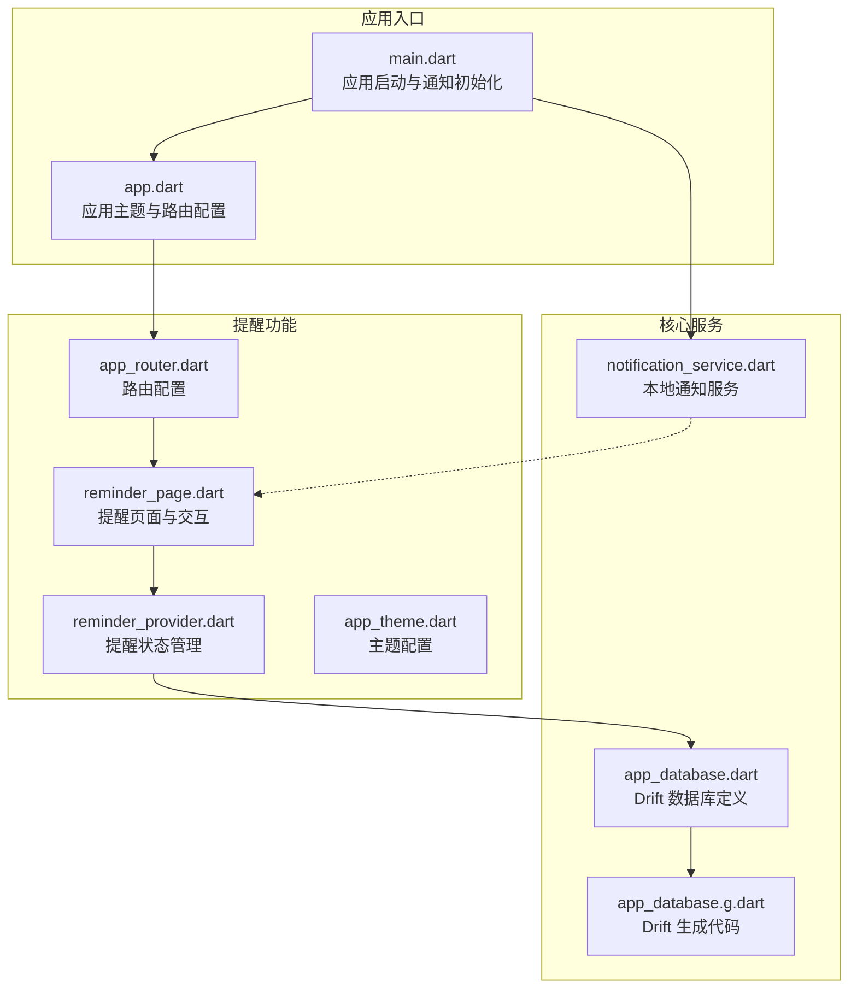
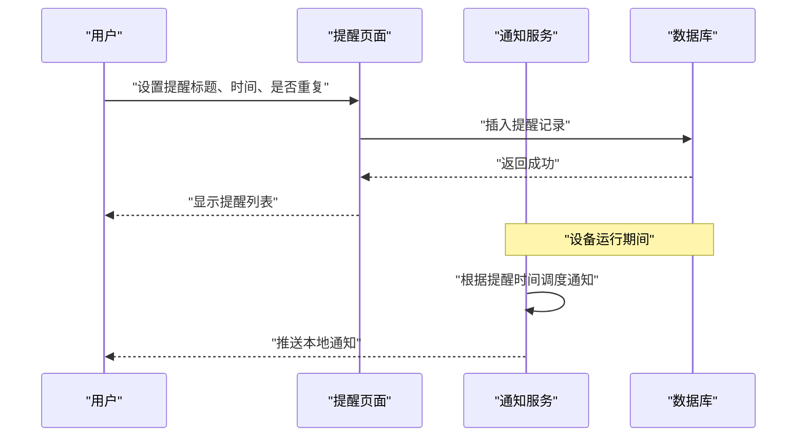
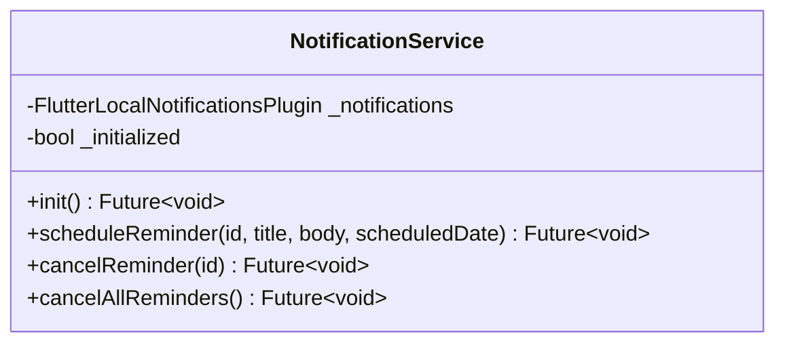
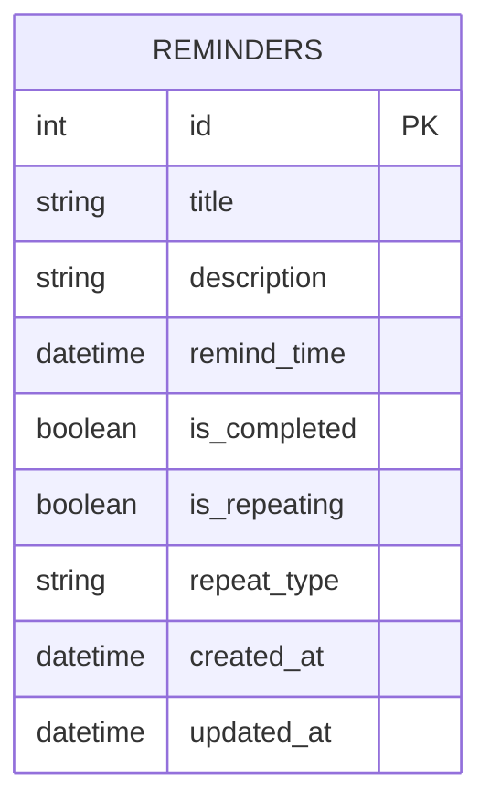
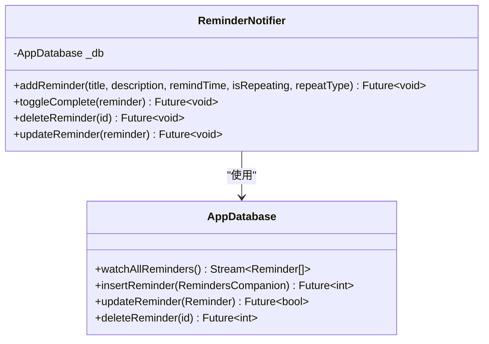
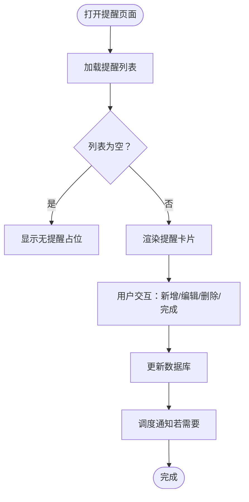
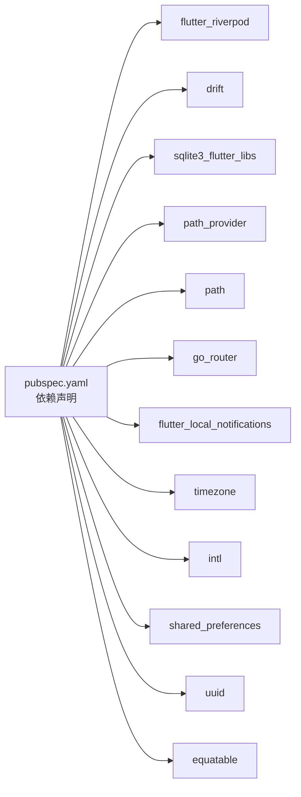

# 提醒事项系统

<cite>
**本文档引用的文件**
- [main.dart](file://lib/main.dart)
- [app.dart](file://lib/app.dart)
- [notification_service.dart](file://lib/core/services/notification_service.dart)
- [reminder_provider.dart](file://lib/features/reminder/presentation/providers/reminder_provider.dart)
- [reminder_page.dart](file://lib/features/reminder/presentation/pages/reminder_page.dart)
- [app_router.dart](file://lib/core/router/app_router.dart)
- [app_database.dart](file://lib/shared/data/database/app_database.dart)
- [app_database.g.dart](file://lib/shared/data/database/app_database.g.dart)
- [app_theme.dart](file://lib/core/theme/app_theme.dart)
- [pubspec.yaml](file://pubspec.yaml)
</cite>

## 目录
1. [简介](#简介)
2. [项目结构](#项目结构)
3. [核心组件](#核心组件)
4. [架构总览](#架构总览)
5. [详细组件分析](#详细组件分析)
6. [依赖关系分析](#依赖关系分析)
7. [性能考虑](#性能考虑)
8. [故障排除指南](#故障排除指南)
9. [结论](#结论)
10. [附录](#附录)

## 简介
本项目是一个基于 Flutter 的个人生活管理系统，其中提醒事项模块提供了完整的提醒功能实现，包括一次性提醒与周期性提醒的设置、闹钟调度、重复规则解析、时间偏移处理、本地通知推送以及系统通知权限管理。同时，系统通过 Drift 数据库持久化存储提醒数据，并提供历史记录追踪与统计能力（当前实现中主要体现为完成状态与更新时间）。本文档将从架构设计、组件关系、数据流、处理逻辑、集成点、错误处理与性能优化等方面进行全面阐述。

## 项目结构
项目采用按功能域分层的组织方式，核心入口在应用启动阶段初始化通知服务，随后通过路由系统进入各功能页面。提醒功能位于 features/reminder 目录下，使用 Riverpod 进行状态管理，数据持久化通过 Drift 实现。

**图表来源**
- [main.dart:1-15](file://lib/main.dart#L1-L15)
- [app.dart:1-23](file://lib/app.dart#L1-L23)
- [notification_service.dart:1-83](file://lib/core/services/notification_service.dart#L1-L83)
- [reminder_provider.dart:1-75](file://lib/features/reminder/presentation/providers/reminder_provider.dart#L1-L75)
- [reminder_page.dart:1-269](file://lib/features/reminder/presentation/pages/reminder_page.dart#L1-L269)
- [app_router.dart:1-61](file://lib/core/router/app_router.dart#L1-L61)
- [app_database.dart:1-147](file://lib/shared/data/database/app_database.dart#L1-L147)
- [app_database.g.dart:1-800](file://lib/shared/data/database/app_database.g.dart#L1-L800)
- [app_theme.dart:1-78](file://lib/core/theme/app_theme.dart#L1-L78)

**章节来源**
- [main.dart:1-15](file://lib/main.dart#L1-L15)
- [app.dart:1-23](file://lib/app.dart#L1-L23)
- [app_router.dart:1-61](file://lib/core/router/app_router.dart#L1-L61)

## 核心组件
- 应用入口与初始化：在应用启动时确保初始化 Flutter 引擎，调用通知服务进行初始化，然后运行应用主体。
- 通知服务：封装 flutter_local_notifications 插件，负责通知通道初始化、权限请求与定时通知调度。
- 数据库层：使用 Drift 定义提醒表结构，提供增删改查与流式查询接口；生成代码提供实体映射与 Companion 模式。
- 状态管理：Riverpod 提供提醒列表的流式监听与添加/编辑/删除/完成切换等操作。
- 页面交互：提醒页面支持一次性提醒与周期性提醒设置，包含日期时间选择、重复类型选择与完成状态管理。

**章节来源**
- [main.dart:6-14](file://lib/main.dart#L6-L14)
- [notification_service.dart:13-31](file://lib/core/services/notification_service.dart#L13-L31)
- [app_database.dart:21-31](file://lib/shared/data/database/app_database.dart#L21-L31)
- [reminder_provider.dart:11-14](file://lib/features/reminder/presentation/providers/reminder_provider.dart#L11-L14)
- [reminder_page.dart:53-169](file://lib/features/reminder/presentation/pages/reminder_page.dart#L53-L169)

## 架构总览
提醒系统的整体架构围绕“状态管理 + 数据持久化 + 通知调度”展开。用户通过页面输入提醒信息，Riverpod 将数据写入 Drift 数据库；当需要触发提醒时，通知服务根据设定的时间进行调度并推送本地通知。

**图表来源**
- [reminder_page.dart:134-159](file://lib/features/reminder/presentation/pages/reminder_page.dart#L134-L159)
- [reminder_provider.dart:27-41](file://lib/features/reminder/presentation/providers/reminder_provider.dart#L27-L41)
- [notification_service.dart:33-71](file://lib/core/services/notification_service.dart#L33-L71)

## 详细组件分析

### 通知服务（NotificationService）
- 初始化流程：确保时区数据初始化，配置 Android/iOS 初始化参数，请求系统通知权限，完成插件初始化。
- 调度机制：使用 zonedSchedule 进行定时通知，支持 Android 精确模式与系统时间解释模式，确保在设备休眠或锁屏状态下仍可按时触发。
- 取消控制：提供按 ID 取消与全部取消的能力，便于清理过期或无效提醒。

**图表来源**
- [notification_service.dart:5-82](file://lib/core/services/notification_service.dart#L5-L82)

**章节来源**
- [notification_service.dart:13-31](file://lib/core/services/notification_service.dart#L13-L31)
- [notification_service.dart:33-71](file://lib/core/services/notification_service.dart#L33-L71)
- [notification_service.dart:73-81](file://lib/core/services/notification_service.dart#L73-L81)

### 数据库与实体模型（Drift）
- 表结构：Reminders 表包含标题、描述、提醒时间、完成状态、重复标志与重复类型等字段。
- 流式查询：提供 watchAllReminders 流式接口，用于实时监听提醒列表变化。
- 操作接口：提供插入、更新、删除与查询方法，配合 Companion 模式简化数据构建。

**图表来源**
- [app_database.dart:21-31](file://lib/shared/data/database/app_database.dart#L21-L31)
- [app_database.g.dart:570-789](file://lib/shared/data/database/app_database.g.dart#L570-L789)

**章节来源**
- [app_database.dart:99-107](file://lib/shared/data/database/app_database.dart#L99-L107)
- [app_database.dart:101](file://lib/shared/data/database/app_database.dart#L101)
- [app_database.g.dart:784-800](file://lib/shared/data/database/app_database.g.dart#L784-L800)

### 提醒状态管理（Riverpod）
- 列表监听：通过 StreamProvider 订阅数据库中的提醒流，实现 UI 自动刷新。
- 添加/编辑/删除/完成切换：通过 StateNotifier 封装 CRUD 操作，统一错误处理与状态反馈。

**图表来源**
- [reminder_provider.dart:16-69](file://lib/features/reminder/presentation/providers/reminder_provider.dart#L16-L69)
- [app_database.dart:99-107](file://lib/shared/data/database/app_database.dart#L99-L107)

**章节来源**
- [reminder_provider.dart:11-14](file://lib/features/reminder/presentation/providers/reminder_provider.dart#L11-L14)
- [reminder_provider.dart:27-41](file://lib/features/reminder/presentation/providers/reminder_provider.dart#L27-L41)
- [reminder_provider.dart:43-68](file://lib/features/reminder/presentation/providers/reminder_provider.dart#L43-L68)

### 提醒页面与交互
- 新增/编辑提醒：支持标题、描述、提醒时间、是否重复及重复类型（日/周/月）设置。
- 完成状态：复选框切换完成状态，自动更新更新时间。
- 删除确认：弹窗确认删除，避免误操作。
- 无提醒提示：空列表时展示占位图与文案。

**图表来源**
- [reminder_page.dart:18-51](file://lib/features/reminder/presentation/pages/reminder_page.dart#L18-L51)
- [reminder_page.dart:53-169](file://lib/features/reminder/presentation/pages/reminder_page.dart#L53-L169)
- [reminder_page.dart:195-268](file://lib/features/reminder/presentation/pages/reminder_page.dart#L195-L268)

**章节来源**
- [reminder_page.dart:53-169](file://lib/features/reminder/presentation/pages/reminder_page.dart#L53-L169)
- [reminder_page.dart:195-268](file://lib/features/reminder/presentation/pages/reminder_page.dart#L195-L268)

### 时间管理与重复规则
- 一次性提醒：直接使用设定的提醒时间进行通知调度。
- 周期性提醒：repeatType 字段标识重复类型（日/周/月），当前页面提供三种选项。实际重复逻辑需结合调度器实现，建议在应用启动后扫描数据库，对即将到期或已过期但未完成的提醒进行重新调度。
- 时间偏移处理：使用 TZDateTime.from 结合本地时区，确保跨时区与夏令时场景下的正确性。

**章节来源**
- [reminder_page.dart:122-132](file://lib/features/reminder/presentation/pages/reminder_page.dart#L122-L132)
- [notification_service.dart:61-70](file://lib/core/services/notification_service.dart#L61-L70)

### 触发机制与通知集成
- 通知通道：Android 使用固定通道 ID，iOS 启用提醒、徽章与声音权限。
- 推送策略：zonedSchedule 支持精确调度与系统时间解释，保证在设备处于允许唤醒模式时仍能触发。
- 权限管理：初始化阶段请求系统通知权限，避免后续无法推送通知。

**章节来源**
- [notification_service.dart:41-59](file://lib/core/services/notification_service.dart#L41-L59)
- [notification_service.dart:18-29](file://lib/core/services/notification_service.dart#L18-L29)

### 历史记录与统计
- 历史追踪：提醒实体包含 createdAt 与 updatedAt 字段，可用于追踪创建与修改历史。
- 统计维度：当前实现以完成状态与更新时间为主，可扩展为按日/周/月统计完成数量与平均延迟等指标。

**章节来源**
- [app_database.dart:28-30](file://lib/shared/data/database/app_database.dart#L28-L30)
- [reminder_provider.dart:45-48](file://lib/features/reminder/presentation/providers/reminder_provider.dart#L45-L48)

### 错误处理与异常情况
- 初始化保护：通知服务在每次操作前检查初始化状态，避免重复初始化。
- 网络/数据库异常：Riverpod 在添加提醒时捕获异常并返回错误状态，页面可根据状态进行提示。
- 设备重启恢复：当前代码未实现设备重启后的提醒恢复机制。建议在应用启动时扫描数据库中未完成且已过期的提醒，重新调用通知服务进行调度。

**章节来源**
- [notification_service.dart:39-40](file://lib/core/services/notification_service.dart#L39-L40)
- [reminder_provider.dart:38-40](file://lib/features/reminder/presentation/providers/reminder_provider.dart#L38-L40)

## 依赖关系分析
项目依赖通过 pubspec.yaml 管理，关键依赖包括：
- 状态管理：flutter_riverpod
- 数据库：drift + sqlite3_flutter_libs + path_provider + path
- 导航：go_router
- 本地通知：flutter_local_notifications + timezone
- 国际化：intl
- 其他工具：uuid、equatable、shared_preferences

**图表来源**
- [pubspec.yaml:9-42](file://pubspec.yaml#L9-L42)

**章节来源**
- [pubspec.yaml:9-42](file://pubspec.yaml#L9-L42)

## 性能考虑
- 数据库访问：使用 Drift 的流式查询减少不必要的全量查询，提升列表渲染性能。
- 通知调度：合理设置 AndroidScheduleMode 与 UILocalNotificationDateInterpretation，避免频繁唤醒导致电量消耗。
- UI 渲染：列表使用 ListView.builder，仅渲染可见项，提高滚动性能。
- 主题与资源：统一主题配置，减少样式计算开销。

## 故障排除指南
- 无法收到通知：检查通知服务初始化是否成功，确认系统通知权限已授予。
- 重复提醒未生效：确认 repeatType 设置正确，建议在应用启动时扫描数据库并重新调度。
- 数据不同步：检查 Riverpod 状态是否正确更新，确认数据库写入成功。
- 时间不准确：确认时区初始化与 TZDateTime.from 的使用，避免跨时区问题。

**章节来源**
- [notification_service.dart:13-31](file://lib/core/services/notification_service.dart#L13-L31)
- [reminder_provider.dart:38-40](file://lib/features/reminder/presentation/providers/reminder_provider.dart#L38-L40)

## 结论
提醒事项系统通过清晰的分层架构实现了从界面交互到数据持久化与通知调度的完整闭环。当前版本支持一次性与周期性提醒的基础功能，具备良好的扩展性。建议后续完善设备重启后的提醒恢复机制与更丰富的重复规则解析，以进一步提升用户体验与可靠性。

## 附录
- 使用指南：在提醒页面通过底部弹窗设置标题、描述、提醒时间与重复类型，点击保存即可完成提醒创建。
- 预设规则：repeatType 支持日、周、月三种预设，可按需选择。
- 开发建议：为提升稳定性，建议在应用启动时进行一次数据库扫描与通知重调度，确保覆盖设备重启等异常场景。