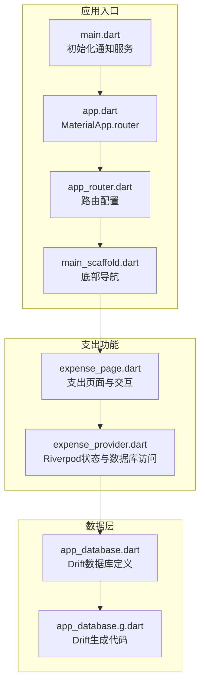
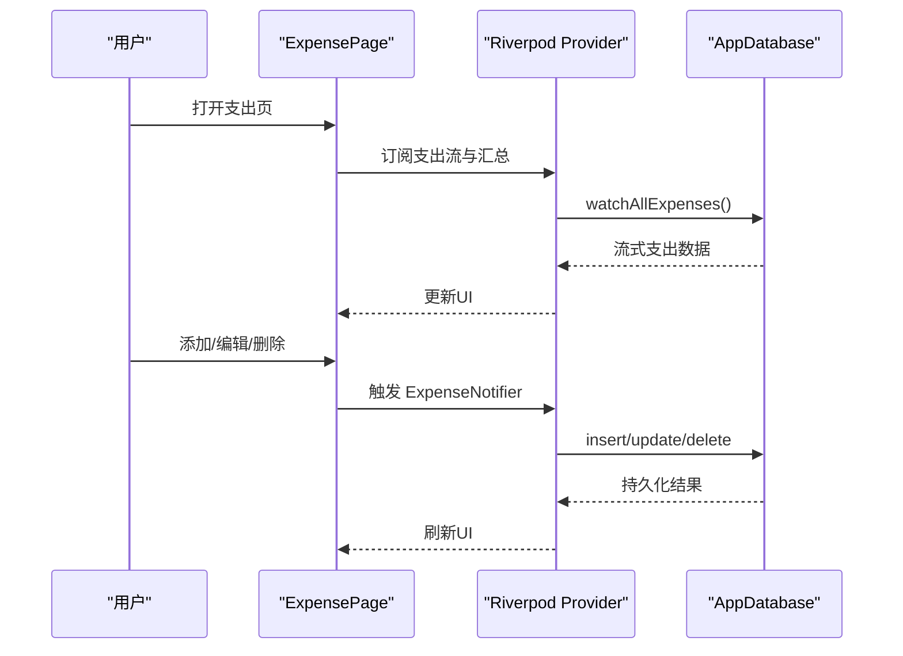
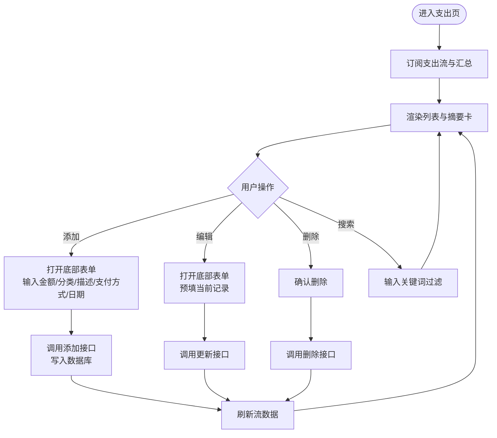
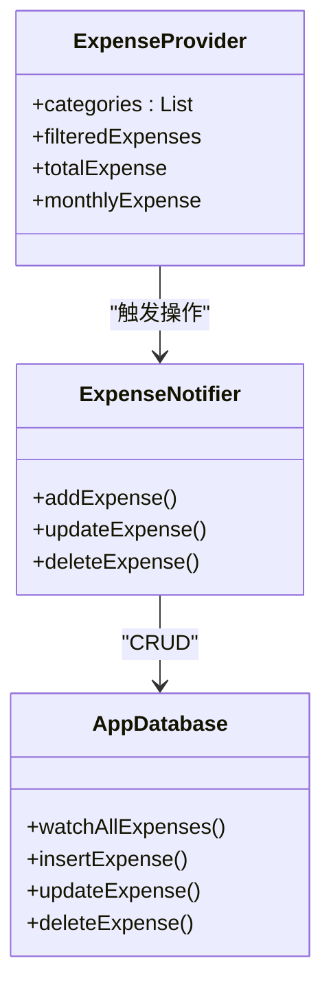
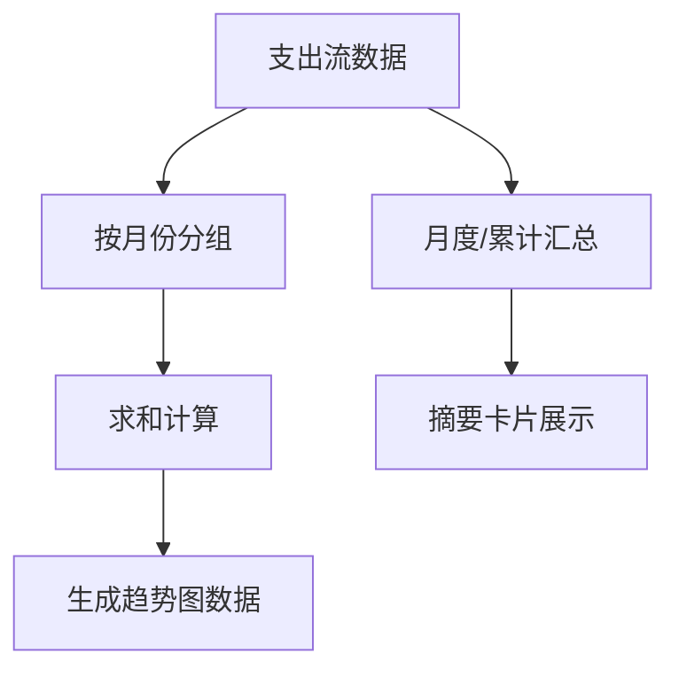
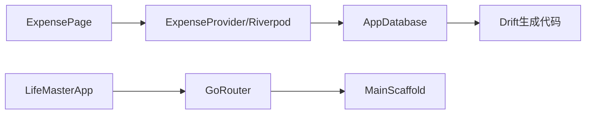

# 支出跟踪

<cite>
**本文引用的文件**
- [main.dart](file://lib/main.dart)
- [app.dart](file://lib/app.dart)
- [app_router.dart](file://lib/core/router/app_router.dart)
- [app_theme.dart](file://lib/core/theme/app_theme.dart)
- [app_constants.dart](file://lib/core/constants/app_constants.dart)
- [main_scaffold.dart](file://lib/shared/presentation/widgets/main_scaffold.dart)
- [expense_page.dart](file://lib/features/expense/presentation/pages/expense_page.dart)
- [expense_provider.dart](file://lib/features/expense/presentation/providers/expense_provider.dart)
- [app_database.dart](file://lib/shared/data/database/app_database.dart)
- [app_database.g.dart](file://lib/shared/data/database/app_database.g.dart)
</cite>

## 目录
1. [简介](#简介)
2. [项目结构](#项目结构)
3. [核心组件](#核心组件)
4. [架构总览](#架构总览)
5. [详细组件分析](#详细组件分析)
6. [依赖关系分析](#依赖关系分析)
7. [性能考虑](#性能考虑)
8. [故障排除指南](#故障排除指南)
9. [结论](#结论)
10. [附录](#附录)

## 简介
本文件围绕支出跟踪功能进行系统化说明，覆盖支出记录的完整生命周期（创建、编辑、删除、查询与展示）、支出分类体系（默认分类、可扩展分类）、支付方式字段设计、统计分析（月度趋势、汇总统计）、以及数据持久化与主题/路由集成。当前仓库中尚未发现预算设置、超支提醒、数据导入导出、数据隐私与安全存储的具体实现代码，因此本文件在相应章节提供概念性指导与建议。

## 项目结构
应用采用模块化组织：入口程序初始化通知服务并启动主应用；路由层通过 GoRouter 将页面挂载到主脚手架；支出功能位于 features/expense 子模块；数据持久化由 shared/data/database 提供 Drift 数据库；UI 主题与常量分别位于 core/theme 与 core/constants。

**图表来源**
- [main.dart:1-15](file://lib/main.dart#L1-L15)
- [app.dart:1-23](file://lib/app.dart#L1-L23)
- [app_router.dart:1-61](file://lib/core/router/app_router.dart#L1-L61)
- [main_scaffold.dart:1-72](file://lib/shared/presentation/widgets/main_scaffold.dart#L1-L72)
- [expense_page.dart:1-451](file://lib/features/expense/presentation/pages/expense_page.dart#L1-L451)
- [expense_provider.dart:1-110](file://lib/features/expense/presentation/providers/expense_provider.dart#L1-L110)
- [app_database.dart:1-147](file://lib/shared/data/database/app_database.dart#L1-L147)
- [app_database.g.dart](file://lib/shared/data/database/app_database.g.dart)

**章节来源**
- [main.dart:1-15](file://lib/main.dart#L1-L15)
- [app.dart:1-23](file://lib/app.dart#L1-L23)
- [app_router.dart:1-61](file://lib/core/router/app_router.dart#L1-L61)
- [main_scaffold.dart:1-72](file://lib/shared/presentation/widgets/main_scaffold.dart#L1-L72)

## 核心组件
- 应用入口与主题
  - 入口初始化通知服务后启动 LifeMasterApp，并配置路由与主题。
  - 主题定义了支出色值用于卡片与图标视觉统一。
- 路由与导航
  - 使用 GoRouter 配置 ShellRoute + 多个子页面，底部导航切换至支出页。
- 支出页面与交互
  - 展示月度与累计支出摘要、搜索过滤、月度趋势图、列表展示与增删改操作。
- Riverpod 状态与数据库
  - 提供支出流式数据、筛选、汇总计算与增删改操作；数据库定义包含支出表及 CRUD 方法。

**章节来源**
- [app.dart:1-23](file://lib/app.dart#L1-L23)
- [app_theme.dart:1-78](file://lib/core/theme/app_theme.dart#L1-L78)
- [app_router.dart:1-61](file://lib/core/router/app_router.dart#L1-L61)
- [main_scaffold.dart:1-72](file://lib/shared/presentation/widgets/main_scaffold.dart#L1-L72)
- [expense_page.dart:1-451](file://lib/features/expense/presentation/pages/expense_page.dart#L1-L451)
- [expense_provider.dart:1-110](file://lib/features/expense/presentation/providers/expense_provider.dart#L1-L110)
- [app_database.dart:1-147](file://lib/shared/data/database/app_database.dart#L1-L147)

## 架构总览
支出功能遵循“页面-状态-数据库”的分层架构：页面负责用户交互与展示；Riverpod 提供状态与数据源；Drift 负责本地持久化。

**图表来源**
- [expense_page.dart:1-451](file://lib/features/expense/presentation/pages/expense_page.dart#L1-L451)
- [expense_provider.dart:1-110](file://lib/features/expense/presentation/providers/expense_provider.dart#L1-L110)
- [app_database.dart:1-147](file://lib/shared/data/database/app_database.dart#L1-L147)

## 详细组件分析

### 支出记录生命周期
- 创建
  - 页面弹出底部表单，输入金额、分类、描述、支付方式与日期，提交后调用 ExpenseNotifier.addExpense，写入数据库。
- 编辑
  - 点击编辑按钮打开相同表单，预填当前记录，保存时调用 ExpenseNotifier.updateExpense。
- 删除
  - 点击删除按钮弹出确认对话框，确认后调用 ExpenseNotifier.deleteExpense。
- 查询与展示
  - 订阅支出流，支持按分类或描述关键词搜索；列表按时间倒序排列；顶部显示月度与累计支出摘要；下方展示月度趋势柱状图。

**图表来源**
- [expense_page.dart:114-254](file://lib/features/expense/presentation/pages/expense_page.dart#L114-L254)
- [expense_provider.dart:62-104](file://lib/features/expense/presentation/providers/expense_provider.dart#L62-L104)
- [app_database.dart:119-127](file://lib/shared/data/database/app_database.dart#L119-L127)

**章节来源**
- [expense_page.dart:114-254](file://lib/features/expense/presentation/pages/expense_page.dart#L114-L254)
- [expense_provider.dart:62-104](file://lib/features/expense/presentation/providers/expense_provider.dart#L62-L104)
- [app_database.dart:119-127](file://lib/shared/data/database/app_database.dart#L119-L127)

### 支出分类体系
- 默认分类
  - 分类列表在 provider 中以静态数组形式提供，包含常用类别。
- 自定义分类
  - 页面表单允许用户选择现有分类；若需新增自定义分类，可在表单中直接输入后提交，后续可继续在分类下拉中选择。
- 层级分类结构
  - 当前实现为一维字符串分类，未见层级结构或父子关系字段；如需层级分类，可在数据库表中增加父级外键字段并在 UI 中实现树形选择。

**图表来源**
- [expense_provider.dart:16-60](file://lib/features/expense/presentation/providers/expense_provider.dart#L16-L60)
- [expense_provider.dart:62-104](file://lib/features/expense/presentation/providers/expense_provider.dart#L62-L104)
- [app_database.dart:119-127](file://lib/shared/data/database/app_database.dart#L119-L127)

**章节来源**
- [expense_provider.dart:16-18](file://lib/features/expense/presentation/providers/expense_provider.dart#L16-L18)
- [app_constants.dart:24-34](file://lib/core/constants/app_constants.dart#L24-L34)

### 支付方式管理机制
- 字段设计
  - 支付方式为可空文本字段，支持现金、银行卡、移动支付等渠道名称。
- 配置与使用
  - 页面表单提供支付方式输入框；提交时将该字段写入数据库；查询与展示时按原样呈现。
- 建议
  - 可引入支付方式枚举或字典表，便于统一管理与校验。

**章节来源**
- [app_database.dart:46-55](file://lib/shared/data/database/app_database.dart#L46-L55)
- [expense_page.dart:172-175](file://lib/features/expense/presentation/pages/expense_page.dart#L172-L175)

### 统计分析功能
- 月度趋势分析
  - 页面内置月度趋势图，统计最近六个月的支出总额并绘制柱状图。
- 汇总统计
  - 提供月度支出与累计支出两个摘要卡片，来源于 Riverpod 的汇总 Provider。
- 分类占比统计
  - 当前未实现分类占比统计；可在 Provider 中按分类聚合金额并计算占比。

**图表来源**
- [expense_page.dart:349-450](file://lib/features/expense/presentation/pages/expense_page.dart#L349-L450)
- [expense_provider.dart:41-60](file://lib/features/expense/presentation/providers/expense_provider.dart#L41-L60)

**章节来源**
- [expense_page.dart:349-450](file://lib/features/expense/presentation/pages/expense_page.dart#L349-L450)
- [expense_provider.dart:41-60](file://lib/features/expense/presentation/providers/expense_provider.dart#L41-L60)

### 数据导入导出（概念性说明）
- 导入
  - 建议提供 CSV/JSON 导入能力：解析文件 -> 校验字段 -> 批量插入数据库。
- 导出
  - 建议提供 CSV/JSON 导出能力：查询支出数据 -> 序列化 -> 下载文件。
- 安全与隐私
  - 导入导出应避免明文敏感信息；可提供加密选项与权限控制。

[本节为概念性指导，不直接分析具体文件]

### 预算设置与超支提醒（概念性说明）
- 预算设置
  - 可新增预算表，按分类或月维度设定限额；在支出页展示预算进度条。
- 超支提醒
  - 在汇总 Provider 中计算支出与预算比值，触发通知或高亮提示。
- 实现建议
  - 引入预算 Provider 与通知服务，结合现有通知初始化流程。

[本节为概念性指导，不直接分析具体文件]

### 数据隐私保护与安全存储（概念性说明）
- 本地存储
  - 使用 SQLite 文件存储于应用文档目录；建议启用数据库加密与访问权限控制。
- 敏感信息
  - 支付方式等字段为纯文本，建议在 UI 层面提供脱敏展示与可选隐藏。
- 远程同步
  - 若未来引入云端同步，需确保传输加密与端到端加密。

[本节为概念性指导，不直接分析具体文件]

## 依赖关系分析
- 页面依赖 Provider 提供的数据与操作方法。
- Provider 依赖数据库实例，数据库由 Drift 生成代码提供 CRUD。
- 应用整体依赖路由与主题配置。

**图表来源**
- [expense_page.dart:1-451](file://lib/features/expense/presentation/pages/expense_page.dart#L1-L451)
- [expense_provider.dart:1-110](file://lib/features/expense/presentation/providers/expense_provider.dart#L1-L110)
- [app_database.dart:1-147](file://lib/shared/data/database/app_database.dart#L1-L147)
- [app.dart:1-23](file://lib/app.dart#L1-L23)
- [app_router.dart:1-61](file://lib/core/router/app_router.dart#L1-L61)
- [main_scaffold.dart:1-72](file://lib/shared/presentation/widgets/main_scaffold.dart#L1-L72)

**章节来源**
- [expense_page.dart:1-451](file://lib/features/expense/presentation/pages/expense_page.dart#L1-L451)
- [expense_provider.dart:1-110](file://lib/features/expense/presentation/providers/expense_provider.dart#L1-L110)
- [app_database.dart:1-147](file://lib/shared/data/database/app_database.dart#L1-L147)
- [app.dart:1-23](file://lib/app.dart#L1-L23)
- [app_router.dart:1-61](file://lib/core/router/app_router.dart#L1-L61)
- [main_scaffold.dart:1-72](file://lib/shared/presentation/widgets/main_scaffold.dart#L1-L72)

## 性能考虑
- 数据加载
  - 使用流式 watchAllExpenses，避免频繁全量查询；在 Provider 中进行轻量计算（如汇总、筛选）。
- UI 渲染
  - 列表按时间倒序，减少重复排序；搜索采用异步过滤，避免阻塞主线程。
- 图表绘制
  - 仅在有数据时渲染趋势图，减少不必要的计算与布局。

[本节提供通用建议，不直接分析具体文件]

## 故障排除指南
- 无法看到支出数据
  - 检查数据库是否正确初始化与迁移；确认 watchAllExpenses 是否正常返回数据流。
- 添加/编辑失败
  - 查看 ExpenseNotifier 的异常处理分支；确认金额与日期参数有效性。
- 删除无效
  - 确认传入的 ID 正确且数据库删除成功。

**章节来源**
- [app_database.dart:75-87](file://lib/shared/data/database/app_database.dart#L75-L87)
- [expense_provider.dart:62-104](file://lib/features/expense/presentation/providers/expense_provider.dart#L62-L104)

## 结论
当前支出功能已实现完整的记录生命周期与基础统计展示，具备良好的扩展空间。建议后续补充预算与超支提醒、分类层级结构、支付方式字典、导入导出与数据安全策略，以进一步提升用户体验与数据治理能力。

## 附录
- 路由与导航
  - 应用通过底部导航进入支出页，页面内提供搜索与图表展示。
- 主题与配色
  - 支出模块使用独立颜色标识，保证视觉一致性。

**章节来源**
- [app_router.dart:15-60](file://lib/core/router/app_router.dart#L15-L60)
- [main_scaffold.dart:14-71](file://lib/shared/presentation/widgets/main_scaffold.dart#L14-L71)
- [app_theme.dart:12-16](file://lib/core/theme/app_theme.dart#L12-L16)