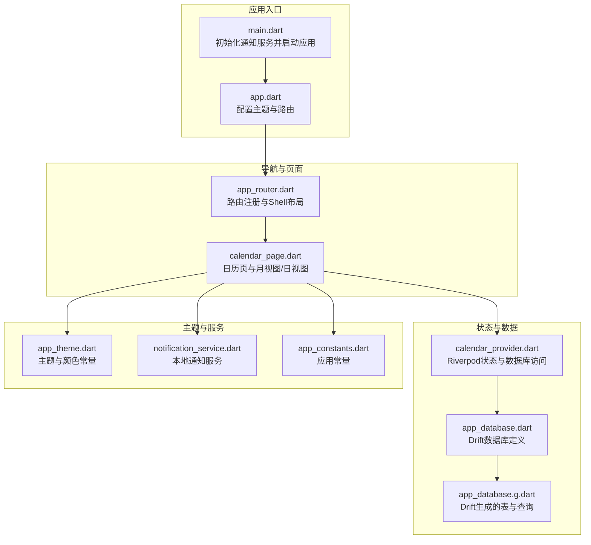
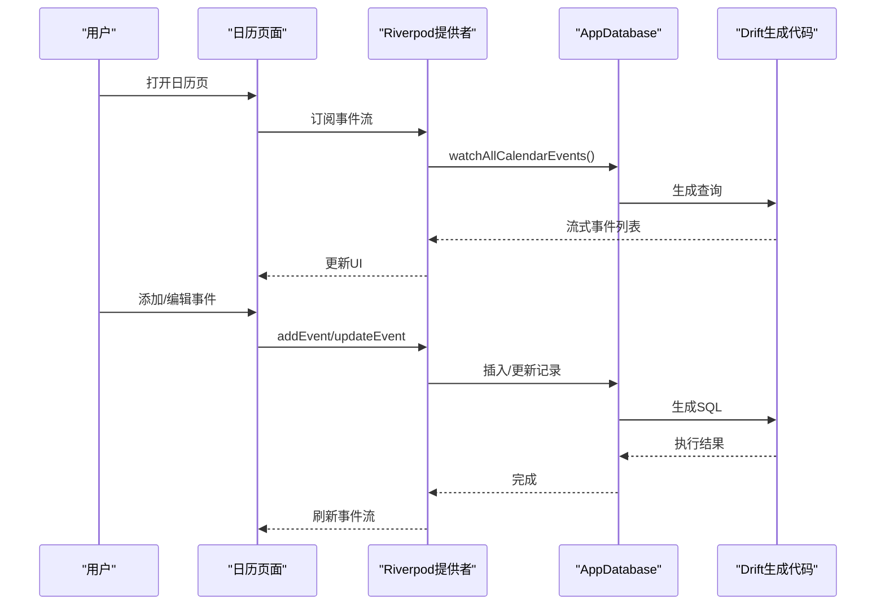
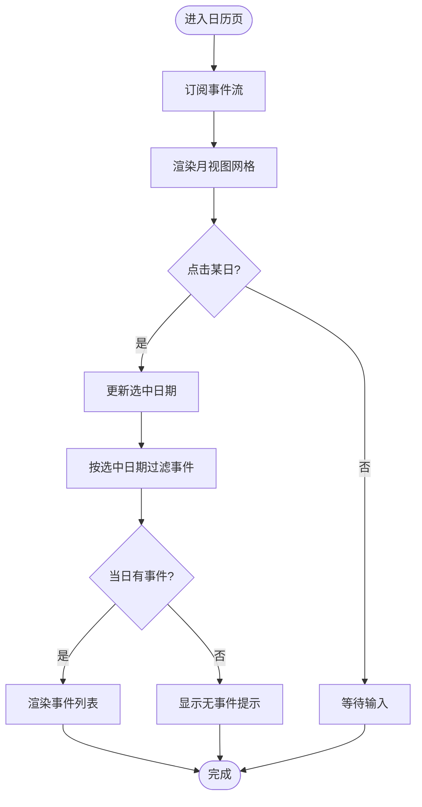
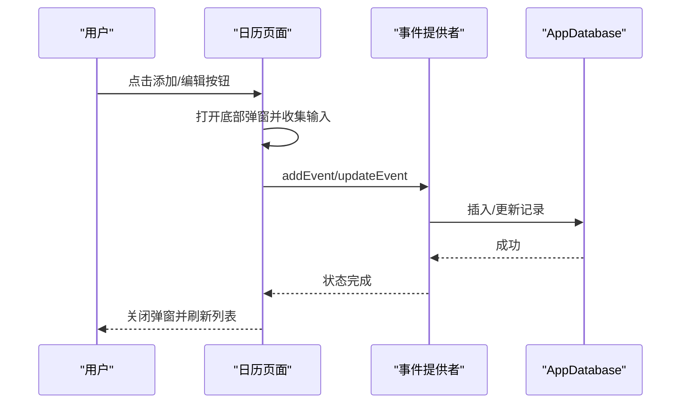
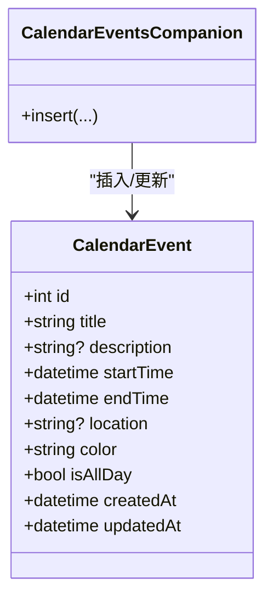
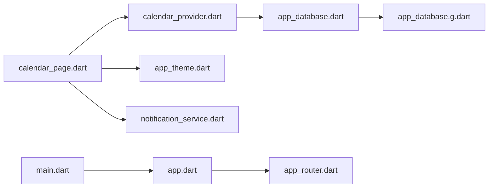

# 日历事件管理

<cite>
**本文引用的文件**
- [main.dart](file://lib/main.dart)
- [app.dart](file://lib/app.dart)
- [calendar_page.dart](file://lib/features/calendar/presentation/pages/calendar_page.dart)
- [calendar_provider.dart](file://lib/features/calendar/presentation/providers/calendar_provider.dart)
- [app_database.dart](file://lib/shared/data/database/app_database.dart)
- [app_database.g.dart](file://lib/shared/data/database/app_database.g.dart)
- [app_router.dart](file://lib/core/router/app_router.dart)
- [app_theme.dart](file://lib/core/theme/app_theme.dart)
- [notification_service.dart](file://lib/core/services/notification_service.dart)
- [app_constants.dart](file://lib/core/constants/app_constants.dart)
</cite>

## 目录
1. [简介](#简介)
2. [项目结构](#项目结构)
3. [核心组件](#核心组件)
4. [架构总览](#架构总览)
5. [详细组件分析](#详细组件分析)
6. [依赖关系分析](#依赖关系分析)
7. [性能考量](#性能考量)
8. [故障排查指南](#故障排查指南)
9. [结论](#结论)
10. [附录](#附录)

## 简介
本文件围绕日历事件管理功能进行系统化说明，覆盖以下方面：
- 日历视图实现：月视图、日视图（含列表）的渲染机制与交互流程
- 事件创建与编辑：基本信息、时间安排、全天事件等
- 时间冲突检测与解决策略：当前实现与建议方案
- 颜色分类与视觉标识：颜色字段与卡片展示
- 搜索与筛选：当前可用能力与扩展方向
- 全天空事件与时长精度：数据模型与显示策略
- 与系统日历的集成：可行性与限制

## 项目结构
项目采用 Flutter + Riverpod 架构，日历模块位于 features/calendar 下，数据库使用 Drift，路由通过 go_router 管理。

**图表来源**
- [main.dart:1-15](file://lib/main.dart#L1-L15)
- [app.dart:1-23](file://lib/app.dart#L1-L23)
- [app_router.dart:15-61](file://lib/core/router/app_router.dart#L15-L61)
- [calendar_page.dart:1-73](file://lib/features/calendar/presentation/pages/calendar_page.dart#L1-L73)
- [calendar_provider.dart:1-70](file://lib/features/calendar/presentation/providers/calendar_provider.dart#L1-L70)
- [app_database.dart:33-44](file://lib/shared/data/database/app_database.dart#L33-L44)
- [app_database.g.dart:1595-1632](file://lib/shared/data/database/app_database.g.dart#L1595-L1632)
- [app_theme.dart:13-16](file://lib/core/theme/app_theme.dart#L13-L16)
- [notification_service.dart:1-83](file://lib/core/services/notification_service.dart#L1-L83)
- [app_constants.dart:7](file://lib/core/constants/app_constants.dart#L7)

**章节来源**
- [main.dart:1-15](file://lib/main.dart#L1-L15)
- [app.dart:1-23](file://lib/app.dart#L1-L23)
- [app_router.dart:15-61](file://lib/core/router/app_router.dart#L15-L61)
- [calendar_page.dart:1-73](file://lib/features/calendar/presentation/pages/calendar_page.dart#L1-L73)
- [calendar_provider.dart:1-70](file://lib/features/calendar/presentation/providers/calendar_provider.dart#L1-L70)
- [app_database.dart:33-44](file://lib/shared/data/database/app_database.dart#L33-L44)
- [app_database.g.dart:1595-1632](file://lib/shared/data/database/app_database.g.dart#L1595-L1632)
- [app_theme.dart:13-16](file://lib/core/theme/app_theme.dart#L13-L16)
- [notification_service.dart:1-83](file://lib/core/services/notification_service.dart#L1-L83)
- [app_constants.dart:7](file://lib/core/constants/app_constants.dart#L7)

## 核心组件
- 应用入口与初始化：在应用启动时初始化通知服务，随后通过 ProviderScope 包裹应用根组件。
- 路由与页面：通过 go_router 将日历页注册到 Shell 布局中，作为主功能之一。
- 日历页面：提供月视图网格与日视图列表；支持添加、编辑、删除事件；支持“全天”事件与颜色标识。
- 数据层：使用 Drift 定义 CalendarEvents 表，提供插入、更新、删除与流式查询；Riverpod 提供状态与数据库访问。
- 主题与颜色：日历颜色常量统一于主题文件，用于界面视觉标识。
- 通知服务：提供本地通知调度与取消能力（用于提醒），可与日历事件结合使用。

**章节来源**
- [main.dart:6-14](file://lib/main.dart#L6-L14)
- [app_router.dart:38-43](file://lib/core/router/app_router.dart#L38-L43)
- [calendar_page.dart:7-73](file://lib/features/calendar/presentation/pages/calendar_page.dart#L7-L73)
- [calendar_provider.dart:11-14](file://lib/features/calendar/presentation/providers/calendar_provider.dart#L11-L14)
- [app_database.dart:33-44](file://lib/shared/data/database/app_database.dart#L33-L44)
- [app_theme.dart:13-16](file://lib/core/theme/app_theme.dart#L13-L16)
- [notification_service.dart:13-31](file://lib/core/services/notification_service.dart#L13-L31)

## 架构总览
日历功能遵循“UI 组件 + Riverpod 状态 + Drift 数据库”的分层设计。UI 层负责视图渲染与用户交互；状态层负责事件增删改与异步加载；数据层负责持久化与查询。

**图表来源**
- [calendar_page.dart:30-63](file://lib/features/calendar/presentation/pages/calendar_page.dart#L30-L63)
- [calendar_provider.dart:11-14](file://lib/features/calendar/presentation/providers/calendar_provider.dart#L11-L14)
- [calendar_provider.dart:23-47](file://lib/features/calendar/presentation/providers/calendar_provider.dart#L23-L47)
- [app_database.dart:111](file://lib/shared/data/database/app_database.dart#L111)
- [app_database.g.dart:1595-1632](file://lib/shared/data/database/app_database.g.dart#L1595-L1632)

## 详细组件分析

### 日历视图实现
- 月视图网格
  - 通过计算当月第一天是星期几，前置空格占位，再逐日渲染单元格。
  - 当前选中日期与今日高亮显示，点击切换选中日期。
- 日视图列表
  - 基于选中日期过滤事件，为空时显示提示；否则以列表形式展示事件卡片。
- 交互
  - 顶部左右箭头切换月份；“今天”按钮回到当前日期。

**图表来源**
- [calendar_page.dart:242-282](file://lib/features/calendar/presentation/pages/calendar_page.dart#L242-L282)
- [calendar_page.dart:299-357](file://lib/features/calendar/presentation/pages/calendar_page.dart#L299-L357)
- [calendar_page.dart:30-63](file://lib/features/calendar/presentation/pages/calendar_page.dart#L30-L63)

**章节来源**
- [calendar_page.dart:242-282](file://lib/features/calendar/presentation/pages/calendar_page.dart#L242-L282)
- [calendar_page.dart:299-357](file://lib/features/calendar/presentation/pages/calendar_page.dart#L299-L357)
- [calendar_page.dart:30-63](file://lib/features/calendar/presentation/pages/calendar_page.dart#L30-L63)

### 事件创建与编辑流程
- 创建
  - 打开底部弹窗，输入标题、描述、地点；选择开始/结束时间；是否“全天”；选择颜色；提交后调用 addEvent。
- 编辑
  - 打开底部弹窗，预填现有信息；修改后调用 updateEvent。
- 删除
  - 弹出确认对话框，确认后调用 deleteEvent。

**图表来源**
- [calendar_page.dart:75-192](file://lib/features/calendar/presentation/pages/calendar_page.dart#L75-L192)
- [calendar_provider.dart:23-63](file://lib/features/calendar/presentation/providers/calendar_provider.dart#L23-L63)
- [app_database.dart:113-117](file://lib/shared/data/database/app_database.dart#L113-L117)

**章节来源**
- [calendar_page.dart:75-192](file://lib/features/calendar/presentation/pages/calendar_page.dart#L75-L192)
- [calendar_provider.dart:23-63](file://lib/features/calendar/presentation/providers/calendar_provider.dart#L23-L63)
- [app_database.dart:113-117](file://lib/shared/data/database/app_database.dart#L113-L117)

### 时间冲突检测与解决策略
- 当前实现
  - 数据模型包含开始时间与结束时间字段；UI 支持选择开始/结束时间与“全天”事件。
  - 未发现显式的冲突检测逻辑或阻止保存的校验。
- 建议策略
  - 在提交前对同一日期/时间段内的事件进行去重与重叠检查。
  - 对“全天”事件与具体时间段事件分别处理，避免跨天冲突。
  - 提示用户选择替代时间或调整事件长度。

**章节来源**
- [app_database.dart:37-38](file://lib/shared/data/database/app_database.dart#L37-L38)
- [calendar_page.dart:134-150](file://lib/features/calendar/presentation/pages/calendar_page.dart#L134-L150)

### 颜色分类系统与视觉标识
- 颜色存储
  - 事件实体包含颜色字段，默认值在数据库层定义。
- 视觉呈现
  - 事件卡片左侧以细条展示颜色；颜色字符串解析为整数后转换为颜色对象。
- 主题颜色
  - 主题中定义了日历颜色常量，用于浮动按钮等界面元素。

**图表来源**
- [app_database.dart:33-44](file://lib/shared/data/database/app_database.dart#L33-L44)
- [app_database.g.dart:1595-1632](file://lib/shared/data/database/app_database.g.dart#L1595-L1632)
- [calendar_page.dart:369-376](file://lib/features/calendar/presentation/pages/calendar_page.dart#L369-L376)
- [app_theme.dart:13-16](file://lib/core/theme/app_theme.dart#L13-L16)

**章节来源**
- [app_database.dart:40](file://lib/shared/data/database/app_database.dart#L40)
- [app_database.g.dart:1595-1632](file://lib/shared/data/database/app_database.g.dart#L1595-L1632)
- [calendar_page.dart:369-376](file://lib/features/calendar/presentation/pages/calendar_page.dart#L369-L376)
- [app_theme.dart:13-16](file://lib/core/theme/app_theme.dart#L13-L16)

### 事件搜索与筛选
- 当前实现
  - 日视图按“选中日期”进行简单过滤；未见全局搜索或多维筛选。
- 建议扩展
  - 增加按标题/地点关键字过滤、按颜色分类筛选、按时间范围筛选。
  - 使用 Drift 的查询组合器构建复杂条件。

**章节来源**
- [calendar_page.dart:32-37](file://lib/features/calendar/presentation/pages/calendar_page.dart#L32-L37)
- [app_database.g.dart:3494-3541](file://lib/shared/data/database/app_database.g.dart#L3494-L3541)

### 全天空事件与时间精度
- 全天空事件
  - 通过“全天”布尔字段表示；UI 中“全天”开关控制开始/结束时间的显示与提交。
- 时间精度
  - 数据模型使用 DateTime 类型；UI 选择器支持到分钟级精度。
- 显示策略
  - 卡片中若为“全天”，显示“All Day”；否则显示开始-结束时间。

**章节来源**
- [app_database.dart:41](file://lib/shared/data/database/app_database.dart#L41)
- [calendar_page.dart:128-150](file://lib/features/calendar/presentation/pages/calendar_page.dart#L128-L150)
- [calendar_page.dart:389-393](file://lib/features/calendar/presentation/pages/calendar_page.dart#L389-L393)

### 与系统日历的集成
- 可行性
  - 本项目未包含系统日历读写或同步逻辑。
- 建议方案
  - Android：使用平台通道调用 ContentResolver 或第三方库（如 flutter_calendar插件）。
  - iOS：使用 EventKit 框架，通过平台通道对接。
- 限制
  - 权限申请、隐私合规、跨平台兼容性、数据一致性与冲突处理。

**章节来源**
- [calendar_page.dart:128-150](file://lib/features/calendar/presentation/pages/calendar_page.dart#L128-L150)

## 依赖关系分析
- 组件耦合
  - 日历页面依赖提供者与数据库；提供者依赖 Drift 生成代码；路由与主题独立注入。
- 外部依赖
  - Riverpod：状态管理
  - Drift：数据库 ORM
  - go_router：路由
  - flutter_local_notifications：通知（与日历事件可结合）

**图表来源**
- [calendar_page.dart:1-7](file://lib/features/calendar/presentation/pages/calendar_page.dart#L1-L7)
- [calendar_provider.dart:1-9](file://lib/features/calendar/presentation/providers/calendar_provider.dart#L1-L9)
- [app_database.dart:71-147](file://lib/shared/data/database/app_database.dart#L71-L147)
- [app_database.g.dart:1595-1632](file://lib/shared/data/database/app_database.g.dart#L1595-L1632)
- [app_theme.dart:1-78](file://lib/core/theme/app_theme.dart#L1-L78)
- [notification_service.dart:1-83](file://lib/core/services/notification_service.dart#L1-L83)
- [app.dart:1-23](file://lib/app.dart#L1-L23)
- [app_router.dart:15-61](file://lib/core/router/app_router.dart#L15-L61)
- [main.dart:1-15](file://lib/main.dart#L1-L15)

**章节来源**
- [calendar_page.dart:1-7](file://lib/features/calendar/presentation/pages/calendar_page.dart#L1-L7)
- [calendar_provider.dart:1-9](file://lib/features/calendar/presentation/providers/calendar_provider.dart#L1-L9)
- [app_database.dart:71-147](file://lib/shared/data/database/app_database.dart#L71-L147)
- [app_database.g.dart:1595-1632](file://lib/shared/data/database/app_database.g.dart#L1595-L1632)
- [app_theme.dart:1-78](file://lib/core/theme/app_theme.dart#L1-L78)
- [notification_service.dart:1-83](file://lib/core/services/notification_service.dart#L1-L83)
- [app.dart:1-23](file://lib/app.dart#L1-L23)
- [app_router.dart:15-61](file://lib/core/router/app_router.dart#L15-L61)
- [main.dart:1-15](file://lib/main.dart#L1-L15)

## 性能考量
- 数据查询
  - 使用流式查询 watchAllCalendarEvents，避免频繁全量拉取；建议在大量事件场景下增加分页或时间窗口限制。
- 渲染优化
  - 月视图使用 GridView；日视图使用 ListView.builder；注意避免不必要的重建。
- 存储上限
  - 应用常量定义了日历事件最大数量，可用于前端提示与后端限制。

**章节来源**
- [app_database.dart:111](file://lib/shared/data/database/app_database.dart#L111)
- [app_constants.dart:7](file://lib/core/constants/app_constants.dart#L7)

## 故障排查指南
- 无法显示事件
  - 检查事件流订阅与数据库连接；确认 watchAllCalendarEvents 是否返回数据。
- 无法保存事件
  - 检查 addEvent/updateEvent 的异常捕获与错误状态；确认 Drift 插入/更新是否成功。
- 通知不生效
  - 确认通知服务已初始化；检查权限与渠道配置；验证调度时间与时区设置。

**章节来源**
- [calendar_provider.dart:32-46](file://lib/features/calendar/presentation/providers/calendar_provider.dart#L32-L46)
- [notification_service.dart:13-31](file://lib/core/services/notification_service.dart#L13-L31)

## 结论
该日历事件管理功能具备清晰的分层架构与基础的 UI/数据能力，支持月视图与日视图、事件的增删改与颜色标识。建议后续完善时间冲突检测、搜索筛选、系统日历集成与性能优化，以提升用户体验与可靠性。

## 附录
- 术语
  - 月视图：基于网格的日历视图，展示整月日期与选中态
  - 日视图：按选中日期过滤并展示事件列表
  - 全天事件：仅日期不带具体时间的事件
- 参考路径
  - 日历页面：[日历页面](file://lib/features/calendar/presentation/pages/calendar_page.dart)
  - 状态提供者：[日历提供者](file://lib/features/calendar/presentation/providers/calendar_provider.dart)
  - 数据库定义：[数据库定义](file://lib/shared/data/database/app_database.dart)
  - 生成代码：[生成代码](file://lib/shared/data/database/app_database.g.dart)
  - 路由配置：[路由](file://lib/core/router/app_router.dart)
  - 主题颜色：[主题](file://lib/core/theme/app_theme.dart)
  - 通知服务：[通知](file://lib/core/services/notification_service.dart)
  - 应用常量：[常量](file://lib/core/constants/app_constants.dart)