# 核心功能模块

<cite>
**本文引用的文件**
- [main.dart](file://lib/main.dart)
- [app.dart](file://lib/app.dart)
- [app_router.dart](file://lib/core/router/app_router.dart)
- [app_theme.dart](file://lib/core/theme/app_theme.dart)
- [app_constants.dart](file://lib/core/constants/app_constants.dart)
- [main_scaffold.dart](file://lib/shared/presentation/widgets/main_scaffold.dart)
- [app_database.dart](file://lib/shared/data/database/app_database.dart)
- [app_database.g.dart](file://lib/shared/data/database/app_database.g.dart)
- [todo_provider.dart](file://lib/features/todo/presentation/providers/todo_provider.dart)
- [reminder_provider.dart](file://lib/features/reminder/presentation/providers/reminder_provider.dart)
- [calendar_provider.dart](file://lib/features/calendar/presentation/providers/calendar_provider.dart)
- [expense_provider.dart](file://lib/features/expense/presentation/providers/expense_provider.dart)
- [subscription_provider.dart](file://lib/features/subscription/presentation/providers/subscription_provider.dart)
</cite>

## 目录
1. [简介](#简介)
2. [项目结构](#项目结构)
3. [核心组件](#核心组件)
4. [架构总览](#架构总览)
5. [详细组件分析](#详细组件分析)
6. [依赖分析](#依赖分析)
7. [性能考虑](#性能考虑)
8. [故障排除指南](#故障排除指南)
9. [结论](#结论)
10. [附录](#附录)

## 简介
本文件面向产品经理与开发者，系统化梳理 LifeMaster 应用的五大核心功能模块：待办事项管理、提醒事项系统、日历事件管理、支出跟踪与订阅服务管理。文档从设计理念、业务逻辑、用户价值出发，阐述模块间协作关系与数据共享机制，提供使用流程图与交互示例，并给出扩展与定制化建议。

## 项目结构
LifeMaster 采用 Flutter + Riverpod 架构，通过 Drift 数据库持久化，GoRouter 路由驱动页面导航，Material 3 主题统一视觉风格。主入口负责初始化 ProviderScope，应用层通过路由装配主脚手架（含底部导航）与各功能页。

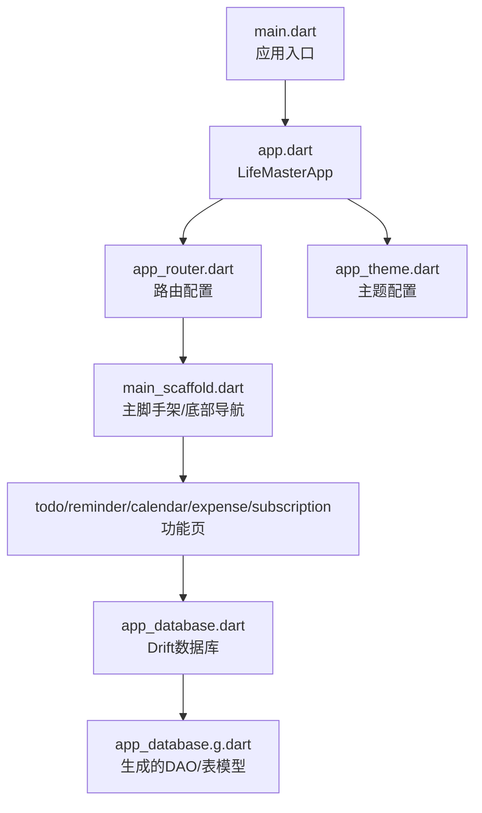

图表来源
- [main.dart:1-13](file://lib/main.dart#L1-L13)
- [app.dart:1-23](file://lib/app.dart#L1-L23)
- [app_router.dart:1-61](file://lib/core/router/app_router.dart#L1-L61)
- [main_scaffold.dart:1-72](file://lib/shared/presentation/widgets/main_scaffold.dart#L1-L72)
- [app_database.dart:1-147](file://lib/shared/data/database/app_database.dart#L1-L147)
- [app_database.g.dart:2903-2921](file://lib/shared/data/database/app_database.g.dart#L2903-L2921)

章节来源
- [main.dart:1-13](file://lib/main.dart#L1-L13)
- [app.dart:1-23](file://lib/app.dart#L1-L23)
- [app_router.dart:1-61](file://lib/core/router/app_router.dart#L1-L61)
- [main_scaffold.dart:1-72](file://lib/shared/presentation/widgets/main_scaffold.dart#L1-L72)
- [app_database.dart:1-147](file://lib/shared/data/database/app_database.dart#L1-L147)
- [app_database.g.dart:2903-2921](file://lib/shared/data/database/app_database.g.dart#L2903-L2921)

## 核心组件
- 应用入口与状态根：通过 ProviderScope 初始化全局状态，保证各功能模块可访问共享数据库与主题等资源。
- 路由与导航：GoRouter 定义五条功能路由，ShellRoute 包裹主脚手架，底部导航切换不同功能页。
- 数据层：Drift 定义五大实体表（Todos、Reminders、CalendarEvents、Expenses、Subscriptions），自动生成 DAO 与 Companion 类型，提供 CRUD 与流式查询能力。
- 状态管理：Riverpod 提供 Provider/StreamProvider/StateNotifierProvider 等，分别用于数据库实例、列表数据流与增删改操作的状态封装。
- 主题与常量：统一颜色体系与默认分类、上限等常量，保障跨模块一致性。

章节来源
- [main.dart:1-13](file://lib/main.dart#L1-L13)
- [app.dart:1-23](file://lib/app.dart#L1-L23)
- [app_router.dart:15-60](file://lib/core/router/app_router.dart#L15-L60)
- [app_theme.dart:1-78](file://lib/core/theme/app_theme.dart#L1-L78)
- [app_constants.dart:1-47](file://lib/core/constants/app_constants.dart#L1-L47)
- [app_database.dart:71-138](file://lib/shared/data/database/app_database.dart#L71-L138)
- [app_database.g.dart:2903-2921](file://lib/shared/data/database/app_database.g.dart#L2903-L2921)

## 架构总览
五大功能模块共享同一数据库实例，通过各自的 Provider 封装 CRUD 与聚合计算；底部导航统一调度；主题与常量贯穿全局。

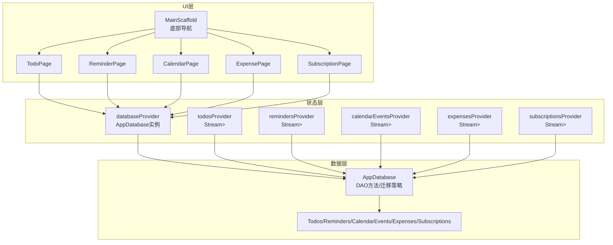

图表来源
- [main_scaffold.dart:8-71](file://lib/shared/presentation/widgets/main_scaffold.dart#L8-L71)
- [app_router.dart:15-60](file://lib/core/router/app_router.dart#L15-L60)
- [todo_provider.dart:5-14](file://lib/features/todo/presentation/providers/todo_provider.dart#L5-L14)
- [reminder_provider.dart:5-14](file://lib/features/reminder/presentation/providers/reminder_provider.dart#L5-L14)
- [calendar_provider.dart:5-14](file://lib/features/calendar/presentation/providers/calendar_provider.dart#L5-L14)
- [expense_provider.dart:5-14](file://lib/features/expense/presentation/providers/expense_provider.dart#L5-L14)
- [subscription_provider.dart:5-14](file://lib/features/subscription/presentation/providers/subscription_provider.dart#L5-L14)
- [app_database.dart:71-138](file://lib/shared/data/database/app_database.dart#L71-L138)

## 详细组件分析

### 待办事项管理（Todo）
- 设计理念：围绕“完成度”和“重要性”双维度组织任务，支持截止日期与分类，提升个人效率与优先级管理。
- 业务逻辑：
  - 新增：标题必填，可选描述、分类、截止时间、是否加星。
  - 更新：切换完成状态、修改信息、更新时间戳。
  - 删除：按 ID 删除。
  - 列表：基于 Drift 流式查询，实时响应变更。
- 用户价值：清晰的任务视图、快速标记完成、重要任务突出显示。
- 数据模型与复杂度：
  - 表结构：包含自增主键、标题、描述、分类、完成状态、重要性、截止时间、创建/更新时间。
  - 复杂度：单表 CRUD 均为 O(1)，查询按需过滤，Watch 模式下增量更新，内存与 I/O 开销低。
- 扩展建议：增加标签、优先级权重、重复任务模板、与日历事件联动提醒。

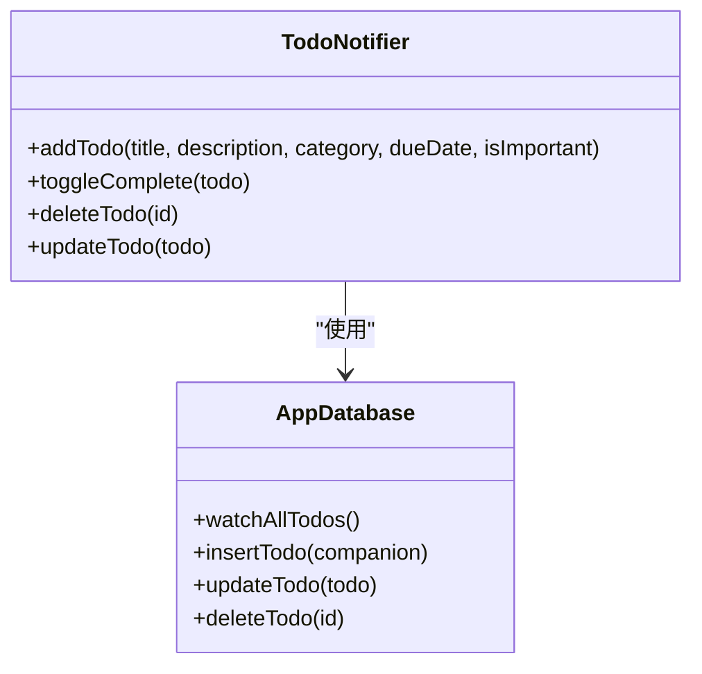

图表来源
- [todo_provider.dart:20-79](file://lib/features/todo/presentation/providers/todo_provider.dart#L20-L79)
- [app_database.dart:89-98](file://lib/shared/data/database/app_database.dart#L89-L98)

章节来源
- [todo_provider.dart:1-79](file://lib/features/todo/presentation/providers/todo_provider.dart#L1-L79)
- [app_database.dart:9-19](file://lib/shared/data/database/app_database.dart#L9-L19)

### 提醒事项系统（Reminder）
- 设计理念：基于“提醒时间 + 可选重复周期”的轻量提醒，覆盖日常事务与周期性任务。
- 业务逻辑：
  - 新增：设置提醒标题、描述、提醒时间、是否重复、重复类型。
  - 更新：切换完成状态、修改提醒参数。
  - 删除：按 ID 删除。
  - 列表：流式监听所有提醒，支持按时间排序展示。
- 用户价值：避免遗漏重要事件，重复任务自动提醒。
- 数据模型与复杂度：
  - 表结构：包含自增主键、标题、描述、提醒时间、完成状态、重复标志与类型、创建/更新时间。
  - 复杂度：同单表 CRUD，Watch 模式下高效增量渲染。
- 扩展建议：加入通知渠道、静音时段、重复规则编辑器、与日历事件同步。

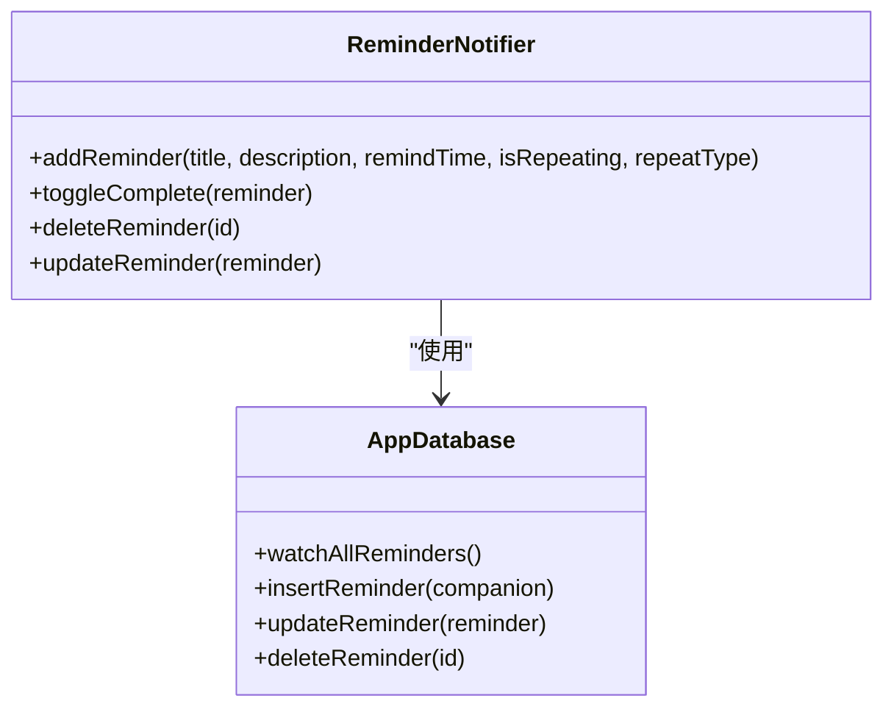

图表来源
- [reminder_provider.dart:16-75](file://lib/features/reminder/presentation/providers/reminder_provider.dart#L16-L75)
- [app_database.dart:99-107](file://lib/shared/data/database/app_database.dart#L99-L107)

章节来源
- [reminder_provider.dart:1-75](file://lib/features/reminder/presentation/providers/reminder_provider.dart#L1-L75)
- [app_database.dart:21-31](file://lib/shared/data/database/app_database.dart#L21-L31)

### 日历事件管理（Calendar）
- 设计理念：以日程为中心的时间管理，支持全天/时间段、地点与颜色标注，便于可视化排程。
- 业务逻辑：
  - 新增：标题、开始/结束时间、描述、地点、颜色、是否全天。
  - 更新：修改事件元数据与时间范围。
  - 删除：按 ID 删除。
  - 列表：流式监听所有事件，支持按日期筛选与月视图渲染。
- 用户价值：直观的日程安排、颜色区分与全天/时间段管理。
- 数据模型与复杂度：
  - 表结构：包含自增主键、标题、描述、起止时间、地点、颜色、全天标志、创建/更新时间。
  - 复杂度：同单表 CRUD，Watch 模式下事件变更即时反映。
- 扩展建议：加入重复事件、提醒联动、与系统日历同步、导出/分享。

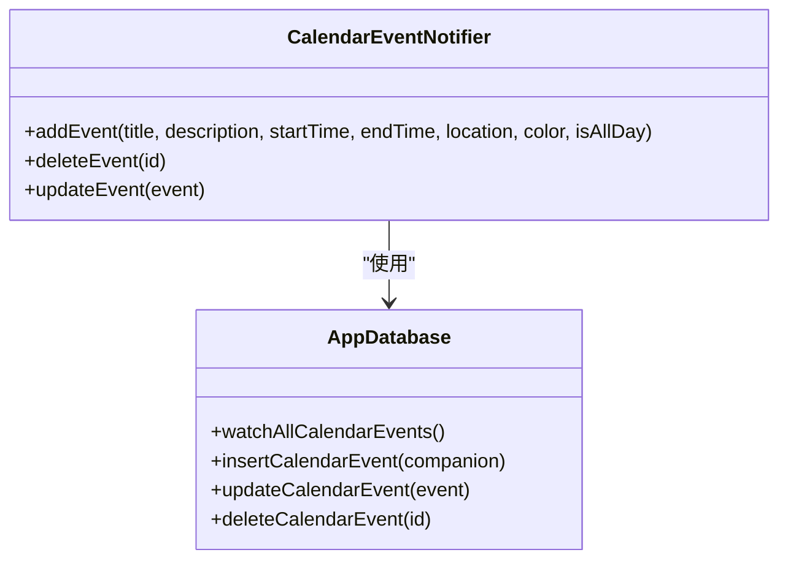

图表来源
- [calendar_provider.dart:18-70](file://lib/features/calendar/presentation/providers/calendar_provider.dart#L18-L70)
- [app_database.dart:109-117](file://lib/shared/data/database/app_database.dart#L109-L117)

章节来源
- [calendar_provider.dart:1-70](file://lib/features/calendar/presentation/providers/calendar_provider.dart#L1-L70)
- [app_database.dart:33-44](file://lib/shared/data/database/app_database.dart#L33-L44)

### 支出跟踪（Expense）
- 设计理念：以“金额 + 分类 + 日期 + 支付方式”为核心的收支记录，提供总支出与月度统计，辅助财务规划。
- 业务逻辑：
  - 新增：金额、分类、描述、日期、支付方式。
  - 更新：修改支出详情与时间戳。
  - 删除：按 ID 删除。
  - 统计：总支出 Provider 与当月支出 Provider，按条件聚合。
  - 列表：流式监听所有支出，支持分页与筛选。
- 用户价值：清晰的消费画像、月度预算控制、分类洞察。
- 数据模型与复杂度：
  - 表结构：包含自增主键、金额、分类、描述、日期、支付方式、创建/更新时间。
  - 复杂度：聚合计算 O(n)，在 Provider 中惰性求值，避免重复遍历。
- 扩展建议：加入预算阈值告警、图表可视化、导入导出、多币种支持。

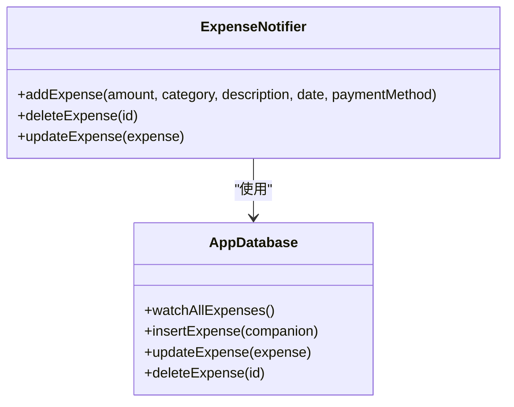

图表来源
- [expense_provider.dart:41-89](file://lib/features/expense/presentation/providers/expense_provider.dart#L41-L89)
- [app_database.dart:119-127](file://lib/shared/data/database/app_database.dart#L119-L127)

章节来源
- [expense_provider.dart:1-89](file://lib/features/expense/presentation/providers/expense_provider.dart#L1-L89)
- [app_database.dart:46-55](file://lib/shared/data/database/app_database.dart#L46-L55)

### 订阅服务管理（Subscription）
- 设计理念：对持续性支出进行集中管理，支持订阅状态切换与账单周期计算，帮助用户掌握长期支出。
- 业务逻辑：
  - 新增：名称、金额、分类、开始日期、下次账单日、账单周期、描述。
  - 更新：切换激活状态、修改订阅信息。
  - 删除：按 ID 删除。
  - 统计：仅统计激活中的订阅，计算总订阅费用。
  - 列表：流式监听所有订阅，支持筛选与排序。
- 用户价值：订阅总览、到期提醒、避免重复付费。
- 数据模型与复杂度：
  - 表结构：包含自增主键、名称、金额、分类、开始日期、下次账单日、周期、描述、激活状态、创建/更新时间。
  - 复杂度：聚合计算 O(n)，Provider 按需计算，避免全量重算。
- 扩展建议：账单日提醒、续费记录、订阅对比分析、自动识别订阅。

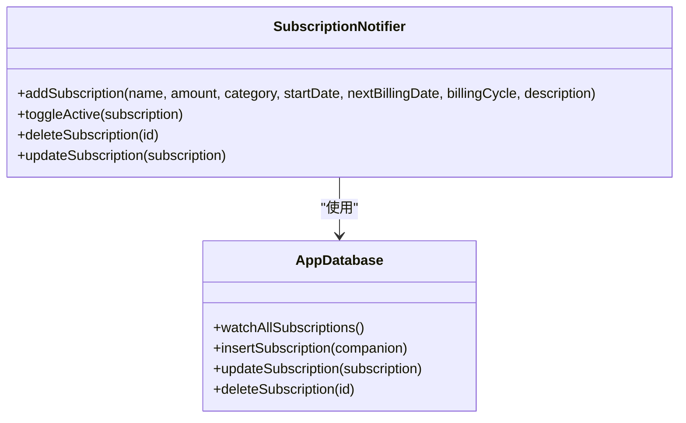

图表来源
- [subscription_provider.dart:29-92](file://lib/features/subscription/presentation/providers/subscription_provider.dart#L29-L92)
- [app_database.dart:129-137](file://lib/shared/data/database/app_database.dart#L129-L137)

章节来源
- [subscription_provider.dart:1-92](file://lib/features/subscription/presentation/providers/subscription_provider.dart#L1-L92)
- [app_database.dart:57-69](file://lib/shared/data/database/app_database.dart#L57-L69)

### 功能协作与数据共享机制
- 共享数据库：各模块通过 databaseProvider 获取 AppDatabase 实例，统一使用 Drift DAO 进行 CRUD 与 Watch 查询。
- 状态共享：todos/reminders/calendar/expenses/subscriptions 的 Provider 分别暴露 Stream<List<Entity>>，UI 层订阅后自动刷新。
- 主题与常量：AppTheme 与 AppConstants 在全局生效，保证颜色、分类与上限的一致性。
- 导航与布局：MainScaffold 统一承载底部导航与页面切换，路由通过 GoRouter 配置。

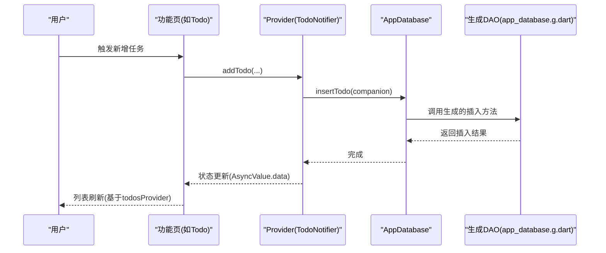

图表来源
- [todo_provider.dart:25-45](file://lib/features/todo/presentation/providers/todo_provider.dart#L25-L45)
- [app_database.dart:93](file://lib/shared/data/database/app_database.dart#L93)
- [app_database.g.dart:2903-2921](file://lib/shared/data/database/app_database.g.dart#L2903-L2921)

章节来源
- [todo_provider.dart:5-14](file://lib/features/todo/presentation/providers/todo_provider.dart#L5-L14)
- [reminder_provider.dart:5-14](file://lib/features/reminder/presentation/providers/reminder_provider.dart#L5-L14)
- [calendar_provider.dart:5-14](file://lib/features/calendar/presentation/providers/calendar_provider.dart#L5-L14)
- [expense_provider.dart:5-14](file://lib/features/expense/presentation/providers/expense_provider.dart#L5-L14)
- [subscription_provider.dart:5-14](file://lib/features/subscription/presentation/providers/subscription_provider.dart#L5-L14)
- [main_scaffold.dart:14-71](file://lib/shared/presentation/widgets/main_scaffold.dart#L14-L71)
- [app_router.dart:15-60](file://lib/core/router/app_router.dart#L15-L60)

### 使用流程图与用户交互示例
- 待办事项新增流程
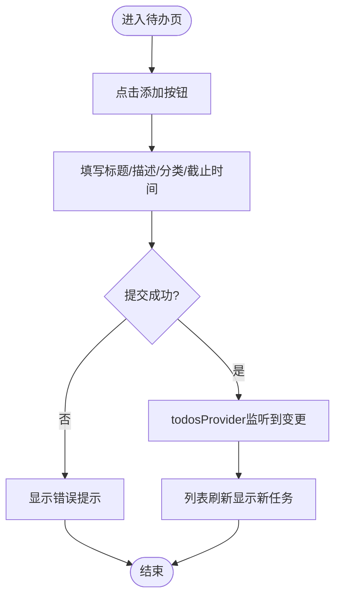

图表来源
- [todo_provider.dart:25-45](file://lib/features/todo/presentation/providers/todo_provider.dart#L25-L45)
- [app_database.dart:89-98](file://lib/shared/data/database/app_database.dart#L89-L98)

- 支出统计流程
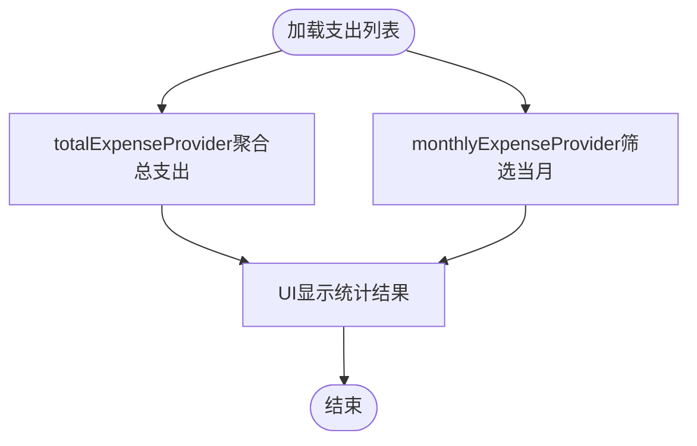

图表来源
- [expense_provider.dart:20-39](file://lib/features/expense/presentation/providers/expense_provider.dart#L20-L39)
- [app_database.dart:119-127](file://lib/shared/data/database/app_database.dart#L119-L127)

- 订阅状态切换流程
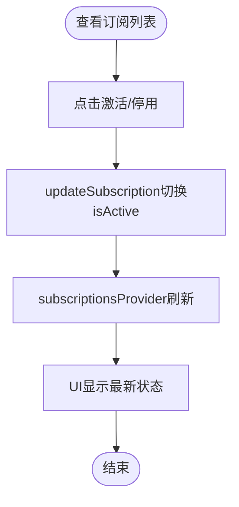

图表来源
- [subscription_provider.dart:60-69](file://lib/features/subscription/presentation/providers/subscription_provider.dart#L60-L69)
- [app_database.dart:135](file://lib/shared/data/database/app_database.dart#L135)

## 依赖分析
- 外部依赖：Flutter SDK、Riverpod、Drift、GoRouter、Material 3、本地通知、时区、UUID、共享偏好等。
- 内部耦合：各功能模块仅通过 Provider 与 AppDatabase 交互，耦合度低；主脚手架与路由为横切关注点。
- 数据依赖：所有实体表均在 AppDatabase 中声明，生成 DAO 提供统一访问接口。

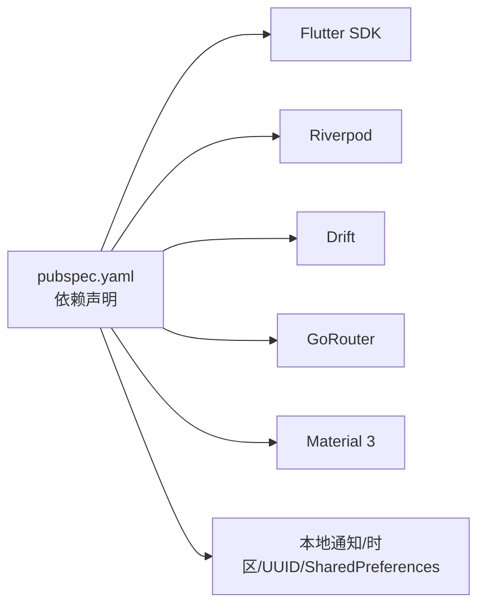

图表来源
- [pubspec.yaml:9-54](file://pubspec.yaml#L9-L54)

章节来源
- [pubspec.yaml:1-54](file://pubspec.yaml#L1-L54)
- [app_database.dart:71-138](file://lib/shared/data/database/app_database.dart#L71-L138)

## 性能考虑
- 数据库：使用 Drift 的 LazyDatabase 与后台线程打开 SQLite，减少主线程阻塞；Watch 查询按需推送变更，避免全量刷新。
- 状态：Provider 的惰性计算与异步值封装，降低 UI 重建成本；聚合计算在 Provider 中缓存结果，避免重复遍历。
- 导航：GoRouter 无过渡动画页面切换，减少动画开销；底部导航复用 Navigator，避免深层嵌套。
- 建议：对高频查询建立索引（如按日期、分类、状态），限制列表项数量与批量加载；对大列表启用虚拟化。

## 故障排除指南
- 数据库异常：检查 AppDatabase 的 schemaVersion 与迁移策略；确认生成文件已更新；验证路径权限与文件存在。
- Provider 报错：确认 databaseProvider 已正确注入 AppDatabase；检查 StreamProvider 的订阅是否在有效作用域内。
- 导航问题：确认路由路径与 ShellRoute 配置一致；检查 MainScaffold 的底部导航索引与路由映射。
- 主题不生效：检查 AppTheme 的 light/dark 主题是否正确传入 MaterialApp.router；确认颜色常量在各模块中一致使用。

章节来源
- [app_database.dart:75-87](file://lib/shared/data/database/app_database.dart#L75-L87)
- [app_database.g.dart:2903-2921](file://lib/shared/data/database/app_database.g.dart#L2903-L2921)
- [app_router.dart:15-60](file://lib/core/router/app_router.dart#L15-L60)
- [main_scaffold.dart:14-71](file://lib/shared/presentation/widgets/main_scaffold.dart#L14-L71)
- [app_theme.dart:18-76](file://lib/core/theme/app_theme.dart#L18-L76)

## 结论
LifeMaster 以 Riverpod + Drift 为核心，构建了高内聚、低耦合的五大功能模块。通过统一的主题、常量与导航，实现了良好的用户体验与可维护性。建议后续在通知联动、报表可视化、订阅识别与预算告警等方面进一步增强，以提升产品竞争力与用户粘性。

## 附录
- 默认分类与上限参考：见 AppConstants 中的默认分类列表与各模块上限定义。
- 数据模型一览：Todos、Reminders、CalendarEvents、Expenses、Subscriptions 五个表结构与字段定义见 AppDatabase。

章节来源
- [app_constants.dart:1-47](file://lib/core/constants/app_constants.dart#L1-L47)
- [app_database.dart:9-69](file://lib/shared/data/database/app_database.dart#L9-L69)