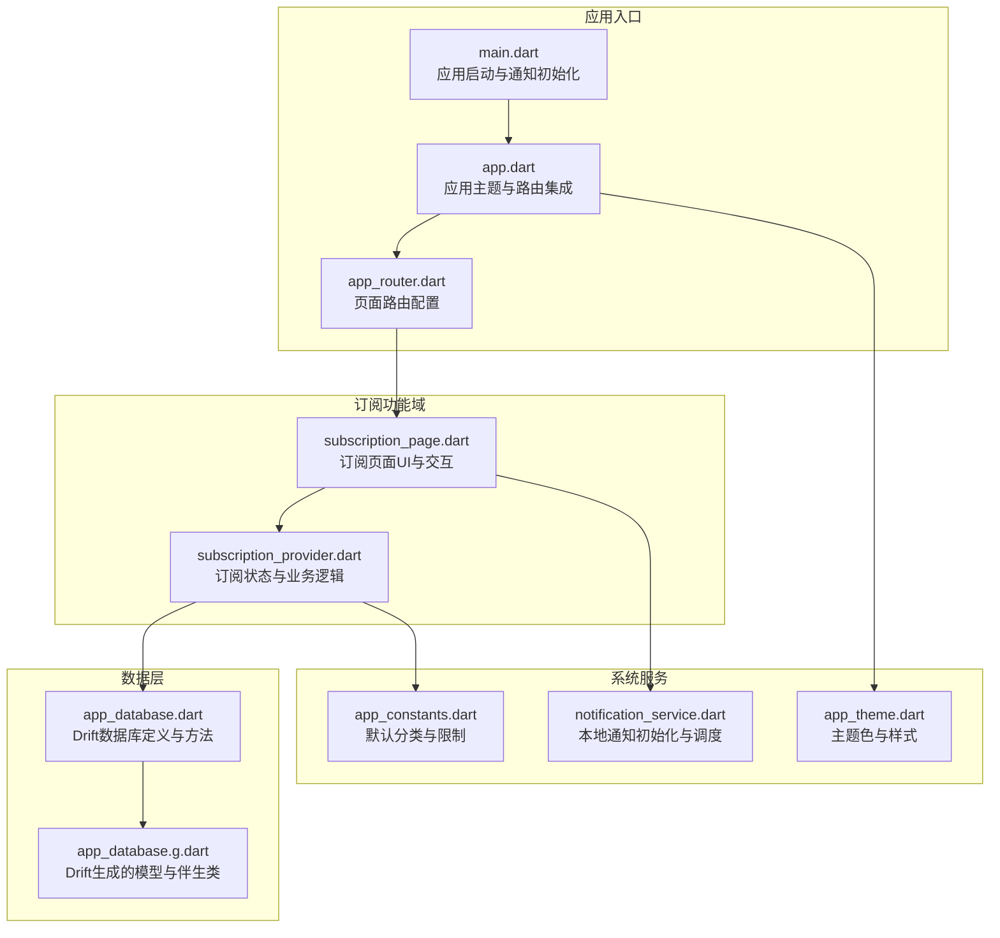
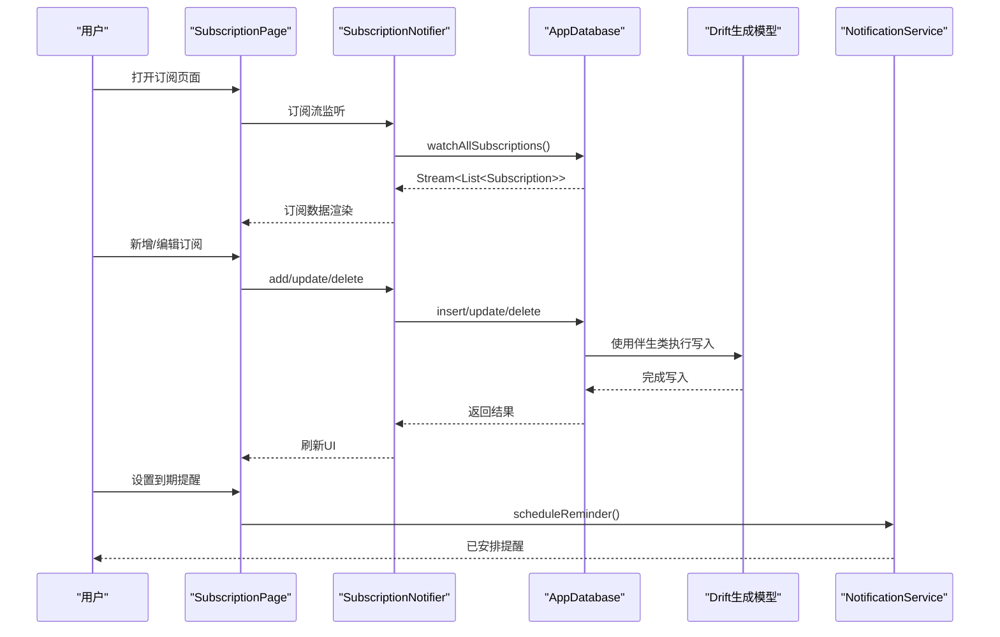
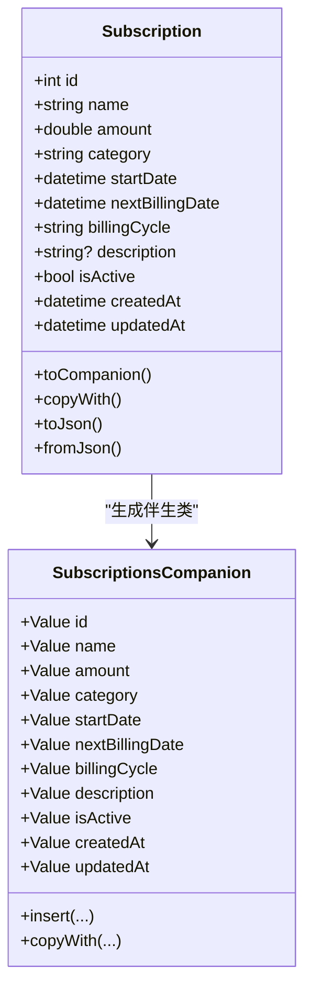
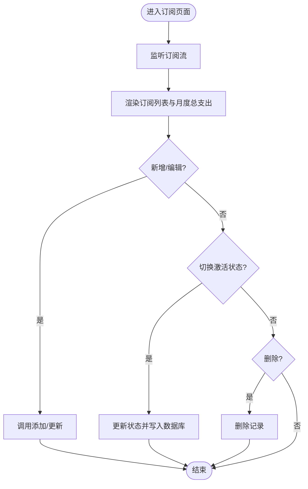
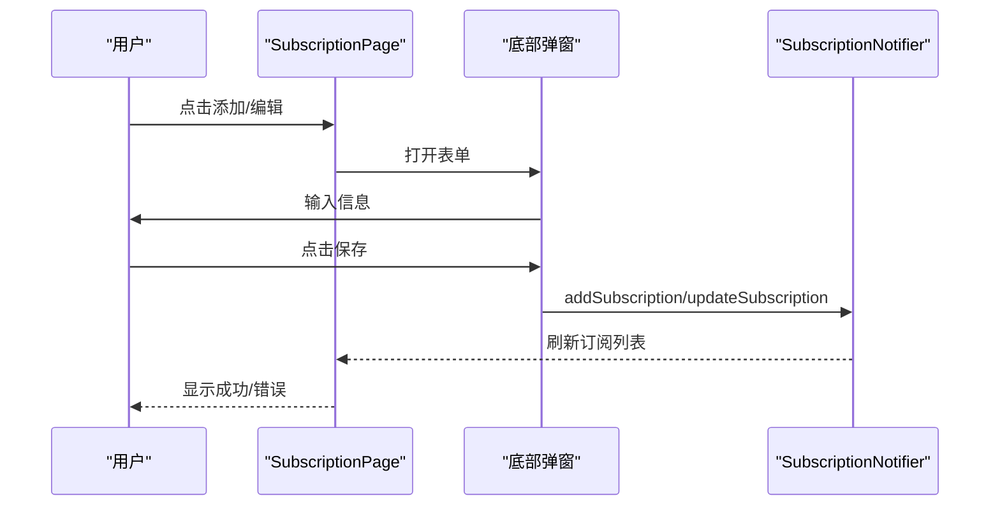
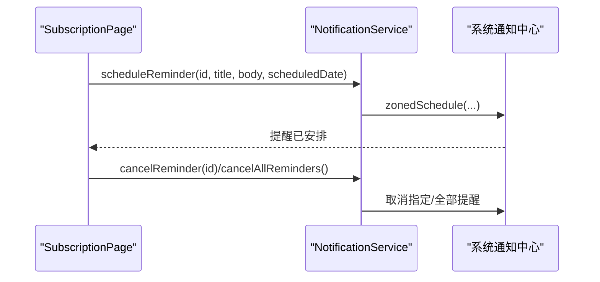
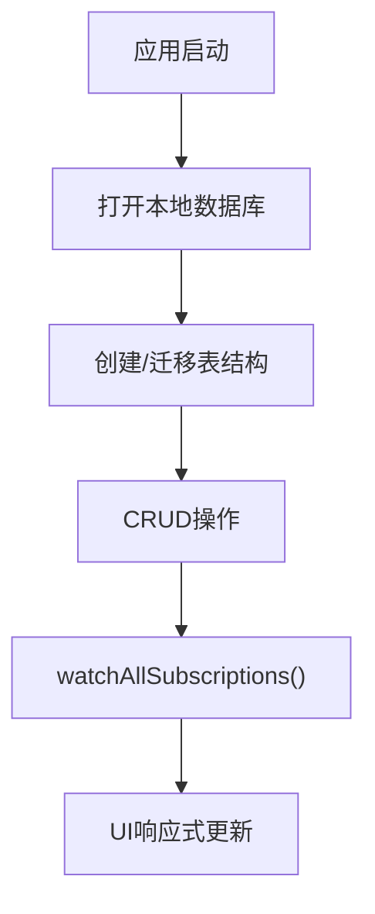
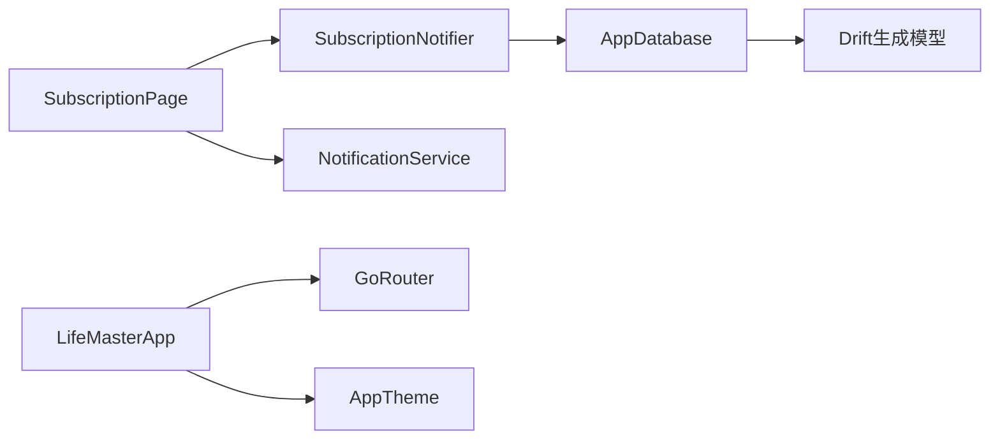

# 订阅服务管理

<cite>
**本文引用的文件**
- [main.dart](file://lib/main.dart)
- [app.dart](file://lib/app.dart)
- [app_database.dart](file://lib/shared/data/database/app_database.dart)
- [app_database.g.dart](file://lib/shared/data/database/app_database.g.dart)
- [subscription_provider.dart](file://lib/features/subscription/presentation/providers/subscription_provider.dart)
- [subscription_page.dart](file://lib/features/subscription/presentation/pages/subscription_page.dart)
- [notification_service.dart](file://lib/core/services/notification_service.dart)
- [app_constants.dart](file://lib/core/constants/app_constants.dart)
- [app_router.dart](file://lib/core/router/app_router.dart)
- [app_theme.dart](file://lib/core/theme/app_theme.dart)
</cite>

## 目录
1. [简介](#简介)
2. [项目结构](#项目结构)
3. [核心组件](#核心组件)
4. [架构总览](#架构总览)
5. [详细组件分析](#详细组件分析)
6. [依赖关系分析](#依赖关系分析)
7. [性能考虑](#性能考虑)
8. [故障排除指南](#故障排除指南)
9. [结论](#结论)
10. [附录](#附录)

## 简介
本项目是一个基于 Flutter 的订阅服务管理应用，围绕订阅的全生命周期进行管理，包括订阅创建、续费日期管理、状态切换（正常/取消）、到期提醒与通知调度、以及基础的费用统计展示。当前实现聚焦于本地数据库存储与界面交互，尚未包含自动扣费监控、第三方支付集成、导入导出与备份恢复等高级能力。

## 项目结构
项目采用按功能域分层的组织方式，核心模块包括：
- 应用入口与路由：负责应用初始化、主题配置与页面导航
- 数据层：基于 Drift 的本地数据库，定义订阅表结构及 CRUD 能力
- 订阅功能域：提供订阅列表、新增/编辑/删除、状态切换与费用统计
- 通知服务：封装本地通知的初始化与定时提醒调度
- 常量与主题：统一常量定义与视觉主题

**图表来源**
- [main.dart:1-15](file://lib/main.dart#L1-L15)
- [app.dart:1-23](file://lib/app.dart#L1-L23)
- [app_router.dart:1-61](file://lib/core/router/app_router.dart#L1-L61)
- [subscription_page.dart:1-341](file://lib/features/subscription/presentation/pages/subscription_page.dart#L1-L341)
- [subscription_provider.dart:1-92](file://lib/features/subscription/presentation/providers/subscription_provider.dart#L1-L92)
- [app_database.dart:1-147](file://lib/shared/data/database/app_database.dart#L1-L147)
- [app_database.g.dart:2552-4304](file://lib/shared/data/database/app_database.g.dart#L2552-L4304)
- [notification_service.dart:1-83](file://lib/core/services/notification_service.dart#L1-L83)
- [app_theme.dart:1-78](file://lib/core/theme/app_theme.dart#L1-L78)
- [app_constants.dart:1-47](file://lib/core/constants/app_constants.dart#L1-L47)

**章节来源**
- [main.dart:1-15](file://lib/main.dart#L1-L15)
- [app.dart:1-23](file://lib/app.dart#L1-L23)
- [app_router.dart:1-61](file://lib/core/router/app_router.dart#L1-L61)

## 核心组件
- 订阅模型与表结构：定义订阅的字段（名称、金额、分类、起始日期、下次计费日、账单周期、是否激活、时间戳）并通过 Drift 生成模型与伴生类，支持序列化/反序列化与更新补丁。
- 订阅提供者与页面：通过 Riverpod 提供订阅流与状态变更，页面负责展示月度总支出、订阅卡片、编辑/删除确认与“即将到期”标记。
- 数据库与 CRUD：提供订阅的查询、插入、更新、删除与流式监听能力，使用本地 SQLite 存储。
- 通知服务：封装本地通知初始化、定时提醒调度与取消，用于到期提醒场景。

**章节来源**
- [app_database.dart:57-69](file://lib/shared/data/database/app_database.dart#L57-L69)
- [app_database.g.dart:2552-2675](file://lib/shared/data/database/app_database.g.dart#L2552-L2675)
- [subscription_provider.dart:11-27](file://lib/features/subscription/presentation/providers/subscription_provider.dart#L11-L27)
- [subscription_page.dart:10-81](file://lib/features/subscription/presentation/pages/subscription_page.dart#L10-L81)
- [notification_service.dart:13-81](file://lib/core/services/notification_service.dart#L13-L81)

## 架构总览
应用采用“页面-提供者-数据库”的分层架构，页面通过 Riverpod 提供的状态与通知服务进行交互，数据库通过 Drift 生成的模型与伴生类进行类型安全的操作。

**图表来源**
- [subscription_page.dart:180-211](file://lib/features/subscription/presentation/pages/subscription_page.dart#L180-L211)
- [subscription_provider.dart:42-85](file://lib/features/subscription/presentation/providers/subscription_provider.dart#L42-L85)
- [app_database.dart:129-137](file://lib/shared/data/database/app_database.dart#L129-L137)
- [app_database.g.dart:2747-2842](file://lib/shared/data/database/app_database.g.dart#L2747-L2842)
- [notification_service.dart:33-71](file://lib/core/services/notification_service.dart#L33-L71)

## 详细组件分析

### 订阅模型与数据结构
- 字段设计：包含名称、金额、分类、起始日期、下次计费日、账单周期、描述、是否激活、创建与更新时间戳。
- 生成模型：通过 Drift 生成的 Subscription 与 SubscriptionsCompanion 支持 toCompanion、copyWith、toJson/fromJson 等常用操作。
- 数据库表：Subscriptions 表在数据库中以列形式存储，提供默认值与约束。

**图表来源**
- [app_database.g.dart:2552-2675](file://lib/shared/data/database/app_database.g.dart#L2552-L2675)
- [app_database.g.dart:2747-2842](file://lib/shared/data/database/app_database.g.dart#L2747-L2842)

**章节来源**
- [app_database.dart:57-69](file://lib/shared/data/database/app_database.dart#L57-L69)
- [app_database.g.dart:2552-2675](file://lib/shared/data/database/app_database.g.dart#L2552-L2675)

### 订阅提供者与状态管理
- 订阅流：通过 StreamProvider 监听数据库中的订阅列表变化，实现 UI 自动刷新。
- 总费用计算：Provider 计算所有激活订阅的金额之和，作为月度总支出展示。
- 业务操作：提供添加、更新、删除、切换激活状态等操作，均通过数据库伴生类完成类型安全的写入。

**图表来源**
- [subscription_provider.dart:11-27](file://lib/features/subscription/presentation/providers/subscription_provider.dart#L11-L27)
- [subscription_provider.dart:42-85](file://lib/features/subscription/presentation/providers/subscription_provider.dart#L42-L85)

**章节来源**
- [subscription_provider.dart:11-27](file://lib/features/subscription/presentation/providers/subscription_provider.dart#L11-L27)
- [subscription_provider.dart:29-91](file://lib/features/subscription/presentation/providers/subscription_provider.dart#L29-L91)

### 订阅页面与交互
- 页面布局：顶部显示月度总支出，下方列表展示订阅卡片；空状态提示与加载状态处理完善。
- 卡片展示：包含名称、分类、账单周期、金额、是否激活；当“下次计费日”距离当前时间小于等于7天时，显示“即将到期”标记。
- 操作面板：支持编辑、删除与开关激活；编辑对话框包含名称、金额、分类、账单周期、描述、起始日期与下次计费日选择。

**图表来源**
- [subscription_page.dart:83-221](file://lib/features/subscription/presentation/pages/subscription_page.dart#L83-L221)
- [subscription_page.dart:248-340](file://lib/features/subscription/presentation/pages/subscription_page.dart#L248-L340)
- [subscription_provider.dart:42-85](file://lib/features/subscription/presentation/providers/subscription_provider.dart#L42-L85)

**章节来源**
- [subscription_page.dart:10-81](file://lib/features/subscription/presentation/pages/subscription_page.dart#L10-L81)
- [subscription_page.dart:248-340](file://lib/features/subscription/presentation/pages/subscription_page.dart#L248-L340)

### 通知服务与到期提醒
- 初始化：首次使用时初始化本地通知插件，设置 Android/iOS 通道与权限。
- 提醒调度：根据传入的 id、标题、内容与时间，使用时区感知的时间进行定时调度。
- 取消与清空：支持按 id 取消单个提醒或清空全部提醒。

**图表来源**
- [notification_service.dart:13-81](file://lib/core/services/notification_service.dart#L13-L81)
- [subscription_page.dart:164-177](file://lib/features/subscription/presentation/pages/subscription_page.dart#L164-L177)

**章节来源**
- [notification_service.dart:13-81](file://lib/core/services/notification_service.dart#L13-L81)

### 数据库与 CRUD 能力
- 表定义：Subscriptions 表包含主键、文本/数值/布尔/时间戳列，并设置默认值与约束。
- 查询与监听：提供 getAll/watchAll 与 insert/update/delete 方法，配合 Riverpod 实现响应式 UI。
- 本地存储：使用 Drift 的 LazyDatabase 在后台线程打开本地 SQLite 文件。

**图表来源**
- [app_database.dart:71-87](file://lib/shared/data/database/app_database.dart#L71-L87)
- [app_database.dart:129-137](file://lib/shared/data/database/app_database.dart#L129-L137)
- [app_database.dart:140-146](file://lib/shared/data/database/app_database.dart#L140-L146)

**章节来源**
- [app_database.dart:57-69](file://lib/shared/data/database/app_database.dart#L57-L69)
- [app_database.dart:129-137](file://lib/shared/data/database/app_database.dart#L129-L137)

## 依赖关系分析
- 页面依赖提供者：SubscriptionPage 依赖 subscriptionsProvider 与 totalSubscriptionProvider 获取数据与计算结果。
- 提供者依赖数据库：SubscriptionNotifier 通过 AppDatabase 进行 CRUD 操作。
- 数据库依赖生成代码：AppDatabase 使用 Drift 生成的模型与伴生类保证类型安全。
- 通知服务独立：NotificationService 与页面/提供者解耦，仅在需要时初始化并调度提醒。
- 路由与主题：app_router.dart 配置页面路由，app_theme.dart 提供统一配色。

**图表来源**
- [subscription_page.dart:10-14](file://lib/features/subscription/presentation/pages/subscription_page.dart#L10-L14)
- [subscription_provider.dart:29-32](file://lib/features/subscription/presentation/providers/subscription_provider.dart#L29-L32)
- [app_database.dart:71-87](file://lib/shared/data/database/app_database.dart#L71-L87)
- [notification_service.dart:13-31](file://lib/core/services/notification_service.dart#L13-L31)
- [app_router.dart:15-60](file://lib/core/router/app_router.dart#L15-L60)
- [app_theme.dart:18-76](file://lib/core/theme/app_theme.dart#L18-L76)

**章节来源**
- [subscription_page.dart:10-14](file://lib/features/subscription/presentation/pages/subscription_page.dart#L10-L14)
- [subscription_provider.dart:29-32](file://lib/features/subscription/presentation/providers/subscription_provider.dart#L29-L32)
- [app_database.dart:71-87](file://lib/shared/data/database/app_database.dart#L71-L87)

## 性能考虑
- 数据监听：使用 watchAllSubscriptions() 返回 Stream，避免频繁轮询，降低 UI 渲染压力。
- 本地存储：SQLite 在后台线程打开，减少主线程阻塞风险。
- 类型安全：Drift 生成的模型与伴生类减少运行时错误，提升开发效率。
- 主题与路由：统一的主题与路由配置减少重复计算与资源浪费。

[本节为通用建议，无需特定文件来源]

## 故障排除指南
- 通知未触发
  - 确认 NotificationService.init() 已在应用启动时调用
  - 检查系统通知权限与时区设置
  - 验证 scheduleReminder 参数（id、标题、时间）
- 订阅数据不刷新
  - 确认 subscriptionsProvider 正确监听数据库流
  - 检查 Riverpod ProviderScope 是否正确包裹应用根节点
- 数据库异常
  - 确认数据库文件路径可写
  - 检查迁移策略与 schema 版本

**章节来源**
- [main.dart:6-14](file://lib/main.dart#L6-L14)
- [notification_service.dart:13-31](file://lib/core/services/notification_service.dart#L13-L31)
- [subscription_provider.dart:11-14](file://lib/features/subscription/presentation/providers/subscription_provider.dart#L11-L14)
- [app_database.dart:71-87](file://lib/shared/data/database/app_database.dart#L71-L87)

## 结论
本项目实现了订阅服务管理的基础能力：订阅的创建、编辑、删除、状态切换与到期提醒调度。通过 Drift 的本地数据库与 Riverpod 的响应式状态管理，提供了简洁高效的用户体验。后续可扩展的方向包括自动扣费监控、第三方支付集成、导入导出与备份恢复、以及更丰富的费用统计与预算对比功能。

[本节为总结性内容，无需特定文件来源]

## 附录

### 订阅状态管理说明
- 正常：isActive 为真，卡片显示正常颜色与字体
- 取消：isActive 为假，卡片显示灰色与删除线
- 到期提醒：当“下次计费日”距离当前时间小于等于7天时，卡片显示“即将到期”标记

**章节来源**
- [subscription_page.dart:320-313](file://lib/features/subscription/presentation/pages/subscription_page.dart#L320-L313)
- [subscription_provider.dart:60-69](file://lib/features/subscription/presentation/providers/subscription_provider.dart#L60-L69)

### 默认分类与限制
- 订阅默认分类：Streaming、Music、Gaming、Productivity、Cloud Storage、Fitness、News、Other
- 各类最大条目限制：用于控制数据规模与性能

**章节来源**
- [app_constants.dart:36-45](file://lib/core/constants/app_constants.dart#L36-L45)

### 路由与页面导航
- 路由配置：ShellRoute 包裹各功能页，初始位置为 /todo
- 订阅页面路径：/subscription

**章节来源**
- [app_router.dart:15-60](file://lib/core/router/app_router.dart#L15-L60)