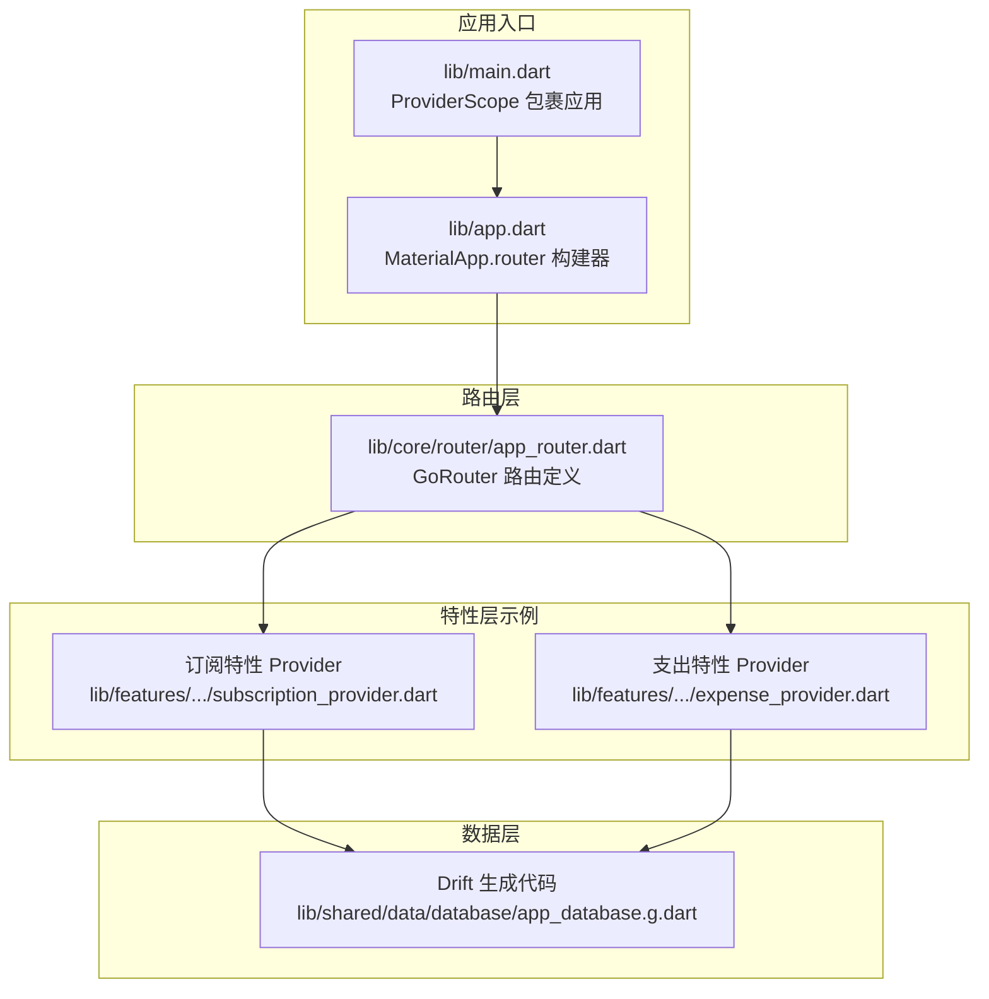
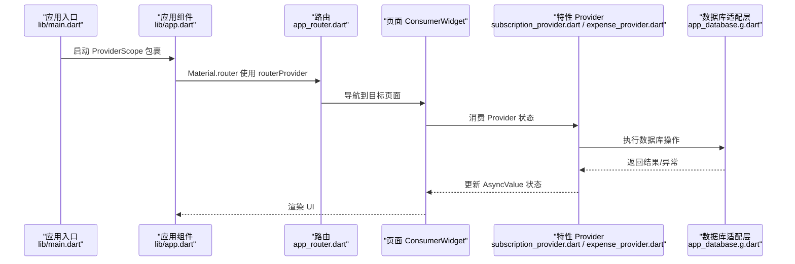
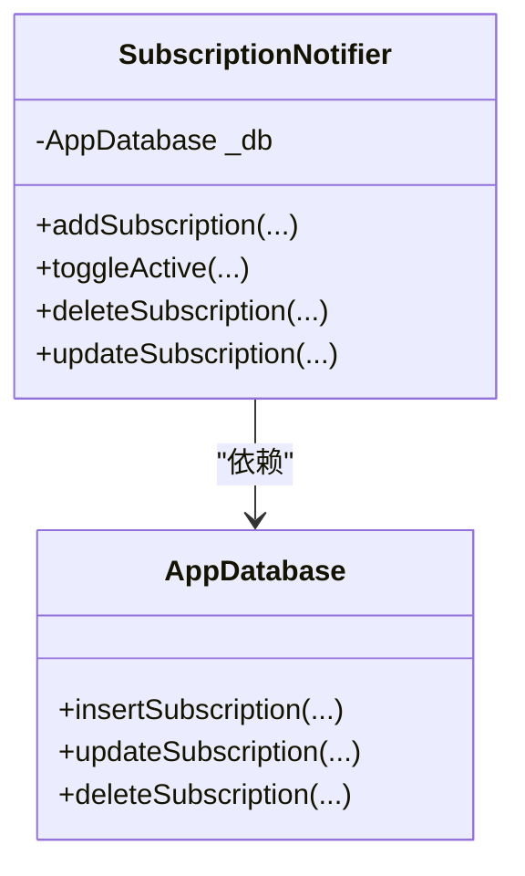
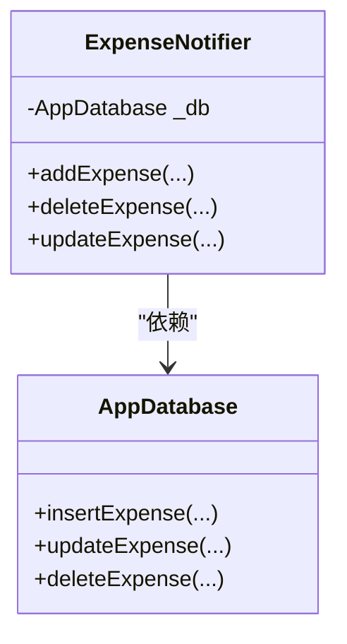
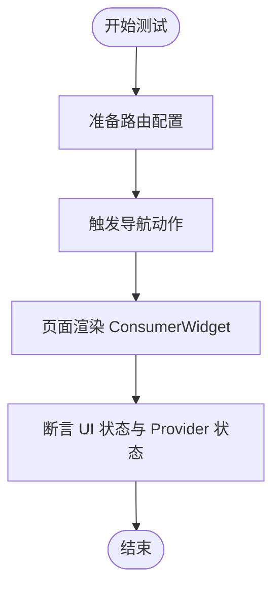
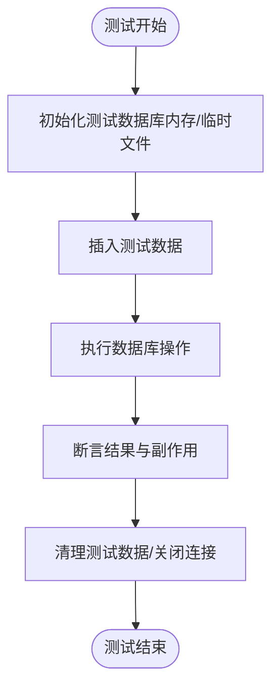
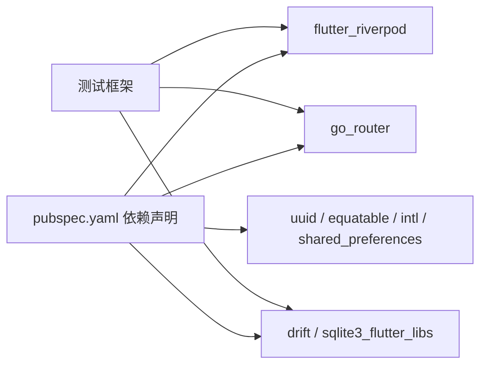

# 测试策略

<cite>
**本文引用的文件**
- [lib/main.dart](file://lib/main.dart)
- [lib/app.dart](file://lib/app.dart)
- [lib/core/router/app_router.dart](file://lib/core/router/app_router.dart)
- [lib/features/subscription/presentation/providers/subscription_provider.dart](file://lib/features/subscription/presentation/providers/subscription_provider.dart)
- [lib/features/expense/presentation/providers/expense_provider.dart](file://lib/features/expense/presentation/providers/expense_provider.dart)
- [lib/shared/data/database/app_database.g.dart](file://lib/shared/data/database/app_database.g.dart)
- [test/widget_test.dart](file://test/widget_test.dart)
- [pubspec.yaml](file://pubspec.yaml)
- [analysis_options.yaml](file://analysis_options.yaml)
</cite>

## 目录
1. [引言](#引言)
2. [项目结构](#项目结构)
3. [核心组件](#核心组件)
4. [架构总览](#架构总览)
5. [详细组件分析](#详细组件分析)
6. [依赖分析](#依赖分析)
7. [性能考虑](#性能考虑)
8. [故障排查指南](#故障排查指南)
9. [结论](#结论)
10. [附录](#附录)

## 引言
本测试策略文档面向LifeMaster应用，旨在为测试工程师与QA团队提供一套系统化的测试实施指南。内容覆盖单元测试、集成测试与UI测试的落地方法，重点阐述在Riverpod状态管理下的测试技巧与Mock策略，数据库操作的测试方法与测试数据管理，测试覆盖率与质量标准，以及自动化测试与持续集成配置建议。文档同时提供测试调试与问题排查的实用指导，帮助团队在开发周期中稳定提升软件质量。

## 项目结构
LifeMaster采用Flutter + Riverpod + Drift的现代移动端架构。应用入口通过ProviderScope包裹根组件，路由由GoRouter集中管理，页面通过ConsumerWidget消费Provider状态，数据持久化使用Drift生成的数据库适配层。

图表来源
- [lib/main.dart:1-13](file://lib/main.dart#L1-L13)
- [lib/app.dart:1-23](file://lib/app.dart#L1-L23)
- [lib/core/router/app_router.dart:15-60](file://lib/core/router/app_router.dart#L15-L60)
- [lib/features/subscription/presentation/providers/subscription_provider.dart:29-91](file://lib/features/subscription/presentation/providers/subscription_provider.dart#L29-L91)
- [lib/features/expense/presentation/providers/expense_provider.dart:41-88](file://lib/features/expense/presentation/providers/expense_provider.dart#L41-L88)
- [lib/shared/data/database/app_database.g.dart:1-200](file://lib/shared/data/database/app_database.g.dart#L1-L200)

章节来源
- [lib/main.dart:1-13](file://lib/main.dart#L1-L13)
- [lib/app.dart:1-23](file://lib/app.dart#L1-L23)
- [lib/core/router/app_router.dart:15-60](file://lib/core/router/app_router.dart#L15-L60)
- [pubspec.yaml:9-54](file://pubspec.yaml#L9-L54)

## 核心组件
- 应用入口与Provider作用域：应用启动时以ProviderScope包裹根组件，确保所有Riverpod Provider在测试与运行时均可被访问与替换。
- 路由与页面：GoRouter集中定义ShellRoute与多级页面路由，页面作为ConsumerWidget消费Provider状态，便于在测试中注入Mock Provider。
- 订阅与支出特性：各自提供StateNotifier类型的Provider，封装对Drift数据库的增删改查操作，并暴露异步状态（AsyncValue）供UI订阅。
- 数据库层：Drift生成的适配层提供类型安全的表结构与查询方法，测试中可通过替换数据库实例或使用内存数据库进行隔离测试。

章节来源
- [lib/main.dart:5-12](file://lib/main.dart#L5-L12)
- [lib/app.dart:6-22](file://lib/app.dart#L6-L22)
- [lib/core/router/app_router.dart:15-60](file://lib/core/router/app_router.dart#L15-L60)
- [lib/features/subscription/presentation/providers/subscription_provider.dart:29-91](file://lib/features/subscription/presentation/providers/subscription_provider.dart#L29-L91)
- [lib/features/expense/presentation/providers/expense_provider.dart:41-88](file://lib/features/expense/presentation/providers/expense_provider.dart#L41-L88)
- [lib/shared/data/database/app_database.g.dart:1-200](file://lib/shared/data/database/app_database.g.dart#L1-L200)

## 架构总览
下图展示了从应用入口到路由、特性Provider再到数据库的调用链路，便于理解测试中的依赖注入与Mock点位。

图表来源
- [lib/main.dart:5-12](file://lib/main.dart#L5-L12)
- [lib/app.dart:10-21](file://lib/app.dart#L10-L21)
- [lib/core/router/app_router.dart:15-60](file://lib/core/router/app_router.dart#L15-L60)
- [lib/features/subscription/presentation/providers/subscription_provider.dart:29-91](file://lib/features/subscription/presentation/providers/subscription_provider.dart#L29-L91)
- [lib/features/expense/presentation/providers/expense_provider.dart:41-88](file://lib/features/expense/presentation/providers/expense_provider.dart#L41-L88)
- [lib/shared/data/database/app_database.g.dart:1-200](file://lib/shared/data/database/app_database.g.dart#L1-L200)

## 详细组件分析

### 订阅特性 Provider 测试要点
- 状态模型：使用AsyncValue承载加载、成功、错误三种状态，便于在测试中断言不同分支。
- 数据库交互：通过AppDatabase执行插入、更新、删除等操作；测试中应替换为可控制的Mock数据库实例或内存数据库。
- 错误处理：捕获异常并回传错误状态，测试需验证错误路径与错误信息传播。
- 依赖注入：通过databaseProvider注入AppDatabase，测试时可用ProviderScope覆盖该Provider。

图表来源
- [lib/features/subscription/presentation/providers/subscription_provider.dart:29-91](file://lib/features/subscription/presentation/providers/subscription_provider.dart#L29-L91)
- [lib/shared/data/database/app_database.g.dart:1-200](file://lib/shared/data/database/app_database.g.dart#L1-L200)

章节来源
- [lib/features/subscription/presentation/providers/subscription_provider.dart:29-91](file://lib/features/subscription/presentation/providers/subscription_provider.dart#L29-L91)

### 支出特性 Provider 测试要点
- 状态模型：同样基于AsyncValue，测试需覆盖添加、删除、更新等异步操作的状态变化。
- 数据库交互：通过AppDatabase执行插入、更新、删除；测试中应隔离真实数据库。
- 错误处理：捕获异常并保持UI一致性，测试需验证错误分支。

图表来源
- [lib/features/expense/presentation/providers/expense_provider.dart:41-88](file://lib/features/expense/presentation/providers/expense_provider.dart#L41-L88)
- [lib/shared/data/database/app_database.g.dart:1-200](file://lib/shared/data/database/app_database.g.dart#L1-L200)

章节来源
- [lib/features/expense/presentation/providers/expense_provider.dart:41-88](file://lib/features/expense/presentation/providers/expense_provider.dart#L41-L88)

### 路由与页面测试要点
- 路由定义：GoRouter集中管理导航，测试中可直接注入自定义路由配置或使用内存导航。
- 页面渲染：页面为ConsumerWidget，测试时通过ProviderScope注入Mock Provider，断言UI状态与交互。
- 导航行为：验证路由跳转、参数传递与页面生命周期。

图表来源
- [lib/core/router/app_router.dart:15-60](file://lib/core/router/app_router.dart#L15-L60)
- [lib/app.dart:10-21](file://lib/app.dart#L10-L21)

章节来源
- [lib/core/router/app_router.dart:15-60](file://lib/core/router/app_router.dart#L15-L60)
- [lib/app.dart:6-22](file://lib/app.dart#L6-L22)

### 数据库操作测试方法
- Drift生成代码：app_database.g.dart提供类型安全的表与查询方法，测试中优先使用内存数据库或可重置的测试数据库。
- 测试数据管理：通过事务或批量插入构造测试集，使用唯一标识与时间戳确保可重复性；在测试结束后清理数据。
- 隔离与并发：避免跨测试共享数据库连接；必要时使用独立数据库文件或命名空间隔离。

图表来源
- [lib/shared/data/database/app_database.g.dart:1-200](file://lib/shared/data/database/app_database.g.dart#L1-L200)

章节来源
- [lib/shared/data/database/app_database.g.dart:1-200](file://lib/shared/data/database/app_database.g.dart#L1-L200)

## 依赖分析
- 状态管理：flutter_riverpod与riverpod_annotation用于Provider体系；测试中通过ProviderScope与StateNotifierProvider进行依赖替换。
- 路由：go_router负责导航；测试中可注入自定义GoRouter实例。
- 数据库：drift与sqlite3_flutter_libs提供本地存储；测试中优先使用内存数据库或可重置的SQLite文件。
- 工具库：uuid、equatable、intl、shared_preferences等辅助功能；测试中可按需Mock。

图表来源
- [pubspec.yaml:9-54](file://pubspec.yaml#L9-L54)

章节来源
- [pubspec.yaml:9-54](file://pubspec.yaml#L9-L54)

## 性能考虑
- 测试执行速度：优先使用内存数据库与轻量级Mock，避免I/O阻塞；批量插入与事务提交减少开销。
- 并发与隔离：每个测试独立数据库实例或命名空间，避免锁竞争与数据污染。
- 覆盖率与回归：针对高风险路径（错误分支、边界条件）提高测试密度；定期评估覆盖率指标并设定阈值。

## 故障排查指南
- 基础测试失败：检查测试入口与断言逻辑，参考现有基础测试用例定位问题。
- Provider状态异常：确认ProviderScope是否正确注入，StateNotifierProvider的初始状态与错误分支是否覆盖。
- 路由导航问题：验证GoRouter配置与页面Key，确保ShellRoute与子路由关系正确。
- 数据库相关错误：确认测试数据库初始化与清理流程，检查Drift生成代码的表结构与约束。

章节来源
- [test/widget_test.dart:1-8](file://test/widget_test.dart#L1-L8)

## 结论
本策略文档提供了LifeMaster应用在Riverpod与Drift架构下的完整测试实施蓝图。通过明确的单元、集成与UI测试方法，结合Provider与数据库的Mock策略，能够有效保障功能正确性与稳定性。建议在CI流水线中强制执行测试与覆盖率检查，持续优化测试质量与效率。

## 附录

### 测试覆盖率与质量标准
- 单元测试覆盖率：核心业务逻辑（Provider状态机、数据库操作）不低于80%，关键分支与异常路径100%覆盖。
- 集成测试覆盖率：路由与Provider组合场景不低于70%，数据库读写路径100%覆盖。
- UI测试覆盖率：关键用户路径（新增、编辑、删除）不低于60%，交互反馈与错误提示100%验证。
- 质量门禁：代码审查与静态分析通过后方可合并；CI失败必须修复后再合入。

### 自动化测试与持续集成配置建议
- 测试命令：使用flutter test --coverage生成覆盖率报告；结合flutter analyze与flutter format检查。
- CI流水线：在构建阶段执行测试与覆盖率统计，失败即终止；将覆盖率报告上传至制品库。
- Mock策略：统一使用ProviderScope覆盖核心Provider；数据库使用内存或临时文件；网络层使用Mock客户端。

### 测试调试与问题排查清单
- Provider调试：打印Provider状态变化，确认StateNotifier状态流转与错误回传。
- 路由调试：记录导航事件与页面Key，核对GoRouter配置与页面注册顺序。
- 数据库调试：输出SQL日志与表结构，核对Drift生成代码与实际表一致。
- UI调试：使用WidgetTester的pumpAndSettle，断言可见性与文本内容，逐步缩小问题范围。