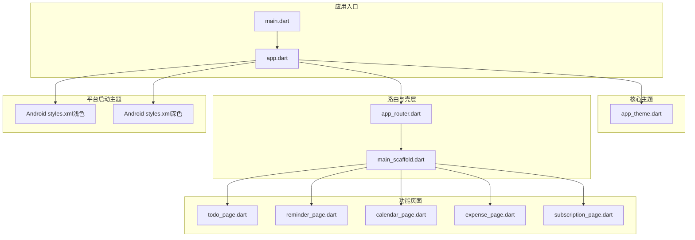
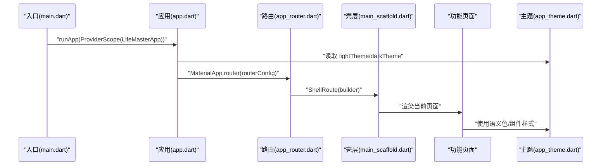
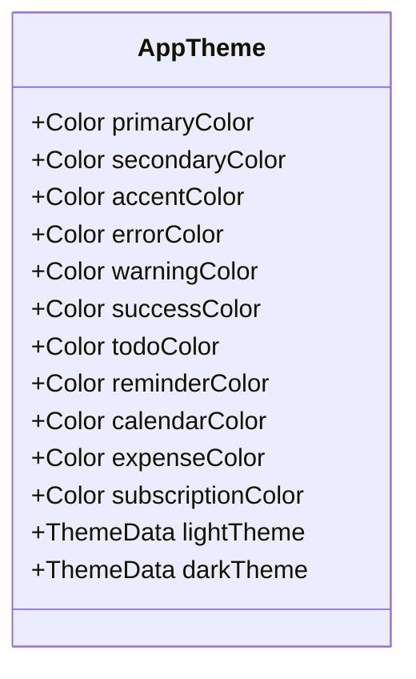
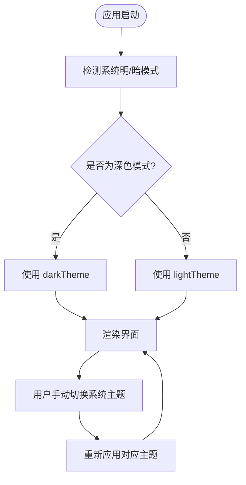
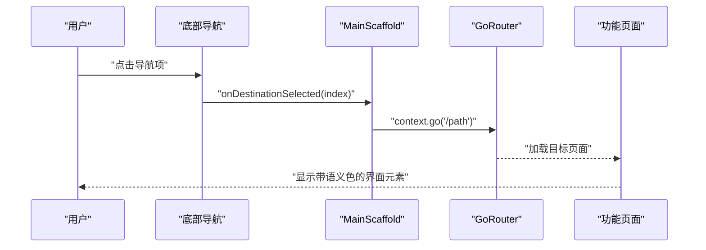
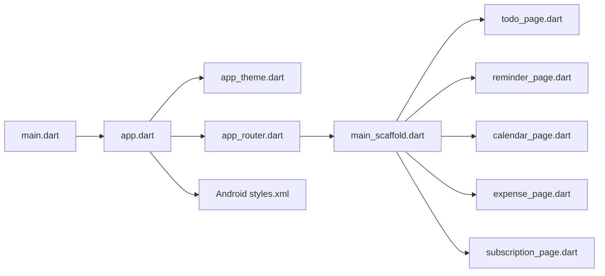

# 主题系统

<cite>
**本文引用的文件**
- [app.dart](file://lib/app.dart)
- [main.dart](file://lib/main.dart)
- [app_theme.dart](file://lib/core/theme/app_theme.dart)
- [app_router.dart](file://lib/core/router/app_router.dart)
- [main_scaffold.dart](file://lib/shared/presentation/widgets/main_scaffold.dart)
- [styles.xml（浅色）](file://android/app/src/main/res/values/styles.xml)
- [styles.xml（深色）](file://android/app/src/main/res/values-night/styles.xml)
- [todo_page.dart](file://lib/features/todo/presentation/pages/todo_page.dart)
- [reminder_page.dart](file://lib/features/reminder/presentation/pages/reminder_page.dart)
- [calendar_page.dart](file://lib/features/calendar/presentation/pages/calendar_page.dart)
- [expense_page.dart](file://lib/features/expense/presentation/pages/expense_page.dart)
- [subscription_page.dart](file://lib/features/subscription/presentation/pages/subscription_page.dart)
</cite>

## 目录
1. [简介](#简介)
2. [项目结构](#项目结构)
3. [核心组件](#核心组件)
4. [架构总览](#架构总览)
5. [详细组件分析](#详细组件分析)
6. [依赖关系分析](#依赖关系分析)
7. [性能考量](#性能考量)
8. [故障排查指南](#故障排查指南)
9. [结论](#结论)
10. [附录](#附录)

## 简介
本文件为 LifeMaster 应用的主题系统提供完整技术文档，聚焦 Material Design 3 的主题配置与颜色方案设计。内容涵盖主色调、强调色、背景色与文本颜色的定义与使用；明暗主题切换机制与系统偏好联动；颜色语义化命名规范与可访问性考虑；主题定制与品牌色彩集成方法；以及动态主题切换的实现与最佳实践。文档同时面向设计师与开发者，提供从架构到实现细节的渐进式说明与可视化图示。

## 项目结构
LifeMaster 的主题系统围绕 Flutter 应用入口与核心主题类展开，并通过路由壳层统一注入导航栏与底部导航，各功能页面按模块化组织并在需要时使用主题色进行语义化标识。

图表来源
- [main.dart:1-13](file://lib/main.dart#L1-L13)
- [app.dart:1-23](file://lib/app.dart#L1-L23)
- [app_theme.dart:1-78](file://lib/core/theme/app_theme.dart#L1-L78)
- [app_router.dart:1-61](file://lib/core/router/app_router.dart#L1-L61)
- [main_scaffold.dart:1-72](file://lib/shared/presentation/widgets/main_scaffold.dart#L1-L72)
- [styles.xml（浅色）:1-19](file://android/app/src/main/res/values/styles.xml#L1-L19)
- [styles.xml（深色）:1-19](file://android/app/src/main/res/values-night/styles.xml#L1-L19)
- [todo_page.dart:1-291](file://lib/features/todo/presentation/pages/todo_page.dart#L1-L291)
- [reminder_page.dart:1-269](file://lib/features/reminder/presentation/pages/reminder_page.dart#L1-L269)
- [calendar_page.dart:1-424](file://lib/features/calendar/presentation/pages/calendar_page.dart#L1-L424)
- [expense_page.dart:1-321](file://lib/features/expense/presentation/pages/expense_page.dart#L1-L321)
- [subscription_page.dart:1-292](file://lib/features/subscription/presentation/pages/subscription_page.dart#L1-L292)

章节来源
- [main.dart:1-13](file://lib/main.dart#L1-L13)
- [app.dart:1-23](file://lib/app.dart#L1-L23)
- [app_theme.dart:1-78](file://lib/core/theme/app_theme.dart#L1-L78)
- [app_router.dart:1-61](file://lib/core/router/app_router.dart#L1-L61)
- [main_scaffold.dart:1-72](file://lib/shared/presentation/widgets/main_scaffold.dart#L1-L72)
- [styles.xml（浅色）:1-19](file://android/app/src/main/res/values/styles.xml#L1-L19)
- [styles.xml（深色）:1-19](file://android/app/src/main/res/values-night/styles.xml#L1-L19)

## 核心组件
- 应用入口与主题注入：在应用入口中通过 ProviderScope 包裹 LifeMasterApp，并在 MaterialApp.router 中设置 lightTheme/darkTheme 与 themeMode=system，使应用随系统主题变化而切换。
- 主题定义与颜色方案：AppTheme 使用 Material 3 的 ColorScheme.fromSeed 以主色生成明/暗两套颜色方案，并统一配置 AppBar、Card、输入框与浮动按钮等部件样式。
- 路由壳层与导航：ShellRoute 包裹 MainScaffold，统一承载底部导航与页面内容，导航项图标在选中态使用对应功能的语义色。
- 平台启动主题：Android 的 values 与 values-night 中的 NormalTheme 指定窗口背景，确保启动阶段与系统主题一致。

章节来源
- [app.dart:13-20](file://lib/app.dart#L13-L20)
- [app_theme.dart:18-76](file://lib/core/theme/app_theme.dart#L18-L76)
- [app_router.dart:20-24](file://lib/core/router/app_router.dart#L20-L24)
- [main_scaffold.dart:19-68](file://lib/shared/presentation/widgets/main_scaffold.dart#L19-L68)
- [styles.xml（浅色）:15-17](file://android/app/src/main/res/values/styles.xml#L15-L17)
- [styles.xml（深色）:15-17](file://android/app/src/main/res/values-night/styles.xml#L15-L17)

## 架构总览
下图展示了主题系统在应用中的整体交互：入口负责注入主题与路由；路由壳层承载导航；各功能页面按需使用主题色与 Material 3 组件。

图表来源
- [main.dart:7-11](file://lib/main.dart#L7-L11)
- [app.dart:13-20](file://lib/app.dart#L13-L20)
- [app_router.dart:15-24](file://lib/core/router/app_router.dart#L15-L24)
- [main_scaffold.dart:17-18](file://lib/shared/presentation/widgets/main_scaffold.dart#L17-L18)
- [app_theme.dart:18-76](file://lib/core/theme/app_theme.dart#L18-L76)

## 详细组件分析

### 主题定义与颜色方案
- 主色调与强调色：主色作为种子色驱动 ColorScheme 生成明/暗两套配色；强调色用于状态与操作反馈（如错误、警告、成功）。
- 功能语义色：为 Todo、提醒、日历、支出、订阅分别定义语义色，用于选中态图标、标签徽章、数值高亮等场景。
- 组件样式：统一配置 AppBar、Card、输入框、FloatingActionButton 的圆角、阴影与形状，保证视觉一致性。

图表来源
- [app_theme.dart:3-77](file://lib/core/theme/app_theme.dart#L3-L77)

章节来源
- [app_theme.dart:3-17](file://lib/core/theme/app_theme.dart#L3-L17)
- [app_theme.dart:18-46](file://lib/core/theme/app_theme.dart#L18-L46)
- [app_theme.dart:48-76](file://lib/core/theme/app_theme.dart#L48-L76)

### 明暗主题切换机制与系统偏好
- 切换机制：通过 themeMode=system 将应用主题与系统设置联动；当系统切换明/暗模式时，Material 会自动选择 lightTheme 或 darkTheme。
- 启动阶段：Android 的 NormalTheme 在启动时设置窗口背景，避免启动期间的闪烁或颜色不一致。
- 页面适配：各功能页面未显式覆写主题，而是直接使用 Theme.of(context) 获取当前主题，从而随系统主题变化自动更新。

图表来源
- [app.dart:18](file://lib/app.dart#L18)
- [app_theme.dart:18-76](file://lib/core/theme/app_theme.dart#L18-L76)
- [styles.xml（浅色）:15-17](file://android/app/src/main/res/values/styles.xml#L15-L17)
- [styles.xml（深色）:15-17](file://android/app/src/main/res/values-night/styles.xml#L15-L17)

章节来源
- [app.dart:16-18](file://lib/app.dart#L16-L18)
- [app_theme.dart:18-76](file://lib/core/theme/app_theme.dart#L18-L76)
- [styles.xml（浅色）:15-17](file://android/app/src/main/res/values/styles.xml#L15-L17)
- [styles.xml（深色）:15-17](file://android/app/src/main/res/values-night/styles.xml#L15-L17)

### 导航与语义色使用
- 底部导航：MainScaffold 的 NavigationDestination 在选中态使用对应功能的语义色，直观传达当前页面与功能。
- 页面元素：各功能页在 FloatingActionButton、标签徽章、数值高亮等位置使用语义色，提升可读性与一致性。

图表来源
- [main_scaffold.dart:20-40](file://lib/shared/presentation/widgets/main_scaffold.dart#L20-L40)
- [app_router.dart:20-57](file://lib/core/router/app_router.dart#L20-L57)
- [todo_page.dart:71-75](file://lib/features/todo/presentation/pages/todo_page.dart#L71-L75)
- [reminder_page.dart:45-49](file://lib/features/reminder/presentation/pages/reminder_page.dart#L45-L49)
- [calendar_page.dart:67-71](file://lib/features/calendar/presentation/pages/calendar_page.dart#L67-L71)
- [expense_page.dart:79-83](file://lib/features/expense/presentation/pages/expense_page.dart#L79-L83)
- [subscription_page.dart:75-79](file://lib/features/subscription/presentation/pages/subscription_page.dart#L75-L79)

章节来源
- [main_scaffold.dart:42-67](file://lib/shared/presentation/widgets/main_scaffold.dart#L42-L67)
- [todo_page.dart:71-75](file://lib/features/todo/presentation/pages/todo_page.dart#L71-L75)
- [reminder_page.dart:45-49](file://lib/features/reminder/presentation/pages/reminder_page.dart#L45-L49)
- [calendar_page.dart:67-71](file://lib/features/calendar/presentation/pages/calendar_page.dart#L67-L71)
- [expense_page.dart:79-83](file://lib/features/expense/presentation/pages/expense_page.dart#L79-L83)
- [subscription_page.dart:75-79](file://lib/features/subscription/presentation/pages/subscription_page.dart#L75-L79)

### 颜色语义化命名规范与可访问性
- 命名规范：采用功能语义命名（如 todoColor、reminderColor），避免使用“红/绿/蓝”等无语义的颜色名称，便于维护与复用。
- 可访问性：优先使用 ColorScheme 提供的语义色，确保在明/暗主题下具备足够的对比度；对关键状态（错误、警告、成功）使用明确的语义色并在交互中保持一致的视觉反馈。
- 文本与背景：通过 Theme.of(context) 获取当前主题的文本与背景色，避免硬编码颜色值，确保随主题变化自动适配。

章节来源
- [app_theme.dart:3-17](file://lib/core/theme/app_theme.dart#L3-L17)
- [todo_page.dart:244-251](file://lib/features/todo/presentation/pages/todo_page.dart#L244-L251)
- [reminder_page.dart:238-246](file://lib/features/reminder/presentation/pages/reminder_page.dart#L238-L246)
- [calendar_page.dart:333-346](file://lib/features/calendar/presentation/pages/calendar_page.dart#L333-L346)
- [expense_page.dart:272-291](file://lib/features/expense/presentation/pages/expense_page.dart#L272-L291)
- [subscription_page.dart:209-266](file://lib/features/subscription/presentation/pages/subscription_page.dart#L209-L266)

### 动态主题切换与最佳实践
- 动态切换：通过修改 themeMode 或在运行时替换 ThemeData 实现动态主题切换；建议结合用户偏好存储与 Provider 状态管理，确保切换后全局生效。
- 最佳实践：
  - 使用 ColorScheme.seedColor 作为主色源，保证明/暗主题的一致性。
  - 对于自定义颜色，提供明/暗两套值或使用 ColorScheme 的相应角色（surface、onSurface、primary 等）。
  - 统一组件样式（圆角、阴影、边框半径）以增强品牌识别度。
  - 在启动阶段设置 Android NormalTheme，避免主题闪烁。

章节来源
- [app.dart:16-18](file://lib/app.dart#L16-L18)
- [app_theme.dart:18-76](file://lib/core/theme/app_theme.dart#L18-L76)
- [styles.xml（浅色）:15-17](file://android/app/src/main/res/values/styles.xml#L15-L17)
- [styles.xml（深色）:15-17](file://android/app/src/main/res/values-night/styles.xml#L15-L17)

## 依赖关系分析
- 入口依赖：main.dart 依赖 app.dart；app.dart 依赖 app_theme.dart 与 app_router.dart。
- 路由依赖：app_router.dart 依赖各功能页面与 main_scaffold.dart。
- 页面依赖：各功能页面依赖 app_theme.dart 的语义色与 Material 组件。
- 平台依赖：Android styles.xml 决定启动阶段窗口背景，影响主题过渡体验。

图表来源
- [main.dart:1-13](file://lib/main.dart#L1-L13)
- [app.dart:1-23](file://lib/app.dart#L1-L23)
- [app_theme.dart:1-78](file://lib/core/theme/app_theme.dart#L1-L78)
- [app_router.dart:1-61](file://lib/core/router/app_router.dart#L1-L61)
- [main_scaffold.dart:1-72](file://lib/shared/presentation/widgets/main_scaffold.dart#L1-L72)
- [todo_page.dart:1-291](file://lib/features/todo/presentation/pages/todo_page.dart#L1-L291)
- [reminder_page.dart:1-269](file://lib/features/reminder/presentation/pages/reminder_page.dart#L1-L269)
- [calendar_page.dart:1-424](file://lib/features/calendar/presentation/pages/calendar_page.dart#L1-L424)
- [expense_page.dart:1-321](file://lib/features/expense/presentation/pages/expense_page.dart#L1-L321)
- [subscription_page.dart:1-292](file://lib/features/subscription/presentation/pages/subscription_page.dart#L1-L292)

章节来源
- [main.dart:1-13](file://lib/main.dart#L1-L13)
- [app.dart:1-23](file://lib/app.dart#L1-L23)
- [app_theme.dart:1-78](file://lib/core/theme/app_theme.dart#L1-L78)
- [app_router.dart:1-61](file://lib/core/router/app_router.dart#L1-L61)
- [main_scaffold.dart:1-72](file://lib/shared/presentation/widgets/main_scaffold.dart#L1-L72)

## 性能考量
- 主题切换成本：Material 3 的 ColorScheme 由种子色生成，切换明/暗主题时仅需更新 ColorScheme，对渲染性能影响较小。
- 组件样式缓存：ThemeData 与 ColorScheme 为不可变对象，建议在应用启动时一次性构建并复用，避免重复计算。
- 启动阶段优化：Android NormalTheme 设置窗口背景，减少启动时的视觉跳变，间接提升用户体验感知性能。

## 故障排查指南
- 主题未随系统切换：检查 themeMode 是否为 system，确认 Android NormalTheme 是否正确设置。
- 颜色不一致：检查是否直接使用了硬编码颜色值，应改用 Theme.of(context) 或 AppTheme 的语义色。
- 启动闪烁：确认 Android styles.xml 的 NormalTheme 已正确配置，且与系统主题一致。

章节来源
- [app.dart:16-18](file://lib/app.dart#L16-L18)
- [styles.xml（浅色）:15-17](file://android/app/src/main/res/values/styles.xml#L15-L17)
- [styles.xml（深色）:15-17](file://android/app/src/main/res/values-night/styles.xml#L15-L17)

## 结论
LifeMaster 的主题系统基于 Material 3 的 ColorScheme 与语义化颜色，实现了与系统主题联动的明/暗模式切换，并通过统一的 AppTheme 定义与各功能页面的语义色使用，确保了良好的可访问性与品牌一致性。配合 Android 启动主题与路由壳层，整体主题体验流畅、可维护性强。后续可在用户偏好存储与动态主题切换上进一步扩展，以满足更丰富的个性化需求。

## 附录
- 设计师参考：以主色为种子，扩展明/暗两套 ColorScheme；为每个功能域定义语义色；统一圆角与阴影风格。
- 开发者参考：使用 Theme.of(context) 获取当前主题；避免硬编码颜色；在入口集中配置 ThemeData 与 themeMode；在启动阶段完善 Android NormalTheme。