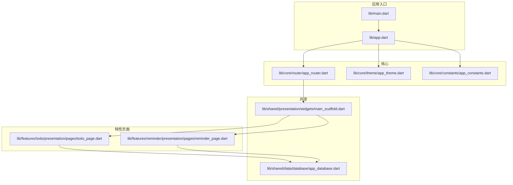
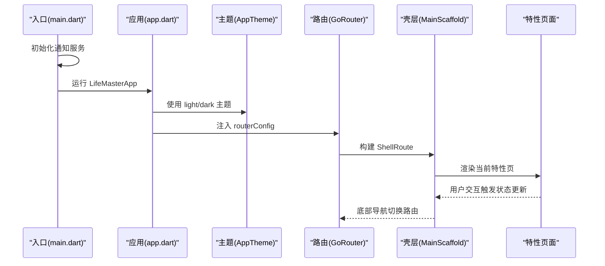
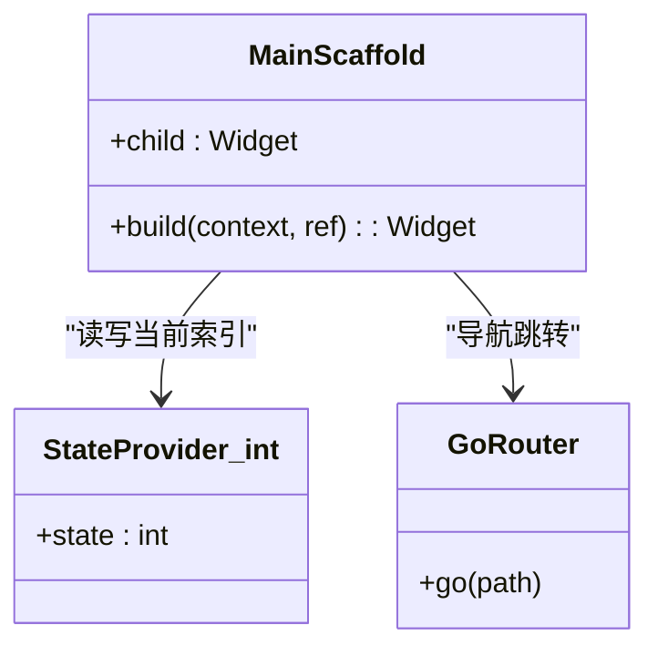
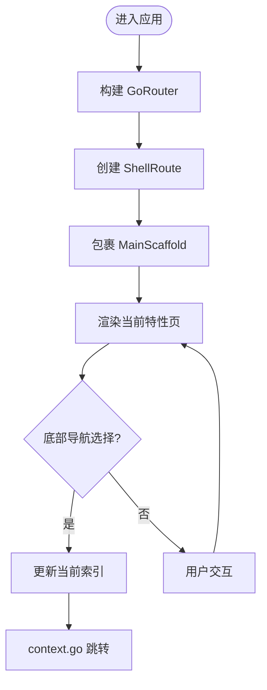
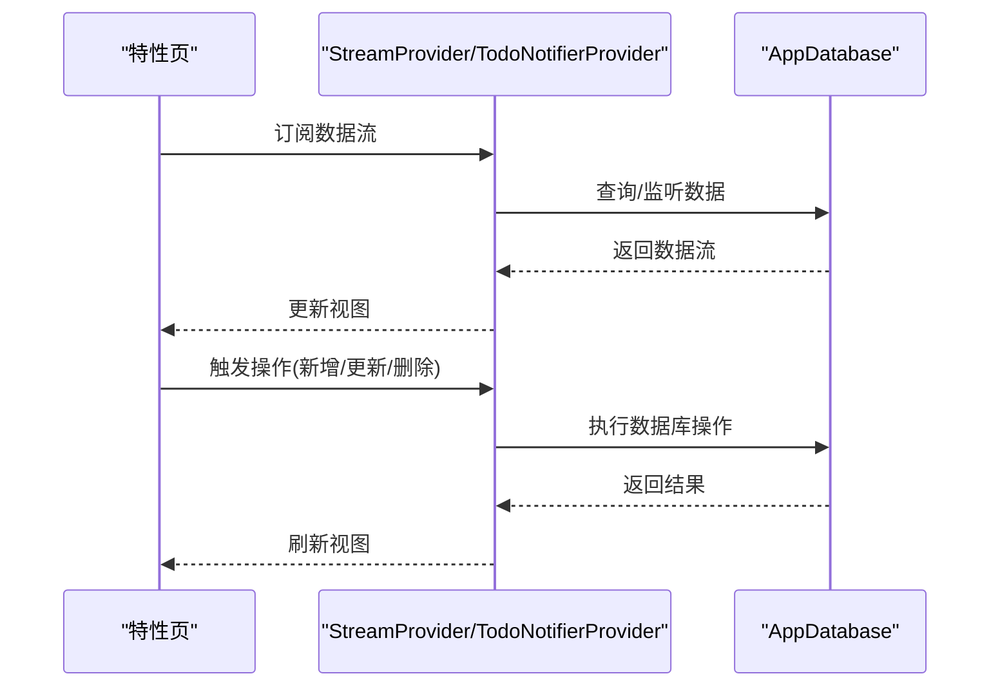
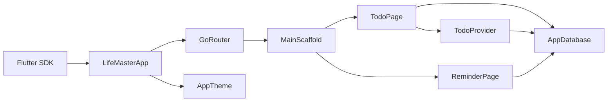

# 共享组件

<cite>
**本文引用的文件**
- [main.dart](file://lib/main.dart)
- [app.dart](file://lib/app.dart)
- [app_theme.dart](file://lib/core/theme/app_theme.dart)
- [app_router.dart](file://lib/core/router/app_router.dart)
- [main_scaffold.dart](file://lib/shared/presentation/widgets/main_scaffold.dart)
- [todo_page.dart](file://lib/features/todo/presentation/pages/todo_page.dart)
- [reminder_page.dart](file://lib/features/reminder/presentation/pages/reminder_page.dart)
- [app_database.dart](file://lib/shared/data/database/app_database.dart)
- [app_constants.dart](file://lib/core/constants/app_constants.dart)
- [todo_provider.dart](file://lib/features/todo/presentation/providers/todo_provider.dart)
</cite>

## 目录
1. [简介](#简介)
2. [项目结构](#项目结构)
3. [核心组件](#核心组件)
4. [架构总览](#架构总览)
5. [详细组件分析](#详细组件分析)
6. [依赖分析](#依赖分析)
7. [性能考虑](#性能考虑)
8. [故障排查指南](#故障排查指南)
9. [结论](#结论)
10. [附录](#附录)

## 简介
本文件面向前端开发者，系统性梳理 LifeMaster 应用中的共享组件与主布局组件，重点覆盖以下方面：
- 可复用 UI 组件的设计原则与实现模式
- 主布局组件 MainScaffold 的架构设计与使用方法
- 自定义 AppBar、按钮、输入框等通用组件的属性配置与事件处理
- 组件状态管理（Riverpod）、样式定制与响应式设计
- 组件组合模式与嵌套使用的最佳实践
- 无障碍访问特性与测试方法
- 完整的组件库使用指南

## 项目结构
项目采用按功能域分层的组织方式：核心能力在 core，特性页面在 features，共享数据与 UI 在 shared，入口在 lib。

图表来源
- [main.dart:1-15](file://lib/main.dart#L1-L15)
- [app.dart:1-23](file://lib/app.dart#L1-L23)
- [app_router.dart:1-61](file://lib/core/router/app_router.dart#L1-L61)
- [main_scaffold.dart:1-72](file://lib/shared/presentation/widgets/main_scaffold.dart#L1-L72)
- [todo_page.dart:1-291](file://lib/features/todo/presentation/pages/todo_page.dart#L1-L291)
- [reminder_page.dart:1-269](file://lib/features/reminder/presentation/pages/reminder_page.dart#L1-L269)
- [app_database.dart:1-147](file://lib/shared/data/database/app_database.dart#L1-L147)
- [app_theme.dart:1-78](file://lib/core/theme/app_theme.dart#L1-L78)
- [app_constants.dart:1-47](file://lib/core/constants/app_constants.dart#L1-L47)

章节来源
- [main.dart:1-15](file://lib/main.dart#L1-L15)
- [app.dart:1-23](file://lib/app.dart#L1-L23)
- [app_router.dart:1-61](file://lib/core/router/app_router.dart#L1-L61)

## 核心组件
本节聚焦共享组件与主布局组件，说明其职责、交互与扩展点。

- 主题系统
  - AppTheme 提供明暗两套 Material 3 主题，统一颜色体系与控件样式（AppBar、Card、InputDecoration、FloatingActionButton）。
- 路由与壳层
  - GoRouter 通过 ShellRoute 包裹 MainScaffold，使底部导航与各特性页共享同一布局。
- 主布局组件 MainScaffold
  - 作为页面壳层，承载子页面内容与底部导航；内部维护当前选中项索引并驱动路由跳转。
- 数据层
  - Drift 数据库封装了 Todo/Reminder/Calendar/Expense/Subscription 等表操作，提供查询、监听与增删改接口。
- 常量与默认值
  - AppConstants 提供默认分类、最大数量限制等常量，便于跨页面一致化配置。

章节来源
- [app_theme.dart:1-78](file://lib/core/theme/app_theme.dart#L1-L78)
- [app_router.dart:15-60](file://lib/core/router/app_router.dart#L15-L60)
- [main_scaffold.dart:6-72](file://lib/shared/presentation/widgets/main_scaffold.dart#L6-L72)
- [app_database.dart:71-147](file://lib/shared/data/database/app_database.dart#L71-L147)
- [app_constants.dart:1-47](file://lib/core/constants/app_constants.dart#L1-L47)

## 架构总览
下图展示应用启动、主题注入、路由壳层与主布局的关系，以及特性页面如何复用共享组件。

图表来源
- [main.dart:6-14](file://lib/main.dart#L6-L14)
- [app.dart:10-21](file://lib/app.dart#L10-L21)
- [app_theme.dart:18-76](file://lib/core/theme/app_theme.dart#L18-L76)
- [app_router.dart:15-60](file://lib/core/router/app_router.dart#L15-L60)
- [main_scaffold.dart:14-70](file://lib/shared/presentation/widgets/main_scaffold.dart#L14-L70)

## 详细组件分析

### 主布局组件 MainScaffold
- 设计要点
  - 使用 ConsumerWidget 读取 Riverpod 状态，保持与路由状态同步。
  - 底部导航使用 NavigationBar，图标与标签与主题色联动，选中态高亮。
  - 通过 ref.read 写入当前索引，结合 context.go 实现无动画跳转。
- 状态管理
  - 内部使用 StateProvider 记录当前选中页，避免重复渲染。
- 扩展建议
  - 如需支持更多导航项，可在 destinations 中追加，并在 switch 分支中添加对应路由。
  - 可将图标与颜色映射抽离为配置，便于统一维护。

图表来源
- [main_scaffold.dart:6-72](file://lib/shared/presentation/widgets/main_scaffold.dart#L6-L72)

章节来源
- [main_scaffold.dart:8-72](file://lib/shared/presentation/widgets/main_scaffold.dart#L8-L72)

### 路由与壳层集成
- ShellRoute 将 MainScaffold 作为页面容器，所有特性页共享同一底部导航。
- 初始位置为 /todo，路由切换不带过渡动画，保证底部导航切换的流畅性。

图表来源
- [app_router.dart:15-60](file://lib/core/router/app_router.dart#L15-L60)
- [main_scaffold.dart:14-70](file://lib/shared/presentation/widgets/main_scaffold.dart#L14-L70)

章节来源
- [app_router.dart:15-60](file://lib/core/router/app_router.dart#L15-L60)

### 通用组件与样式定制
- AppBar
  - 特性页直接使用系统 AppBar，标题文本来自页面自身。
- 按钮
  - FloatingActionButton 使用主题色突出功能入口；对话框按钮使用 FilledButton 并设置背景色。
- 输入框
  - TextField 与 DropdownButtonFormField 配合 InputDecorationTheme，统一圆角与填充风格。
- 卡片与列表
  - 使用 Card 与 ListTile 展示数据项，支持侧边图标、尾部操作按钮与完成态样式。

章节来源
- [todo_page.dart:22-77](file://lib/features/todo/presentation/pages/todo_page.dart#L22-L77)
- [reminder_page.dart:14-51](file://lib/features/reminder/presentation/pages/reminder_page.dart#L14-L51)
- [app_theme.dart:18-76](file://lib/core/theme/app_theme.dart#L18-L76)

### 组件状态管理与数据流
- Riverpod Provider
  - databaseProvider 提供数据库实例，随页面销毁自动关闭连接。
  - StreamProvider 监听数据库变更，实现响应式 UI 更新。
  - StateNotifierProvider 管理业务操作（新增、删除、更新、切换完成状态），统一错误处理。
- Todo 示例
  - todosProvider 监听 Todo 列表变化；todoNotifierProvider 执行 CRUD 操作。
- 状态模式
  - 使用 AsyncValue 表达加载/成功/错误三态，提升交互反馈质量。

图表来源
- [todo_provider.dart:11-79](file://lib/features/todo/presentation/providers/todo_provider.dart#L11-L79)
- [app_database.dart:89-138](file://lib/shared/data/database/app_database.dart#L89-L138)
- [todo_page.dart:18-77](file://lib/features/todo/presentation/pages/todo_page.dart#L18-L77)

章节来源
- [todo_provider.dart:5-79](file://lib/features/todo/presentation/providers/todo_provider.dart#L5-L79)
- [app_database.dart:71-147](file://lib/shared/data/database/app_database.dart#L71-L147)

### 响应式设计与交互细节
- 响应式布局
  - 使用 ListView.builder 与 Padding 实现滚动与内边距，适配不同屏幕尺寸。
  - BottomSheet 使用 isScrollControlled 并结合 MediaQuery.viewInsets.bottom 处理键盘遮挡。
- 日期时间选择
  - showDatePicker 与 showTimePicker 结合使用，确保时间选择一致性。
- 无障碍与可访问性
  - 使用语义化图标与文本，确保按钮与列表项具备明确的可点击区域。
  - 对话框与确认弹窗提供明确的取消/确认选项，减少误操作风险。

章节来源
- [todo_page.dart:102-208](file://lib/features/todo/presentation/pages/todo_page.dart#L102-L208)
- [reminder_page.dart:53-169](file://lib/features/reminder/presentation/pages/reminder_page.dart#L53-L169)

### 组件组合模式与嵌套使用最佳实践
- 页面级组合
  - 特性页在 Scaffold 内部组合 AppBar、Body（列表或空态）、FAB 等子组件。
- 子组件复用
  - 将卡片组件抽取为独立 ConsumerWidget，传入数据模型，便于在多个页面复用。
- 壳层复用
  - 通过 ShellRoute 与 MainScaffold 统一底部导航，避免重复代码。
- 最佳实践
  - 明确父子组件职责边界，避免在子组件中直接访问全局状态。
  - 使用 ProviderScope 与 ref.watch/ref.read 合理划分读写权限。
  - 对外暴露最小 API，内部通过状态管理与数据库解耦。

章节来源
- [todo_page.dart:211-291](file://lib/features/todo/presentation/pages/todo_page.dart#L211-L291)
- [app_router.dart:20-25](file://lib/core/router/app_router.dart#L20-L25)
- [main_scaffold.dart:17-70](file://lib/shared/presentation/widgets/main_scaffold.dart#L17-L70)

## 依赖分析
- 外部依赖
  - Flutter SDK、Material Design、Riverpod、GoRouter、Drift、intl、shared_preferences、uuid、equatable、flutter_local_notifications、timezone。
- 内部依赖
  - app.dart 依赖 app_router.dart 与 app_theme.dart；MainScaffold 依赖 go_router 与 riverpod；特性页依赖各自 provider 与数据库。

图表来源
- [app.dart:1-23](file://lib/app.dart#L1-L23)
- [app_router.dart:15-60](file://lib/core/router/app_router.dart#L15-L60)
- [main_scaffold.dart:1-72](file://lib/shared/presentation/widgets/main_scaffold.dart#L1-L72)
- [todo_page.dart:1-291](file://lib/features/todo/presentation/pages/todo_page.dart#L1-L291)
- [reminder_page.dart:1-269](file://lib/features/reminder/presentation/pages/reminder_page.dart#L1-L269)
- [app_database.dart:1-147](file://lib/shared/data/database/app_database.dart#L1-L147)
- [todo_provider.dart:1-79](file://lib/features/todo/presentation/providers/todo_provider.dart#L1-L79)

章节来源
- [pubspec.yaml:9-54](file://pubspec.yaml#L9-L54)
- [app.dart:1-23](file://lib/app.dart#L1-L23)
- [app_router.dart:15-60](file://lib/core/router/app_router.dart#L15-L60)

## 性能考虑
- 数据监听
  - 使用 StreamProvider 监听数据库变更，避免不必要的重建；对大数据集使用 ListView.builder。
- 状态更新
  - Riverpod 的异步状态与最小化刷新，减少重绘范围。
- 导航与动画
  - 路由切换使用无过渡动画，降低切换成本；底部导航仅更新索引与路由。
- I/O 优化
  - Drift 数据库在后台线程打开文件，避免阻塞主线程。

## 故障排查指南
- 路由无法跳转
  - 检查 ShellRoute 是否正确包裹 MainScaffold，以及底部导航的 onDestinationSelected 是否调用 context.go。
- 底部导航索引不同步
  - 确认 _currentIndexProvider 是否被正确读写，且与 selectedIndex 对齐。
- 数据未刷新
  - 检查 StreamProvider 是否订阅到数据库监听，以及 StateNotifier 的状态是否正确回写。
- 主题不生效
  - 确认 AppTheme.lightTheme/darkTheme 已在 LifeMasterApp 中注入，且控件样式使用了主题配置。
- 键盘遮挡 BottomSheet
  - 确保使用 isScrollControlled 并结合 viewInsets.bottom 设置内边距。

章节来源
- [app_router.dart:15-60](file://lib/core/router/app_router.dart#L15-L60)
- [main_scaffold.dart:14-70](file://lib/shared/presentation/widgets/main_scaffold.dart#L14-L70)
- [todo_provider.dart:11-79](file://lib/features/todo/presentation/providers/todo_provider.dart#L11-L79)
- [app_theme.dart:18-76](file://lib/core/theme/app_theme.dart#L18-L76)

## 结论
LifeMaster 的共享组件与主布局遵循“主题统一、状态集中、路由壳层”的设计思路，通过 Riverpod 实现响应式数据流，借助 Drift 提供本地持久化能力。MainScaffold 作为壳层组件，有效复用了底部导航与主题样式，特性页通过 Provider 与数据库解耦，形成清晰的层次结构与良好的可维护性。建议在后续迭代中进一步抽象通用卡片与对话框组件，完善无障碍与国际化支持。

## 附录
- 快速上手清单
  - 在 app.dart 中确认主题与路由已注入
  - 在 app_router.dart 中确认 ShellRoute 与 MainScaffold 已建立
  - 在特性页中使用 StreamProvider 订阅数据，使用 StateNotifier 执行业务操作
  - 使用 AppTheme 中的颜色常量统一视觉风格
- 常见问题
  - 若出现“未找到子目录: lib/shared”，请确认路径拼写与实际目录结构一致
  - 若 BottomSheet 被键盘遮挡，请检查是否正确使用 isScrollControlled 与 viewInsets.bottom