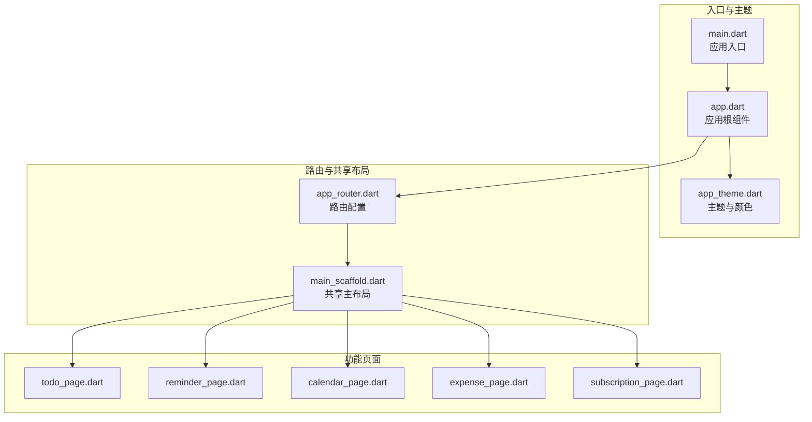
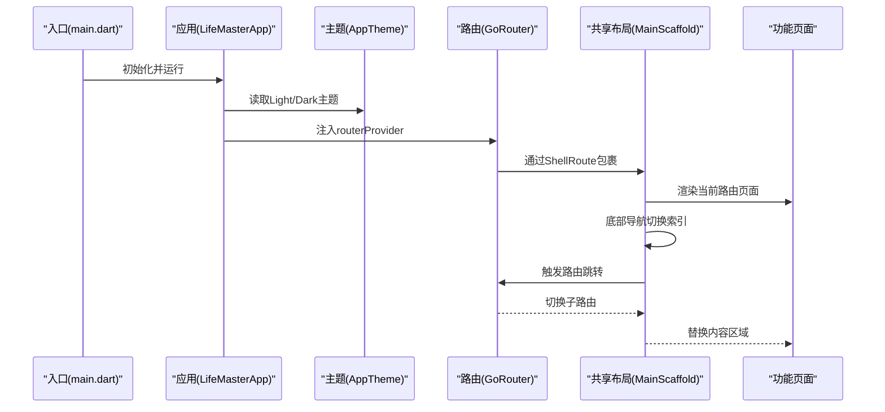
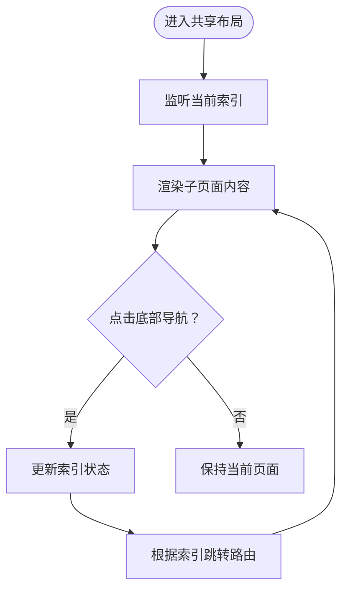
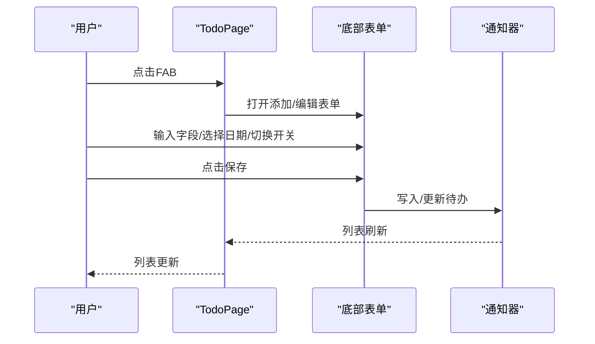
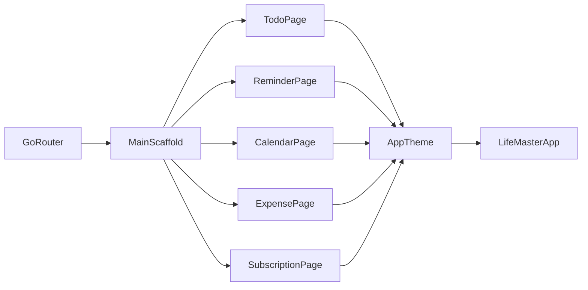

# 用户界面组件

<cite>
**本文引用的文件**
- [lib/main.dart](file://lib/main.dart)
- [lib/app.dart](file://lib/app.dart)
- [lib/core/theme/app_theme.dart](file://lib/core/theme/app_theme.dart)
- [lib/core/router/app_router.dart](file://lib/core/router/app_router.dart)
- [lib/shared/presentation/widgets/main_scaffold.dart](file://lib/shared/presentation/widgets/main_scaffold.dart)
- [lib/features/todo/presentation/pages/todo_page.dart](file://lib/features/todo/presentation/pages/todo_page.dart)
- [lib/features/reminder/presentation/pages/reminder_page.dart](file://lib/features/reminder/presentation/pages/reminder_page.dart)
- [lib/features/calendar/presentation/pages/calendar_page.dart](file://lib/features/calendar/presentation/pages/calendar_page.dart)
- [lib/features/expense/presentation/pages/expense_page.dart](file://lib/features/expense/presentation/pages/expense_page.dart)
- [lib/features/subscription/presentation/pages/subscription_page.dart](file://lib/features/subscription/presentation/pages/subscription_page.dart)
- [lib/core/constants/app_constants.dart](file://lib/core/constants/app_constants.dart)
</cite>

## 目录
1. [简介](#简介)
2. [项目结构](#项目结构)
3. [核心组件](#核心组件)
4. [架构总览](#架构总览)
5. [详细组件分析](#详细组件分析)
6. [依赖关系分析](#依赖关系分析)
7. [性能考量](#性能考量)
8. [故障排查指南](#故障排查指南)
9. [结论](#结论)
10. [附录](#附录)

## 简介
本文件为 LifeMaster 应用的用户界面组件提供完整参考手册，重点覆盖以下方面：
- Material Design 3 主题系统与颜色方案配置
- 共享组件的设计模式与复用策略
- 主布局组件、导航组件与表单组件的实现细节
- 组件属性、事件处理与状态管理最佳实践
- 响应式设计与无障碍访问指导
- 组件组合模式与自定义样式实现方法

目标读者：UI/UX 设计师与前端开发者。

## 项目结构
应用采用按特性分层的组织方式，核心 UI 由主题、路由与共享布局组成，各功能模块（待办、提醒、日历、支出、订阅）分别提供页面与数据提供者，形成清晰的职责边界与可复用性。

图表来源
- [lib/main.dart:1-13](file://lib/main.dart#L1-L13)
- [lib/app.dart:1-23](file://lib/app.dart#L1-L23)
- [lib/core/theme/app_theme.dart:1-78](file://lib/core/theme/app_theme.dart#L1-L78)
- [lib/core/router/app_router.dart:1-61](file://lib/core/router/app_router.dart#L1-L61)
- [lib/shared/presentation/widgets/main_scaffold.dart:1-72](file://lib/shared/presentation/widgets/main_scaffold.dart#L1-L72)
- [lib/features/todo/presentation/pages/todo_page.dart:1-291](file://lib/features/todo/presentation/pages/todo_page.dart#L1-L291)
- [lib/features/reminder/presentation/pages/reminder_page.dart:1-226](file://lib/features/reminder/presentation/pages/reminder_page.dart#L1-L226)
- [lib/features/calendar/presentation/pages/calendar_page.dart:1-370](file://lib/features/calendar/presentation/pages/calendar_page.dart#L1-L370)
- [lib/features/expense/presentation/pages/expense_page.dart:1-269](file://lib/features/expense/presentation/pages/expense_page.dart#L1-L269)
- [lib/features/subscription/presentation/pages/subscription_page.dart:1-292](file://lib/features/subscription/presentation/pages/subscription_page.dart#L1-L292)

章节来源
- [lib/main.dart:1-13](file://lib/main.dart#L1-L13)
- [lib/app.dart:1-23](file://lib/app.dart#L1-L23)
- [lib/core/router/app_router.dart:1-61](file://lib/core/router/app_router.dart#L1-L61)

## 核心组件
- 应用入口与根组件
  - 入口文件负责初始化运行时并挂载 Provider 作用域与根应用组件。
  - 根组件通过 Riverpod 提供路由实例，并注入 Light/Dark 主题与系统主题模式。
- 主题与颜色方案
  - 使用 Material 3 的 ColorScheme.fromSeed，以统一的 seed 颜色生成明暗两套配色。
  - 定义了多类业务色板（主色、次色、强调色、错误/警告/成功色、各功能色），用于图标、卡片、输入框等组件风格化。
- 路由与共享布局
  - 使用 go_router 的 ShellRoute 包裹共享主布局，子路由在不切换布局的情况下切换内容页。
  - 主布局包含底部导航栏，使用状态提供者维护当前选中项并驱动路由跳转。

章节来源
- [lib/main.dart:1-13](file://lib/main.dart#L1-L13)
- [lib/app.dart:6-22](file://lib/app.dart#L6-L22)
- [lib/core/theme/app_theme.dart:3-77](file://lib/core/theme/app_theme.dart#L3-L77)
- [lib/core/router/app_router.dart:15-60](file://lib/core/router/app_router.dart#L15-L60)
- [lib/shared/presentation/widgets/main_scaffold.dart:8-71](file://lib/shared/presentation/widgets/main_scaffold.dart#L8-L71)

## 架构总览
下图展示了从应用启动到页面渲染、路由切换与共享布局协作的整体流程。

图表来源
- [lib/main.dart:5-12](file://lib/main.dart#L5-L12)
- [lib/app.dart:10-20](file://lib/app.dart#L10-L20)
- [lib/core/theme/app_theme.dart:18-76](file://lib/core/theme/app_theme.dart#L18-L76)
- [lib/core/router/app_router.dart:15-60](file://lib/core/router/app_router.dart#L15-L60)
- [lib/shared/presentation/widgets/main_scaffold.dart:14-70](file://lib/shared/presentation/widgets/main_scaffold.dart#L14-L70)

## 详细组件分析

### 主题与颜色系统（Material Design 3）
- 设计要点
  - 使用 ColorScheme.fromSeed(seedColor) 自动生成明/暗两套配色，确保一致性与可扩展性。
  - 通过主题字段统一控制 AppBar、Card、输入框、FAB 等组件的形状、圆角与填充风格。
  - 业务色板集中定义于 AppTheme，便于全局替换与品牌化。
- 关键属性与行为
  - 明/暗主题：useMaterial3=true，brightness=light/dark。
  - 颜色方案：seedColor=primaryColor，派生出 primary、secondary、surface、error 等。
  - 组件风格：AppBar elevation=0；Card 圆角半径 12；输入框圆角 12；FAB 圆角 16。
- 最佳实践
  - 优先使用 Theme.of(context) 获取当前主题，避免硬编码颜色。
  - 业务色用于强调与状态标识（如重要事项、到期提醒、分类标签）。
  - 在深色模式下注意对比度与可读性，必要时调整透明度或饱和度。

章节来源
- [lib/core/theme/app_theme.dart:3-77](file://lib/core/theme/app_theme.dart#L3-L77)

### 共享主布局（MainScaffold）
- 设计模式
  - 作为 ShellRoute 的 builder，所有页面共享同一布局骨架，降低重复代码与提升一致性。
  - 使用 StateProvider 维护底部导航选中状态，结合 go_router 的 context.go 实现无刷新跳转。
- 组件职责
  - 提供统一的 body 区域承载页面内容。
  - 提供底部导航，支持五类功能入口，选中态使用业务色图标增强视觉反馈。
- 交互流程
  - 点击导航项更新索引并触发路由跳转至对应路径。
  - 通过 selectedIcon 与业务色实现选中态高亮。

图表来源
- [lib/shared/presentation/widgets/main_scaffold.dart:14-70](file://lib/shared/presentation/widgets/main_scaffold.dart#L14-L70)

章节来源
- [lib/shared/presentation/widgets/main_scaffold.dart:8-71](file://lib/shared/presentation/widgets/main_scaffold.dart#L8-L71)

### 路由系统（GoRouter + ShellRoute）
- 设计要点
  - 顶层 ShellRoute 持有共享布局，子路由均为无过渡页面，保证底部导航切换的流畅性。
  - 初始位置为“待办”页，便于用户快速开始。
- 路由映射
  - /todo → TodoPage
  - /reminder → ReminderPage
  - /calendar → CalendarPage
  - /expense → ExpensePage
  - /subscription → SubscriptionPage
- 最佳实践
  - 子路由仅传递页面内容，避免在布局层做复杂逻辑。
  - 使用 navigatorKey 管理导航栈，确保跨平台一致行为。

章节来源
- [lib/core/router/app_router.dart:15-60](file://lib/core/router/app_router.dart#L15-L60)

### 待办（Todo）页面
- 页面结构
  - 顶部工具栏 + 过滤菜单（按分类筛选）+ 列表 + 浮动添加按钮。
  - 列表项包含完成状态、标题、描述、分类、截止日期、是否重要等信息。
- 表单与交互
  - 添加/编辑弹窗（底部表单）包含标题、描述、分类、截止日期、重要标记。
  - 支持日期选择器、下拉选择、开关等控件。
  - 删除操作通过确认对话框执行。
- 状态管理
  - 使用 Riverpod 提供待办列表与分类集合。
  - 列表渲染基于 AsyncValue 的 data/loading/error 分支处理。
- 最佳实践
  - 使用 InputDecorationTheme 与圆角输入框提升一致性。
  - 对空状态显示友好提示与占位图标。

图表来源
- [lib/features/todo/presentation/pages/todo_page.dart:14-209](file://lib/features/todo/presentation/pages/todo_page.dart#L14-L209)

章节来源
- [lib/features/todo/presentation/pages/todo_page.dart:7-291](file://lib/features/todo/presentation/pages/todo_page.dart#L7-L291)

### 日历（Calendar）页面
- 页面结构
  - 顶部工具栏 + 月视图头部（上一月/下一月、周标题）+ 月日历网格 + 当日事件列表 + 浮动添加按钮。
- 交互与表单
  - 月日历网格：点击日期切换选中日期；今日与选中日期高亮。
  - 添加事件底部表单：标题、描述、地点、全天开关、起止时间选择、颜色选择。
- 状态管理
  - 选中日期与事件列表通过 Riverpod 提供。
  - 事件卡片展示颜色条、时间区间、地点等信息。
- 最佳实践
  - 使用 GridView 实现日历网格，禁用滚动以避免误触。
  - 对空状态提供占位图标与文案。

章节来源
- [lib/features/calendar/presentation/pages/calendar_page.dart:7-370](file://lib/features/calendar/presentation/pages/calendar_page.dart#L7-L370)

### 提醒（Reminder）页面
- 页面结构
  - 顶部工具栏 + 列表 + 浮动添加按钮。
  - 列表项包含完成状态、标题、描述、提醒时间、是否重复及重复类型。
- 表单与交互
  - 添加提醒底部表单：标题、描述、提醒时间、重复开关与重复类型。
  - 时间选择器联动日期与时间。
- 状态管理
  - 使用 Riverpod 提供提醒列表与重复类型选项。
  - 列表项对过期提醒进行视觉强调（颜色与删除线）。
- 最佳实践
  - 对过期状态使用红色强调，提升可读性。
  - 重复类型使用小型标签展示，保持信息密度与可读性的平衡。

章节来源
- [lib/features/reminder/presentation/pages/reminder_page.dart:7-226](file://lib/features/reminder/presentation/pages/reminder_page.dart#L7-L226)

### 支出（Expense）页面
- 页面结构
  - 顶部摘要卡（当月合计与总合计）+ 列表 + 浮动添加按钮。
  - 摘要卡使用业务色突出金额。
- 表单与交互
  - 添加支出底部表单：金额、分类、描述、付款方式、日期。
  - 金额使用数字键盘输入，日期选择器限定范围。
- 状态管理
  - 使用 Riverpod 提供支出列表、总金额与当月金额。
  - 列表项以分类标签与日期展示，支持删除。
- 最佳实践
  - 金额格式化显示，分类标签使用业务色与圆角背景。
  - 对空状态提供占位图标与文案。

章节来源
- [lib/features/expense/presentation/pages/expense_page.dart:8-269](file://lib/features/expense/presentation/pages/expense_page.dart#L8-L269)

### 订阅（Subscription）页面
- 页面结构
  - 顶部摘要卡（月度总支出）+ 列表 + 浮动添加按钮。
- 表单与交互
  - 添加订阅底部表单：名称、金额、分类、账单周期、描述、开始日期与下次账单日期。
  - 下次账单日期随开始日期自动推算。
- 状态管理
  - 使用 Riverpod 提供订阅列表与月度总支出。
  - 列表项对即将到期的订阅使用红色标签提示。
- 最佳实践
  - 使用开关控制订阅状态，删除前确认。
  - 即将到期使用轻量标签提示，避免过度干扰。

章节来源
- [lib/features/subscription/presentation/pages/subscription_page.dart:7-292](file://lib/features/subscription/presentation/pages/subscription_page.dart#L7-L292)

### 常量与默认值（AppConstants）
- 设计要点
  - 统一管理应用名称、版本、各类实体上限、默认分类等常量。
  - 默认分类覆盖待办、支出、订阅的主要场景，便于初始化与兜底。
- 使用建议
  - 在表单默认值与初始化逻辑中引用，减少硬编码。
  - 作为 UI 层的兜底数据源，确保在数据缺失时仍能正常渲染。

章节来源
- [lib/core/constants/app_constants.dart:1-47](file://lib/core/constants/app_constants.dart#L1-L47)

## 依赖关系分析
- 组件耦合
  - 应用根组件依赖主题与路由提供者；路由依赖共享布局；页面依赖各自的数据提供者与主题色板。
- 外部依赖
  - Flutter Material 3、go_router、flutter_riverpod、intl。
- 可能的循环依赖
  - 通过 Provider 与 Consumer 解耦，避免直接互相导入导致的循环。

图表来源
- [lib/app.dart:10-20](file://lib/app.dart#L10-L20)
- [lib/core/theme/app_theme.dart:18-76](file://lib/core/theme/app_theme.dart#L18-L76)
- [lib/core/router/app_router.dart:15-60](file://lib/core/router/app_router.dart#L15-L60)
- [lib/shared/presentation/widgets/main_scaffold.dart:14-70](file://lib/shared/presentation/widgets/main_scaffold.dart#L14-L70)
- [lib/features/todo/presentation/pages/todo_page.dart:4](file://lib/features/todo/presentation/pages/todo_page.dart#L4)
- [lib/features/reminder/presentation/pages/reminder_page.dart:4](file://lib/features/reminder/presentation/pages/reminder_page.dart#L4)
- [lib/features/calendar/presentation/pages/calendar_page.dart:4](file://lib/features/calendar/presentation/pages/calendar_page.dart#L4)
- [lib/features/expense/presentation/pages/expense_page.dart:4](file://lib/features/expense/presentation/pages/expense_page.dart#L4)
- [lib/features/subscription/presentation/pages/subscription_page.dart:4](file://lib/features/subscription/presentation/pages/subscription_page.dart#L4)

## 性能考量
- 列表渲染
  - 使用 ListView.builder 与合理的缓存策略，避免一次性构建大量子项。
  - 对空状态与加载状态使用占位元素，减少不必要的重绘。
- 表单弹窗
  - 使用 showModalBottomSheet 并启用 isScrollControlled，配合 StatefulBuilder 控制局部重建。
- 主题与颜色
  - 将颜色集中于 AppTheme，避免在多处重复计算或转换颜色值。
- 路由切换
  - ShellRoute 无过渡页面，减少动画成本；导航切换仅更新索引与路由，不重建布局。

## 故障排查指南
- 主题不生效
  - 确认在 LifeMasterApp 中正确传入 lightTheme/darkTheme 与 themeMode。
  - 检查 AppTheme 是否被正确导入且未被覆盖。
- 导航不跳转
  - 检查 MainScaffold 的 onDestinationSelected 与 context.go 调用是否正确。
  - 确认路由路径与 ShellRoute 的子路由配置一致。
- 列表不刷新
  - 检查 Riverpod 提供者的变更是否触发了 watch 的重建。
  - 确保 AsyncValue 的 data/loading/error 分支已覆盖。
- 表单输入异常
  - 确认 TextEditingController 的生命周期与弹窗一致，避免泄漏。
  - 数字输入需进行非空与数值解析校验。

章节来源
- [lib/app.dart:13-20](file://lib/app.dart#L13-L20)
- [lib/shared/presentation/widgets/main_scaffold.dart:21-40](file://lib/shared/presentation/widgets/main_scaffold.dart#L21-L40)
- [lib/features/todo/presentation/pages/todo_page.dart:102-208](file://lib/features/todo/presentation/pages/todo_page.dart#L102-L208)
- [lib/features/expense/presentation/pages/expense_page.dart:159-171](file://lib/features/expense/presentation/pages/expense_page.dart#L159-L171)

## 结论
LifeMaster 的 UI 组件体系以 Material Design 3 为主题基石，通过统一的颜色方案与共享布局实现高度一致的用户体验。借助 Riverpod 的状态管理与 go_router 的路由组织，页面间切换流畅、职责清晰。建议在后续迭代中持续完善无障碍能力与响应式适配，进一步提升可用性与可维护性。

## 附录

### 响应式设计与无障碍访问指导
- 响应式设计
  - 使用 MediaQuery 与 Flexible/Expanded/GridView 等布局组件适配不同屏幕尺寸。
  - 弹窗表单使用 isScrollControlled 并考虑键盘遮挡，动态调整内边距。
- 无障碍访问
  - 为图标与按钮提供语义化标签（如 selectedIcon 的颜色变化应搭配文本说明）。
  - 确保高对比度与可读性，尤其在深色模式下。
  - 对日期/时间选择器提供明确的可读文本与键盘导航支持。

### 组件组合与自定义样式
- 组合模式
  - 页面通过共享布局组合导航与内容；列表项通过卡片与 ListTile 组合多种信息。
- 自定义样式
  - 使用 Theme.of(context) 获取当前主题，再叠加业务色与圆角等局部样式。
  - 对分类标签、状态徽标等使用统一的圆角背景与字号规范，保持视觉层级清晰。