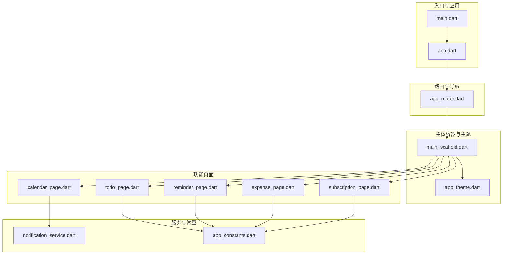
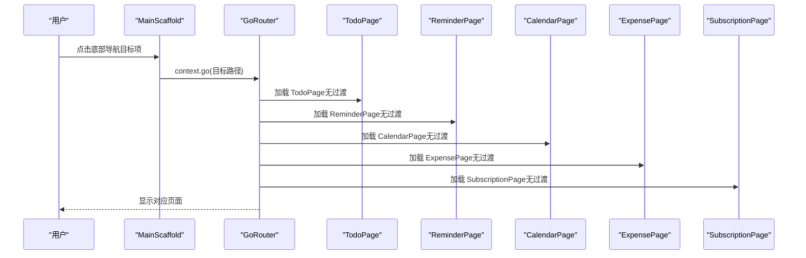
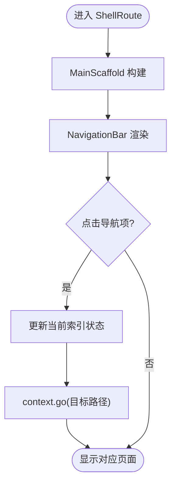
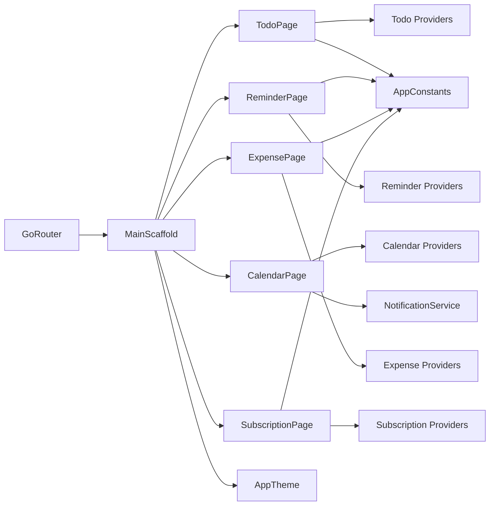

# 页面布局

<cite>
**本文引用的文件**
- [main.dart](file://lib/main.dart)
- [app.dart](file://lib/app.dart)
- [app_router.dart](file://lib/core/router/app_router.dart)
- [main_scaffold.dart](file://lib/shared/presentation/widgets/main_scaffold.dart)
- [app_theme.dart](file://lib/core/theme/app_theme.dart)
- [todo_page.dart](file://lib/features/todo/presentation/pages/todo_page.dart)
- [reminder_page.dart](file://lib/features/reminder/presentation/pages/reminder_page.dart)
- [calendar_page.dart](file://lib/features/calendar/presentation/pages/calendar_page.dart)
- [expense_page.dart](file://lib/features/expense/presentation/pages/expense_page.dart)
- [subscription_page.dart](file://lib/features/subscription/presentation/pages/subscription_page.dart)
- [notification_service.dart](file://lib/core/services/notification_service.dart)
- [app_constants.dart](file://lib/core/constants/app_constants.dart)
</cite>

## 目录
1. [简介](#简介)
2. [项目结构](#项目结构)
3. [核心组件](#核心组件)
4. [架构总览](#架构总览)
5. [详细组件分析](#详细组件分析)
6. [依赖关系分析](#依赖关系分析)
7. [性能考量](#性能考量)
8. [故障排查指南](#故障排查指南)
9. [结论](#结论)
10. [附录](#附录)

## 简介
本文件系统性阐述 LifeMaster 应用的页面布局体系，重点包括：
- ShellRoute 模式的实现与底部导航栏的设计原理
- 页面容器组件（MainScaffold）的结构与布局策略
- 各功能模块页面的布局模式与响应式适配
- 页面间导航状态管理与路由参数传递机制
- 页面加载状态、错误处理与空状态的 UI 设计模式
- 页面动画与过渡效果的实现方法
- 移动端页面布局的完整实现指南

## 项目结构
应用采用分层与按功能域划分的组织方式：
- 入口与根应用：main.dart、app.dart
- 路由与导航：core/router/app_router.dart
- 主体容器与主题：shared/presentation/widgets/main_scaffold.dart、core/theme/app_theme.dart
- 功能模块页面：features/todo、reminder、calendar、expense、subscription 下的 pages
- 服务与常量：core/services/notification_service.dart、core/constants/app_constants.dart

图表来源
- [main.dart:1-15](file://lib/main.dart#L1-L15)
- [app.dart:1-23](file://lib/app.dart#L1-L23)
- [app_router.dart:1-61](file://lib/core/router/app_router.dart#L1-L61)
- [main_scaffold.dart:1-72](file://lib/shared/presentation/widgets/main_scaffold.dart#L1-L72)
- [app_theme.dart:1-78](file://lib/core/theme/app_theme.dart#L1-L78)
- [todo_page.dart:1-291](file://lib/features/todo/presentation/pages/todo_page.dart#L1-L291)
- [reminder_page.dart:1-269](file://lib/features/reminder/presentation/pages/reminder_page.dart#L1-L269)
- [calendar_page.dart:1-424](file://lib/features/calendar/presentation/pages/calendar_page.dart#L1-L424)
- [expense_page.dart:1-347](file://lib/features/expense/presentation/pages/expense_page.dart#L1-L347)
- [subscription_page.dart:1-341](file://lib/features/subscription/presentation/pages/subscription_page.dart#L1-L341)
- [notification_service.dart:1-83](file://lib/core/services/notification_service.dart#L1-L83)
- [app_constants.dart:1-47](file://lib/core/constants/app_constants.dart#L1-L47)

章节来源
- [main.dart:1-15](file://lib/main.dart#L1-L15)
- [app.dart:1-23](file://lib/app.dart#L1-L23)
- [app_router.dart:1-61](file://lib/core/router/app_router.dart#L1-L61)
- [main_scaffold.dart:1-72](file://lib/shared/presentation/widgets/main_scaffold.dart#L1-L72)
- [app_theme.dart:1-78](file://lib/core/theme/app_theme.dart#L1-L78)

## 核心组件
- 应用入口与根应用
  - main.dart：初始化通知服务后启动 ProviderScope 包裹的 LifeMasterApp
  - app.dart：基于 Riverpod 的 ConsumerWidget，使用 GoRouter 配置 RouterConfig 并注入主题
- 路由与 ShellRoute 容器
  - app_router.dart：定义根导航键、ShellRoute 容器与五个子页面路由；子路由均使用无过渡页构建器
  - MainScaffold：作为 ShellRoute 的 builder，承载页面内容与底部导航栏
- 主题与色彩
  - app_theme.dart：定义明暗主题、主色与各模块专属色，统一卡片、输入框、悬浮按钮等组件样式

章节来源
- [main.dart:6-14](file://lib/main.dart#L6-L14)
- [app.dart:6-21](file://lib/app.dart#L6-L21)
- [app_router.dart:15-60](file://lib/core/router/app_router.dart#L15-L60)
- [main_scaffold.dart:8-71](file://lib/shared/presentation/widgets/main_scaffold.dart#L8-L71)
- [app_theme.dart:3-77](file://lib/core/theme/app_theme.dart#L3-L77)

## 架构总览
LifeMaster 的页面布局采用“ShellRoute + 主容器 + 多功能页面”的分层架构：
- ShellRoute 将所有页面包裹在 MainScaffold 中，统一提供底部导航与页面切换
- 各功能页面独立实现自身业务 UI，共享主题与容器样式
- 导航状态通过 Riverpod 的 StateProvider 维护，避免深层嵌套与状态分散

图表来源
- [app_router.dart:20-57](file://lib/core/router/app_router.dart#L20-L57)
- [main_scaffold.dart:19-68](file://lib/shared/presentation/widgets/main_scaffold.dart#L19-L68)

章节来源
- [app_router.dart:15-60](file://lib/core/router/app_router.dart#L15-L60)
- [main_scaffold.dart:8-71](file://lib/shared/presentation/widgets/main_scaffold.dart#L8-L71)

## 详细组件分析

### ShellRoute 与底部导航设计
- ShellRoute 容器
  - 使用 navigatorKey 管理 Shell 层导航栈，确保子路由切换不破坏整体容器
  - builder 返回 MainScaffold，使所有子页面共享同一底部导航与页面骨架
- 底部导航
  - NavigationBar 提供五项目的地，分别映射到各功能页面
  - 选中态图标与颜色随模块主题变化，增强视觉一致性
  - 状态通过 StateProvider 维护，onDestinationSelected 触发路由跳转

图表来源
- [app_router.dart:20-24](file://lib/core/router/app_router.dart#L20-L24)
- [main_scaffold.dart:19-40](file://lib/shared/presentation/widgets/main_scaffold.dart#L19-L40)

章节来源
- [app_router.dart:15-60](file://lib/core/router/app_router.dart#L15-L60)
- [main_scaffold.dart:8-71](file://lib/shared/presentation/widgets/main_scaffold.dart#L8-L71)

### 页面容器组件 MainScaffold
- 结构
  - 接收 child 作为页面内容，统一放置于 Scaffold.body
  - 在底部提供 NavigationBar，承载五项目的地
- 布局策略
  - 使用 StateProvider 维护当前索引，避免每次重建都重算
  - onDestinationSelected 内部直接调用 context.go 切换路由，保持轻量
- 主题与可访问性
  - 图标与标签颜色依据模块主题动态变化，提升识别度

章节来源
- [main_scaffold.dart:8-71](file://lib/shared/presentation/widgets/main_scaffold.dart#L8-L71)

### 功能页面布局模式与响应式适配
- Todo 页面
  - 顶部过滤菜单（分类筛选），支持下拉选择
  - 列表展示任务，支持完成状态切换、编辑与删除
  - 空状态与错误状态分别以图标+文案提示
  - 响应式：列表使用 Expanded 占满剩余空间，底部弹窗使用 isScrollControlled 自适应键盘
- Reminder 页面
  - 时间选择器用于设置提醒时间，支持重复类型配置
  - 列表展示提醒项，支持完成状态与过期高亮
  - 空状态与错误状态采用统一提示风格
- Calendar 页面
  - 日历网格渲染当月日期，选中与今日高亮
  - 事件列表按日筛选，支持添加/编辑/删除事件
  - 弹窗表单支持全天与时间段选择
- Expense 页面
  - 顶部双卡片汇总月度与累计支出
  - 支持搜索框过滤，列表按时间倒序
  - 弹窗表单支持金额、类别、支付方式与日期选择
- Subscription 页面
  - 顶部卡片展示月度总支出
  - 列表展示订阅项，支持启用/停用与到期预警
  - 弹窗表单支持周期与起始日期联动计算下次账单

章节来源
- [todo_page.dart:14-77](file://lib/features/todo/presentation/pages/todo_page.dart#L14-L77)
- [reminder_page.dart:11-51](file://lib/features/reminder/presentation/pages/reminder_page.dart#L11-L51)
- [calendar_page.dart:11-73](file://lib/features/calendar/presentation/pages/calendar_page.dart#L11-L73)
- [expense_page.dart:12-111](file://lib/features/expense/presentation/pages/expense_page.dart#L12-L111)
- [subscription_page.dart:10-81](file://lib/features/subscription/presentation/pages/subscription_page.dart#L10-L81)

### 页面间导航状态管理与路由参数传递
- 导航状态
  - 通过 StateProvider 维护当前底部导航索引，避免跨页面状态丢失
- 路由参数
  - 当前实现使用路径切换，未见显式查询参数或路径参数传递逻辑
  - 若需传参，可在现有基础上扩展 GoRoute 的 extra 或自定义 pageBuilder 参数传递

章节来源
- [main_scaffold.dart:6-22](file://lib/shared/presentation/widgets/main_scaffold.dart#L6-L22)
- [app_router.dart:26-57](file://lib/core/router/app_router.dart#L26-L57)

### 页面加载状态、错误处理与空状态 UI 模式
- 加载状态
  - 使用 Center + CircularProgressIndicator 统一提示
- 错误状态
  - 使用 Center + Text 显示错误信息
- 空状态
  - 统一采用居中图标+灰色文案提示，保持一致的视觉反馈
- 表单交互
  - 使用 showModalBottomSheet 承载复杂表单，结合 isScrollControlled 与键盘 inset 适配

章节来源
- [todo_page.dart:40-70](file://lib/features/todo/presentation/pages/todo_page.dart#L40-L70)
- [reminder_page.dart:18-44](file://lib/features/reminder/presentation/pages/reminder_page.dart#L18-L44)
- [calendar_page.dart:31-63](file://lib/features/calendar/presentation/pages/calendar_page.dart#L31-L63)
- [expense_page.dart:72-101](file://lib/features/expense/presentation/pages/expense_page.dart#L72-L101)
- [subscription_page.dart:45-71](file://lib/features/subscription/presentation/pages/subscription_page.dart#L45-L71)

### 页面动画与过渡效果实现方法
- 当前实现
  - 子路由使用 NoTransitionPage，页面切换无过渡动画
- 可选方案
  - 在 GoRoute.pageBuilder 中使用自定义 PageTransition 或 Hero 动画
  - 对于复杂场景，可引入 AnimatedSwitcher 或自定义PageRouteBuilder 实现淡入/滑动等效果
- 注意事项
  - 过渡动画会增加帧率压力，建议仅对关键页面启用
  - 保持动画时长与系统手势一致，避免割裂体验

章节来源
- [app_router.dart:28-54](file://lib/core/router/app_router.dart#L28-L54)

### 移动端页面布局实现指南
- 布局基线
  - 使用 Scaffold + Column/ListView/GridView 组合，保证滚动区域明确
  - 顶部工具栏使用 AppBar，右侧动作区放置操作按钮
- 交互细节
  - 使用 showModalBottomSheet 承载复杂表单，注意处理键盘遮挡与 inset
  - 列表项使用 Card + ListTile，配合图标与徽标突出关键信息
- 主题与一致性
  - 统一使用 AppTheme 中的颜色与圆角，确保各模块风格一致
- 性能优化
  - 列表使用 ListView.builder，避免一次性渲染大量节点
  - 使用 AsyncValue 的 when 分支渲染，减少不必要的重建

章节来源
- [app_theme.dart:18-76](file://lib/core/theme/app_theme.dart#L18-L76)
- [todo_page.dart:102-208](file://lib/features/todo/presentation/pages/todo_page.dart#L102-L208)
- [reminder_page.dart:53-169](file://lib/features/reminder/presentation/pages/reminder_page.dart#L53-L169)
- [calendar_page.dart:75-235](file://lib/features/calendar/presentation/pages/calendar_page.dart#L75-L235)
- [expense_page.dart:113-253](file://lib/features/expense/presentation/pages/expense_page.dart#L113-L253)
- [subscription_page.dart:83-245](file://lib/features/subscription/presentation/pages/subscription_page.dart#L83-L245)

## 依赖关系分析
- 组件耦合
  - MainScaffold 依赖 GoRouter 的 context.go 进行导航，耦合度低
  - 各功能页面与容器解耦，通过路由与 Provider 管理状态
- 外部依赖
  - go_router：路由与 ShellRoute
  - flutter_riverpod：状态管理（Provider/StateProvider）
  - intl：日期格式化
  - fl_chart（Expense 页面）：图表展示
- 循环依赖
  - 未发现循环导入；路由与页面通过接口式依赖连接

图表来源
- [app_router.dart:15-60](file://lib/core/router/app_router.dart#L15-L60)
- [main_scaffold.dart:1-72](file://lib/shared/presentation/widgets/main_scaffold.dart#L1-L72)
- [todo_page.dart:1-6](file://lib/features/todo/presentation/pages/todo_page.dart#L1-L6)
- [reminder_page.dart:1-6](file://lib/features/reminder/presentation/pages/reminder_page.dart#L1-L6)
- [calendar_page.dart:1-6](file://lib/features/calendar/presentation/pages/calendar_page.dart#L1-L6)
- [expense_page.dart:1-8](file://lib/features/expense/presentation/pages/expense_page.dart#L1-L8)
- [subscription_page.dart:1-6](file://lib/features/subscription/presentation/pages/subscription_page.dart#L1-L6)
- [app_theme.dart:1-78](file://lib/core/theme/app_theme.dart#L1-L78)
- [notification_service.dart:1-83](file://lib/core/services/notification_service.dart#L1-L83)
- [app_constants.dart:1-47](file://lib/core/constants/app_constants.dart#L1-L47)

章节来源
- [app_router.dart:15-60](file://lib/core/router/app_router.dart#L15-L60)
- [main_scaffold.dart:1-72](file://lib/shared/presentation/widgets/main_scaffold.dart#L1-L72)

## 性能考量
- 列表渲染
  - 使用 ListView.builder 与 AsyncValue.when 分支，避免全量重建
- 主题与资源
  - 统一主题减少样式计算开销；图标与颜色来自主题，利于缓存
- 动画与过渡
  - 当前无过渡动画，降低渲染压力；如需动画，建议限制在关键页面
- 键盘与弹窗
  - showModalBottomSheet 配合 viewInsets.bottom，避免布局抖动

## 故障排查指南
- 页面无法切换
  - 检查 ShellRoute.builder 是否返回 MainScaffold
  - 确认 NavigationBar.onDestinationSelected 中的路径与路由定义一致
- 空白页或布局错位
  - 确保子路由使用 NoTransitionPage，避免自定义 PageTransition 导致的布局异常
  - 检查页面是否正确使用 Expanded/ListView 等占满空间
- 错误状态未显示
  - 确认 AsyncValue 的 error 分支已正确处理并返回文本
- 键盘遮挡弹窗
  - 确保 showModalBottomSheet 设置 isScrollControlled，并使用 MediaQuery.of(context).viewInsets.bottom
- 提醒通知未生效
  - 检查 NotificationService.init 是否在应用启动时调用
  - 确认时区初始化与调度模式配置

章节来源
- [app_router.dart:20-57](file://lib/core/router/app_router.dart#L20-L57)
- [main_scaffold.dart:19-68](file://lib/shared/presentation/widgets/main_scaffold.dart#L19-L68)
- [todo_page.dart:40-70](file://lib/features/todo/presentation/pages/todo_page.dart#L40-L70)
- [reminder_page.dart:18-44](file://lib/features/reminder/presentation/pages/reminder_page.dart#L18-L44)
- [calendar_page.dart:31-63](file://lib/features/calendar/presentation/pages/calendar_page.dart#L31-L63)
- [expense_page.dart:72-101](file://lib/features/expense/presentation/pages/expense_page.dart#L72-L101)
- [subscription_page.dart:45-71](file://lib/features/subscription/presentation/pages/subscription_page.dart#L45-L71)
- [notification_service.dart:13-31](file://lib/core/services/notification_service.dart#L13-L31)

## 结论
LifeMaster 的页面布局以 ShellRoute 为核心，通过 MainScaffold 统一承载底部导航与页面内容，结合各功能页面的独立实现，形成清晰、可维护且一致的移动端布局体系。当前实现注重简洁与性能，后续可在关键页面引入适度的过渡动画，并完善路由参数传递能力，以进一步提升用户体验。

## 附录
- 主题色值与模块色板
  - 主色、辅色、强调色与各模块专属色集中定义，便于全局统一
- 默认分类与容量限制
  - 提供默认分类清单与最大条目数限制，便于数据治理与性能控制

章节来源
- [app_theme.dart:3-16](file://lib/core/theme/app_theme.dart#L3-L16)
- [app_constants.dart:13-46](file://lib/core/constants/app_constants.dart#L13-L46)