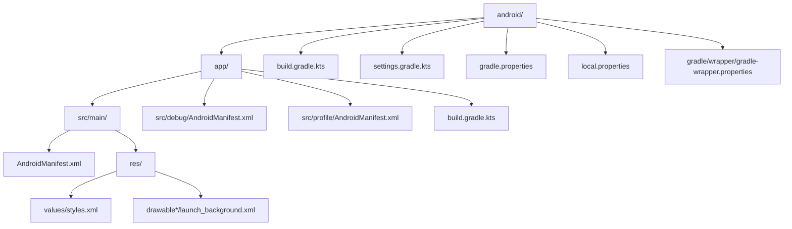
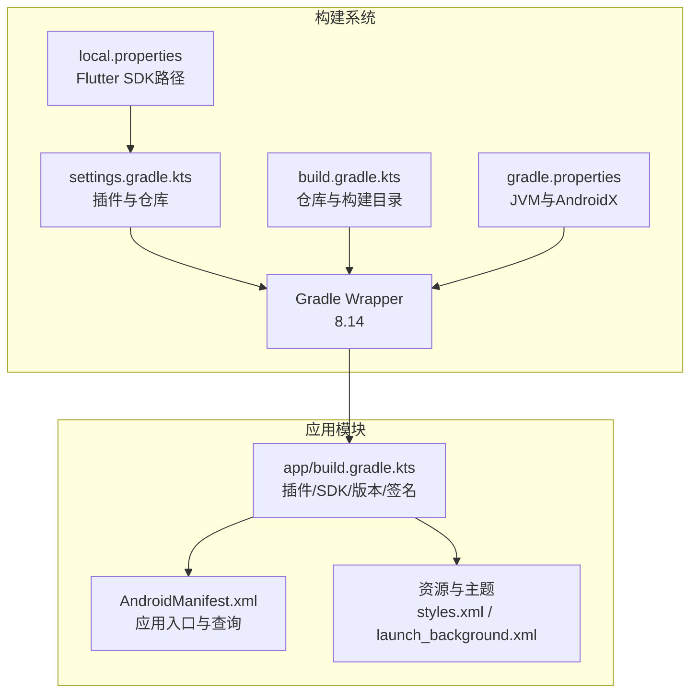
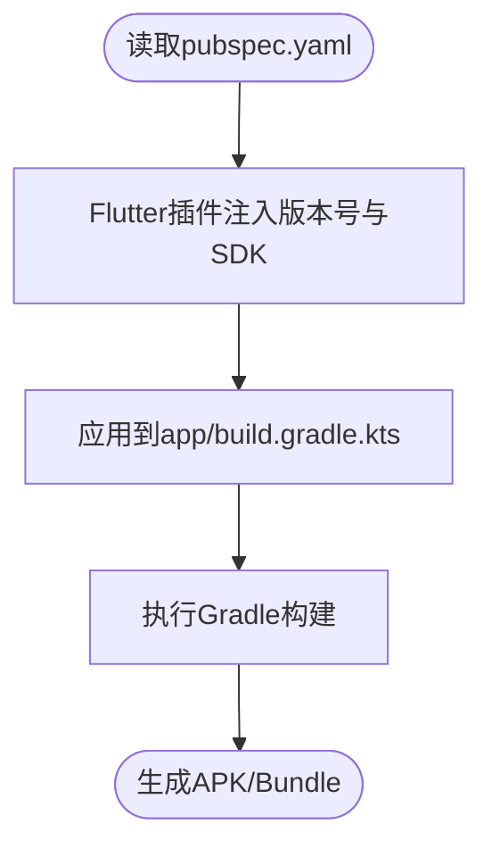
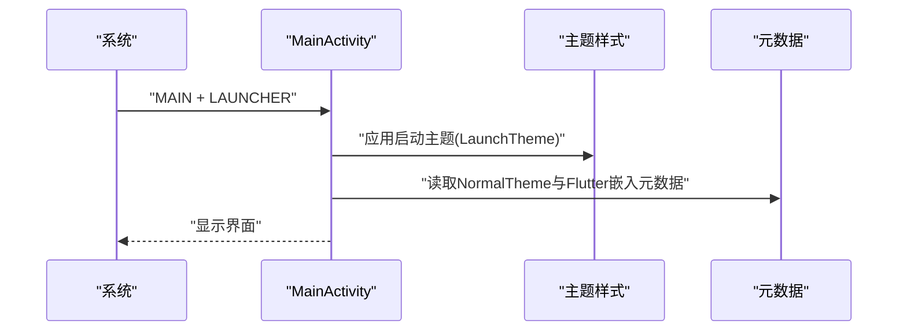
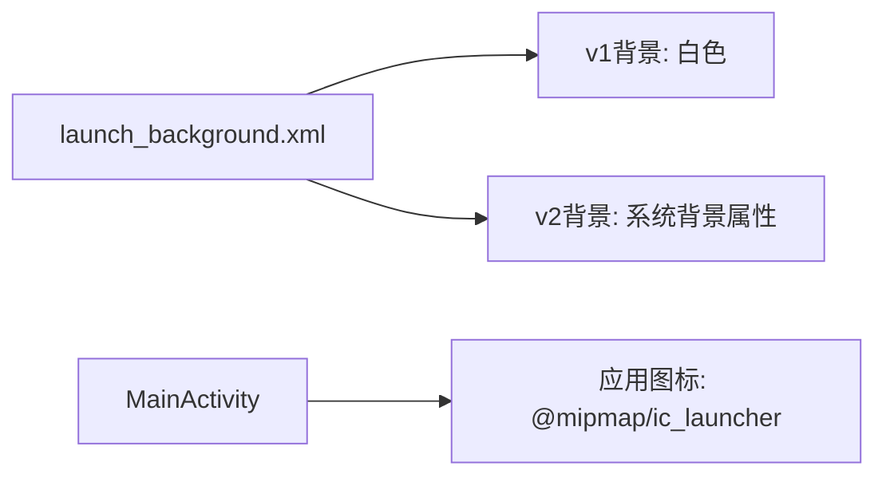
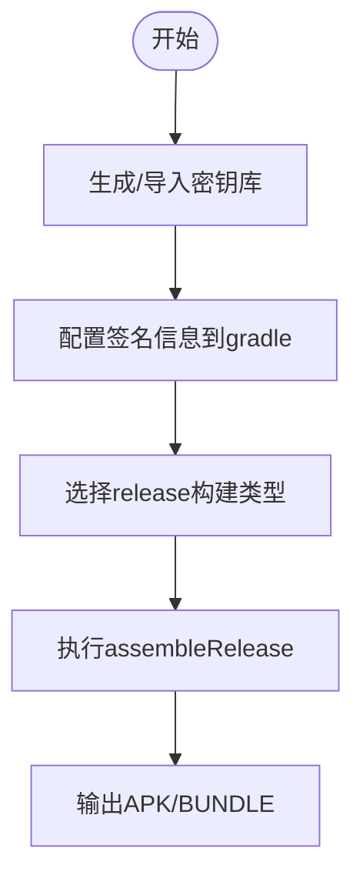
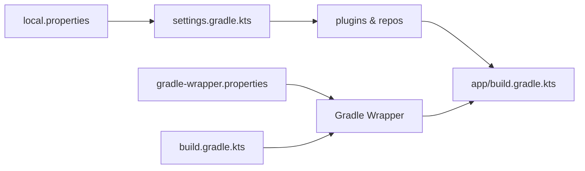

# Android部署

<cite>
**本文引用的文件**
- [android/app/build.gradle.kts](file://android/app/build.gradle.kts)
- [android/build.gradle.kts](file://android/build.gradle.kts)
- [android/settings.gradle.kts](file://android/settings.gradle.kts)
- [android/gradle.properties](file://android/gradle.properties)
- [android/local.properties](file://android/local.properties)
- [android/gradle/wrapper/gradle-wrapper.properties](file://android/gradle/wrapper/gradle-wrapper.properties)
- [android/app/src/main/AndroidManifest.xml](file://android/app/src/main/AndroidManifest.xml)
- [android/app/src/debug/AndroidManifest.xml](file://android/app/src/debug/AndroidManifest.xml)
- [android/app/src/profile/AndroidManifest.xml](file://android/app/src/profile/AndroidManifest.xml)
- [android/app/src/main/res/values/styles.xml](file://android/app/src/main/res/values/styles.xml)
- [android/app/src/main/res/drawable/launch_background.xml](file://android/app/src/main/res/drawable/launch_background.xml)
- [android/app/src/main/res/drawable-v21/launch_background.xml](file://android/app/src/main/res/drawable-v21/launch_background.xml)
- [pubspec.yaml](file://pubspec.yaml)
- [android/.gitignore](file://android/.gitignore)
</cite>

## 目录
1. [简介](#简介)
2. [项目结构](#项目结构)
3. [核心组件](#核心组件)
4. [架构总览](#架构总览)
5. [详细组件分析](#详细组件分析)
6. [依赖关系分析](#依赖关系分析)
7. [性能考虑](#性能考虑)
8. [故障排查指南](#故障排查指南)
9. [结论](#结论)
10. [附录](#附录)

## 简介
本文件面向LifeMaster应用的Android部署，覆盖从构建配置、签名证书到APK生成与发布流程的完整说明。文档同时解释版本号管理、混淆与资源优化策略，并给出Google Play商店发布要点（如包上传、截图准备、描述撰写与审核要求）。最后提供调试与发布版本差异、内测渠道配置及生产环境部署建议。

## 项目结构
Android子工程采用Flutter标准目录组织，核心配置集中在android/app与根级gradle脚本中；应用清单与资源位于android/app/src/main；调试与性能分析构建类型分别在debug与profile源集下声明权限。

图表来源
- [android/app/src/main/AndroidManifest.xml:1-46](file://android/app/src/main/AndroidManifest.xml#L1-L46)
- [android/app/src/debug/AndroidManifest.xml:1-8](file://android/app/src/debug/AndroidManifest.xml#L1-L8)
- [android/app/src/profile/AndroidManifest.xml:1-8](file://android/app/src/profile/AndroidManifest.xml#L1-L8)
- [android/app/src/main/res/values/styles.xml:1-19](file://android/app/src/main/res/values/styles.xml#L1-L19)
- [android/app/src/main/res/drawable/launch_background.xml:1-13](file://android/app/src/main/res/drawable/launch_background.xml#L1-L13)
- [android/app/src/main/res/drawable-v21/launch_background.xml:1-13](file://android/app/src/main/res/drawable-v21/launch_background.xml#L1-L13)
- [android/app/build.gradle.kts:1-45](file://android/app/build.gradle.kts#L1-L45)
- [android/build.gradle.kts:1-25](file://android/build.gradle.kts#L1-L25)
- [android/settings.gradle.kts:1-27](file://android/settings.gradle.kts#L1-L27)
- [android/gradle.properties:1-3](file://android/gradle.properties#L1-L3)
- [android/local.properties:1-1](file://android/local.properties#L1-L1)
- [android/gradle/wrapper/gradle-wrapper.properties:1-6](file://android/gradle/wrapper/gradle-wrapper.properties#L1-L6)

章节来源
- [android/app/build.gradle.kts:1-45](file://android/app/build.gradle.kts#L1-L45)
- [android/build.gradle.kts:1-25](file://android/build.gradle.kts#L1-L25)
- [android/settings.gradle.kts:1-27](file://android/settings.gradle.kts#L1-L27)
- [android/gradle.properties:1-3](file://android/gradle.properties#L1-L3)
- [android/local.properties:1-1](file://android/local.properties#L1-L1)
- [android/gradle/wrapper/gradle-wrapper.properties:1-6](file://android/gradle/wrapper/gradle-wrapper.properties#L1-L6)

## 核心组件
- 构建插件与工具链
  - 应用插件：com.android.application、org.jetbrains.kotlin.android、dev.flutter.flutter-gradle-plugin
  - 工具链：Gradle Wrapper使用8.14版本；Flutter SDK路径通过local.properties指定
- 版本与SDK配置
  - 应用命名空间与应用ID：com.lifemaster.lifemaster
  - 编译与目标SDK：由Flutter插件注入
  - Java/Kotlin版本：JDK 17
  - 版本号：来源于pubspec.yaml的version字段，Flutter插件注入到gradle
- 构建类型与签名
  - release构建当前使用debug签名配置以便flutter run --release可用
  - 需要替换为正式签名配置以生成可发布的APK
- 资源与主题
  - 启动主题与普通主题样式定义于values/styles.xml
  - 启动背景图层列表位于drawable与drawable-v21目录
  - 应用图标位于mipmap资源目录（清单中引用ic_launcher）

章节来源
- [android/app/build.gradle.kts:1-45](file://android/app/build.gradle.kts#L1-L45)
- [android/settings.gradle.kts:1-27](file://android/settings.gradle.kts#L1-L27)
- [android/gradle/wrapper/gradle-wrapper.properties:1-6](file://android/gradle/wrapper/gradle-wrapper.properties#L1-L6)
- [android/local.properties:1-1](file://android/local.properties#L1-L1)
- [android/app/src/main/AndroidManifest.xml:1-46](file://android/app/src/main/AndroidManifest.xml#L1-L46)
- [android/app/src/main/res/values/styles.xml:1-19](file://android/app/src/main/res/values/styles.xml#L1-L19)
- [android/app/src/main/res/drawable/launch_background.xml:1-13](file://android/app/src/main/res/drawable/launch_background.xml#L1-L13)
- [android/app/src/main/res/drawable-v21/launch_background.xml:1-13](file://android/app/src/main/res/drawable-v21/launch_background.xml#L1-L13)
- [pubspec.yaml:1-54](file://pubspec.yaml#L1-L54)

## 架构总览
Android构建体系由Flutter Gradle插件驱动，统一注入Flutter SDK版本、编译与目标SDK、版本号等参数；Gradle Wrapper负责构建执行；AndroidManifest集中声明应用入口、主题与查询意图；资源目录提供启动画面与图标。

图表来源
- [android/settings.gradle.kts:1-27](file://android/settings.gradle.kts#L1-L27)
- [android/build.gradle.kts:1-25](file://android/build.gradle.kts#L1-L25)
- [android/gradle.properties:1-3](file://android/gradle.properties#L1-L3)
- [android/local.properties:1-1](file://android/local.properties#L1-L1)
- [android/gradle/wrapper/gradle-wrapper.properties:1-6](file://android/gradle/wrapper/gradle-wrapper.properties#L1-L6)
- [android/app/build.gradle.kts:1-45](file://android/app/build.gradle.kts#L1-L45)
- [android/app/src/main/AndroidManifest.xml:1-46](file://android/app/src/main/AndroidManifest.xml#L1-L46)
- [android/app/src/main/res/values/styles.xml:1-19](file://android/app/src/main/res/values/styles.xml#L1-L19)
- [android/app/src/main/res/drawable/launch_background.xml:1-13](file://android/app/src/main/res/drawable/launch_background.xml#L1-L13)
- [android/app/src/main/res/drawable-v21/launch_background.xml:1-13](file://android/app/src/main/res/drawable-v21/launch_background.xml#L1-L13)

## 详细组件分析

### 构建脚本与版本号管理
- 插件与仓库
  - 应用插件顺序：Android应用、Kotlin、Flutter Gradle插件
  - 仓库：google、mavenCentral
- SDK与语言级别
  - compileSdk、targetSdk、minSdk由Flutter插件注入
  - Java/Kotlin兼容性：sourceCompatibility/targetCompatibility/jvmTarget均为17
- 版本号来源
  - 版本号与构建号来自pubspec.yaml的version字段，Flutter插件注入到gradle
- 构建目录
  - 子项目构建目录统一指向根build目录，便于清理与缓存管理

图表来源
- [pubspec.yaml:1-54](file://pubspec.yaml#L1-L54)
- [android/app/build.gradle.kts:22-31](file://android/app/build.gradle.kts#L22-L31)
- [android/build.gradle.kts:8-17](file://android/build.gradle.kts#L8-L17)

章节来源
- [android/app/build.gradle.kts:1-45](file://android/app/build.gradle.kts#L1-L45)
- [android/build.gradle.kts:1-25](file://android/build.gradle.kts#L1-L25)
- [pubspec.yaml:1-54](file://pubspec.yaml#L1-L54)

### 清单与权限配置
- 应用入口
  - MainActivity作为主入口，导出标志为true，支持单任务栈模式
  - 指定启动主题与普通主题，以及硬件加速与软键盘适配
- 查询意图
  - 声明对ACTION_PROCESS_TEXT的查询能力，满足文本处理插件需求
- 权限声明
  - debug与profile源集均声明INTERNET权限，用于开发调试与热重载
  - 生产发布需按需最小化权限，避免过度授权

图表来源
- [android/app/src/main/AndroidManifest.xml:6-27](file://android/app/src/main/AndroidManifest.xml#L6-L27)
- [android/app/src/main/res/values/styles.xml:3-17](file://android/app/src/main/res/values/styles.xml#L3-L17)

章节来源
- [android/app/src/main/AndroidManifest.xml:1-46](file://android/app/src/main/AndroidManifest.xml#L1-L46)
- [android/app/src/debug/AndroidManifest.xml:1-8](file://android/app/src/debug/AndroidManifest.xml#L1-L8)
- [android/app/src/profile/AndroidManifest.xml:1-8](file://android/app/src/profile/AndroidManifest.xml#L1-L8)
- [android/app/src/main/res/values/styles.xml:1-19](file://android/app/src/main/res/values/styles.xml#L1-L19)

### 启动画面与图标
- 启动画面
  - 使用layer-list定义背景，v21版本使用系统背景属性
  - 可在注释提示处插入自定义启动图像资源
- 图标
  - 清单中引用mipmap/ic_launcher作为应用图标
  - 对应多密度mipmap资源目录（mdpi、hdpi、xhdpi、xxhdpi、xxxhdpi）用于不同屏幕密度

图表来源
- [android/app/src/main/res/drawable/launch_background.xml:1-13](file://android/app/src/main/res/drawable/launch_background.xml#L1-L13)
- [android/app/src/main/res/drawable-v21/launch_background.xml:1-13](file://android/app/src/main/res/drawable-v21/launch_background.xml#L1-L13)
- [android/app/src/main/AndroidManifest.xml](file://android/app/src/main/AndroidManifest.xml#L5)

章节来源
- [android/app/src/main/res/drawable/launch_background.xml:1-13](file://android/app/src/main/res/drawable/launch_background.xml#L1-L13)
- [android/app/src/main/res/drawable-v21/launch_background.xml:1-13](file://android/app/src/main/res/drawable-v21/launch_background.xml#L1-L13)
- [android/app/src/main/AndroidManifest.xml:1-46](file://android/app/src/main/AndroidManifest.xml#L1-L46)

### 签名证书与APK生成
- 当前状态
  - release构建使用debug签名配置，便于命令行调试
- 正式发布步骤
  - 生成或导入密钥库，配置签名信息（密钥别名、密码、密钥密码）
  - 在app/build.gradle.kts中为release构建类型配置signingConfig
  - 执行assembleRelease生成签名APK或bundle
- 安全建议
  - 密钥库与key.properties不应纳入版本控制
  - 参考.gitignore中关于keystore与key.properties的保护条目

图表来源
- [android/app/build.gradle.kts:33-39](file://android/app/build.gradle.kts#L33-L39)
- [android/.gitignore:10-14](file://android/.gitignore#L10-L14)

章节来源
- [android/app/build.gradle.kts:33-39](file://android/app/build.gradle.kts#L33-L39)
- [android/.gitignore:10-14](file://android/.gitignore#L10-L14)

### Google Play商店发布流程
- 包上传
  - 生成发布版APK/BUNDLE后，登录Google Play Console进行上传
- 截图与预览
  - 准备多尺寸设备截图、横竖屏截图与视频预览
- 应用描述与关键词
  - 撰写清晰的功能介绍、更新日志与隐私政策链接
- 审核要求
  - 符合内容政策、隐私合规与权限最小化原则
  - 提供可测试的开发者账号与联系方式

[本节为通用发布流程说明，不直接分析具体代码文件]

### 调试版本与发布版本差异
- 权限
  - debug与profile默认开启INTERNET权限，便于开发调试
  - 发布版应仅声明必要权限
- 签名
  - release默认使用debug签名（便于命令行运行），发布前需替换为正式签名
- 性能与混淆
  - 发布版启用ProGuard/R8混淆与代码压缩，提升安全性与体积优化
  - 配置混淆规则以保留必要的反射与序列化逻辑

[本节为通用发布流程说明，不直接分析具体代码文件]

### 内测渠道与生产部署策略
- 内测渠道
  - 使用内部测试轨道或封闭测试轨道分发APK/BETA
  - 通过邀请链接或邮件分发，收集早期反馈
- 生产部署
  - 通过内部流程校验签名、版本与资源一致性
  - 使用发布轨道逐步放量，监控崩溃与用户反馈

[本节为通用发布流程说明，不直接分析具体代码文件]

## 依赖关系分析
- 插件与仓库
  - settings.gradle.kts声明插件版本与仓库，include ":app"
  - build.gradle.kts统一仓库与构建目录
- 工具链
  - gradle-wrapper.properties固定Gradle版本
  - local.properties提供Flutter SDK路径
- 应用模块
  - app/build.gradle.kts应用插件、注入Flutter参数、配置签名与构建类型

图表来源
- [android/gradle/wrapper/gradle-wrapper.properties:1-6](file://android/gradle/wrapper/gradle-wrapper.properties#L1-L6)
- [android/local.properties:1-1](file://android/local.properties#L1-L1)
- [android/settings.gradle.kts:1-27](file://android/settings.gradle.kts#L1-L27)
- [android/build.gradle.kts:1-25](file://android/build.gradle.kts#L1-L25)
- [android/app/build.gradle.kts:1-45](file://android/app/build.gradle.kts#L1-L45)

章节来源
- [android/settings.gradle.kts:1-27](file://android/settings.gradle.kts#L1-L27)
- [android/build.gradle.kts:1-25](file://android/build.gradle.kts#L1-L25)
- [android/gradle/wrapper/gradle-wrapper.properties:1-6](file://android/gradle/wrapper/gradle-wrapper.properties#L1-L6)
- [android/local.properties:1-1](file://android/local.properties#L1-L1)
- [android/app/build.gradle.kts:1-45](file://android/app/build.gradle.kts#L1-L45)

## 性能考虑
- 构建性能
  - gradle.properties已启用AndroidX并配置较大JVM内存，有助于大型项目构建稳定性
- 代码与资源
  - 发布版建议启用混淆与资源压缩，减少APK体积
  - 启动画面与图标资源应按密度裁剪，避免冗余

章节来源
- [android/gradle.properties:1-3](file://android/gradle.properties#L1-L3)

## 故障排查指南
- 构建失败
  - 确认Flutter SDK路径正确（local.properties）
  - 确认Gradle Wrapper版本与IDE匹配（gradle-wrapper.properties）
  - 清理构建缓存后重试（根build目录）
- 签名问题
  - release未配置签名时会沿用debug签名，导致无法发布
  - 密钥库与key.properties请勿提交至版本控制
- 权限相关
  - 开发阶段INTERNET权限在debug/profile源集中已声明
  - 发布前检查是否仍需要该权限，避免过度授权

章节来源
- [android/local.properties:1-1](file://android/local.properties#L1-L1)
- [android/gradle/wrapper/gradle-wrapper.properties:1-6](file://android/gradle/wrapper/gradle-wrapper.properties#L1-L6)
- [android/build.gradle.kts:22-24](file://android/build.gradle.kts#L22-L24)
- [android/app/build.gradle.kts:33-39](file://android/app/build.gradle.kts#L33-L39)
- [android/.gitignore:10-14](file://android/.gitignore#L10-L14)
- [android/app/src/debug/AndroidManifest.xml:1-8](file://android/app/src/debug/AndroidManifest.xml#L1-L8)
- [android/app/src/profile/AndroidManifest.xml:1-8](file://android/app/src/profile/AndroidManifest.xml#L1-L8)

## 结论
LifeMaster的Android部署以Flutter Gradle插件为核心，版本号与SDK由pubspec.yaml与Flutter插件注入，构建类型与签名在app/build.gradle.kts中配置。发布前需完成签名配置、混淆与资源优化，并遵循Google Play的上传与审核规范。通过内测渠道收集反馈，再进入生产发布轨道，确保质量与稳定性。

## 附录
- 关键文件索引
  - 构建脚本：android/app/build.gradle.kts、android/build.gradle.kts、android/settings.gradle.kts
  - 工具链：android/gradle.properties、android/local.properties、android/gradle/wrapper/gradle-wrapper.properties
  - 清单与资源：android/app/src/main/AndroidManifest.xml、android/app/src/main/res/values/styles.xml、android/app/src/main/res/drawable*/launch_background.xml
  - 版本号：pubspec.yaml