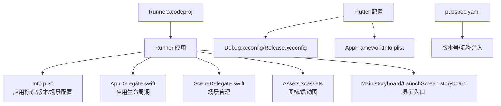
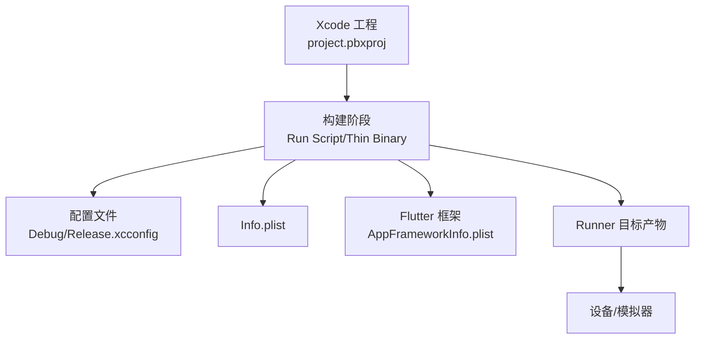
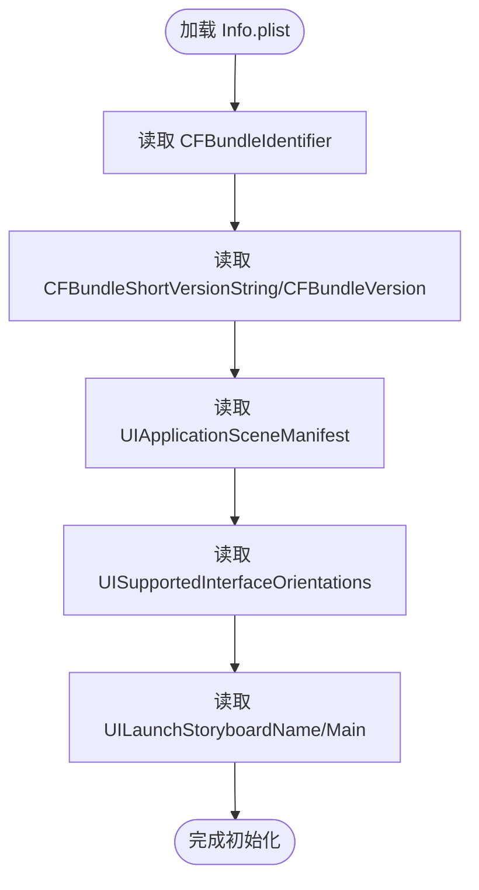
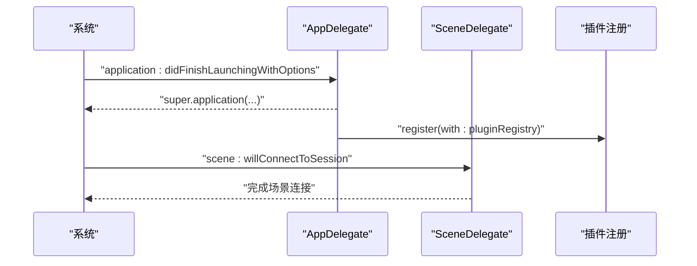
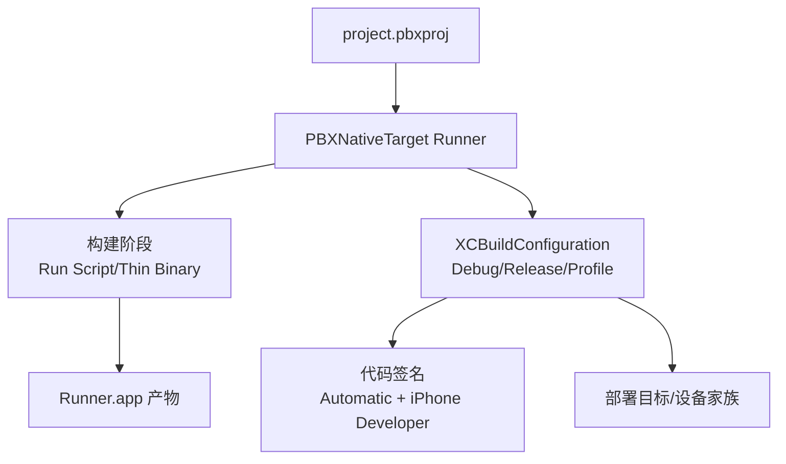
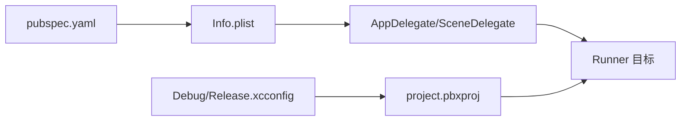

# iOS部署

<cite>
**本文引用的文件**
- [ios/Runner/Info.plist](file://ios/Runner/Info.plist)
- [ios/Runner/AppDelegate.swift](file://ios/Runner/AppDelegate.swift)
- [ios/Runner/SceneDelegate.swift](file://ios/Runner/SceneDelegate.swift)
- [ios/Runner.xcodeproj/project.pbxproj](file://ios/Runner.xcodeproj/project.pbxproj)
- [ios/Flutter/Debug.xcconfig](file://ios/Flutter/Debug.xcconfig)
- [ios/Flutter/Release.xcconfig](file://ios/Flutter/Release.xcconfig)
- [ios/Flutter/AppFrameworkInfo.plist](file://ios/Flutter/AppFrameworkInfo.plist)
- [ios/Runner/Runner-Bridging-Header.h](file://ios/Runner/Runner-Bridging-Header.h)
- [pubspec.yaml](file://pubspec.yaml)
- [README.md](file://README.md)
</cite>

## 目录
1. [简介](#简介)
2. [项目结构](#项目结构)
3. [核心组件](#核心组件)
4. [架构总览](#架构总览)
5. [详细组件分析](#详细组件分析)
6. [依赖关系分析](#依赖关系分析)
7. [性能考虑](#性能考虑)
8. [故障排查指南](#故障排查指南)
9. [结论](#结论)
10. [附录](#附录)

## 简介
本文件面向LifeMaster应用的iOS部署，基于仓库中的Xcode工程与Flutter配置，提供从Xcode项目配置、Apple开发者账号与证书、构建签名、App Store Connect配置到TestFlight内测与App Store发布的全流程说明。同时涵盖Info.plist关键配置项、权限声明与系统兼容性设置，以及iOS版本与设备适配、性能优化建议。

## 项目结构
LifeMaster采用Flutter多端统一代码，iOS侧通过Xcode工程组织原生资源与配置。关键目录与文件如下：
- ios/Runner：iOS应用入口与配置（Info.plist、AppDelegate、SceneDelegate、资源与故事板）
- ios/Flutter：Flutter框架配置与生成的配置文件（Debug/Release.xcconfig、AppFrameworkInfo.plist）
- ios/Runner.xcodeproj：Xcode工程定义，包含构建配置、目标产物、脚本阶段等
- pubspec.yaml：Flutter依赖与版本信息，用于构建时注入版本号与名称

图表来源
- [ios/Runner/Info.plist:1-71](file://ios/Runner/Info.plist#L1-L71)
- [ios/Runner/AppDelegate.swift:1-17](file://ios/Runner/AppDelegate.swift#L1-L17)
- [ios/Runner/SceneDelegate.swift:1-7](file://ios/Runner/SceneDelegate.swift#L1-L7)
- [ios/Runner.xcodeproj/project.pbxproj:1-621](file://ios/Runner.xcodeproj/project.pbxproj#L1-L621)
- [ios/Flutter/Debug.xcconfig:1-2](file://ios/Flutter/Debug.xcconfig#L1-L2)
- [ios/Flutter/Release.xcconfig:1-2](file://ios/Flutter/Release.xcconfig#L1-L2)
- [ios/Flutter/AppFrameworkInfo.plist:1-25](file://ios/Flutter/AppFrameworkInfo.plist#L1-L25)
- [pubspec.yaml:1-54](file://pubspec.yaml#L1-L54)

章节来源
- [README.md:1-18](file://README.md#L1-L18)
- [pubspec.yaml:1-54](file://pubspec.yaml#L1-L54)

## 核心组件
- 应用清单与场景配置：Info.plist定义应用标识、版本、最低系统版本、支持方向、场景配置等。
- 应用委托：AppDelegate.swift负责应用启动与插件注册；SceneDelegate.swift继承自FlutterSceneDelegate，处理场景生命周期。
- Xcode工程：project.pbxproj定义构建目标、配置、脚本阶段、资源与产物路径。
- Flutter配置：Debug/Release.xcconfig引入Generated.xcconfig，AppFrameworkInfo.plist提供Flutter框架元信息。
- 桥接头：Runner-Bridging-Header.h用于桥接Objective-C与Swift，注册插件。

章节来源
- [ios/Runner/Info.plist:1-71](file://ios/Runner/Info.plist#L1-L71)
- [ios/Runner/AppDelegate.swift:1-17](file://ios/Runner/AppDelegate.swift#L1-L17)
- [ios/Runner/SceneDelegate.swift:1-7](file://ios/Runner/SceneDelegate.swift#L1-L7)
- [ios/Runner.xcodeproj/project.pbxproj:1-621](file://ios/Runner.xcodeproj/project.pbxproj#L1-L621)
- [ios/Flutter/Debug.xcconfig:1-2](file://ios/Flutter/Debug.xcconfig#L1-L2)
- [ios/Flutter/Release.xcconfig:1-2](file://ios/Flutter/Release.xcconfig#L1-L2)
- [ios/Flutter/AppFrameworkInfo.plist:1-25](file://ios/Flutter/AppFrameworkInfo.plist#L1-L25)
- [ios/Runner/Runner-Bridging-Header.h:1-1](file://ios/Runner/Runner-Bridging-Header.h#L1-L1)

## 架构总览
下图展示从Xcode构建到应用运行的关键交互：Xcode读取配置与资源，执行构建脚本，生成Runner应用，最终在设备或模拟器上运行。

图表来源
- [ios/Runner.xcodeproj/project.pbxproj:227-259](file://ios/Runner.xcodeproj/project.pbxproj#L227-L259)
- [ios/Flutter/Debug.xcconfig:1-2](file://ios/Flutter/Debug.xcconfig#L1-L2)
- [ios/Flutter/Release.xcconfig:1-2](file://ios/Flutter/Release.xcconfig#L1-L2)
- [ios/Runner/Info.plist:1-71](file://ios/Runner/Info.plist#L1-L71)
- [ios/Flutter/AppFrameworkInfo.plist:1-25](file://ios/Flutter/AppFrameworkInfo.plist#L1-L25)

## 详细组件分析

### Info.plist 关键配置解析
- 应用标识与版本
  - CFBundleIdentifier：应用Bundle标识，用于区分应用与沙盒隔离。
  - CFBundleShortVersionString/CFBundleVersion：语义化版本与构建号，由Flutter构建系统注入。
- 系统与场景
  - LSRequiresIPhoneOS：要求iOS平台。
  - UIApplicationSceneManifest：定义场景类、配置名、委托类与主故事板。
- 方向支持
  - UISupportedInterfaceOrientations/iPad：定义手机与iPad支持的方向集合。
- 启动与主界面
  - UILaunchStoryboardName/UIMainStoryboardFile：启动屏与主界面故事板。

图表来源
- [ios/Runner/Info.plist:1-71](file://ios/Runner/Info.plist#L1-L71)

章节来源
- [ios/Runner/Info.plist:1-71](file://ios/Runner/Info.plist#L1-L71)

### AppDelegate 与 SceneDelegate 生命周期
- AppDelegate.swift
  - 继承FlutterAppDelegate与FlutterImplicitEngineDelegate，重写应用启动回调并在引擎初始化后注册插件。
- SceneDelegate.swift
  - 继承FlutterSceneDelegate，作为场景级生命周期管理入口。

图表来源
- [ios/Runner/AppDelegate.swift:1-17](file://ios/Runner/AppDelegate.swift#L1-L17)
- [ios/Runner/SceneDelegate.swift:1-7](file://ios/Runner/SceneDelegate.swift#L1-L7)

章节来源
- [ios/Runner/AppDelegate.swift:1-17](file://ios/Runner/AppDelegate.swift#L1-L17)
- [ios/Runner/SceneDelegate.swift:1-7](file://ios/Runner/SceneDelegate.swift#L1-L7)

### Xcode 构建配置与签名
- 构建目标与产物
  - PBXNativeTarget “Runner” 定义应用目标，包含源码、资源、嵌入框架与Thin Binary脚本。
- 构建配置
  - Debug/Release/Profile：包含编译选项、链接路径、Bundle标识、Swift桥接头、Bitcode开关、部署目标等。
  - IPHONEOS_DEPLOYMENT_TARGET：最低iOS版本。
  - TARGETED_DEVICE_FAMILY：支持iPhone与iPad。
- 代码签名
  - CODE_SIGN_STYLE：自动签名。
  - CODE_SIGN_IDENTITY：默认使用“iPhone Developer”，需在Apple开发者账号中配置有效证书与Provisioning Profile。

图表来源
- [ios/Runner.xcodeproj/project.pbxproj:129-167](file://ios/Runner.xcodeproj/project.pbxproj#L129-L167)
- [ios/Runner.xcodeproj/project.pbxproj:383-540](file://ios/Runner.xcodeproj/project.pbxproj#L383-L540)

章节来源
- [ios/Runner.xcodeproj/project.pbxproj:129-167](file://ios/Runner.xcodeproj/project.pbxproj#L129-L167)
- [ios/Runner.xcodeproj/project.pbxproj:383-540](file://ios/Runner.xcodeproj/project.pbxproj#L383-L540)

### Flutter 配置与版本注入
- Debug/Release.xcconfig 引入 Generated.xcconfig，确保构建环境一致。
- AppFrameworkInfo.plist 提供Flutter框架元信息。
- Runner-Bridging-Header.h 指定Swift桥接头，注册插件。
- pubspec.yaml 中的版本与名称将通过构建系统注入到Info.plist字段。

章节来源
- [ios/Flutter/Debug.xcconfig:1-2](file://ios/Flutter/Debug.xcconfig#L1-L2)
- [ios/Flutter/Release.xcconfig:1-2](file://ios/Flutter/Release.xcconfig#L1-L2)
- [ios/Flutter/AppFrameworkInfo.plist:1-25](file://ios/Flutter/AppFrameworkInfo.plist#L1-L25)
- [ios/Runner/Runner-Bridging-Header.h:1-1](file://ios/Runner/Runner-Bridging-Header.h#L1-L1)
- [pubspec.yaml:1-54](file://pubspec.yaml#L1-L54)

## 依赖关系分析
- 应用层依赖于Info.plist提供的元数据与场景配置，AppDelegate/SceneDelegate负责生命周期与插件注册。
- Xcode工程通过project.pbxproj集中管理构建配置、资源与脚本，确保产物一致性。
- Flutter配置文件与pubspec.yaml共同决定版本号与名称注入。

图表来源
- [ios/Runner/Info.plist:1-71](file://ios/Runner/Info.plist#L1-L71)
- [ios/Runner/AppDelegate.swift:1-17](file://ios/Runner/AppDelegate.swift#L1-L17)
- [ios/Runner/SceneDelegate.swift:1-7](file://ios/Runner/SceneDelegate.swift#L1-L7)
- [ios/Runner.xcodeproj/project.pbxproj:129-167](file://ios/Runner.xcodeproj/project.pbxproj#L129-L167)
- [ios/Flutter/Debug.xcconfig:1-2](file://ios/Flutter/Debug.xcconfig#L1-L2)
- [ios/Flutter/Release.xcconfig:1-2](file://ios/Flutter/Release.xcconfig#L1-L2)
- [pubspec.yaml:1-54](file://pubspec.yaml#L1-L54)

章节来源
- [ios/Runner/Info.plist:1-71](file://ios/Runner/Info.plist#L1-L71)
- [ios/Runner/AppDelegate.swift:1-17](file://ios/Runner/AppDelegate.swift#L1-L17)
- [ios/Runner/SceneDelegate.swift:1-7](file://ios/Runner/SceneDelegate.swift#L1-L7)
- [ios/Runner.xcodeproj/project.pbxproj:129-167](file://ios/Runner.xcodeproj/project.pbxproj#L129-L167)
- [ios/Flutter/Debug.xcconfig:1-2](file://ios/Flutter/Debug.xcconfig#L1-L2)
- [ios/Flutter/Release.xcconfig:1-2](file://ios/Flutter/Release.xcconfig#L1-L2)
- [pubspec.yaml:1-54](file://pubspec.yaml#L1-L54)

## 性能考虑
- 构建优化
  - Release模式启用Swift整体编译与优化级别，减少体积与提升运行效率。
  - 关闭Bitcode以简化发布流程（当前配置已禁用）。
- 运行时优化
  - 支持多场景与间接输入事件，确保流畅体验。
  - 设备方向与场景配置合理，避免不必要的旋转开销。
- 版本与兼容性
  - 最低部署目标为iOS 13.0，覆盖主流设备；可根据业务需求评估是否提升最低版本以获得更佳性能与特性支持。

章节来源
- [ios/Runner.xcodeproj/project.pbxproj:530-540](file://ios/Runner.xcodeproj/project.pbxproj#L530-L540)
- [ios/Runner/Info.plist:56-68](file://ios/Runner/Info.plist#L56-L68)

## 故障排查指南
- 代码签名失败
  - 现象：构建时报签名错误。
  - 排查：确认Apple开发者账号登录Xcode；检查证书与Provisioning Profile有效性；确认项目设置中选择了正确的Team与Bundle Identifier。
  - 参考：project.pbxproj中的CODE_SIGN_STYLE与CODE_SIGN_IDENTITY设置。
- 构建脚本问题
  - 现象：Thin Binary或Run Script阶段报错。
  - 排查：检查Flutter工具链路径与Xcode后端脚本；确认FLUTTER_ROOT与工具链可用。
- 场景配置异常
  - 现象：启动屏或主界面不显示。
  - 排查：核对Info.plist中的UILaunchStoryboardName与UIMainStoryboardFile；确认Main/LaunchScreen故事板存在且未被移除。
- 设备方向不匹配
  - 现象：横屏/竖屏切换异常。
  - 排查：检查Info.plist中UISupportedInterfaceOrientations与UISupportedInterfaceOrientations~ipad配置。

章节来源
- [ios/Runner.xcodeproj/project.pbxproj:227-259](file://ios/Runner.xcodeproj/project.pbxproj#L227-L259)
- [ios/Runner/Info.plist:52-55](file://ios/Runner/Info.plist#L52-L55)

## 结论
LifeMaster的iOS部署以Flutter为基础，结合Xcode工程与配置文件实现稳定的构建与运行。通过合理配置Info.plist、AppDelegate/SceneDelegate与Xcode构建设置，可确保应用在iOS设备上的正确安装与运行。后续发布至App Store或TestFlight，需配合Apple开发者账号与App Store Connect完成元数据与证书配置。

## 附录

### Apple开发者账号与证书申请流程（概述）
- 登录Apple Developer并创建或选择团队
- 在Certificates, Identifiers & Profiles中创建以下内容：
  - App ID：使用Bundle Identifier（如com.lifemaster.lifemaster）
  - 证书：开发/分发证书（.p12或在钥匙串中）
  - Provisioning Profile：开发/发布（Development/AdHoc/AppStore）
- 在Xcode中选择Team与证书，确保Bundle Identifier与Profile匹配

[本节为通用流程说明，不直接分析具体文件，故无章节来源]

### 构建与签名要点
- Bundle Identifier：确保与App ID一致
- Team：在Xcode Targets Signing中选择
- 自动签名：CODE_SIGN_STYLE=Automatic，系统自动管理证书与Profile
- 手动签名：若需指定证书与Profile，可在项目设置中关闭自动签名并手动选择

章节来源
- [ios/Runner.xcodeproj/project.pbxproj:383-540](file://ios/Runner.xcodeproj/project.pbxproj#L383-L540)

### App Store Connect 配置与元数据填写（概述）
- 应用信息：名称、版本号、截图、预览视频、关键词
- 审核信息：联系信息、演示账户（如有）
- 分类与合规：隐私政策链接、数据类型勾选
- 发布方式：直接发布或等待审核

[本节为通用流程说明，不直接分析具体文件，故无章节来源]

### TestFlight 内测与 App Store 正式发布流程（概述）
- TestFlight内测
  - 在App Store Connect中上传归档（Archive），创建内部测试组并邀请测试者
- 正式发布
  - 提交审核，等待Apple审核通过后自动上架

[本节为通用流程说明，不直接分析具体文件，故无章节来源]

### Info.plist 权限声明与系统兼容性
- 系统兼容性
  - LSRequiresIPhoneOS：限定iOS平台
  - IPHONEOS_DEPLOYMENT_TARGET：最低iOS版本
- 场景与方向
  - UIApplicationSceneManifest：场景配置
  - UISupportedInterfaceOrientations/iPad：支持方向
- 启动与主界面
  - UILaunchStoryboardName/UIMainStoryboardFile：启动与主界面

章节来源
- [ios/Runner/Info.plist:27-27](file://ios/Runner/Info.plist#L27-L27)
- [ios/Runner/Info.plist:56-68](file://ios/Runner/Info.plist#L56-L68)
- [ios/Runner/Info.plist:52-55](file://ios/Runner/Info.plist#L52-L55)

### iOS 版本与设备适配建议
- 最低版本：iOS 13.0（当前配置）
- 设备家族：iPhone与iPad均支持（TARGETED_DEVICE_FAMILY=1,2）
- 建议：根据功能与性能需求，评估是否提升最低版本以获得新API与优化

章节来源
- [ios/Runner.xcodeproj/project.pbxproj:353-353](file://ios/Runner.xcodeproj/project.pbxproj#L353-L353)
- [ios/Runner.xcodeproj/project.pbxproj:357-357](file://ios/Runner.xcodeproj/project.pbxproj#L357-L357)