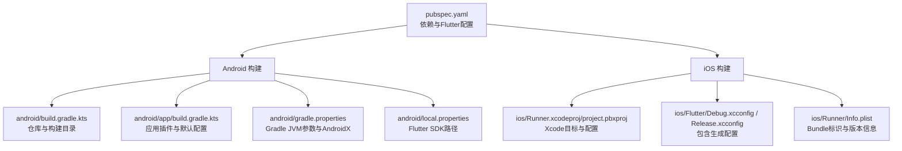
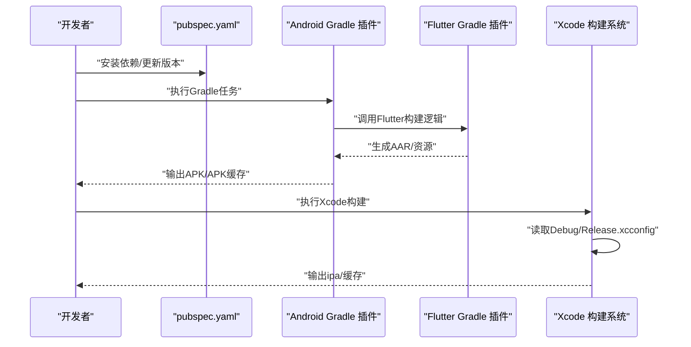
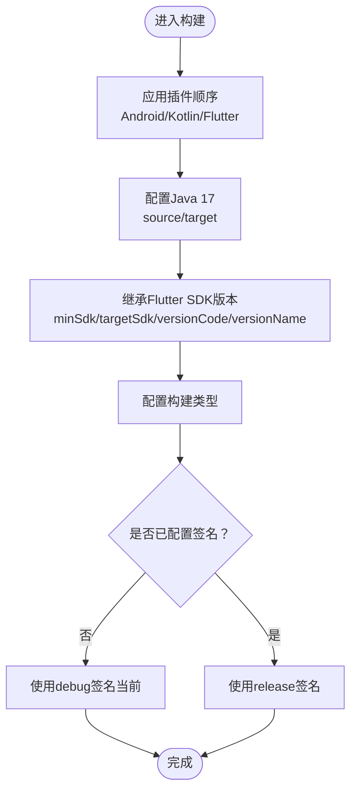
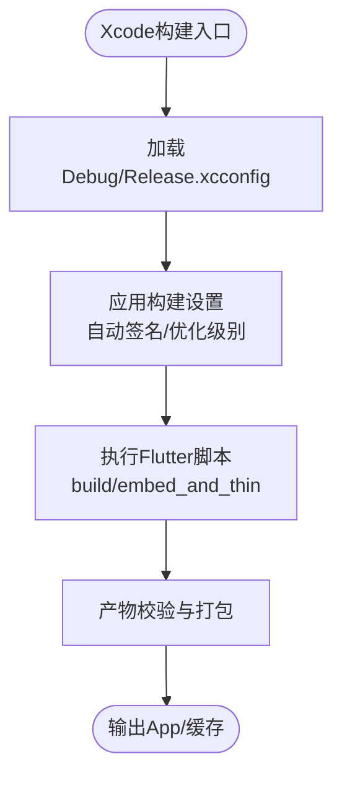
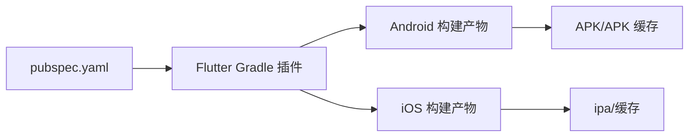

# 构建配置

<cite>
**本文引用的文件**
- [pubspec.yaml](file://pubspec.yaml)
- [android/build.gradle.kts](file://android/build.gradle.kts)
- [android/app/build.gradle.kts](file://android/app/build.gradle.kts)
- [android/gradle.properties](file://android/gradle.properties)
- [android/local.properties](file://android/local.properties)
- [android/app/src/main/AndroidManifest.xml](file://android/app/src/main/AndroidManifest.xml)
- [android/app/src/debug/AndroidManifest.xml](file://android/app/src/debug/AndroidManifest.xml)
- [android/app/src/profile/AndroidManifest.xml](file://android/app/src/profile/AndroidManifest.xml)
- [ios/Runner.xcodeproj/project.pbxproj](file://ios/Runner.xcodeproj/project.pbxproj)
- [ios/Flutter/Debug.xcconfig](file://ios/Flutter/Debug.xcconfig)
- [ios/Flutter/Release.xcconfig](file://ios/Flutter/Release.xcconfig)
- [ios/Runner/Info.plist](file://ios/Runner/Info.plist)
</cite>

## 目录
1. [简介](#简介)
2. [项目结构](#项目结构)
3. [核心组件](#核心组件)
4. [架构总览](#架构总览)
5. [详细组件分析](#详细组件分析)
6. [依赖关系分析](#依赖关系分析)
7. [性能考虑](#性能考虑)
8. [故障排查指南](#故障排查指南)
9. [结论](#结论)
10. [附录](#附录)

## 简介
本文件面向LifeMaster应用的构建配置，系统性说明pubspec.yaml中的依赖与版本策略、Flutter SDK与工具链配置；Android与iOS平台的构建属性、环境变量与密钥管理现状；不同构建类型（debug、profile、release）的差异；以及在CI/CD环境下的可操作建议与安全实践。同时提供构建优化、增量构建与并行构建的配置要点。

## 项目结构
LifeMaster采用标准Flutter工程结构，Android与iOS分别拥有独立的构建脚本与配置文件。pubspec.yaml集中定义了应用名称、版本号、Flutter SDK约束以及所有依赖项。Android侧通过Gradle Kotlin DSL进行模块化构建与目录重定向；iOS侧通过Xcode工程文件与xcconfig进行编译配置。

**图表来源**
- [pubspec.yaml:1-57](file://pubspec.yaml#L1-L57)
- [android/build.gradle.kts:1-25](file://android/build.gradle.kts#L1-L25)
- [android/app/build.gradle.kts:1-45](file://android/app/build.gradle.kts#L1-L45)
- [android/gradle.properties:1-3](file://android/gradle.properties#L1-L3)
- [android/local.properties:1-1](file://android/local.properties#L1-L1)
- [ios/Runner.xcodeproj/project.pbxproj:1-621](file://ios/Runner.xcodeproj/project.pbxproj#L1-L621)
- [ios/Flutter/Debug.xcconfig:1-2](file://ios/Flutter/Debug.xcconfig#L1-L2)
- [ios/Flutter/Release.xcconfig:1-2](file://ios/Flutter/Release.xcconfig#L1-L2)
- [ios/Runner/Info.plist:1-71](file://ios/Runner/Info.plist#L1-L71)

**章节来源**
- [pubspec.yaml:1-57](file://pubspec.yaml#L1-L57)
- [android/build.gradle.kts:1-25](file://android/build.gradle.kts#L1-L25)
- [android/app/build.gradle.kts:1-45](file://android/app/build.gradle.kts#L1-L45)
- [android/gradle.properties:1-3](file://android/gradle.properties#L1-L3)
- [android/local.properties:1-1](file://android/local.properties#L1-L1)
- [ios/Runner.xcodeproj/project.pbxproj:1-621](file://ios/Runner.xcodeproj/project.pbxproj#L1-L621)
- [ios/Flutter/Debug.xcconfig:1-2](file://ios/Flutter/Debug.xcconfig#L1-L2)
- [ios/Flutter/Release.xcconfig:1-2](file://ios/Flutter/Release.xcconfig#L1-L2)
- [ios/Runner/Info.plist:1-71](file://ios/Runner/Info.plist#L1-L71)

## 核心组件
- 依赖与版本管理
  - Flutter SDK版本：由环境字段约束，确保工具链一致性。
  - 应用依赖：状态管理、数据库、导航、国际化、本地存储、通知、图表等，均以语义化版本声明。
  - 开发依赖：测试框架、代码规范、Drift代码生成与构建运行器。
- Android构建
  - Gradle仓库与构建目录统一到根目录，便于缓存与清理。
  - 子项目评估依赖于app模块，保证构建顺序。
  - 清理任务统一删除根构建目录。
- iOS构建
  - Xcode工程启用了并行构建，提升多核编译效率。
  - Debug/Release/Profile三套配置，包含自动签名与优化级别差异。
  - Info.plist集中管理Bundle标识、版本号与场景配置。

**章节来源**
- [pubspec.yaml:6-57](file://pubspec.yaml#L6-L57)
- [android/build.gradle.kts:1-25](file://android/build.gradle.kts#L1-L25)
- [ios/Runner.xcodeproj/project.pbxproj:172-186](file://ios/Runner.xcodeproj/project.pbxproj#L172-L186)

## 架构总览
下图展示从Flutter层到平台层的构建流程与关键配置点：

**图表来源**
- [pubspec.yaml:9-57](file://pubspec.yaml#L9-L57)
- [android/app/build.gradle.kts:1-6](file://android/app/build.gradle.kts#L1-L6)
- [ios/Flutter/Debug.xcconfig:1-2](file://ios/Flutter/Debug.xcconfig#L1-L2)
- [ios/Flutter/Release.xcconfig:1-2](file://ios/Flutter/Release.xcconfig#L1-L2)

## 详细组件分析

### Flutter与pubspec配置
- 版本与发布策略
  - 应用版本与构建号由Flutter工具链注入，pubspec中仅声明格式与约束。
  - 发布策略设置为私有，避免意外发布。
- 依赖分层
  - 运行时依赖集中在features/core/shared等模块中，pubspec列出核心库。
  - 开发期依赖用于代码生成与质量控制。
- Flutter元数据
  - 启用Material设计与代码生成开关，确保插件注册与资源处理。

**章节来源**
- [pubspec.yaml:1-57](file://pubspec.yaml#L1-L57)

### Android构建配置
- Gradle仓库与构建目录
  - 统一仓库源与构建目录，减少跨模块冲突。
  - 子项目构建目录按模块名归档，便于并行与缓存。
- 应用插件与默认配置
  - 应用插件、Kotlin插件与Flutter插件按顺序加载，确保资源与AAR生成。
  - 编译与目标Java版本统一为17，提升兼容性与性能。
  - 默认配置继承Flutter提供的SDK版本与最小/目标SDK。
- 构建类型
  - release类型当前使用debug签名配置以便调试，生产发布前需替换为正式签名。

**图表来源**
- [android/app/build.gradle.kts:1-45](file://android/app/build.gradle.kts#L1-L45)

**章节来源**
- [android/build.gradle.kts:1-25](file://android/build.gradle.kts#L1-L25)
- [android/app/build.gradle.kts:1-45](file://android/app/build.gradle.kts#L1-L45)
- [android/gradle.properties:1-3](file://android/gradle.properties#L1-L3)
- [android/local.properties:1-1](file://android/local.properties#L1-L1)

### iOS构建配置
- 并行构建与脚本
  - 工程启用“BuildIndependentTargetsInParallel”，提升多核编译效率。
  - 集成Flutter脚本，负责资源嵌入与二进制瘦身。
- 配置文件与签名
  - Debug/Release/Profile三套配置，包含自动签名策略与优化级别。
  - Debug配置开启调试符号与严格检查，Release配置启用优化与裁剪。
- 应用清单
  - Info.plist集中管理Bundle标识、版本号、场景配置与方向支持。

**图表来源**
- [ios/Runner.xcodeproj/project.pbxproj:244-258](file://ios/Runner.xcodeproj/project.pbxproj#L244-L258)
- [ios/Flutter/Debug.xcconfig:1-2](file://ios/Flutter/Debug.xcconfig#L1-L2)
- [ios/Flutter/Release.xcconfig:1-2](file://ios/Flutter/Release.xcconfig#L1-L2)

**章节来源**
- [ios/Runner.xcodeproj/project.pbxproj:172-186](file://ios/Runner.xcodeproj/project.pbxproj#L172-L186)
- [ios/Runner.xcodeproj/project.pbxproj:244-258](file://ios/Runner.xcodeproj/project.pbxproj#L244-L258)
- [ios/Runner/Info.plist:1-71](file://ios/Runner/Info.plist#L1-L71)

### 构建类型差异（debug、profile、release）
- Android
  - debug与profile通常与release共享Internet权限清单片段，便于开发与性能测试。
  - release当前使用debug签名，生产前应替换为正式签名配置。
- iOS
  - Debug：开启调试符号、严格检查与仅活动架构，便于断点与热重载。
  - Release：启用优化、裁剪与验证，适合分发。
  - Profile：平衡调试与性能，适合性能分析。

**章节来源**
- [android/app/src/debug/AndroidManifest.xml:1-8](file://android/app/src/debug/AndroidManifest.xml#L1-L8)
- [android/app/src/profile/AndroidManifest.xml:1-8](file://android/app/src/profile/AndroidManifest.xml#L1-L8)
- [android/app/build.gradle.kts:33-39](file://android/app/build.gradle.kts#L33-L39)
- [ios/Runner.xcodeproj/project.pbxproj:430-540](file://ios/Runner.xcodeproj/project.pbxproj#L430-L540)

### 代码签名与密钥管理
- Android
  - 当前release使用debug签名，未见独立签名配置，存在分发风险。
  - 建议在CI/CD中通过环境变量注入签名密钥与别名，并在构建脚本中动态配置。
- iOS
  - 使用自动签名策略，需确保开发者账号与证书在构建机可用。
  - 建议在CI/CD中配置Team ID、Provisioning Profile与证书导出，避免交互式登录。

**章节来源**
- [android/app/build.gradle.kts:33-39](file://android/app/build.gradle.kts#L33-L39)
- [ios/Runner.xcodeproj/project.pbxproj:387-420](file://ios/Runner.xcodeproj/project.pbxproj#L387-L420)

### CI/CD环境下的构建配置与自动化
- Android
  - 在CI中设置Gradle JVM参数与AndroidX开关，确保内存充足与兼容性。
  - 将Flutter SDK路径写入local.properties或通过CI变量传递。
  - 使用缓存目录与并行任务提升构建速度。
- iOS
  - 在CI中配置Xcode构建设置与自动签名，必要时预置证书与描述文件。
  - 利用并行构建选项加速多核编译。
- 安全
  - 密钥与证书通过CI安全变量或密钥管理服务注入，避免硬编码。
  - 对构建产物进行签名与完整性校验。

**章节来源**
- [android/gradle.properties:1-3](file://android/gradle.properties#L1-L3)
- [android/local.properties:1-1](file://android/local.properties#L1-L1)
- [ios/Runner.xcodeproj/project.pbxproj:172-186](file://ios/Runner.xcodeproj/project.pbxproj#L172-L186)

## 依赖关系分析
- Flutter层依赖于pubspec.yaml声明的包集合，运行时通过插件注册与生成代码参与构建。
- Android层依赖Flutter Gradle插件生成的资源与AAR，再由AGP打包为APK/APK缓存。
- iOS层依赖Xcode构建系统与Flutter脚本，最终输出ipa/缓存。

**图表来源**
- [pubspec.yaml:9-57](file://pubspec.yaml#L9-L57)
- [android/app/build.gradle.kts:1-6](file://android/app/build.gradle.kts#L1-L6)
- [ios/Runner.xcodeproj/project.pbxproj:244-258](file://ios/Runner.xcodeproj/project.pbxproj#L244-L258)

**章节来源**
- [pubspec.yaml:9-57](file://pubspec.yaml#L9-L57)
- [android/app/build.gradle.kts:1-6](file://android/app/build.gradle.kts#L1-L6)
- [ios/Runner.xcodeproj/project.pbxproj:244-258](file://ios/Runner.xcodeproj/project.pbxproj#L244-L258)

## 性能考虑
- Gradle
  - 调整JVM堆与元空间大小，启用并行任务与构建缓存。
  - 将构建目录统一到根目录，便于CI缓存命中。
- Android
  - Java/Kotlin目标版本统一为17，提升编译与运行效率。
  - 在release中启用代码压缩与资源裁剪。
- iOS
  - 启用并行构建，合理设置优化级别与调试符号。
  - 使用Thin Binary脚本进行产物瘦身。

**章节来源**
- [android/gradle.properties:1-3](file://android/gradle.properties#L1-L3)
- [android/build.gradle.kts:8-17](file://android/build.gradle.kts#L8-L17)
- [ios/Runner.xcodeproj/project.pbxproj:172-186](file://ios/Runner.xcodeproj/project.pbxproj#L172-L186)

## 故障排查指南
- Android
  - 构建目录不一致导致缓存失效：确认根构建目录与子项目目录映射正确。
  - release无法签名：检查签名配置是否存在，或在CI中注入签名参数。
  - SDK版本不匹配：确保Flutter SDK版本与gradle.properties一致。
- iOS
  - 自动签名失败：检查开发者账号、Team ID与证书/描述文件有效性。
  - 并行构建异常：降低并发或检查磁盘IO瓶颈。
- 通用
  - 依赖解析失败：清理缓存后重新安装依赖，检查网络代理与镜像源。
  - 构建超时：增大JVM堆与元空间，启用并行与缓存。

**章节来源**
- [android/build.gradle.kts:8-17](file://android/build.gradle.kts#L8-L17)
- [android/app/build.gradle.kts:33-39](file://android/app/build.gradle.kts#L33-L39)
- [ios/Runner.xcodeproj/project.pbxproj:387-420](file://ios/Runner.xcodeproj/project.pbxproj#L387-L420)

## 结论
LifeMaster的构建配置遵循Flutter标准实践，Android与iOS分别通过Gradle与Xcode实现模块化与并行构建。当前release签名在Android侧尚未配置，建议在CI/CD中补齐密钥与签名流程。通过合理设置JVM参数、并行构建与缓存策略，可显著提升构建效率与稳定性。

## 附录
- Android清单权限
  - debug与profile均包含Internet权限，便于开发与测试。
- iOS Info.plist
  - 包含Bundle标识、版本号、场景配置与方向支持，确保应用正常启动与适配。

**章节来源**
- [android/app/src/debug/AndroidManifest.xml:1-8](file://android/app/src/debug/AndroidManifest.xml#L1-L8)
- [android/app/src/profile/AndroidManifest.xml:1-8](file://android/app/src/profile/AndroidManifest.xml#L1-L8)
- [ios/Runner/Info.plist:1-71](file://ios/Runner/Info.plist#L1-L71)