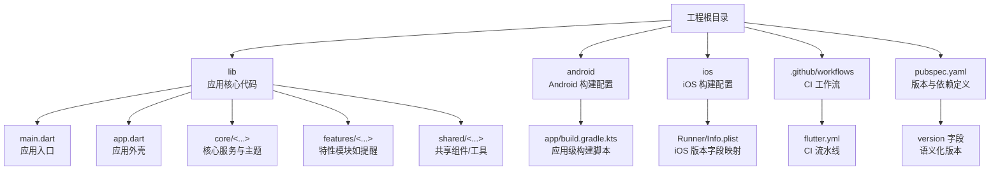
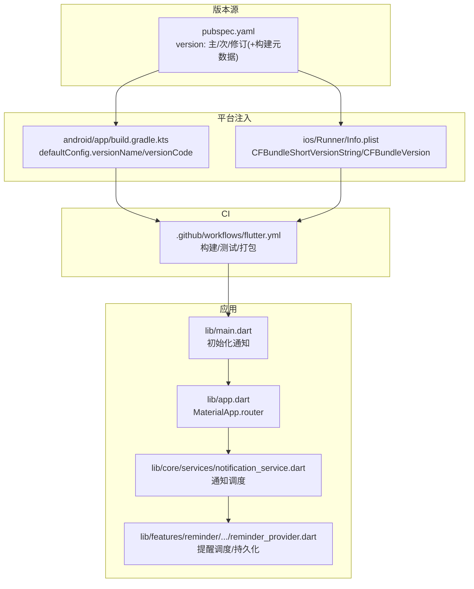
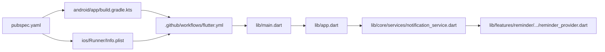

# 版本管理

<cite>
**本文引用的文件**
- [pubspec.yaml](file://pubspec.yaml)
- [android/app/build.gradle.kts](file://android/app/build.gradle.kts)
- [ios/Runner/Info.plist](file://ios/Runner/Info.plist)
- [.github/workflows/flutter.yml](file://.github/workflows/flutter.yml)
- [lib/main.dart](file://lib/main.dart)
- [lib/app.dart](file://lib/app.dart)
- [lib/core/services/notification_service.dart](file://lib/core/services/notification_service.dart)
- [lib/features/reminder/presentation/providers/reminder_provider.dart](file://lib/features/reminder/presentation/providers/reminder_provider.dart)
- [analysis_options.yaml](file://analysis_options.yaml)
- [.gitignore](file://.gitignore)
- [README.md](file://README.md)
</cite>

## 目录
1. [简介](#简介)
2. [项目结构](#项目结构)
3. [核心组件](#核心组件)
4. [架构总览](#架构总览)
5. [详细组件分析](#详细组件分析)
6. [依赖关系分析](#依赖关系分析)
7. [性能考虑](#性能考虑)
8. [故障排查指南](#故障排查指南)
9. [结论](#结论)
10. [附录](#附录)

## 简介
本指南面向 LifeMaster 应用的版本管理与发布流程，结合当前仓库中的配置与工作流，制定可落地的语义化版本策略、发布周期、Git 标签与分支管理、合并流程、发布检查清单、质量保证与回滚策略，并覆盖热修复与紧急发布场景。同时给出变更日志与发布说明模板、自动化版本更新与发布验证建议，以及向后兼容性维护要点。

## 项目结构
LifeMaster 是一个 Flutter 应用，采用多平台（Android/iOS）构建，使用 Riverpod 进行状态管理，Drift 作为本地数据库方案，集成本地通知能力。根目录包含 Flutter 工程配置、Android 与 iOS 平台配置、核心业务模块与测试入口；CI 使用 GitHub Actions 在主分支与开发分支上执行构建、分析与测试。

图表来源
- [pubspec.yaml:1-57](file://pubspec.yaml#L1-L57)
- [android/app/build.gradle.kts:1-45](file://android/app/build.gradle.kts#L1-L45)
- [ios/Runner/Info.plist:1-71](file://ios/Runner/Info.plist#L1-L71)
- [.github/workflows/flutter.yml:1-41](file://.github/workflows/flutter.yml#L1-L41)

章节来源
- [pubspec.yaml:1-57](file://pubspec.yaml#L1-L57)
- [android/app/build.gradle.kts:1-45](file://android/app/build.gradle.kts#L1-L45)
- [ios/Runner/Info.plist:1-71](file://ios/Runner/Info.plist#L1-L71)
- [.github/workflows/flutter.yml:1-41](file://.github/workflows/flutter.yml#L1-L41)

## 核心组件
- 语义化版本与构建元数据
  - Flutter 包版本在根配置中定义，包含主版本号、次版本号、修订号与构建元数据，用于标识应用版本与构建序号。
  - Android 通过 Gradle 将 Flutter 的版本名与版本码注入到应用配置中，确保平台侧版本与包版本一致。
  - iOS 通过 Info.plist 将 Flutter 的构建名称与构建号映射到 CFBundleShortVersionString 与 CFBundleVersion，实现跨平台一致性。
- CI 发布流水线
  - GitHub Actions 在推送至主分支或拉取请求至主分支时触发，执行依赖安装、代码生成、静态分析、单元测试、打包 APK，并上传产物。
- 应用入口与通知初始化
  - 应用入口负责初始化通知服务并在应用外壳中注册路由与主题，确保通知能力在启动阶段可用。

章节来源
- [pubspec.yaml:1-57](file://pubspec.yaml#L1-L57)
- [android/app/build.gradle.kts:22-31](file://android/app/build.gradle.kts#L22-L31)
- [ios/Runner/Info.plist:21-26](file://ios/Runner/Info.plist#L21-L26)
- [.github/workflows/flutter.yml:13-41](file://.github/workflows/flutter.yml#L13-L41)
- [lib/main.dart:6-14](file://lib/main.dart#L6-L14)
- [lib/app.dart:6-22](file://lib/app.dart#L6-L22)

## 架构总览
下图展示版本管理相关的关键构件：版本源（pubspec）、平台注入（Gradle/iOS）、CI 流水线（GitHub Actions）、应用入口与通知服务。

图表来源
- [pubspec.yaml:4](file://pubspec.yaml#L4)
- [android/app/build.gradle.kts:22-31](file://android/app/build.gradle.kts#L22-L31)
- [ios/Runner/Info.plist:21-26](file://ios/Runner/Info.plist#L21-L26)
- [.github/workflows/flutter.yml:13-41](file://.github/workflows/flutter.yml#L13-L41)
- [lib/main.dart:6-14](file://lib/main.dart#L6-L14)
- [lib/app.dart:6-22](file://lib/app.dart#L6-L22)
- [lib/core/services/notification_service.dart:39-82](file://lib/core/services/notification_service.dart#L39-L82)
- [lib/features/reminder/presentation/providers/reminder_provider.dart:17-66](file://lib/features/reminder/presentation/providers/reminder_provider.dart#L17-L66)

## 详细组件分析

### 语义化版本策略与版本号格式
- 版本号结构
  - 主版本号：破坏性变更时递增，例如 API 或数据模型的重大调整。
  - 次版本号：新增功能且保持向后兼容时递增。
  - 修订号：修复问题且不引入新功能时递增。
  - 构建元数据：以加号分隔，记录构建序号或环境标识，不影响语义化比较。
- 当前版本
  - 根配置中已定义初始版本与构建元数据，后续发布应遵循语义化规则进行递增。
- 平台侧版本同步
  - Android 通过 Gradle 将 Flutter 的版本名与版本码注入到应用配置，确保安装包与包版本一致。
  - iOS 通过 Info.plist 将 Flutter 的构建名称与构建号映射到 CFBundleShortVersionString 与 CFBundleVersion，避免平台差异导致的版本混淆。

章节来源
- [pubspec.yaml:4](file://pubspec.yaml#L4)
- [android/app/build.gradle.kts:22-31](file://android/app/build.gradle.kts#L22-L31)
- [ios/Runner/Info.plist:21-26](file://ios/Runner/Info.plist#L21-L26)

### 发布周期规划
- 周期建议
  - 预发布周期：每周固定时间进行预发布，包含回归测试与小范围灰度。
  - 正式发布周期：每两周一次正式发布，发布前完成变更评审与发布说明。
  - 热修复：紧急修复可在当天内完成，但需走最小流程（评审、测试、打包、发布）。
- 分支策略
  - develop：日常开发分支，合并前必须通过 CI。
  - main：稳定分支，仅允许从 develop 合并，打标签发布。
  - hotfix/<issue>：紧急修复分支，修复后同时合并至 develop 与 main，并打补丁标签。
- 合并流程
  - Pull Request 至 main 需至少一名维护者批准，且 CI 必须全部通过。
  - 合并后由 CI 自动执行构建与测试，成功后方可打标签发布。

章节来源
- [.github/workflows/flutter.yml:3-7](file://.github/workflows/flutter.yml#L3-L7)

### Git 标签管理
- 标签命名
  - 正式版本：v<主>.<次>.<修订>，例如 v1.2.3。
  - 热修复版本：v<主>.<次>.<修订>+<补丁号>，例如 v1.2.3+1。
- 打标签时机
  - 仅在 main 分支通过 CI 后打标签，标签指向最终发布提交。
- 标签与版本一致性
  - 标签名与 pubspec.yaml 中的版本保持一致，确保发布渠道与版本追踪统一。

章节来源
- [pubspec.yaml:4](file://pubspec.yaml#L4)

### 版本发布检查清单
- 版本号核对
  - pubspec.yaml 版本与平台注入值一致。
  - Android/iOS 版本字段与 pubspec.yaml 对齐。
- 质量门禁
  - 代码静态分析通过。
  - 单元测试与集成测试全部通过。
  - 无新增 Lint 规则违规。
- 构建产物
  - 生成 APK/IPA 并上传制品库。
  - 产物签名与配置正确。
- 文档与发布说明
  - 变更日志与发布说明已生成并审核。
  - 用户通知文案准备就绪。

章节来源
- [.github/workflows/flutter.yml:22-32](file://.github/workflows/flutter.yml#L22-L32)
- [analysis_options.yaml:8-29](file://analysis_options.yaml#L8-L29)

### 质量保证流程
- 静态分析与 Lint
  - 使用推荐的 Flutter Lint 规则，确保代码风格与潜在问题被提前发现。
- 测试策略
  - 单测：覆盖核心业务逻辑与边界条件。
  - 集成测试：验证关键流程（如提醒创建、通知调度）。
  - UI 测试：针对关键交互进行回归验证。
- 通知与提醒链路验证
  - 初始化通知服务后，验证提醒创建、调度、取消与批量取消流程。

章节来源
- [analysis_options.yaml:8-29](file://analysis_options.yaml#L8-L29)
- [.github/workflows/flutter.yml:28-32](file://.github/workflows/flutter.yml#L28-L32)
- [lib/main.dart:6-14](file://lib/main.dart#L6-L14)
- [lib/core/services/notification_service.dart:39-82](file://lib/core/services/notification_service.dart#L39-L82)
- [lib/features/reminder/presentation/providers/reminder_provider.dart:17-66](file://lib/features/reminder/presentation/providers/reminder_provider.dart#L17-L66)

### 回滚策略
- 回滚触发条件
  - 发布后出现严重崩溃、数据异常或重大功能缺陷。
- 回滚步骤
  - 通过 Git 标签定位上一个稳定版本，回退至该提交并重新打标签。
  - 更新版本号（必要时增加修订号或补丁号），重新执行 CI 并发布。
  - 通知用户并提供降级指引。
- 预防措施
  - 引入灰度发布与健康监控，降低回滚概率。

章节来源
- [pubspec.yaml:4](file://pubspec.yaml#L4)

### 热修复版本处理与紧急发布流程
- 热修复分支
  - 从 main 切出 hotfix/<issue>，修复后合并至 develop 与 main。
- 紧急发布
  - 修复完成后立即打补丁标签（v<主>.<次>.<修订>+<补丁号>），触发 CI 并发布。
- 变更日志
  - 在变更日志中标注“热修复”类别，简述问题与修复内容。

章节来源
- [pubspec.yaml:4](file://pubspec.yaml#L4)

### 向后兼容性维护
- API 兼容
  - 新增功能尽量采用可选参数或默认值，避免破坏既有调用。
- 数据层兼容
  - 数据库迁移采用增量方式，避免删除或重命名关键字段。
- 通知与提醒
  - 通知通道与调度逻辑保持稳定，避免影响用户使用体验。

章节来源
- [lib/core/services/notification_service.dart:39-82](file://lib/core/services/notification_service.dart#L39-L82)
- [lib/features/reminder/presentation/providers/reminder_provider.dart:17-66](file://lib/features/reminder/presentation/providers/reminder_provider.dart#L17-L66)

### 版本变更日志与发布说明模板
- 变更日志模板
  - 日期：YYYY-MM-DD
  - 版本：v<主>.<次>.<修订>(+<补丁>)
  - 类别：
    - 新增：列出新增功能与改进
    - 修复：列出问题修复与优化
    - 变更：列出破坏性变更与迁移说明
    - 性能：列出性能优化
    - 文档：列出文档更新
- 发布说明模板
  - 标题：LifeMaster v<主>.<次>.<修订> 发布
  - 概述：简要介绍本次发布目标与主要变化
  - 功能亮点：突出重要功能
  - 已知问题：列出当前已知问题与规避方案
  - 升级指引：提供升级建议与注意事项
  - 用户通知：简短提示用户关注的功能点

### 自动化版本更新与发布验证
- 自动化版本更新
  - 在 CI 中根据 PR 标签或分支命名自动递增版本号（主/次/修），并更新 pubspec.yaml 与平台注入值。
- 发布验证
  - 产物完整性校验：校验 APK/IPA 签名与大小。
  - 关键路径验证：启动、通知、提醒等核心流程端到端验证。
  - 回归验证：运行最近一次发布的回归用例集。

## 依赖关系分析
- 版本来源与平台注入
  - pubspec.yaml 定义版本，Gradle 与 Info.plist 将其注入到平台侧，形成统一的版本来源。
- CI 与构建产物
  - GitHub Actions 在指定分支触发，执行构建与测试，产出 APK 并上传制品。
- 应用初始化与通知
  - 应用入口初始化通知服务，应用外壳注册路由与主题，提醒提供器负责调度与持久化。

图表来源
- [pubspec.yaml:4](file://pubspec.yaml#L4)
- [android/app/build.gradle.kts:22-31](file://android/app/build.gradle.kts#L22-L31)
- [ios/Runner/Info.plist:21-26](file://ios/Runner/Info.plist#L21-L26)
- [.github/workflows/flutter.yml:13-41](file://.github/workflows/flutter.yml#L13-L41)
- [lib/main.dart:6-14](file://lib/main.dart#L6-L14)
- [lib/app.dart:6-22](file://lib/app.dart#L6-L22)
- [lib/core/services/notification_service.dart:39-82](file://lib/core/services/notification_service.dart#L39-L82)
- [lib/features/reminder/presentation/providers/reminder_provider.dart:17-66](file://lib/features/reminder/presentation/providers/reminder_provider.dart#L17-L66)

章节来源
- [pubspec.yaml:4](file://pubspec.yaml#L4)
- [android/app/build.gradle.kts:22-31](file://android/app/build.gradle.kts#L22-L31)
- [ios/Runner/Info.plist:21-26](file://ios/Runner/Info.plist#L21-L26)
- [.github/workflows/flutter.yml:13-41](file://.github/workflows/flutter.yml#L13-L41)
- [lib/main.dart:6-14](file://lib/main.dart#L6-L14)
- [lib/app.dart:6-22](file://lib/app.dart#L6-L22)
- [lib/core/services/notification_service.dart:39-82](file://lib/core/services/notification_service.dart#L39-L82)
- [lib/features/reminder/presentation/providers/reminder_provider.dart:17-66](file://lib/features/reminder/presentation/providers/reminder_provider.dart#L17-L66)

## 性能考虑
- 发布频率与回归成本
  - 更短的发布周期需要更强的自动化与更严格的门禁，以降低回归风险。
- 构建与测试效率
  - 优先并行化测试任务，减少 CI 时间；对大文件产物进行增量构建与缓存。
- 通知与提醒链路
  - 通知调度与数据库写入应避免阻塞主线程，确保用户体验流畅。

## 故障排查指南
- 版本不一致
  - 若平台侧版本与 pubspec.yaml 不一致，检查 Gradle 与 Info.plist 的注入配置是否正确。
- CI 失败
  - 查看分析与测试失败的具体原因，修复后再触发流水线。
- 通知未生效
  - 确认应用入口已初始化通知服务，检查通知通道与调度逻辑。

章节来源
- [android/app/build.gradle.kts:22-31](file://android/app/build.gradle.kts#L22-L31)
- [ios/Runner/Info.plist:21-26](file://ios/Runner/Info.plist#L21-L26)
- [.github/workflows/flutter.yml:22-32](file://.github/workflows/flutter.yml#L22-L32)
- [lib/main.dart:6-14](file://lib/main.dart#L6-L14)
- [lib/core/services/notification_service.dart:39-82](file://lib/core/services/notification_service.dart#L39-L82)

## 结论
通过统一的语义化版本策略、明确的分支与标签管理、严格的 CI 门禁与发布检查清单，LifeMaster 可以稳定地交付高质量版本。配合热修复与紧急发布流程，能够快速响应线上问题；借助变更日志与发布说明模板，提升发布透明度与用户沟通效率。建议持续完善自动化与监控体系，进一步缩短反馈闭环。

## 附录
- 快速参考
  - 版本号位置：根配置文件
  - 平台注入：Android Gradle、iOS Info.plist
  - CI 触发：指定分支与 PR
  - 应用入口：初始化通知与注册外壳
- 参考文件
  - [README.md:1-18](file://README.md#L1-L18)