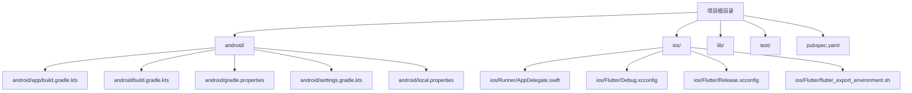
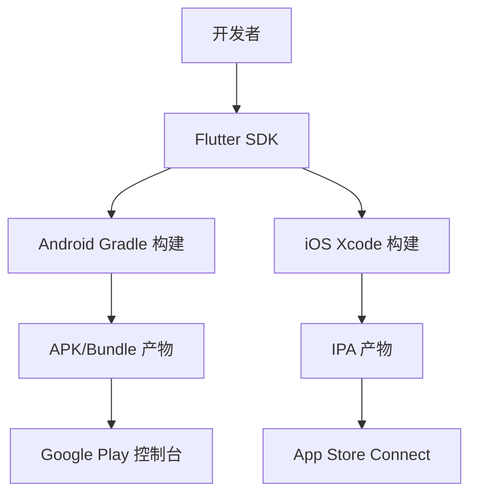
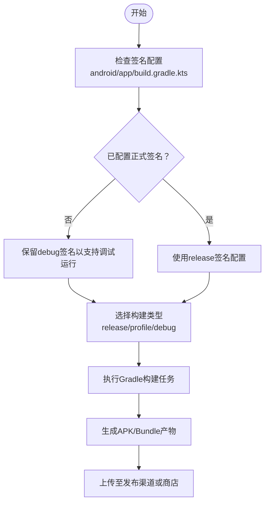
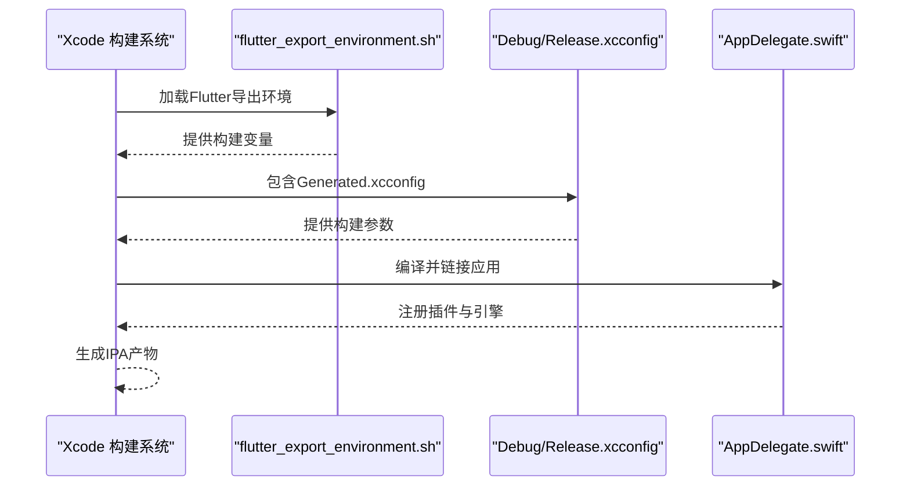
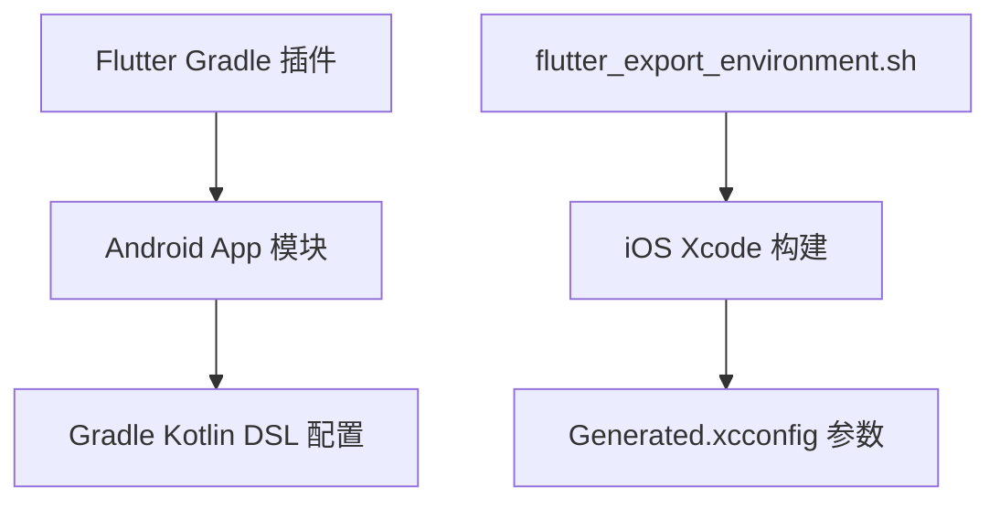

# 部署指南

<cite>
**本文引用的文件**
- [android/app/build.gradle.kts](file://android/app/build.gradle.kts)
- [android/build.gradle.kts](file://android/build.gradle.kts)
- [android/gradle.properties](file://android/gradle.properties)
- [android/local.properties](file://android/local.properties)
- [android/settings.gradle.kts](file://android/settings.gradle.kts)
- [ios/Runner/AppDelegate.swift](file://ios/Runner/AppDelegate.swift)
- [ios/Flutter/Debug.xcconfig](file://ios/Flutter/Debug.xcconfig)
- [ios/Flutter/Release.xcconfig](file://ios/Flutter/Release.xcconfig)
- [ios/Flutter/flutter_export_environment.sh](file://ios/Flutter/flutter_export_environment.sh)
- [pubspec.yaml](file://pubspec.yaml)
- [README.md](file://README.md)
</cite>

## 目录
1. [简介](#简介)
2. [项目结构](#项目结构)
3. [核心组件](#核心组件)
4. [架构总览](#架构总览)
5. [详细组件分析](#详细组件分析)
6. [依赖关系分析](#依赖关系分析)
7. [性能考虑](#性能考虑)
8. [故障排查指南](#故障排查指南)
9. [结论](#结论)
10. [附录](#附录)

## 简介
本指南面向DevOps工程师与发布经理，提供LifeMaster应用在Android与iOS平台的完整部署操作手册。内容涵盖：
- Android应用的打包与发布：签名配置、APK生成、Google Play发布准备
- iOS应用的构建与分发：证书配置、IPA生成、App Store发布准备
- 版本管理、更新机制与回滚策略
- 性能监控与崩溃报告的集成建议
- CI/CD流水线配置与自动化部署思路
- 基于仓库现有配置的可执行步骤与注意事项

## 项目结构
LifeMaster采用Flutter跨平台架构，Android与iOS分别通过各自原生工程进行构建与打包。根目录下的pubspec.yaml定义了应用版本号与依赖；Android与iOS子目录包含各自的构建配置与资源。

**图表来源**
- [android/app/build.gradle.kts:1-45](file://android/app/build.gradle.kts#L1-L45)
- [android/build.gradle.kts:1-25](file://android/build.gradle.kts#L1-L25)
- [android/gradle.properties:1-3](file://android/gradle.properties#L1-L3)
- [android/settings.gradle.kts:1-27](file://android/settings.gradle.kts#L1-L27)
- [android/local.properties:1-1](file://android/local.properties#L1-L1)
- [ios/Runner/AppDelegate.swift:1-17](file://ios/Runner/AppDelegate.swift#L1-L17)
- [ios/Flutter/Debug.xcconfig:1-2](file://ios/Flutter/Debug.xcconfig#L1-L2)
- [ios/Flutter/Release.xcconfig:1-2](file://ios/Flutter/Release.xcconfig#L1-L2)
- [ios/Flutter/flutter_export_environment.sh](file://ios/Flutter/flutter_export_environment.sh)
- [pubspec.yaml:1-54](file://pubspec.yaml#L1-L54)

**章节来源**
- [README.md:1-18](file://README.md#L1-L18)
- [pubspec.yaml:1-54](file://pubspec.yaml#L1-L54)

## 核心组件
- 应用版本与依赖管理：由pubspec.yaml统一声明，包含版本号、SDK约束与依赖列表，用于构建与发布前的版本核对。
- Android构建配置：通过Gradle Kotlin DSL定义应用元数据、编译选项、签名配置与Flutter集成。
- iOS构建配置：通过Xcode配置文件与Flutter导出环境脚本控制调试与发布构建参数。
- 工程入口：Android主Activity与iOS AppDelegate负责应用生命周期与插件注册。

**章节来源**
- [pubspec.yaml:1-54](file://pubspec.yaml#L1-L54)
- [android/app/build.gradle.kts:1-45](file://android/app/build.gradle.kts#L1-L45)
- [ios/Runner/AppDelegate.swift:1-17](file://ios/Runner/AppDelegate.swift#L1-L17)

## 架构总览
下图展示了从源码到发布的关键路径：Flutter SDK驱动构建，Android使用Gradle，iOS使用Xcode与Flutter工具链。

[此图为概念性总览，不直接映射具体源码文件，故无“图表来源”]

## 详细组件分析

### Android 部署组件分析
- 应用元数据与编译设置
  - 应用命名空间、编译与目标SDK、Java/Kotlin版本由Gradle配置统一管理。
  - 默认配置中读取Flutter提供的minSdk、targetSdk、versionCode与versionName，确保与pubspec.yaml一致。
- 签名与发布类型
  - 当前release构建使用debug签名配置以便本地调试运行，生产发布需替换为正式签名配置。
- 构建目录与清理
  - 统一构建目录位于项目根目录的build文件夹，便于CI缓存与清理。

**图表来源**
- [android/app/build.gradle.kts:33-39](file://android/app/build.gradle.kts#L33-L39)
- [android/build.gradle.kts:8-25](file://android/build.gradle.kts#L8-L25)

**章节来源**
- [android/app/build.gradle.kts:1-45](file://android/app/build.gradle.kts#L1-L45)
- [android/build.gradle.kts:1-25](file://android/build.gradle.kts#L1-L25)
- [android/gradle.properties:1-3](file://android/gradle.properties#L1-L3)
- [android/settings.gradle.kts:1-27](file://android/settings.gradle.kts#L1-L27)
- [android/local.properties:1-1](file://android/local.properties#L1-L1)

### iOS 部署组件分析
- 应用入口与生命周期
  - AppDelegate负责应用启动与Flutter引擎初始化，确保插件正确注册。
- 调试与发布配置
  - Debug.xcconfig与Release.xcconfig均包含Generated.xcconfig，表明构建参数由Flutter生成，需在Xcode中正确选择方案。
- 导出环境
  - flutter_export_environment.sh提供构建时的环境变量，确保Xcode构建与Flutter工具链一致。

**图表来源**
- [ios/Flutter/Debug.xcconfig:1-2](file://ios/Flutter/Debug.xcconfig#L1-L2)
- [ios/Flutter/Release.xcconfig:1-2](file://ios/Flutter/Release.xcconfig#L1-L2)
- [ios/Flutter/flutter_export_environment.sh](file://ios/Flutter/flutter_export_environment.sh)
- [ios/Runner/AppDelegate.swift:1-17](file://ios/Runner/AppDelegate.swift#L1-L17)

**章节来源**
- [ios/Runner/AppDelegate.swift:1-17](file://ios/Runner/AppDelegate.swift#L1-L17)
- [ios/Flutter/Debug.xcconfig:1-2](file://ios/Flutter/Debug.xcconfig#L1-L2)
- [ios/Flutter/Release.xcconfig:1-2](file://ios/Flutter/Release.xcconfig#L1-L2)
- [ios/Flutter/flutter_export_environment.sh](file://ios/Flutter/flutter_export_environment.sh)

### 版本管理、更新机制与回滚策略
- 版本号来源与一致性
  - pubspec.yaml中的version字段为应用版本号；Android通过flutter.versionCode与flutter.versionName读取，应保持一致以避免发布混乱。
- 更新机制
  - Android可通过Google Play内部测试轨道或封闭测试轨道进行灰度发布；iOS可通过TestFlight进行内测。
- 回滚策略
  - 在Google Play与App Store控制台中，若新版本出现严重问题，可回退至上一个稳定版本；同时保留旧版本安装包以支持紧急回滚。

**章节来源**
- [pubspec.yaml:4-4](file://pubspec.yaml#L4-L4)
- [android/app/build.gradle.kts:29-30](file://android/app/build.gradle.kts#L29-L30)

### 性能监控与崩溃报告集成
- 集成建议
  - Android：可接入Firebase Crashlytics或类似服务，在release构建中启用符号表上传与崩溃收集。
  - iOS：可接入Firebase Analytics/Crashlytics或App Center，在Xcode中配置Provisioning Profile与分发证书。
- 运行时配置
  - 在应用启动阶段初始化监控SDK，并在发布构建中开启上报开关。

[本节为通用实践指导，不直接分析具体源码文件，故无“章节来源”]

### CI/CD 流水线配置与自动化部署
- Android流水线要点
  - 使用Gradle Wrapper执行构建，设置构建目录缓存，生成release签名配置文件（密钥与密码建议通过CI机密管理），执行构建任务后上传产物。
- iOS流水线要点
  - 安装Xcode与Flutter依赖，配置Apple证书与Provisioning Profile（建议通过CI机密与钥匙串），执行flutter build ios --release --no-codesign后由Xcode进行签名与打包。
- 发布策略
  - Android：将APK/Bundle上传至Google Play控制台或内部测试轨道；iOS：将IPA上传至App Store Connect或TestFlight。

[本节为通用实践指导，不直接分析具体源码文件，故无“章节来源”]

## 依赖关系分析
- Flutter与原生工程耦合点
  - Android通过dev.flutter.flutter-gradle-plugin与Flutter SDK集成；iOS通过flutter_export_environment.sh与Xcode集成。
- 构建工具链
  - Android使用Gradle Kotlin DSL与Java/Kotlin编译选项；iOS使用Xcode与Generated.xcconfig参数。

**图表来源**
- [android/app/build.gradle.kts:1-6](file://android/app/build.gradle.kts#L1-L6)
- [ios/Flutter/flutter_export_environment.sh](file://ios/Flutter/flutter_export_environment.sh)
- [ios/Flutter/Debug.xcconfig:1-2](file://ios/Flutter/Debug.xcconfig#L1-L2)

**章节来源**
- [android/app/build.gradle.kts:1-6](file://android/app/build.gradle.kts#L1-L6)
- [ios/Flutter/flutter_export_environment.sh](file://ios/Flutter/flutter_export_environment.sh)

## 性能考虑
- 构建性能
  - 合理设置Gradle JVM参数与并行度，避免内存不足导致的构建失败。
  - 统一构建目录位置，提升CI缓存命中率。
- 发布效率
  - 在CI中复用缓存与预编译产物，减少重复下载与编译时间。
  - 对Android与iOS分别配置独立缓存键，避免交叉污染。

[本节为通用指导，不直接分析具体源码文件，故无“章节来源”]

## 故障排查指南
- Android常见问题
  - 签名未配置：release构建默认使用debug签名，可能导致无法上架。请在release构建中添加正式签名配置。
  - 构建目录冲突：确认统一构建目录设置，避免多模块并行构建时的目录竞争。
- iOS常见问题
  - 证书与Provisioning Profile缺失：确保CI环境具备有效的Apple证书与对应Profile。
  - Xcode方案选择错误：确认在Xcode中选择了正确的Debug/Release方案，且包含Generated.xcconfig。
- 版本不一致
  - 若pubspec.yaml与Android构建参数不一致，可能导致版本混淆。请同步version与versionCode/versionName。

**章节来源**
- [android/app/build.gradle.kts:33-39](file://android/app/build.gradle.kts#L33-L39)
- [android/build.gradle.kts:8-25](file://android/build.gradle.kts#L8-L25)
- [ios/Flutter/Debug.xcconfig:1-2](file://ios/Flutter/Debug.xcconfig#L1-L2)
- [pubspec.yaml:4-4](file://pubspec.yaml#L4-L4)

## 结论
本指南基于仓库现有配置，给出了LifeMaster在Android与iOS平台的部署步骤与最佳实践。建议在正式发布前完成签名配置、版本号核对与CI缓存优化，并结合性能监控与崩溃报告完善发布后的质量保障体系。

## 附录
- 快速检查清单
  - Android：release签名配置已就绪、构建目录统一、版本号与Flutter参数一致
  - iOS：Apple证书与Provisioning Profile已配置、Xcode方案正确、包含Generated.xcconfig
  - 版本：pubspec.yaml与Android构建参数一致
  - CI：缓存键合理、构建任务按平台拆分、产物上传与发布流程自动化

[本节为通用指导，不直接分析具体源码文件，故无“章节来源”]