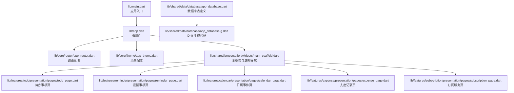
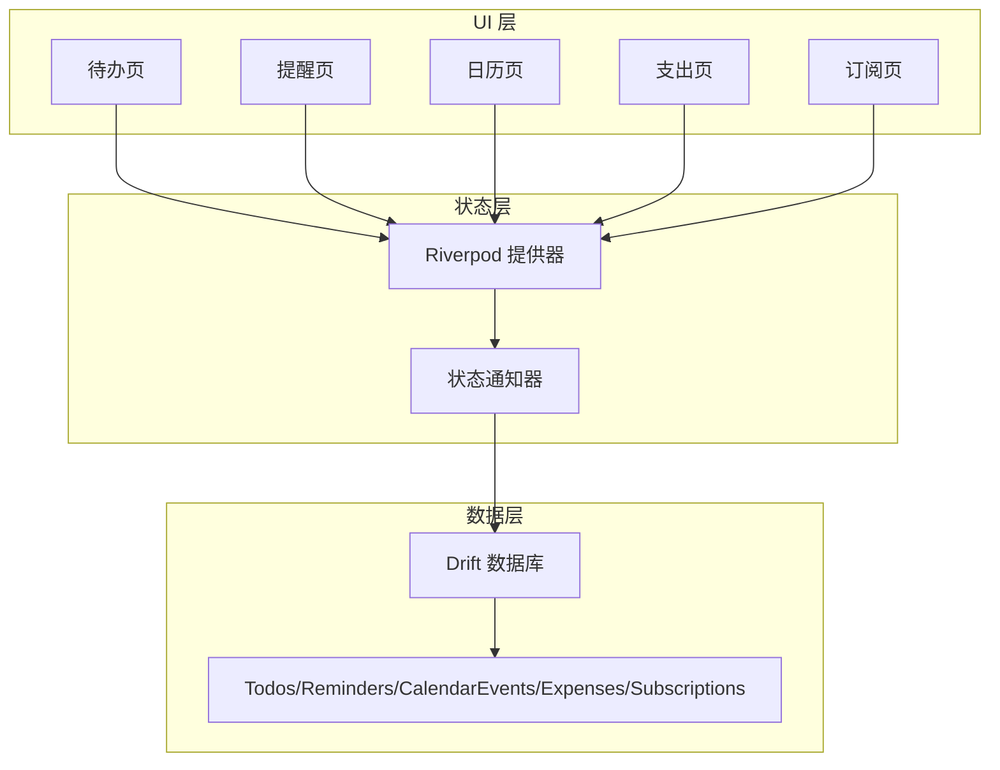
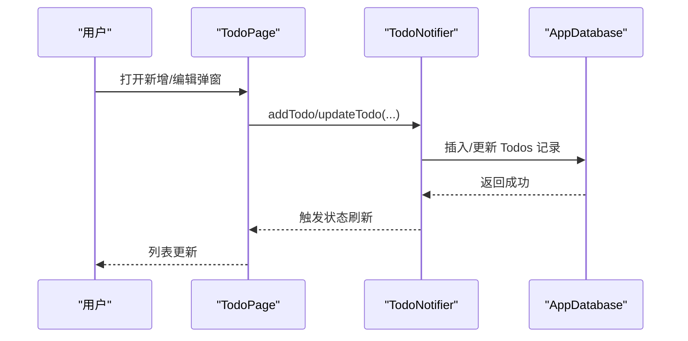
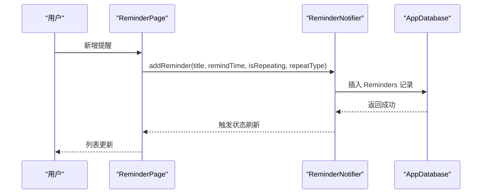
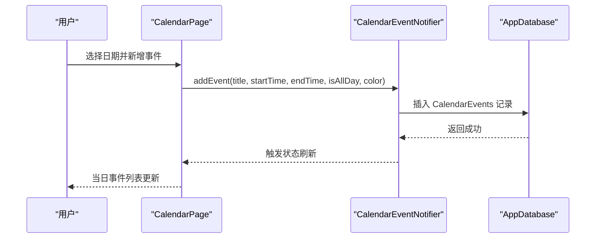
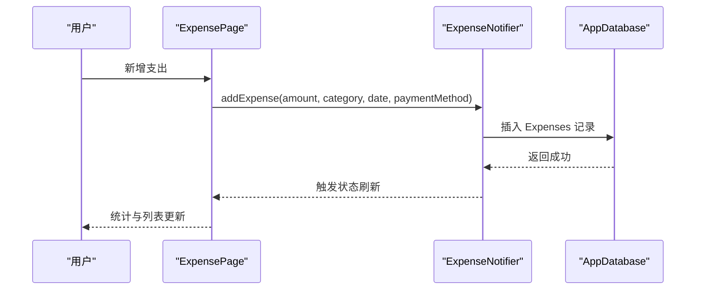
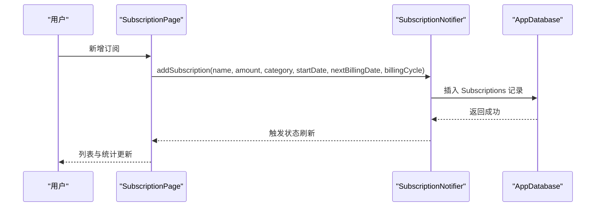
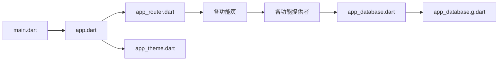

# 项目概述

<cite>
**本文档引用的文件**
- [README.md](file://README.md)
- [pubspec.yaml](file://pubspec.yaml)
- [main.dart](file://lib/main.dart)
- [app.dart](file://lib/app.dart)
- [app_router.dart](file://lib/core/router/app_router.dart)
- [app_theme.dart](file://lib/core/theme/app_theme.dart)
- [main_scaffold.dart](file://lib/shared/presentation/widgets/main_scaffold.dart)
- [app_database.dart](file://lib/shared/data/database/app_database.dart)
- [app_database.g.dart](file://lib/shared/data/database/app_database.g.dart)
- [todo_page.dart](file://lib/features/todo/presentation/pages/todo_page.dart)
- [reminder_page.dart](file://lib/features/reminder/presentation/pages/reminder_page.dart)
- [calendar_page.dart](file://lib/features/calendar/presentation/pages/calendar_page.dart)
- [expense_page.dart](file://lib/features/expense/presentation/pages/expense_page.dart)
- [subscription_page.dart](file://lib/features/subscription/presentation/pages/subscription_page.dart)
</cite>

## 目录
1. [引言](#引言)
2. [项目结构](#项目结构)
3. [核心组件](#核心组件)
4. [架构总览](#架构总览)
5. [详细组件分析](#详细组件分析)
6. [依赖关系分析](#依赖关系分析)
7. [性能考虑](#性能考虑)
8. [故障排除指南](#故障排除指南)
9. [结论](#结论)
10. [附录](#附录)

## 引言
LifeMaster 是一款面向个人生活的管理应用，旨在帮助用户统一管理待办事项、提醒事项、日历事件、支出与订阅服务。通过简洁直观的界面与稳定的本地数据存储，用户可以在一个应用中掌控日常事务与财务状况，提升生活与工作的效率。

本项目采用 Flutter 跨平台框架构建，结合 Riverpod 状态管理与 Drift 数据库，形成“UI 层 + 状态层 + 数据持久化”的清晰分层架构。应用支持浅色/深色主题切换，提供 Material Design 3 风格的现代化体验，并通过底部导航在五大核心功能模块间自由切换。

## 项目结构
项目遵循“按功能域划分”的组织方式，主要目录如下：
- lib/main.dart：应用入口，初始化状态提供器作用域并启动应用
- lib/app.dart：应用根组件，集成路由与主题配置
- lib/core/*：核心基础设施（路由、主题）
- lib/features/*：各功能域页面与提供者（todo、reminder、calendar、expense、subscription）
- lib/shared/*：共享组件与数据层（数据库定义与生成代码）

图表来源
- [main.dart:1-13](file://lib/main.dart#L1-L13)
- [app.dart:1-23](file://lib/app.dart#L1-L23)
- [app_router.dart:1-60](file://lib/core/router/app_router.dart#L1-L60)
- [app_theme.dart:1-78](file://lib/core/theme/app_theme.dart#L1-L78)
- [main_scaffold.dart:1-53](file://lib/shared/presentation/widgets/main_scaffold.dart#L1-L53)
- [app_database.dart:46-73](file://lib/shared/data/database/app_database.dart#L46-L73)
- [app_database.g.dart:2903-2922](file://lib/shared/data/database/app_database.g.dart#L2903-L2922)

章节来源
- [main.dart:1-13](file://lib/main.dart#L1-L13)
- [app.dart:1-23](file://lib/app.dart#L1-L23)
- [pubspec.yaml:1-54](file://pubspec.yaml#L1-L54)

## 核心组件
- 应用入口与根组件
  - 入口文件负责初始化 Flutter 绑定并以 ProviderScope 包裹应用，确保 Riverpod 提供器在整个应用生命周期内可用
  - 根组件负责注入路由与主题，设置标题、调试横幅与系统主题模式
- 路由与导航
  - 使用 go_router 实现 ShellRoute + 多级路由，配合 Provider 注入 routerProvider，实现页面级导航
  - 主框架包含底部导航栏，点击切换至不同功能页
- 主题系统
  - 定义主色、强调色与各功能模块专用色，分别用于图标、卡片与悬浮按钮
  - 同时支持浅色与深色主题，自动跟随系统设置
- 数据层
  - 使用 Drift 定义多张表：Todos、Reminders、CalendarEvents、Expenses、Subscriptions
  - 自动生成映射类与 Companion，提供类型安全的数据操作接口

章节来源
- [main.dart:5-12](file://lib/main.dart#L5-L12)
- [app.dart:9-21](file://lib/app.dart#L9-L21)
- [app_router.dart:15-60](file://lib/core/router/app_router.dart#L15-L60)
- [main_scaffold.dart:8-41](file://lib/shared/presentation/widgets/main_scaffold.dart#L8-L41)
- [app_theme.dart:3-77](file://lib/core/theme/app_theme.dart#L3-L77)
- [app_database.dart:46-73](file://lib/shared/data/database/app_database.dart#L46-L73)
- [app_database.g.dart:2903-2922](file://lib/shared/data/database/app_database.g.dart#L2903-L2922)

## 架构总览
整体采用“单向数据流”设计：
- UI 层：各功能页通过 ConsumerWidget 订阅 Provider，响应状态变化
- 状态层：Riverpod 提供 Provider/StateNotifier，封装业务逻辑与异步状态
- 数据层：Drift 作为本地数据库，提供类型安全的 CRUD 操作与查询

图表来源
- [app_router.dart:15-60](file://lib/core/router/app_router.dart#L15-L60)
- [app_database.g.dart:2903-2922](file://lib/shared/data/database/app_database.g.dart#L2903-L2922)

## 详细组件分析

### 待办事项模块（Todo）
- 功能要点
  - 支持分类筛选、重要标记、到期时间设置
  - 提供新增、编辑、删除与完成状态切换
  - 使用底部弹窗表单进行输入，保证页面整洁
- 数据模型
  - 表结构包含标题、描述、分类、是否完成、是否重要、到期时间等字段
- 用户体验
  - 完成项显示删除线样式，重要项带星标提示
  - 分类下拉菜单动态读取可用类别

图表来源
- [todo_page.dart:104-210](file://lib/features/todo/presentation/pages/todo_page.dart#L104-L210)
- [app_database.g.dart:214-257](file://lib/shared/data/database/app_database.g.dart#L214-L257)

章节来源
- [todo_page.dart:14-293](file://lib/features/todo/presentation/pages/todo_page.dart#L14-L293)
- [app_database.g.dart:214-257](file://lib/shared/data/database/app_database.g.dart#L214-L257)

### 提醒事项模块（Reminder）
- 功能要点
  - 支持一次性与重复提醒（日/周/月），设置提醒时间
  - 提供新增、编辑、删除与完成状态切换
- 数据模型
  - 表结构包含标题、描述、提醒时间、是否完成、是否重复、重复类型等字段
- 用户体验
  - 重复类型下拉菜单仅在开启重复时显示
  - 提醒列表展示标题、描述、提醒时间与重复周期

图表来源
- [reminder_page.dart:136-147](file://lib/features/reminder/presentation/pages/reminder_page.dart#L136-L147)
- [app_database.g.dart:784-824](file://lib/shared/data/database/app_database.g.dart#L784-L824)

章节来源
- [reminder_page.dart:108-162](file://lib/features/reminder/presentation/pages/reminder_page.dart#L108-L162)
- [app_database.g.dart:784-824](file://lib/shared/data/database/app_database.g.dart#L784-L824)

### 日历事件模块（Calendar）
- 功能要点
  - 月视图网格选择日期，展示当日事件
  - 支持全天事件与时间段事件，设置开始/结束时间与地点
  - 提供新增、删除事件
- 数据模型
  - 表结构包含标题、描述、开始/结束时间、地点、颜色、是否全天等字段
- 用户体验
  - 顶部月份导航与周标题，今日高亮
  - 事件卡片展示颜色条、时间范围与地点

图表来源
- [calendar_page.dart:75-169](file://lib/features/calendar/presentation/pages/calendar_page.dart#L75-L169)
- [app_database.g.dart:1360-1404](file://lib/shared/data/database/app_database.g.dart#L1360-L1404)

章节来源
- [calendar_page.dart:7-370](file://lib/features/calendar/presentation/pages/calendar_page.dart#L7-L370)
- [app_database.g.dart:1360-1404](file://lib/shared/data/database/app_database.g.dart#L1360-L1404)

### 支出记录模块（Expense）
- 功能要点
  - 记录金额、分类、描述、支付方式与日期
  - 展示当月与累计支出统计
  - 提供新增、删除支出
- 数据模型
  - 表结构包含金额、分类、描述、日期、支付方式等字段
- 用户体验
  - 顶部卡片展示当月与累计支出
  - 支出列表按日期倒序排列

图表来源
- [expense_page.dart:87-182](file://lib/features/expense/presentation/pages/expense_page.dart#L87-L182)
- [app_database.g.dart:1917-1953](file://lib/shared/data/database/app_database.g.dart#L1917-L1953)

章节来源
- [expense_page.dart:8-269](file://lib/features/expense/presentation/pages/expense_page.dart#L8-L269)
- [app_database.g.dart:1917-1953](file://lib/shared/data/database/app_database.g.dart#L1917-L1953)

### 订阅服务模块（Subscription）
- 功能要点
  - 记录订阅名称、金额、分类、开始日期、下次计费日期与计费周期
  - 支持启用/停用订阅，展示“即将到期”提醒
  - 提供新增、删除与切换状态
- 数据模型
  - 表结构包含名称、金额、分类、开始日期、下次计费日期、计费周期、是否启用等字段
- 用户体验
  - 即将到期（7天内）以红色标签提示
  - 停用订阅显示为已删除样式

图表来源
- [subscription_page.dart:83-198](file://lib/features/subscription/presentation/pages/subscription_page.dart#L83-L198)
- [app_database.g.dart:2496-2544](file://lib/shared/data/database/app_database.g.dart#L2496-L2544)

章节来源
- [subscription_page.dart:7-292](file://lib/features/subscription/presentation/pages/subscription_page.dart#L7-L292)
- [app_database.g.dart:2496-2544](file://lib/shared/data/database/app_database.g.dart#L2496-L2544)

## 依赖关系分析
- 技术栈与版本
  - Flutter SDK 版本：^3.11.1
  - 状态管理：flutter_riverpod ^2.6.1、riverpod_annotation ^2.6.1
  - 数据库：drift ^2.22.1、sqlite3_flutter_libs ^0.5.28、path_provider ^2.1.5、path ^1.9.1
  - 导航：go_router ^14.8.1
  - 国际化：intl ^0.20.2
  - 本地存储：shared_preferences ^2.3.5
  - 工具库：uuid ^4.5.1、equatable ^2.0.7
  - 通知：flutter_local_notifications ^18.0.1、timezone ^0.10.0
  - 开发工具：drift_dev ^2.22.1、build_runner ^2.4.14
- 关键依赖关系
  - 应用入口依赖 Riverpod 与应用根组件
  - 根组件依赖路由与主题
  - 页面组件依赖对应 Provider 与 Drift 数据库
  - 数据库通过 Drift 生成代码提供类型安全访问

图表来源
- [pubspec.yaml:9-54](file://pubspec.yaml#L9-L54)
- [main.dart:1-13](file://lib/main.dart#L1-L13)
- [app.dart:1-23](file://lib/app.dart#L1-L23)
- [app_router.dart:1-60](file://lib/core/router/app_router.dart#L1-L60)
- [app_database.dart:46-73](file://lib/shared/data/database/app_database.dart#L46-L73)
- [app_database.g.dart:2903-2922](file://lib/shared/data/database/app_database.g.dart#L2903-L2922)

章节来源
- [pubspec.yaml:1-54](file://pubspec.yaml#L1-L54)

## 性能考虑
- 状态管理
  - Riverpod 的 Provider/StateNotifier 将状态与 UI 解耦，避免不必要的重建
  - 使用 AsyncValue 管理加载/错误状态，减少 UI 空转
- 数据访问
  - Drift 生成代码提供编译期类型检查，降低运行时错误
  - 表结构设计包含默认时间戳字段，便于排序与统计
- UI 渲染
  - 列表使用 ListView.builder，按需渲染
  - 日期选择与弹窗表单采用可滚动容器，避免布局溢出
- 主题与导航
  - 主题集中管理，减少重复计算
  - 底部导航使用无过渡页面，提升切换流畅度

## 故障排除指南
- 应用无法启动或报错
  - 检查 pubspec.yaml 中依赖版本与 Flutter SDK 是否匹配
  - 确认 main.dart 中 ProviderScope 是否正确包裹应用根组件
- 数据库相关异常
  - 确保 Drift 生成代码已更新（执行构建 runner 或相应命令）
  - 检查表结构字段与插入数据是否一致（如必填字段、默认值）
- 路由跳转无效
  - 确认 go_router 路由配置与页面路径一致
  - 检查 ShellRoute 与主框架 MainScaffold 的组合是否正确
- 主题不生效
  - 确认 AppTheme.lightTheme/AppTheme.darkTheme 已正确传入 MaterialApp.router
  - 检查系统主题设置与 ThemeMode.system 配置

章节来源
- [pubspec.yaml:6-8](file://pubspec.yaml#L6-L8)
- [main.dart:5-12](file://lib/main.dart#L5-L12)
- [app.dart:13-21](file://lib/app.dart#L13-L21)
- [app_router.dart:15-60](file://lib/core/router/app_router.dart#L15-L60)
- [app_theme.dart:18-76](file://lib/core/theme/app_theme.dart#L18-L76)

## 结论
LifeMaster 通过清晰的分层架构与现代 Flutter 技术栈，为用户提供统一的个人生活管理体验。Riverpod 的响应式状态管理与 Drift 的本地数据库能力，使得应用在功能完整性与性能表现上达到良好平衡。未来可在通知推送、数据同步与报表可视化等方面进一步扩展，持续提升用户体验。

## 附录
- 项目背景与动机
  - 面向个人用户的轻量级管理工具，解决多任务、多账单与多订阅的碎片化管理问题
  - 通过统一入口与本地存储，降低用户在多个应用之间切换的成本
- 价值主张
  - 一站式管理：待办、提醒、日历、支出、订阅
  - 本地优先：数据保存在设备端，隐私与离线可用性更强
  - 界面友好：Material Design 3 与主题系统，适配多种使用场景